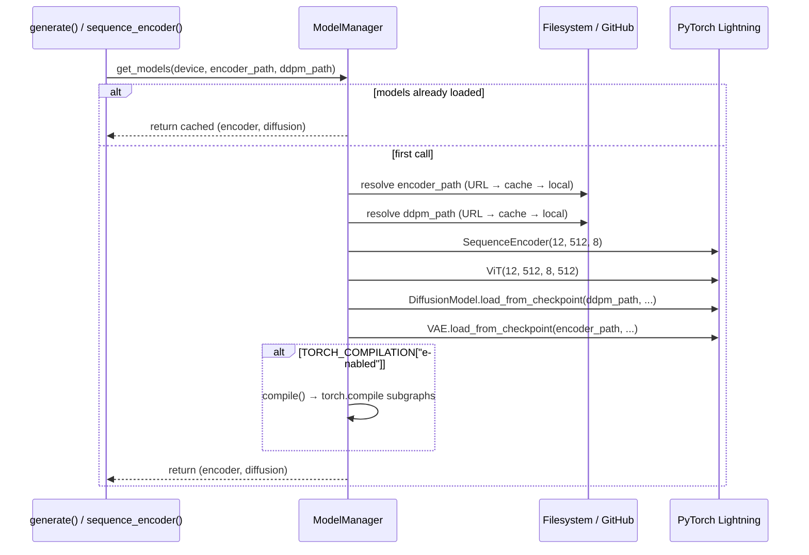
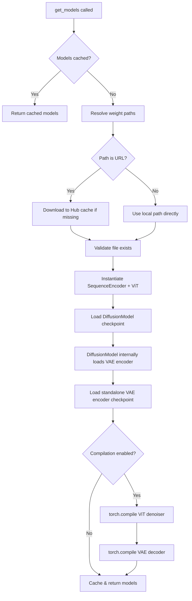

---
slug:15-model-loading-and-compilation
blog_type:normal
---


Starling的模型加载基础设施控制着两个核心预训练模型——**VAE距离图编码器**和**ViT条件扩散模型**——如何被解析、获取、反序列化，以及可选地编译以加速推理。该系统实现了带有多种来源权重解析（本地文件系统、环境变量和GitHub Releases URLs）的懒加载单例模式、PyTorch Hub集成，以及对推理关键子图选择性使用基于`torch.compile`的即时编译。

## 权重解析与来源优先级

Starling附带两个必须在运行时可用的检查点文件：

| 检查点 | 默认文件名 | 作用 |
|---|---|---|
| **VAE Encoder** | `STARLING_v2.0.0_ViT_VAE_2025_10_14.ckpt` | 将距离图压缩到潜空间；将潜空间采样解码回距离图 |
| **DDPM** | `STARLING_v2.0.0_ViT_DDPM_2025_10_14.ckpt` | 带有ViT主干网络和序列编码器的去噪扩散模型 |

每个检查点的解析顺序遵循严格的优先级链。环境变量覆盖一切，回退到托管在`idptools/starling`仓库下的GitHub Releases URLs：

```
STARLING_ENCODER_PATH env var  →  https://github.com/idptools/starling/releases/download/v2.0.0/<filename>
STARLING_DDPM_PATH env var    →  https://github.com/idptools/starling/releases/download/v2.0.0/<filename>
```

当检测到URL（默认情况）时，`ModelManager.load_from_path_or_url`内部函数使用`torch.hub.download_url_to_file`将检查点下载到PyTorch Hub的缓存目录（`torch.hub.get_dir() + "/checkpoints/"`）中，如果文件已在本地存在则跳过下载。此设计确保首次使用的用户仅产生一次下载开销，而后续运行则直接从缓存中瞬间解析。需要离线部署或自定义模型变体的用户，可以将环境变量指向本地`.ckpt`路径，从而完全绕过网络访问。

来源: [configs.py](starling/configs.py#L8-L91), [model_loading.py](starling/inference/model_loading.py#L21-L46)

## 用户配置覆盖

除了环境变量，Starling还支持位于`~/.starling_weights/configs.py`的基于Python的用户配置文件。当此文件存在时，`load_user_config()`函数会在导入时执行它，并覆盖`starling.configs`中任何匹配的全局变量——包括`DEFAULT_ENCODE_WEIGHTS`、`DEFAULT_DDPM_WEIGHTS`、`DEFAULT_MODEL_DIR`以及所有编译设置。此机制允许进行持久的逐用户自定义，而无需修改已安装的包：

```python
# ~/.starling_weights/configs.py
DEFAULT_ENCODE_WEIGHTS = "my_custom_vae.ckpt"
DEFAULT_DDPM_WEIGHTS = "my_custom_ddpm.ckpt"
TORCH_COMPILATION = {"enabled": True, "options": {"mode": "reduce-overhead"}}
```

来源: [configs.py](starling/configs.py#L42-L69)

## ModelManager与懒加载架构

`ModelManager`类是模型生命周期管理的中央协调器。它维护两个实例属性——`encoder_model`和`diffusion_model`——两者均初始化为`None`，并在首次通过`get_models()`方法访问时被填充。这种懒加载模式确保将反序列化两个深度模型的庞大内存和计算开销延迟到实际需要时：



检查点加载过程重建了两个复合模型。**扩散模型**检查点通过`DiffusionModel.load_from_checkpoint`加载，它接收三个构造函数参数：一个新实例化的`ViT(12, 512, 8, 512)`去噪器、一个新实例化的`SequenceEncoder(12, 512, 8)`，以及`encoder_path`字符串。在`DiffusionModel.__init__`内部，`distance_map_encoder`路径触发了一个*嵌套的*检查点加载——`VAE.load_from_checkpoint(distance_map_encoder)`——该操作会冻结VAE的参数，以便在扩散训练验证期间将其用作固定的潜空间编码器。另外，顶级`encoder_model`作为另一个`VAE.load_from_checkpoint`实例加载，用于在推理时将采样的潜变量解码回距离图。

模型架构参数`(12, 512, 8)`对应于`num_layers=12`、`embed_dim=512`、`num_heads=8`，与序列编码器配置中的值相匹配。ViT的`context_dim=512`与序列编码器的输出嵌入维度对齐，确保DiT块中的交叉注意力层能够使用序列条件向量而不会出现维度不匹配。

<CgxTip>`ModelManager`单例在`generation.py`中作为`model_manager = ModelManager()`于模块级别实例化。因为`ensemble_generation.py`从`generation`导入，所以在单个Python会话中对`generate()`或`sequence_encoder()`的所有调用都共享相同的已加载模型——从而避免了在重复调用时进行冗余的反序列化。</CgxTip>

来源: [model_loading.py](starling/inference/model_loading.py#L16-L101), [diffusion.py](starling/models/diffusion.py#L55-L143), [generation.py](starling/inference/generation.py#L23-L26), [sequence_encoder.yaml](starling/configs/sequence_encoder/sequence_encoder.yaml#L1-L3)

## PyTorch编译流水线

Starling集成了`torch.compile`，用于对推理关键模型子图进行即时图编译。编译**默认禁用**（`TORCH_COMPILATION["enabled"] = False`），必须通过`set_compilation_options()` API、用户配置文件或在模型加载前设置`TORCH_COMPILATION`全局变量来显式激活。

### 编译的子图

启用编译时，`ModelManager.compile()`方法选择性地编译两个子图，而非整个模型层级：

| 子图 | 访问路径 | 原理 |
|---|---|---|
| **ViT Denoiser** | `diffusion_model.model` | ViT前向传播是迭代去噪期间的瓶颈（每个时间步每个样本调用一次） |
| **VAE Decoder** | `encoder_model.decoder` | ResNet解码器在每个构象中调用一次，将潜空间采样映射回距离图 |

`SequenceEncoder`被故意**不编译**（源码中相关行已被注释掉），因为它的前向传播每个序列仅调用一次，无法从编译开销摊销中获得实质性收益。

### 编译选项

默认编译配置提供了合理的默认值，同时暴露了完整的`torch.compile`参数面：

```python
TORCH_COMPILATION = {
    "enabled": False,
    "options": {
        "mode": "default",        # "default" | "reduce-overhead" | "max-autotune"
        "fullgraph": True,       # 编译整个前向图
        "backend": "inductor",   # 基于Triton的后端
        "dynamic": None,         # 动态形状处理
    },
}
```

三种`mode`值代表了一种权衡范围：

| 模式 | 编译时间 | 推理速度 | 最适用场景 |
|---|---|---|---|
| `"default"` | 中等 | 良好 | 通用场景，首次编译 |
| `"reduce-overhead"` | 快 | 中等 | 减少Python开销而无需激进优化 |
| `"max-autotune"` | 慢（内核搜索） | 最佳 | 在固定硬件上重复推理；最高吞吐量 |

### 编程式配置

顶级`starling.set_compilation_options()`函数为运行时编译控制提供了标准API。它接受任何有效的`torch.compile`关键字参数，并在设置更改时自动使缓存的模型失效——重置`ModelManager`单例，以便后续的`get_models()`调用使用更新的选项重新加载和重新编译：

```python
import starling

# 启用减少开销的编译
starling.set_compilation_options(enabled=True, mode="reduce-overhead")

# 高级：使用Triton CUDA图进行完整自动调优
starling.set_compilation_options(
    enabled=True,
    mode="max-autotune",
    backend="inductor",
    fullgraph=False,
    dynamic=True,
    options={"triton.cudagraphs": True}
)

# 使用编译后的模型生成集成系综
results = starling.generate("MDEKRMKGLGL")
```

`set_compilation_options()`中的失效逻辑会检查`model_manager.encoder_model`是否已被填充；如果是，它将用一个全新的`ModelManager()`实例替换该单例。这确保了过时的编译图不会在配置更改后持续存在。

<CgxTip>编译是一项**一次性的前期开销**，根据模式和硬件不同，可能需要30–120秒。编译完成后，所有后续的推理调用将完全绕过Python解释，产生1.5–4倍的加速。对于多次调用`generate()`的交互式笔记本或脚本，摊销后的收益是显著的。对于单次调用的脚本，编译开销可能超过节省的时间——请使用`"reduce-overhead"`模式或保持编译禁用。</CgxTip>

来源: [configs.py](starling/configs.py#L27-L35), [model_loading.py](starling/inference/model_loading.py#L95-L130), [__init__.py](starling/__init__.py#L16-L76)

## 训练时编译

与推理编译分开，`VAE`类通过其`setup()`钩子支持在训练期间使用`torch.compile`。当`stage == "fit"`且`compile_mode`不为`None`时，`encode`、`decode`和`forward`方法将使用指定的模式单独编译：

```python
# 在 VAE.setup() 中 — 仅在 PyTorch Lightning 训练期间触发
if stage == "fit" and self.compile_mode is not None:
    self.encode = torch.compile(self.encode, mode=self.compile_mode)
    self.decode = torch.compile(self.decode, mode=self.compile_mode)
    self.forward = torch.compile(self.forward, mode=self.compile_mode)
```

训练的`compile_mode`在VAE模型YAML中配置为`"max-autotune-no-cudagraphs"`。此训练编译路径完全独立于推理时的`ModelManager.compile()`流程，仅当模型通过PyTorch Lightning的`Trainer.fit()`进行训练时才激活。

来源: [vae.py](starling/models/vae.py#L251-L257), [model.yaml](starling/configs/vae_model/model.yaml#L15-L16)

## PyTorch Hub集成

Starling注册了一个`hubconf.py`入口点，通过PyTorch Hub的标准接口暴露模型加载：

```python
import torch
encoder, diffusion = torch.hub.load("idptools/starling", "starling_model", pretrained=True, device="cuda")
```

`starling_model()`函数实例化一个新的`ModelManager`并调用`get_models()`，返回`(encoder_model, diffusion_model)`元组。请注意，这会创建一个**全新的**`ModelManager`实例，与`generation.py`中的单例不同，因此通过Hub加载的模型不与通过`starling.generate()`加载的模型共享状态。

来源: [hubconf.py](hubconf.py#L1-L18)

## 设备放置与检查点映射

两次检查点加载均使用了PyTorch Lightning带有`map_location=device`参数的`load_from_checkpoint`，确保模型权重在反序列化期间直接放置在目标设备（CPU、CUDA或MPS）上——从而避免了中间的CPU→GPU传输。`device`参数在`get_models()`中默认为`"cpu"`以实现跨平台兼容性，但通常在生成前端检测到GPU硬件时，被`check_device()`工具覆盖为`"cuda"`或`"mps"`。

来源: [model_loading.py](starling/inference/model_loading.py#L48-L61), [utilities.py](starling/utilities.py#L148-L200)

## 加载流程总结



若要深入了解编译模型架构本身，请参阅[视觉Transformer去噪器](14-vision-transformer-denoiser)了解ViT内部原理，以及[VAE潜空间](6-vae-latent-space)了解编码器/解码器结构。有关所有加载和编译参数的配置，请参阅[配置参考](17-configuration-reference)。