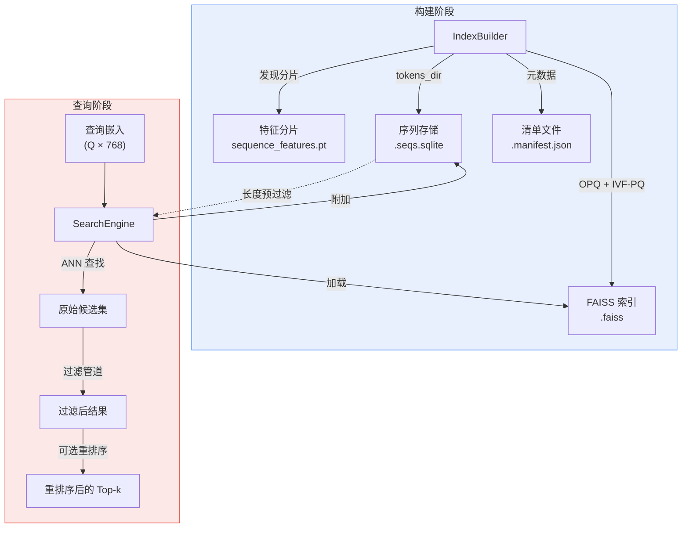
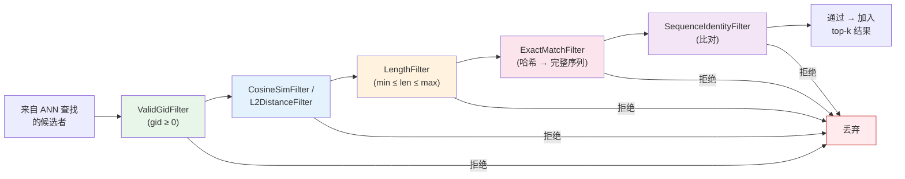
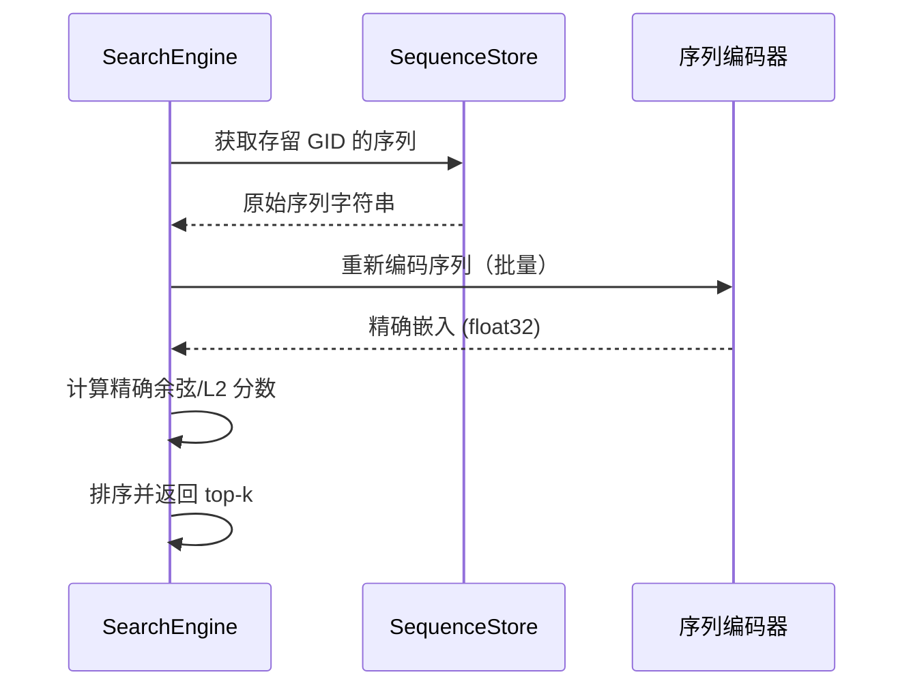

---
slug:16-similarity-search
blog_type:normal
---


STARLING 的相似度搜索子系统在蛋白质序列嵌入上提供了**基于 FAISS 的近似最近邻（ANN）搜索**，并配备了多层过滤管道、精确重排序以及基于 SQLite 的元数据存储。它是生成的序列或查询序列在大型数据库中寻找其结构邻居的机制——在生成管道的潜在空间与真实序列仓库之间架起了桥梁。

## 架构概述

搜索模块由四个协同组件构成，每个组件在“构建后查询”的生命周期中各司其职：



**构建阶段**从分片特征文件中构建压缩的 FAISS 索引和附带的 SQLite 数据库。**查询阶段**将这些产物加载到 `SearchEngine` 中，并执行带有可配置过滤和可选精确重评分的 ANN 搜索。这两个阶段完全解耦——索引是可移植的产物，可以跨环境共享。

来源：[\_\_init\_\_.py](/starling/search/__init__.py#L1-L36), [builder.py](/starling/search/builder.py#L1-L200)

## 使用 IndexBuilder 构建索引

`IndexBuilder` 将分片嵌入文件转换为生产就绪的 FAISS 索引。它采用 **OPQ + IVF-PQ 压缩**——一种三阶段量化策略，将 768 维的 float32 向量（每个约 3 KB）缩减为约 64–128 字节的编码，同时保持检索质量。

| 参数 | 默认值 | 作用 |
|-----------|---------|------|
| `sample_size` | 655,360 | 用于量化器学习的训练向量 |
| `nlist` | 16,384 | IVF 分区数（若训练集过小则自动减少） |
| `m` | 64 | PQ 子量化器数（必须能整除嵌入维度） |
| `nbits` | 8 | 每个子量化器码本条目的比特数 |
| `use_opq` | `True` | 学习旋转以改善量化 |
| `use_gpu` | `True` | GPU 加速训练 |
| `compress_sequences` | `False` | 附带 SQLite 中的 zstd 压缩 |

构建器通过在指定 `root` 下全局匹配 `**/sequence_features.pt` 来发现特征分片，从目录名解析分片 ID，并按数字对它们进行排序以保证稳定的 GID 分配。它会验证分片间的维度一致性，并在训练样本数不足以满足请求的分区数时，自动向下调整 `nlist`（至最接近的 2 的幂）。

**快速构建示例：**

```python
from starling.search import IndexBuilder, build_index

# 函数式 API
index = build_index(
    root="/data/feature_shards",
    index_path="/data/uniref_index.faiss",
    tokens_dir="/data/tokenized_sequences",
    metric="cosine",
    sample_size=655_360,
    nlist=16384,
    m=64,
)

# 面向对象 API（控制更精细）
builder = IndexBuilder(root="/data/feature_shards", metric="cosine")
index = builder.build_index(
    index_path="/data/uniref_index.faiss",
    tokens_dir="/data/tokenized_sequences",
    use_opq=True,
    use_gpu=True,
)
```

构建过程产生三个产物：`.faiss` 索引文件、带有元数据（维度、总向量数、IVF-PQ 配置、构建日期）的 `.manifest.json`，以及提供 `tokens_dir` 时生成的 `.seqs.sqlite` 序列存储。

来源：[builder.py](/starling/search/builder.py#L450-L649), [builder.py](/starling/search/builder.py#L200-L399)

## 序列元数据存储

`SequenceStore` 是一个基于 SQLite 的数据库，为过滤和重排序所需的序列数据提供 **O(log N) 索引查找**。它遵循构建后发布模式以保证原子性：写入器在隔离的临时文件中构建数据库，然后通过 `os.replace()` 原子地替换正式路径。

| 操作 | 方法 | 已索引？ | 备注 |
|-----------|--------|----------|-------|
| 单序列获取 | `get_seq(gid)` | ✓ (PK) | LRU 缓存（32K 条目） |
| 头部 + 长度 | `get_header_len(gid)` | ✓ (PK) | 单行查找 |
| 批量元数据 | `get_many_meta(gids)` | ✓ (PK) | 大批量使用临时表 JOIN |
| 长度范围查询 | `get_gids_by_length_range(min, max)` | ✓ (len) | 用于 IVF ID 选择器 |
| 批量插入 | `insert_rows(rows)` | — | 写入优化的 PRAGMA |
| 哈希计算 | `hash8(seq)` | — | SHA1 截断至 8 字节 |

**模式：**

```sql
CREATE TABLE sequences (
    gid       INTEGER PRIMARY KEY,
    len       INTEGER NOT NULL,
    hash8     INTEGER,          -- 用于去重的 8 字节哈希
    seq       BLOB NOT NULL,    -- [标志:1B][有效载荷] (0=UTF-8, 1=zstd)
    shard     INTEGER,
    local_idx INTEGER,
    header    BLOB              -- 与 seq 编码相同
);
CREATE INDEX idx_len ON sequences(len);
CREATE INDEX idx_hash8 ON sequences(hash8);
```

序列和头部使用 1 字节标志前缀进行编码：`0x00` 表示普通 UTF-8，`0x01` 表示 zstd 压缩的有效载荷。这允许在同一数据库中混合压缩和未压缩的数据。读取器以 `immutable=1` 和 `mode=ro` 打开——它们从不加锁，并支持跨线程和进程的无限并发访问。

来源：[store.py](/starling/search/store.py#L1-L200), [store.py](/starling/search/store.py#L400-L587)

## SearchEngine：查询索引

`SearchEngine` 是主要的查询接口。它封装了训练好的 FAISS 索引和可选的 `SequenceStore`，以提供带有多层过滤和精确重排序的高级搜索。

### 加载

```python
from starling.search import SearchEngine, load_engine

# 函数式 API
engine = load_engine("/data/uniref_index.faiss", metric="cosine")

# 类方法（等效）
engine = SearchEngine.load("/data/uniref_index.faiss", metric="cosine", verbose=True)
```

加载器读取 `.faiss` 文件，并在同级目录下存在 `.seqs.sqlite` 时自动附加。如果序列存储不存在，依赖它的过滤和重排序将在查询时引发 `RuntimeError`。

### 核心搜索方法

`search()` 方法编排整个管道：ANN 查找 → 元数据收集 → 过滤应用 → 可选重排序。其签名暴露了所有可调参数：

| 参数 | 默认值 | 用途 |
|-----------|---------|---------|
| `queries` | *(必填)* | 查询嵌入，形状为 `(Q, D)` |
| `k` | 10 | 每次查询的最终结果数 |
| `nprobe` | `None` | IVF 探测次数（越高 = 召回率越好，速度越慢） |
| `return_similarity` | `False` | 返回余弦相似度 ∈ [0,1] 还是距离 |
| `length_min` / `length_max` | `None` | 序列长度边界 |
| `max_cosine_similarity` | `None` | 相似度上限阈值（排除近乎重复项） |
| `exclude_exact` | `False` | 移除完全序列匹配项 |
| `sequence_identity_max` | `None` | 序列同一性上限阈值 |
| `overfetch` | `None` | 过滤前将 `k` 乘以的倍数（自动：若有活跃过滤器则为 5×） |
| `rerank` | `False` | 重新嵌入候选者并精确重评分 |
| `rerank_device` | `None` | 用于重排序编码器的设备 |

**基本搜索：**

```python
import torch

queries = torch.randn(10, 768)
queries = torch.nn.functional.normalize(queries, dim=1)

results = engine.search(queries=queries, k=100, nprobe=128, return_similarity=True)
# results[i] = [(score, gid, header, length), ...] 对应查询 i
```

<CgxTip>对于余弦度量，在将查询向量传递给 `search()` 之前，务必进行 L2 归一化。该方法会进行防御性归一化，但预归一化可避免不必要的计算。较高的 `nprobe` 值能以适中的延迟代价显著提升召回率——典型的生产值范围在 64 到 256 之间。</CgxTip>

来源：[search_engine.py](/starling/search/search_engine.py#L1-L200), [search_engine.py](/starling/search/search_engine.py#L760-L957)

## 多层过滤管道

过滤器作为顺序管道应用，其中第一个失败的过滤器会短路该候选者的评估。顺序经过刻意选择，将**廉价操作置于昂贵操作之前**——嵌入级检查先于元数据查找，元数据查找先于完整序列比较，完整序列比较先于比对计算。



| 过滤器 | 开销 | 触发条件 | 需要 SeqStore？ |
|--------|------|-------------|---------------------|
| `ValidGidFilter` | 可忽略 | 始终活跃 | 否 |
| `CosineSimFilter` | 可忽略 | `max_cosine_similarity` | 否 |
| `L2DistanceFilter` | 可忽略 | `min_l2_distance` | 否 |
| `LengthFilter` | O(1) 查找 | `length_min` / `length_max` | 是（用于长度数据） |
| `ExactMatchFilter` | 哈希比较 + 完整序列 | `exclude_exact` | 是 |
| `SequenceIdentityFilter` | 比对计算 | `sequence_identity_max` | 是 |

**过获取**机制补偿了由过滤引起的结果损失。当 `ValidGidFilter` 之外的任何过滤器处于活跃状态且未显式设置 `overfetch` 时，引擎会自动从 FAISS 请求 `5 × k` 个候选者，然后过滤至所需的 `k` 个。

### 长度预过滤优化

当指定了 `length_min` 和/或 `length_max` 时，引擎执行**两阶段长度优化**：首先，它查询 SQLite `idx_len` 索引以收集长度范围内的所有 GID，然后通过 `SearchParametersIVF` 将这些作为 `IDSelectorBatch` 传递给 FAISS。这将 ANN 搜索限制在仅相关的 IVF 分区，当长度范围相对于整个数据库较窄时，比事后过滤提供了显著加速。

来源：[search_utils.py](/starling/search/search_utils.py#L200-L384), [search_engine.py](/starling/search/search_engine.py#L200-L399)

## 精确重排序

重排序路径解决了压缩 ANN 搜索的根本准确性局限：IVF-PQ 分数是**近似的**，因为它们操作的是量化表示。当高精度至关重要时，重排序阶段通过完整的 STARLING 编码器重新嵌入存留的候选序列，并重新计算精确分数。



重排序通过 `rerank=True` 启用，并受三个附加参数控制：`rerank_device`（CUDA 设备或 CPU）、`rerank_batch_size`（编码器批大小，默认为 64）和 `rerank_ionic_strength`（转发给编码器的确定性 dropout 逻辑）。编码器导入是惰性的——`starling.inference.generation.sequence_encoder_backend`——因此除非激活，否则重排序不会产生启动开销。

<CgxTip>重排序开销很大：它需要对所有查询中的每个唯一候选者进行一次编码器的完整前向传递。仅在精度至关重要的最终精选阶段使用它。对于探索性搜索，增加 `nprobe`（例如，128→256）是提升召回率的更廉价方式。</CgxTip>

来源：[search_engine.py](/starling/search/search_engine.py#L600-L760), [search_engine.py](/starling/search/search_engine.py#L760-L957)

## 常见搜索模式

过滤参数可自然组合以服务于不同的分析目标：

| 模式 | 目标 | 关键参数 |
|---------|------|----------------|
| **近重复移除** | 寻找相似但不完全相同的序列 | `exclude_exact=True`, `max_cosine_similarity=0.99`, `nprobe=256` |
| **聚焦长度的邻域** | 目标长度 ±ΔL 范围内的序列 | `length_min=L-50`, `length_max=L+50`, `k=1000` |
| **多样化相似序列** | 具有同一性上限的广泛覆盖 | `max_cosine_similarity=0.80`, `sequence_identity_max=0.70`, `length_min=50`, `length_max=500` |
| **高精度精选** | 候选者的精确分数 | `rerank=True`, `rerank_device="cuda:0"`, `nprobe=128` |

**近重复搜索示例：**

```python
results = engine.search(
    queries=queries,
    k=100,
    nprobe=256,
    exclude_exact=True,
    max_cosine_similarity=0.99,
    return_similarity=True,
)
```

**带重排序的长度约束搜索：**

```python
results = engine.search(
    queries=queries,
    k=50,
    nprobe=128,
    length_min=100,
    length_max=300,
    rerank=True,
    rerank_device="cuda:0",
    query_sequences=sequence_list,  # 重排序所需
)
```

## 自定义过滤器扩展

`CandidateFilter` 抽象基类支持内置集之外的自定义过滤逻辑。过滤器实现两个方法：`apply(candidate, query_seq) → bool`（返回 `True` 以保留）和 `get_name() → str`（用于日志记录）。

```python
from starling.search.search_utils import CandidateFilter, Candidate

class MinScoreFilter(CandidateFilter):
    """排除低于最低分数阈值的候选者。"""
    def __init__(self, min_score: float):
        self.min_score = min_score

    def apply(self, candidate: Candidate, query_seq: str = None) -> bool:
        return candidate.score >= self.min_score

    def get_name(self) -> str:
        return "min_score"
```

自定义过滤器可以通过子类化 `SearchEngine` 或在将结果列表传递给下游分析之前对其进行预过滤，从而与内置管道组合。

来源：[search_utils.py](/starling/search/search_utils.py#L200-L384)

## 分数转换语义

`ScoreConverter` 处理 FAISS 原始分数与面向用户输出之间的非平凡映射，这取决于度量和 `return_similarity` 标志：

| 度量 | FAISS 原始输出 | `return_similarity=True` | `return_similarity=False` |
|--------|-----------------|------------------------|--------------------------|
| **cosine** | 内积（越高 = 越相似） | 相似度 ∈ [0, 1] | 距离 = 1 − 相似度 |
| **l2** | 平方 L2 距离（越低 = 越相似） | 距离（无转换） | 距离（无转换） |

对于具有归一化向量的余弦度量，内积直接等于余弦相似度。转换器确保无论选择何种组合，输出语义都是一致的。

来源：[search_utils.py](/starling/search/search_utils.py#L330-L384)

## 序列同一性计算

内置的同一性函数（`_seq_identity`）是一种**快速的无空位启发式算法**：它计算两个序列重叠前缀上的精确字符匹配数，并除以可配置的分母。它**不**执行比对——没有空位，没有插入，没有缺失。

| 分母模式 | 公式 | 用例 |
|-----------------|---------|----------|
| `query` | 匹配数 / len(query) | 默认；相对于查询的同一性 |
| `target` | 匹配数 / len(target) | 相对于数据库命中项的同一性 |
| `max` | 匹配数 / max(len1, len2) | 最保守 |
| `min` | 匹配数 / min(len1, len2) | 最不保守 |
| `avg` | 匹配数 / 0.5×(len1+len2) | 平衡 |

这种启发式方法适用于粗略过滤（例如，`sequence_identity_max=0.95` 以排除近乎相同的命中项），但对于具有短插入缺失的序列，会低估真实同一性。若要获得比对准确的同一性，请向 `SequenceIdentityFilter` 提供自定义 `identity_func`。

来源：[search_engine.py](/starling/search/search_engine.py#L400-L530)

## 产物摘要

构建阶段生成一组可独立于训练基础设施部署的自包含文件：

| 文件 | 格式 | 包含内容 |
|------|--------|----------|
| `index.faiss` | FAISS 二进制 | 训练好的包含所有向量的 OPQ+IVF-PQ 索引 |
| `index.faiss.manifest.json` | JSON | 构建元数据（维度、总数、nlist、m、nbits、日期） |
| `index.faiss.seqs.sqlite` | SQLite | 序列、头部、长度、哈希、分片来源 |

查询阶段仅需 `.faiss` 文件即可进行基本 ANN 搜索。`.seqs.sqlite` 文件是可选的，但任何需要序列内容或元数据的过滤或重排序操作都必须依赖它。

---

**下一步**：对于生成输入此搜索系统的嵌入的编码器，参见[序列编码器](5-sequence-encoder)。关于搜索结果如何输入集成构建，参见[集成对象 API](9-ensemble-object-api)。有关完整参数参考，参见[配置参考](17-configuration-reference)。