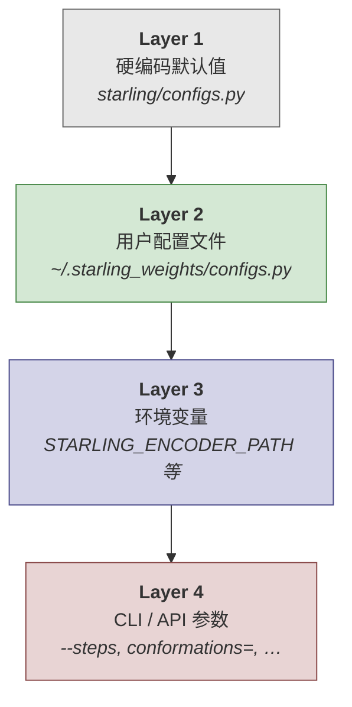
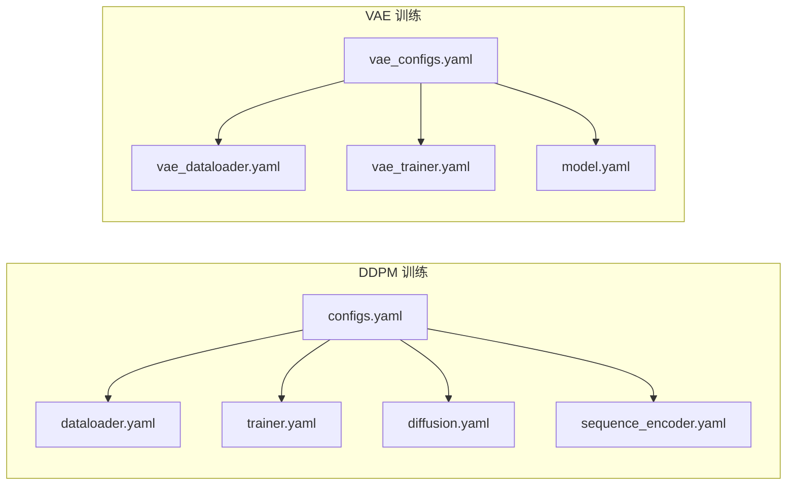

---
slug:17-configuration-reference
blog_type:normal
---


Starling 的配置系统在**三个层级**中运行——硬编码默认值、用户级覆盖文件和环境变量——每一层的优先级逐级递增。理解此层级结构对于自定义模型路径、推理参数和搜索产物路径至关重要，且无需修改已安装的包。

## 配置层级

Starling 通过严格的优先级链解析运行时参数。后层会静默覆盖前层，当应用用户配置覆盖时，系统会打印一条确认信息。



**Layer 1** 随包附带，定义了合理的默认值。**Layer 2** 是你在 `~/.starling_weights/` 中创建的可选 Python 文件——任何与 Layer 1 符号名匹配的变量名都会在导入时被覆盖。**Layer 3** 使用环境变量（例如 `STARLING_ENCODER_PATH`）来重定向模型权重和搜索产物，这在容器化或 CI 环境中尤为实用。**Layer 4**——CLI 标志或 Python API 关键字参数——提供单次调用的覆盖，且始终具有最高优先级。

来源：[configs.py](/starling/configs.py#L1-L69), [ensemble_generation.py](/starling/frontend/ensemble_generation.py#L160-L182)

## 运行时默认值 (Layer 1)

下表列举了 `starling/configs.py` 中定义的每个可配置常量、其默认值及用途。

| 变量 | 默认值 | 描述 |
|---|---|---|
| `DEFAULT_MODEL_DIR` | `~/.starling_weights` | 下载模型检查点的基础目录 |
| `DEFAULT_ENCODE_WEIGHTS` | `STARLING_v2.0.0_ViT_VAE_2025_10_14.ckpt` | VAE 编码器检查点文件名 |
| `DEFAULT_DDPM_WEIGHTS` | `STARLING_v2.0.0_ViT_DDPM_2025_10_14.ckpt` | 扩散 (DDPM) 检查点文件名 |
| `DEFAULT_ENCODER_WEIGHTS_PATH` | `STARLING_ENCODER_PATH` 环境变量或 GitHub 发布 URL | 编码器权重的解析路径或 URL |
| `DEFAULT_DDPM_WEIGHTS_PATH` | `STARLING_DDPM_PATH` 环境变量或 GitHub 发布 URL | DDPM 权重的解析路径或 URL |
| `DEFAULT_NUMBER_CONFS` | `400` | 每条序列生成的构象数 |
| `DEFAULT_BATCH_SIZE` | `100` | 采样批大小 |
| `DEFAULT_STEPS` | `30` | 去噪扩散步数 |
| `DEFAULT_MDS_NUM_INIT` | `4` | 每条序列的独立 MDS 初始化次数 |
| `DEFAULT_STRUCTURE_GEN` | `"mds"` | 3D 重建后端（当前仅为 `mds`） |
| `DEFAULT_IONIC_STRENGTH` | `150` | 离子强度（单位 mM） |
| `DEFAULT_SAMPLER` | `"ddim"` | 扩散采样器：`"ddim"`、`"ddpm"` 或 `"plms"` |
| `MAX_SEQUENCE_LENGTH` | `380` | 最大残基数；超长序列将被静默跳过 |
| `UNET_LABELS_DIM` | `512` | U-Net / ViT 去噪器内部的标签嵌入维度 |
| `CONVERT_ANGSTROM_TO_NM` | `10` | Å → nm 转换的乘法因子 |
| `DEFAULT_CPU_COUNT_MDS` | `min(DEFAULT_MDS_NUM_INIT, os.cpu_count())` | MDS 优化的 CPU 工作进程数 |
| `VALID_AA` | `"ACDEFGHIKLMNPQRSTVWY"` | 标准的 20 个氨基酸字母表 |

来源：[configs.py](/starling/configs.py#L6-L97)

## 用户配置覆盖 (Layer 2)

你可以通过在 `~/.starling_weights/configs.py` 创建一个纯 Python 文件来覆盖任何 Layer 1 变量。在导入时，`starling` 会发现此文件，将其作为模块执行，并将每个匹配的符号名复制到 `starling.configs` 命名空间中。每项覆盖都会打印到标准输出以保证透明度。

**示例 `~/.starling_weights/configs.py`：**

```python
# 覆盖推理默认值
DEFAULT_NUMBER_CONFS = 1000
DEFAULT_STEPS = 50
DEFAULT_BATCH_SIZE = 200

# 启用 PyTorch 编译以加速重复推理
TORCH_COMPILATION = {
    "enabled": True,
    "options": {
        "mode": "reduce-overhead",
        "fullgraph": True,
        "backend": "inductor",
        "dynamic": None,
    },
}
```

`load_user_config()` 函数遍历 `vars(user_config)`，跳过双下划线名称，并且只替换 `globals()` 中已存在的键——拼写错误的变量名会被静默忽略，因此请验证你期望的每一项覆盖是否都出现了 `[Starling Config] Overriding …` 消息。

<CgxTip>由于用户配置是常规的 Python 文件，你可以导入辅助模块或动态计算值（例如 `DEFAULT_CPU_COUNT_MDS = max(1, os.cpu_count() - 2)`）。然而，请避免产生副作用——该文件在**导入时**执行，这意味着任何 print 语句或 I/O 操作都会在每次导入 `starling` 时运行。</CgxTip>

来源：[configs.py](/starling/configs.py#L42-L69)

## 环境变量覆盖 (Layer 3)

对于模型权重和搜索产物路径，环境变量的优先级高于硬编码默认值和用户配置文件。它们在用户配置加载后立即被解析。

### 模型权重路径

| 变量 | 覆盖 | 回退 |
|---|---|---|
| `STARLING_ENCODER_PATH` | `DEFAULT_ENCODER_WEIGHTS_PATH` | v2.0.0 的 GitHub Releases URL |
| `STARLING_DDPM_PATH` | `DEFAULT_DDPM_WEIGHTS_PATH` | v2.0.0 的 GitHub Releases URL |

将这些变量设置为本地文件路径或替代的 HTTP URL，会使 `ModelManager` 从该位置加载，而非从官方发布处下载。当提供 URL 时，PyTorch 的 `hub.download_url_to_file` 会将文件缓存到 `torch.hub.get_dir()/checkpoints/` 下。

### 搜索产物路径

| 变量 | 覆盖 | 回退 |
|---|---|---|
| `STARLING_FAISS_INDEX_PATH` | `DEFAULT_FAISS_INDEX_PATH` | `~/.starling_search/<index_name>` |
| `STARLING_SEQSTORE_PATH` | `DEFAULT_SEQSTORE_DB_PATH` | `~/.starling_search/<seqstore_name>` |
| `STARLING_FAISS_MANIFEST_PATH` | `DEFAULT_FAISS_MANIFEST_PATH` | `~/.starling_search/<manifest_name>` |
| `STARLING_ZENODO_FAISS_URL` | `ZENODO_FAISS_INDEX_URL` | Zenodo 记录 17342150 |
| `STARLING_ZENODO_SEQSTORE_URL` | `ZENODO_SEQSTORE_URL` | Zenodo 记录 17342150 |
| `STARLING_ZENODO_MANIFEST_URL` | `ZENODO_MANIFEST_URL` | Zenodo 记录 17342150 |
| `STARLING_FAISS_INDEX_MD5` | `FAISS_INDEX_MD5` | 硬编码的 MD5 摘要 |
| `STARLING_SEQSTORE_MD5` | `SEQSTORE_MD5` | 硬编码的 MD5 摘要 |
| `STARLING_FAISS_MANIFEST_MD5` | `MANIFEST_MD5` | 硬编码的 MD5 摘要 |

`ensure_search_artifacts()` 函数会检查每个产物是否存在于本地；如果缺失且 `download=True`，它将从配置的 URL 下载，支持断点续传和可选的 MD5 校验。下载内容会写入 `.part` 临时文件，并在成功后进行原子重命名。

来源：[configs.py](/starling/configs.py#L82-L178), [model_loading.py](/starling/inference/model_loading.py#L21-L46)

## PyTorch 编译设置

`TORCH_COMPILATION` 字典控制是否在加载后将 `torch.compile` 应用于扩散模型的 ViT 去噪器和 VAE 解码器。默认情况下编译处于**禁用**状态。

| 键 | 默认值 | 选项 |
|---|---|---|
| `enabled` | `False` | `True` / `False` |
| `options.mode` | `"default"` | `"default"`、`"reduce-overhead"`、`"max-autotune"` |
| `options.fullgraph` | `True` | `True` / `False` —— 尝试将整个前向传播编译为单一计算图 |
| `options.backend` | `"inductor"` | `torch.compile` 接受的任何后端 |
| `options.dynamic` | `None` | `True` / `False` / `None` —— 处理动态张量形状 |

启用后，编译会在 `ModelManager.get_models()` 期间发生一次，并将完整的 `options` 字典作为关键字参数传递给 `torch.compile`。后续推理将受益于算子融合和减少的 Python 开销，但首次调用会产生显著的一次性编译开销。

来源：[configs.py](/starling/configs.py#L27-L35), [model_loading.py](/starling/inference/model_loading.py#L95-L130)

## 训练 YAML 配置 (Hydra)

`starling/configs/` 目录包含由 Hydra 组合的 YAML 文件，它们**仅在模型训练期间使用**。推理时不会参考这些文件——它们是 `starling-vae-train` 和 `starling-ddpm-train` CLI 入口点的打包产物。

### 组合结构



### 扩散训练 — `diffusion.yaml`

| 参数 | 默认值 | 描述 |
|---|---|---|
| `type` | `"discrete"` | 扩散类型（仅支持 `discrete`） |
| `discrete.beta_scheduler` | `"cosine"` | 噪声调度 |
| `discrete.timesteps` | `1000` | 训练扩散时间步 |
| `discrete.set_lr` | `0.0001` | 学习率 |
| `discrete.config_scheduler` | `"CosineAnnealingLR"` | 学习率调度器 |
| `discrete.min_snr_loss` | `False` | 是否使用 min-SNR 加权 |
| `discrete.min_snr_gamma` | `5.0` | min-SNR 损失的 Gamma 值 |

### 序列编码器 — `sequence_encoder.yaml`

| 参数 | 默认值 | 描述 |
|---|---|---|
| `num_layers` | `12` | Transformer 编码器层数 |
| `embed_dim` | `512` | 嵌入维度 |
| `num_heads` | `8` | 多头注意力头数 |

### VAE 模型 — `vae_model/model.yaml`

| 参数 | 默认值 | 描述 |
|---|---|---|
| `model_type` | `"Resnet18"` | 编码器架构 |
| `in_channels` | `1` | 输入通道数（灰度距离图） |
| `latent_dim` | `1` | 隐变量分布维度参数 |
| `dimension` | `384` | 隐空间维度 |
| `loss_type` | `"nll"` | 重建损失 |
| `KLD_weight` | `1e-6` | KL 散度损失权重 |
| `KLD_warmup_fraction` | `0` | KLD 预热的 epoch 占比 |
| `KLD_scheduler_type` | `"cyclical"` | KLD 退火调度 |
| `set_lr` | `0.00001` | 学习率 |
| `optimizer` | `"Adam"` | 优化器 |
| `norm` | `"instance"` | 归一化类型 |
| `base` | `64` | 基础通道数 |
| `compile_mode` | `"max-autotune-no-cudagraphs"` | 训练用的 `torch.compile` 模式 |

### 训练器 — `trainer.yaml` / `vae_trainer.yaml`

| 参数 | 训练器默认值 | VAE 训练器默认值 | 描述 |
|---|---|---|---|
| `cuda` | `1` | `1` | GPU 数量 |
| `num_nodes` | `1` | `1` | 分布式节点数 |
| `num_workers` | `8` | `8` | DataLoader 工作进程数 |
| `num_epochs` | `50` | `1` | 训练 epoch 数 |
| `gradient_clip_val` | `1.0` | `1.0` | 梯度裁剪 |
| `precision` | `"bf16-mixed"` | `"bf16-mixed"` | 混合精度模式 |
| `output_path` | `"20mM_model"` | `"ionic-strength-model"` | 检查点输出目录 |
| `fine_tune` | `False` | `True` | 从检查点恢复 |
| `checkpoint` | `null` | `.ckpt` 的路径 | 要恢复的检查点 |

### 数据加载器 — `dataloader.yaml` / `vae_dataloader.yaml`

| 参数 | DDPM 默认值 | VAE 默认值 | 描述 |
|---|---|---|---|
| `type` | `"tar"` | `"tar"` | 数据集格式：`"tar"` 或 `"h5"` |
| `tar.batch_size` | `64` | `16` | 每 GPU 批大小 |
| `tar.num_workers` | `8` | `8` | DataLoader 工作进程数 |
| `tar.prefetch_factor` | `4` | `4` | 预取乘数 |
| `tar.train_size` | `null` | `11_420_000` | 预估训练集大小 |
| `tar.val_size` | `null` | `2_450_000` | 预估验证集大小 |

来源：[configs.yaml](/starling/configs/configs.yaml#L1-L8), [diffusion.yaml](/starling/configs/diffusion/diffusion.yaml#L1-L12), [sequence_encoder.yaml](/starling/configs/sequence_encoder/sequence_encoder.yaml#L1-L3), [model.yaml](/starling/configs/vae_model/model.yaml#L1-L17), [trainer.yaml](/starling/configs/trainer/trainer.yaml#L1-L12), [vae_trainer.yaml](/starling/configs/trainer/vae_trainer.yaml#L1-L12), [dataloader.yaml](/starling/configs/dataloader/dataloader.yaml#L1-L16), [vae_dataloader.yaml](/starling/configs/dataloader/vae_dataloader.yaml#L1-L18)

## CLI 参数映射

`starling` CLI 将最常调整的推理参数作为标志暴露。每个标志的默认值均从 `starling.configs` 提取，因此 Layer 2 的覆盖会自动传播。

| CLI 标志 | 配置变量 | API 参数 | 默认值 |
|---|---|---|---|
| `-c / --conformations` | `DEFAULT_NUMBER_CONFS` | `conformations` | `400` |
| `-s / --steps` | `DEFAULT_STEPS` | `steps` | `30` |
| `-b / --batch_size` | `DEFAULT_BATCH_SIZE` | `batch_size` | `100` |
| `-d / --device` | *(自动检测)* | `device` | `None` |
| `--num-cpus` | `DEFAULT_CPU_COUNT_MDS` | `num_cpus_mds` | `min(4, cpu_count)` |
| `--num-mds-init` | `DEFAULT_MDS_NUM_INIT` | `num_mds_init` | `4` |
| `--ionic_strength` | `DEFAULT_IONIC_STRENGTH` | `ionic_strength` | `150` |
| `-r / --return_structures` | — | `return_structures` | `False` |
| `-o / --output_directory` | — | `output_directory` | `"."` |
| `--outname` | — | `output_name` | `None` |
| `-v / --verbose` | — | `verbose` | `False` |
| `--disable_progress_bar` | — | `show_progress_bar` | `True` |
| `--info` | — | *(打印配置摘要并退出)* | — |
| `--version` | — | *(打印版本并退出)* | — |

`--info` 标志在调试时尤为实用：它无需运行推理即可打印出解析后的模型权重路径、关键默认值和自动检测到的设备。

来源：[starling_main_cli.py](/starling/scripts/starling_main_cli.py#L45-L200), [ensemble_generation.py](/starling/frontend/ensemble_generation.py#L160-L244)

## 氨基酸映射字典

导出了两个查找表用于残基代码转换。它们在序列验证期间内部使用，也可以直接导入。

| 字典 | 键 → 值 | 示例 |
|---|---|---|
| `AA_THREE_TO_ONE` | 3 字母 → 1 字母 | `"ALA" → "A"` |
| `AA_ONE_TO_THREE` | 1 字母 → 3 字母 | `"A" → "ALA"` |

这两个字典涵盖了 `VALID_AA` 中定义的 20 个标准残基。

来源：[configs.py](/starling/configs.py#L97-L125)

## 快速配置方案

以下是一个精简的 `~/.starling_weights/configs.py`，它为典型的 IDP 集合生成平衡了质量与速度：

```python
# 更高质量的集合
DEFAULT_NUMBER_CONFS = 800
DEFAULT_STEPS = 50

# 如果有足够的核数，使用更多的并行 MDS 作业
DEFAULT_MDS_NUM_INIT = 8

# 启用 torch 编译以加速重复推理运行
TORCH_COMPILATION = {
    "enabled": True,
    "options": {
        "mode": "reduce-overhead",
        "fullgraph": True,
        "backend": "inductor",
        "dynamic": None,
    },
}
```

创建或编辑此文件后，运行 `starling --info` 以确认你的覆盖已生效——你应当能看到所更改的每个变量对应的 `[Starling Config] Overriding …` 日志行。

若要深入探索这些参数如何在生成流水线中流转，请参阅[架构概述](4-architecture-overview)和[采样策略](8-sampling-strategies)。若要了解约束如何与采样器参数交互，请参阅[约束引导采样](13-constraint-guided-sampling)。