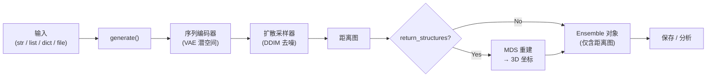

---
slug:2-quick-start
blog_type:normal
---


在五分钟内，从零开始生成你的首个本征无序蛋白质系综。本页将带你走完安装流程、首次生成运行（CLI 和 Python），以及你将在每个 `Ensemble` 对象上使用的核心分析操作——不多不少。

---

## 安装

STARLING 需要 **Python ≥ 3.10**，并依赖 PyTorch。推荐的工作流程从一个全新的 conda 环境开始：

```bash
conda create -n starling python=3.11 -y
conda activate starling
pip install idptools-starling
```

或者，直接从 GitHub 安装最新开发版：

```bash
pip install git+https://github.com/idptools/starling.git
```

通过运行 CLI 帮助信息来验证安装是否成功——如果能正常打印输出，说明已准备就绪：

```bash
starling --help
```

<CgxTip>首次使用时，STARLING 会自动将预训练的 VAE 和扩散模型权重（约 200 MB）下载到 `~/.starling_weights/`。后续运行将复用已缓存的权重。你可以设置 `STARLING_ENCODER_PATH` 和 `STARLING_DDPM_PATH` 环境变量来覆盖默认的下载路径。</CgxTip>

此外，也提供了 Docker 镜像用于容器化工作流——详情请参阅 [Docker 文档](docker/readme.md)。

来源: [README.md](/README.md#L49-L68), [pyproject.toml](/pyproject.toml#L8-L12), [starling/configs.py](/starling/configs.py#L8-L16)

---

## 你的首个系综 (CLI)

`starling` 命令行工具是从序列生成系综的最快途径。传入原始氨基酸序列，使用 `-c` 指定构象数量，并添加 `-r` 来重建 3D 结构：

```bash
starling MDVFMKGLSKAKEGVVAAAEKTKQGVAEAAGKTKEGVLYVGSKTKEGVVHGVATVAEKTKEQVTNVGGAVVTGVTAVAQKTVEGAGSIAAATGFVKKDQLGKNEEGAPQEGILEDMPVDPDNEAYEMPSEEGYQDYEPEA \
  --outname synuclein -c 400 -r
```

这将在当前目录下生成三个文件：

| 文件 | 描述 |
|------|-------------|
| `synuclein.starling` | 二进制归档文件 — 距离图 + 元数据（可重新加载） |
| `synuclein_STARLING.pdb` | 系综的 PDB 拓扑文件 |
| `synuclein_STARLING.xtc` | 包含所有构象的压缩 XTC 轨迹文件 |

CLI 还接受 `.fasta` 文件、`.tsv` 文件（`名称<TAB>序列`）以及 `.seq.in` 文件以进行批处理。你最常使用的核心标志：

| 标志 | 默认值 | 用途 |
|------|---------|---------|
| `-c, --conformations` | 400 | 采样的构象数量 |
| `--steps` | 30 | DDIM 去噪步数（越少越快，但精度越低） |
| `-d, --device` | auto | 计算设备：`cpu`、`cuda:0`、`mps` |
| `--ionic_strength` | 150 | 溶剂离子强度，单位 mM（20、150 或 300） |
| `-r, --return_structures` | off | 生成 PDB + XTC 3D 坐标 |
| `--outname` | auto | 输出文件名前缀（仅限单序列） |
| `-o, --output_directory` | `.` | 输出文件的目录 |

来源: [README.md](/README.md#L77-L112), [starling/scripts/starling_main_cli.py](/starling/scripts/starling_main_cli.py#L54-L99), [starling/configs.py](/starling/configs.py#L18-L28)

---

## 你的首个系综 (Python)

Python API 与 CLI 功能相对应，但为你提供了实时的 `Ensemble` 对象，以便通过编程方式进行检视与分析。你最常使用的两个符号是 [`generate`](/starling/frontend/ensemble_generation.py#L111-L525) 和 [`load_ensemble`](/starling/structure/ensemble.py)：

```python
from starling import generate, load_ensemble

# 在生理离子强度下生成包含 100 个构象的系综
sequence = "MQDRVKRPMNAFIVWSRDQRRKMALENPRMRNSEISKQLGYQWKMLTEAEKWPFFQEAQKLQAMHREKYPNYKYRPRRKAKMLPK"
ensemble = generate(sequence, conformations=100, ionic_strength=150, return_single_ensemble=True)

# 立即计算生物物理可观测量
mean_rg = ensemble.radius_of_gyration(return_mean=True)
print(f"Mean Rg: {mean_rg:.2f} Å")

# 持久化保存到磁盘，以便后续重新加载
ensemble.save("my_ensemble")
reloaded = load_ensemble("my_ensemble.starling")
```

`generate` 函数接受多种输入格式——单个序列字符串、字符串列表、`{名称: 序列}` 字典，或 FASTA/TSV 文件路径。当 `return_single_ensemble=True` 时，它返回一个单独的 `Ensemble` 对象；否则返回一个以序列名称为键的 `dict`。



日常使用中 `generate()` 函数最重要的参数：

| 参数 | 默认值 | 用途 |
|-----------|---------|---------|
| `conformations` | 400 | 每条序列采样的构象数量 |
| `ionic_strength` | 150 | 溶剂离子强度，单位 mM（20、150 或 300） |
| `steps` | 30 | DDIM 去噪步数 |
| `device` | auto | `None` 会自动选择最佳可用加速器 |
| `return_structures` | `False` | 包含 3D 坐标重建 |
| `return_single_ensemble` | `False` | 返回单独的 `Ensemble` 而非 `dict` |
| `constraint` | `None` | 在采样期间应用约束 |
| `batch_size` | 100 | 采样迭代的批处理大小 |

<CgxTip>超过 380 个残基的序列将被自动跳过并发出警告——这是当前模型的上下文窗口。包含非标准残基的序列将在输入验证阶段引发 `ValueError`，此阶段早于任何 GPU 计算的启动。</CgxTip>

来源: [starling/__init__.py](/starling/__init__.py#L6-L9), [starling/frontend/ensemble_generation.py](/starling/frontend/ensemble_generation.py#L111-L200), [starling/structure/ensemble.py](/starling/structure/ensemble.py#L1-L60), [demos/basic_usage.ipynb](/demos/basic_usage.ipynb)

---

## 分析 Ensemble 对象

一旦你拥有了一个 `Ensemble` 对象，一系列分析方法即可立即使用——无需额外导入。所有返回逐构象数组的方法也接受 `return_mean=True` 以获取单一标量，以及在你执行 BME 重加权后可使用 `use_bme_weights=True`。

### 核心分析方法

| 方法 | 返回值 | 描述 |
|--------|---------|-------------|
| `radius_of_gyration()` | `ndarray` 或 `float` | 每个构象的全局 Rg (Å) |
| `local_radius_of_gyration(start, end)` | `ndarray` 或 `float` | 残基子区域的 Rg |
| `hydrodynamic_radius()` | `ndarray` 或 `float` | 通过 Nygaard 或 Kirkwood-Riseman 方法计算的 Rh |
| `end_to_end_distance()` | `ndarray` 或 `float` | 每个构象的 N 端到 C 端距离 (Å) |
| `rij(i, j)` | `ndarray` 或 `float` | 残基 i 和 j 之间的距离（从 0 开始索引） |
| `distance_maps(return_mean=True)` | `ndarray` | 平均或逐帧距离图 |
| `contact_map(contact_thresh=11)` | `ndarray` | 接触概率图（阈值单位为 Å） |
| `check_for_errors(remove_errors=True)` | `list` | 查找并可选地移除物理上不可能的帧 |

### 快速分析示例

```python
from starling import generate

ensemble = generate("GS" * 30, conformations=200, return_single_ensemble=True)

# 回转半径
all_rg = ensemble.radius_of_gyration()            # 包含 200 个值的数组
mean_rg = ensemble.radius_of_gyration(return_mean=True)  # 单个浮点数

# 端到端距离
ete = ensemble.end_to_end_distance()

# 残基间距离（从 0 开始索引：残基 10 → 第 11 个残基）
d_11_51 = ensemble.rij(10, 50)

# 12 Å 阈值下的接触图
contacts = ensemble.contact_map(contact_thresh=12.0, return_mean=True)

# 流体力学半径（默认为 Nygaard 模式）
rh = ensemble.hydrodynamic_radius(return_mean=True)
```

### 保存、加载与 3D 轨迹

```python
# 保存完整的 .starling 归档文件（距离图 + 元数据）
ensemble.save("my_protein")

# 从磁盘重新加载
from starling import load_ensemble
reloaded = load_ensemble("my_protein.starling")

# 生成并保存 3D 轨迹（PDB 拓扑 + XTC）
ensemble.save_trajectory("my_protein")          # .pdb + .xtc
ensemble.save_trajectory("my_protein", pdb_trajectory=True)  # 仅多模型 .pdb
```

`.starling` 归档文件是标准的存储格式——它保留了原始距离图和所有元数据，可实现无损的往返操作。PDB/XTC 文件是衍生产品，用于在 VMD、PyMOL 或 MDAnalysis 等工具中进行可视化。

来源: [starling/structure/ensemble.py](/starling/structure/ensemble.py#L349-L500), [starling/structure/ensemble.py](/starling/structure/ensemble.py#L850-L920), [demos/basic_usage.ipynb](/demos/basic_usage.ipynb)

---

## 选择离子强度

STARLING 的生成模型在三种溶剂条件下进行了训练。选择最接近你实验条件的那一种，可以提高物理真实性：

| 离子强度 | 条件 | 适用场景 |
|---------------|-----------|-------------|
| 20 mM | 低盐 | 稀释的体外实验，低盐 NMR |
| 150 mM | 生理 | 模拟细胞条件（默认） |
| 300 mM | 高盐 | 拥挤环境，高盐缓冲液 |

```python
# 低盐系综
ensemble_low = generate(sequence, ionic_strength=20, return_single_ensemble=True)

# 生理条件（默认）
ensemble_phys = generate(sequence, ionic_strength=150, return_single_ensemble=True)

# 高盐
ensemble_high = generate(sequence, ionic_strength=300, return_single_ensemble=True)
```

来源: [starling/configs.py](/starling/configs.py#L25-L26), [demos/basic_usage.ipynb](/demos/basic_usage.ipynb)

---

## 性能一览

STARLING **在 GPU 上非常快**（对于典型的 140 残基 IDR 生成 400 个构象仅需数秒），并通过 MPS 后端 **在 Apple Silicon 上同样极快**。CPU 推理耗时在分钟级而非秒级——对于大多数用例仍具实用性。要显式选择设备：

```python
# 强制使用 GPU
ensemble = generate(sequence, device="cuda:0", return_single_ensemble=True)

# Apple Silicon
ensemble = generate(sequence, device="mps", return_single_ensemble=True)

# 显式使用 CPU
ensemble = generate(sequence, device="cpu", return_single_ensemble=True)
```

对于重复的 GPU 工作负载，启用 PyTorch 编译以摊销内核启动开销：

```python
import starling
starling.set_compilation_options(enabled=True, mode="reduce-overhead")
ensemble = starling.generate(sequence, return_single_ensemble=True)
```

来源: [README.md](/README.md#L114-L116), [starling/__init__.py](/starling/__init__.py#L23-L77), [starling/configs.py](/starling/configs.py#L30-L39)

---

## 首次运行排障

| 症状 | 原因 | 解决方案 |
|---------|-------|-----|
| `starling: command not found` | pip 安装未添加至 PATH | 使用 `python -m starling.scripts.starling_main_cli` 或在活动环境中重新安装 |
| 首次 `generate()` 时下载缓慢 | 正在获取模型权重（约 200 MB） | 等待；首次下载后会缓存至 `~/.starling_weights/` |
| `ValueError: Invalid amino acid detected` | 序列中存在非标准残基 | 在传入 STARLING 之前移除或转换非标准残基 |
| `Warning: Sequence … is too long` | 序列超过 380 个残基 | STARLING 的最大上下文为 380；请拆分或截断序列 |
| 输出时出现 `FileNotFoundError` | 输出目录不存在 | 先创建目录或使用已有路径 |

来源: [starling/frontend/ensemble_generation.py](/starling/frontend/ensemble_generation.py#L28-L106), [starling/configs.py](/starling/configs.py#L26-L27)

---

## 接下来的去向

你现在已拥有一个可用的 STARLING 安装，并能够生成和分析系综。以下是深入探索的逻辑进阶路径：

1. **[CLI 参考](3-cli-reference)** — 完整的标志参考、使用 FASTA/TSV 进行批处理、文件转换工具（`starling2pdb`、`starling2xtc`）
2. **[架构概览](4-architecture-overview)** — 了解三阶段流水线（编码器 → 扩散 → MDS 重建）
3. **[Ensemble 对象 API](9-ensemble-object-api)** — 完整的方法目录、BME 重加权、错误诊断
4. **[约束引导采样](12-constraint-guided-sampling)** — 通过距离、Rg 或螺旋度约束引导系综
5. **[BME 重加权](11-bme-reweighting)** — 根据实验可观测量（SAXS、FRET、NMR）精修系综

如果你发现 STARLING 在你的研究中很有用，请引用：

> Novak, B., Lotthammer, J. M., Emenecker, R. J. & Holehouse, A. S. **Accurate predictions of disordered protein ensembles with STARLING.** *Nature* **652**, 240–250 (2026).