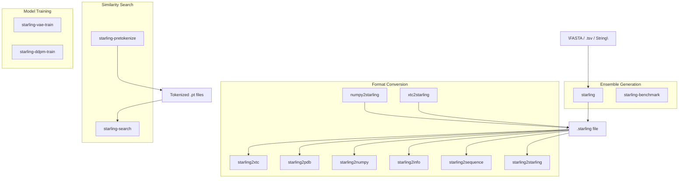
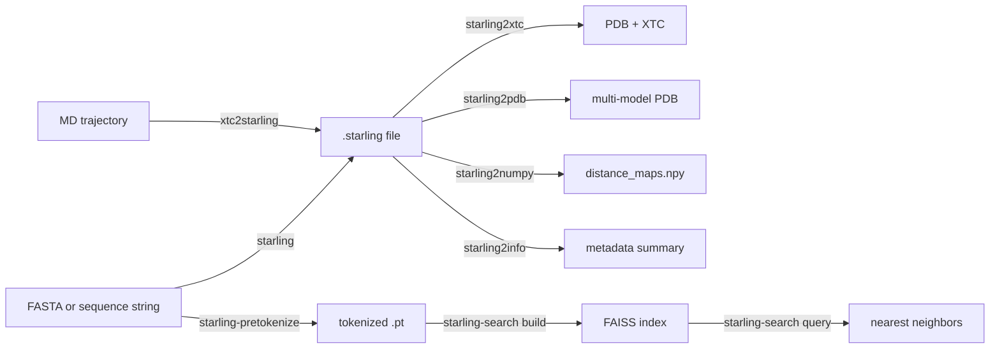

---
slug:3-cli-reference
blog_type:normal
---


Starling 提供了一套命令行工具，覆盖了内禀无序蛋白质构象系综生成的完整生命周期——从序列输入到构象采样、格式转换、相似性搜索及性能基准测试。当你执行 `pip install idptools-starling` 时，每个 CLI 命令都会自动安装，并在项目配置中被定义为控制台脚本入口点。本页面记录了每个命令的用途、参数及典型使用模式。

来源: [pyproject.toml](/pyproject.toml#L50-L66)

## 命令概述

Starling CLI 被组织为**四个功能组**：系综生成、格式转换、相似性搜索和模型训练。下图展示了这些组之间及其与核心数据格式的关系。



| 组 | 命令 | 用途 |
|---|---|---|
| **生成** | `starling` | 从序列生成 IDP 构象系综 |
| **生成** | `starling-benchmark` | 基准测试运行时和输出质量 |
| **转换** | `starling2xtc` | `.starling` → PDB 拓扑 + XTC 轨迹 |
| **转换** | `starling2pdb` | `.starling` → 多模型 PDB |
| **转换** | `starling2numpy` | `.starling` → NumPy 距离图数组 |
| **转换** | `starling2info` | 显示 `.starling` 系综元数据 |
| **转换** | `starling2sequence` | 将 `.starling` 中的序列打印到标准输出 |
| **转换** | `starling2starling` | 修复或错误检查 `.starling` 文件 |
| **转换** | `numpy2starling` | 旧版 NumPy 数组 → `.starling`（向后兼容） |
| **转换** | `xtc2starling` | XTC 轨迹 → `.starling` |
| **搜索** | `starling-search` | 构建和查询 FAISS 相似性索引 |
| **搜索** | `starling-pretokenize` | 为索引构建预分词 FASTA |
| **训练** | `starling-vae-train` | 训练 VAE 序列编码器 |
| **训练** | `starling-ddpm-train` | 训练扩散去噪模型 |

来源: [pyproject.toml](/pyproject.toml#L50-L66)

---

## `starling` — 系综生成

这是用于生成构象系综的**主命令**。它接受一个蛋白质序列（或包含序列的文件），运行完整的生成流水线（VAE 编码 → 扩散采样 → MDS 重建），并将结果写为 `.starling` 文件。

### 输入格式

位置参数 `user_input` 很灵活，可以是以下任意一种：

| 输入类型 | 示例 | 备注 |
|---|---|---|
| **FASTA 文件** | `sequences.fasta` | 使用 `protfasta` 解析；重复名称会导致错误 |
| **TSV / seq.in 文件** | `seqs.tsv` 或 `seqs.in` | 以制表符分隔的 `name\tsequence` 行 |
| **原始序列字符串** | `"MDVFMKGLSK"` | 内联传递的单个序列 |

### 参数

| 标志 | 类型 | 默认值 | 描述 |
|---|---|---|---|
| `user_input` | str | *(必选)* | 序列、FASTA 路径或 TSV 路径 |
| `-c` / `--conformations` | int | 400 | 要生成的构象数量 |
| `-d` / `--device` | str | 自动检测 | 计算设备 (`cpu`, `cuda`, `mps`) |
| `-s` / `--steps` | int | 30 | 扩散模型采样步数 |
| `-b` / `--batch_size` | int | 100 | 采样批大小 |
| `-o` / `--output_directory` | str | `.` | 输出目录 |
| `--outname` | str | None | 自定义输出文件名前缀（仅限单个序列） |
| `-r` / `--return_structures` | 标志 | False | 生成 3D 坐标 (PDB + XTC) |
| `--num-cpus` | int | min(4, cpu_count) | MDS 重建的最大 CPU 数 |
| `--num-mds-init` | int | 4 | 并行 MDS 作业（为获最佳性能请匹配 `--num-cpus`） |
| `--ionic_strength` | int | 150 | 离子强度，单位 mM |
| `--disable_progress_bar` | 标志 | off | 隐藏进度条 |
| `-v` / `--verbose` | 标志 | off | 启用详细日志 |
| `--info` | 标志 | off | 打印配置信息并退出 |
| `--version` | 标志 | off | 打印版本并退出 |

### 示例

```bash
# 从原始序列生成 400 个构象
starling "MDVFMKGLSKAKEGVVAAAEKTKQGVAEAAG" -o ./output

# 生成 1000 个构象并输出 3D 结构
starling sequences.fasta -c 1000 -r -o ./ensembles

# 检查 Starling 配置和模型路径
starling --info
```

<CgxTip>为获得最快生成速度，请将 `--num-mds-init` 设置为与 `--num-cpus` 相等。每个 MDS 作业彼此独立，因此跨所有可用核心并行化可避免距离图到坐标重建的单线程瓶颈。</CgxTip>

来源: [starling_main_cli.py](/starling/scripts/starling_main_cli.py#L37-L197), [configs.py](/starling/configs.py#L14-L25), [ensemble_generation.py](/starling/frontend/ensemble_generation.py#L8-L79)

---

## `starling-benchmark` — 性能基准测试

运行受控的系综生成基准测试，测量不同构象数量下的运行时和平均回转半径。默认情况下，它生成 10 个在 10 到 1000 之间线性等距的构象计数，并在运行之间加入硬件冷却时间。

### 参数

| 标志 | 类型 | 默认值 | 描述 |
|---|---|---|---|
| `--device` | str | 自动检测 | 计算设备 |
| `--batch-size` | int | 100 | 采样批大小 |
| `--steps` | int | 30 | 扩散步数 |
| `--sequence` | str | α-突触核蛋白 | 基准测试的蛋白质序列 |
| `--cooltime` | int | 20 | 运行间等待的秒数 |
| `--single-run` | int | 0 | 在此构象计数下运行单次基准测试 |
| `--compile` | 标志 | off | 启用 `torch.compile`（仅限 CUDA） |

### 输出

基准测试结果保存为 CSV 文件：`runtime_matrix_*.csv` 和 `rg_matrix_*.csv`，每个文件包含列 `[conformations, value]`。

```bash
# 单次基准测试：在 GPU 上生成 500 个构象
starling-benchmark --single-run 500 --device cuda

# 启用编译的全量扫描
starling-benchmark --compile --device cuda
```

来源: [starling_main_cli.py](/starling/scripts/starling_main_cli.py#L210-L367)

---

## 格式转换命令

Starling 使用自定义的 **`.starling`** 归档格式（基于 HDF5）来存储距离图、元数据和可选的 3D 结构。以下转换器命令允许你将这些归档转换为标准结构生物学格式，反之亦然。

### `starling2xtc` — 转换为 PDB + XTC

从 `.starling` 系综生成 PDB 拓扑文件和 XTC 轨迹。如果 3D 结构尚未重建，将自动触发 MDS 重建。

| 标志 | 类型 | 默认值 | 描述 |
|---|---|---|---|
| `input_file` | str | *(必选)* | 输入 `.starling` 文件 |
| `-o` / `--output` | str | `.` | 输出路径 |
| `--device` | str | None | 用于 MDS 重建的设备 |
| `--remove-errors` | 标志 | off | 移除具有物理不可能距离的帧 |

来源: [starling_converter.py](/starling/scripts/starling_converter.py#L14-L45)

### `starling2pdb` — 转换为 PDB 轨迹

与 `starling2xtc` 相同，但输出多模型 PDB 文件而非 PDB+XTC。

| 标志 | 类型 | 默认值 | 描述 |
|---|---|---|---|
| `input_file` | str | *(必选)* | 输入 `.starling` 文件 |
| `-o` / `--output` | str | `.` | 输出路径 |
| `--device` | str | None | 用于 MDS 重建的设备 |
| `--remove-errors` | 标志 | off | 移除具有物理不可能距离的帧 |

来源: [starling_converter.py](/starling/scripts/starling_converter.py#L48-L80)

### `starling2numpy` — 转换为 NumPy 数组

从 `.starling` 文件中提取距离图张量，并将其保存为 `.npy` 文件。

| 标志 | 类型 | 默认值 | 描述 |
|---|---|---|---|
| `input_file` | str | *(必选)* | 输入 `.starling` 文件 |
| `-o` / `--output` | str | `.` | 输出路径 |

来源: [starling_converter.py](/starling/scripts/starling_converter.py#L83-L103)

### `starling2info` — 显示系综元数据

打印系综的摘要：构象数量、生成日期、模型权重路径、回转半径、端到端距离以及是否包含 3D 结构。

```bash
starling2info my_protein.starling
```

**示例输出:**
```
-------------------------------
STARLING Generated ensemble
-------------------------------
Number of conformations     : 400
Generate with STARLING      : 2.0.0
Generate on ....            : Mon Oct 14 10:00:00 2025
Average radius of gyration  : 3.72
Average end-to-end distance : 8.15
Sequence                    : MDVFMKGLSKAKEGVVAAAEKTKQGVAEAAG
Structures?                 : [X] (400 structures)
-------------------------------
```

来源: [starling_converter.py](/starling/scripts/starling_converter.py#L106-L155)

### `starling2sequence` — 打印序列

将与 `.starling` 文件关联的氨基酸序列写入标准输出。

```bash
starling2sequence my_protein.starling
# 输出: MDVFMKGLSKAKEGVVAAAEKTKQGVAEAAG
```

来源: [starling_converter.py](/starling/scripts/starling_converter.py#L158-L175)

### `starling2starling` — 修复 / 错误检查

重新处理 `.starling` 文件，可选地扫描错误构象（具有不可能残基间距离的帧）并写入修正后的归档。

| 标志 | 类型 | 默认值 | 描述 |
|---|---|---|---|
| `input_file` | str | *(必选)* | 输入 `.starling` 文件 |
| `-o` / `--output` | str | `.` | 输出路径 |
| `--error-check` | 标志 | off | 扫描系综以排查问题 |
| `--remove-errors` | 标志 | off | 移除不良构象并保存 |
| `--overwrite` | 标志 | off | 原地覆盖输入文件 |

来源: [starling_converter.py](/starling/scripts/starling_converter.py#L158-L213)

### `numpy2starling` — 旧版 NumPy 转为 `.starling`

将先前生成的 NumPy 距离图数组转换为 `.starling` 格式。**此命令出于向后兼容目的而存在**，并将在未来版本中移除。

| 标志 | 类型 | 默认值 | 描述 |
|---|---|---|---|
| `input_file` | str | *(必选)* | 输入 `.npy` 文件 |
| `-s` / `--sequence` | str | None | 氨基酸序列（除非提供 `-p` 否则必选） |
| `-o` / `--output` | str | `.` | 输出路径 |
| `-x` / `--xtc` | str | None | XTC 轨迹文件 |
| `-p` / `--pdb` | str | None | PDB 拓扑文件 |
| `--build-structures` | 标志 | off | 重建 3D 系综 |

来源: [starling_converter.py](/starling/scripts/starling_converter.py#L216-L305)

### `xtc2starling` — XTC 轨迹转为 `.starling`

通过从轨迹帧计算残基间距离图，将 MD 轨迹 (XTC + PDB) 转换为 `.starling` 系综。

| 标志 | 类型 | 默认值 | 描述 |
|---|---|---|---|
| `--xtc` | str | *(必选)* | 输入 XTC 轨迹 |
| `--pdb` | str | *(必选)* | PDB 拓扑文件 |
| `-o` / `--output` | str | `.` | 输出路径 |

```bash
xtc2starling --xtc simulation.xtc --pdb topology.pdb -o ./converted
```

来源: [starling_converter.py](/starling/scripts/starling_converter.py#L308-L395)

---

## `starling-search` — 相似性搜索

一个两阶段的 CLI，用于基于蛋白质序列嵌入构建和查询 FAISS 近邻索引。使用 `build` 子命令从预分词数据创建索引，使用 `query` 子命令查找相似序列。

### `starling-search build`

从分词序列数据构建 FAISS 索引。需要先前由 `starling-pretokenize` 创建的分词目录。

| 标志 | 类型 | 默认值 | 描述 |
|---|---|---|---|
| `--root` | str | *(必选)* | 索引产物的根目录 |
| `--index` | str | *(必选)* | 输出 FAISS 索引路径 |
| `--tokens` | str | *(必选)* | 分词后的 `.pt` 文件目录 |
| `--metric` | `cosine` \| `l2` | `cosine` | 距离度量 |
| `--sample-size` | int | 655360 | IVF 的训练样本大小 |
| `--nlist` | int | 16384 | IVF 单元格数量 |
| `--m` | int | 64 | 乘积量子量化子量化器 |
| `--nbits` | int | 8 | 每个 PQ 子码的比特数 |
| `--nprobe` | int | 16 | 搜索时探测的单元格数 |
| `--use-gpu` | 标志 | on | 启用 GPU 构建索引 |
| `--gpu-device` | int | 0 | GPU 设备索引 |
| `--opq` | 标志 | off | 使用 OPQ 旋转 |
| `--compress` | 标志 | off | 压缩存储的序列 |
| `--shard-regex` | str | None | 用于过滤分词分片的正则表达式 |
| `--verbose` | 标志 | on | 详细日志 |

```bash
starling-search build --root /data/starling --tokens /data/tokens --index myindex.faiss
```

来源: [starling_search.py](/starling/scripts/starling_search.py#L28-L72)

### `starling-search query`

使用一个或多个蛋白质序列查询已构建的 FAISS 索引。如果使用 `--index default` 或文件缺失，Starling 会自动从 Zenodo 下载并缓存默认的预构建索引。

| 标志 | 类型 | 默认值 | 描述 |
|---|---|---|---|
| `--index` | str | `default` | FAISS 索引路径（或 `default` 以自动获取） |
| `--metric` | `cosine` \| `l2` | `cosine` | 距离度量（必须与构建时匹配） |
| `--seq` | str\* | None | 查询序列（通过重复传递多个） |
| `--k` | int | 10 | 近邻数量 |
| `--nprobe` | int | 64 | 探测的单元格数 |
| `--exclude-exact` | 标志 | on | 排除精确匹配 |
| `--sequence-identity-max` | float | None | 最大序列同一性过滤器 |
| `--identity-denominator` | str | `query` | 同一性分母：`query`, `target`, `max`, `min`, `avg` |
| `--max-cosine-similarity` | float | None | 最大余弦相似度阈值 |
| `--min-l2-distance` | float | None | 最小 L2 距离阈值 |
| `--length-min` | int | None | 最小目标序列长度 |
| `--length-max` | int | None | 最大目标序列长度 |
| `--rerank` | 标志 | on | 启用结构感知比较的重排 |
| `--rerank-ionic-strength` | int | None | 重排的离子强度 |
| `--device` | str | `cuda:0` | 计算设备 |
| `--batch-size` | int | 256 | 嵌入批大小 |
| `--ionic-strength` | int | 150 | 嵌入的离子强度 |
| `--out` | str | `nearest_neighbors` | 输出基本名称（扩展名自动设置） |
| `--out-format` | `csv` \| `jsonl` | `csv` | 输出格式 |
| `--verbose` | 标志 | on | 详细日志 |

```bash
# 在默认索引中查询两个序列
starling-search query --seq "MDVFMKGLSKAKEGVV" --seq "MSTESDQLV" --k 20 --out results

# 启用重排和序列同一性过滤进行查询
starling-search query --index myindex.faiss --seq "MDVFMKGLSK" \
  --k 50 --rerank --sequence-identity-max 0.8 --out-format jsonl
```

**查询输出列** (CSV/JSONL)：`query_index`, `query_seq`, `rank`, `gid`, `score`, `similarity`, `header`, `length`, `sequence`。同时还会写入一个包含命中序列的配套 `.fasta` 文件。

<CgxTip>在首次运行时使用 `--index default`，让 Starling 从 Zenodo 自动下载预构建的搜索索引（GB 级别）。后续查询将使用位于 `~/.starling_search/` 的缓存副本。设置环境变量 `STARLING_FAISS_INDEX_PATH` 和 `STARLING_SEQSTORE_PATH` 可覆盖缓存位置。</CgxTip>

来源: [starling_search.py](/starling/scripts/starling_search.py#L74-L112), [starling_search.py](/starling/scripts/starling_search.py#L230-L337), [configs.py](/starling/configs.py#L157-L208)

---

## `starling-pretokenize` — FASTA 预分词

使用 Starling 的序列编码器对 FASTA 蛋白质序列文件进行分词，生成 `starling-search build` 所需的 `.pt` 张量文件。支持跨多个工作进程的并行处理。

| 标志 | 类型 | 默认值 | 描述 |
|---|---|---|---|
| `fastas` | str\* | None | 输入 FASTA 文件路径 |
| `--sequences` | str | None | 列出绝对 FASTA 路径的文本文件（每行一个） |
| `-o` / `--output` | str | *(必选)* | 输出目录 |
| `--combined` | 标志 | off | 将所有条目写入单个合并的 `.pt` 文件 |
| `--prefix` | str | `pretokenized` | 合并输出的文件名前缀 |
| `--workers` | int | 1 | 并行工作进程数 |
| `--no-progress` | 标志 | off | 禁用进度条 |

```bash
# 分词单个 FASTA 文件
starling-pretokenize uniprot_sprot.fasta swissprot.fasta -o ./tokens

# 从路径列表文件分词，合并输出，4 个工作进程
starling-pretokenize --sequences fasta_list.txt -o ./tokens --combined --prefix all_seqs --workers 4
```

**输出**：每个 FASTA 对应的 `<basename>.tokens.pt` 文件（或在使用 `--combined` 时的单个 `<prefix>.pt`），每个文件包含一个 `{header, sequence, tokenized}` 字典列表。

来源: [starling_pretokenize.py](/starling/scripts/starling_pretokenize.py#L1-L126)

---

## 训练命令

这些命令面向想要重新训练或微调 Starling 神经网络组件的**高级用户**。两者均使用 Hydra 配置和 PyTorch Lightning，并可选配 Weights & Biases 日志记录。

### `starling-vae-train` — 训练 VAE 编码器

训练 Vision Transformer VAE，将蛋白质序列编码为潜在表示。配置通过 Hydra YAML 文件管理。

```bash
starling-vae-train  # 使用 starling/training/config.yaml 中的默认 Hydra 配置
```

来源: [pyproject.toml](/pyproject.toml#L50-L51), [vae_train.py](/starling/training/vae_train.py#L1-L50)

### `starling-ddpm-train` — 训练扩散模型

训练基于 ViT 的扩散去噪模型，该模型生成以 VAE 潜向量为条件的距离图。同样通过 Hydra 配置。

```bash
starling-ddpm-train  # 使用默认 Hydra 配置
```

来源: [pyproject.toml](/pyproject.toml#L52), [diffusion_train.py](/starling/training/diffusion_train.py#L1-L50)

---

## 默认配置值

下表总结了控制 CLI 行为的内置默认值。所有值均可通过创建 `~/.starling_weights/configs.py` 文件或设置相应的环境变量来覆盖。

| 参数 | 默认值 | 环境变量覆盖 |
|---|---|---|
| 模型目录 | `~/.starling_weights/` | — |
| VAE 权重 | `STARLING_v2.0.0_ViT_VAE_2025_10_14.ckpt` | `STARLING_ENCODER_PATH` |
| DDPM 权重 | `STARLING_v2.0.0_ViT_DDPM_2025_10_14.ckpt` | `STARLING_DDPM_PATH` |
| 构象数量 | 400 | — |
| 批大小 | 100 | — |
| 扩散步数 | 30 | — |
| MDS 初始化作业 | 4 | — |
| 离子强度 | 150 mM | — |
| 最大序列长度 | 380 残基 | — |
| 默认采样器 | DDIM | — |
| 搜索索引目录 | `~/.starling_search/` | `STARLING_FAISS_INDEX_PATH` |

来源: [configs.py](/starling/configs.py#L12-L30), [configs.py](/starling/configs.py#L157-L208)

---

## 快速参考：常见工作流

以下流程图展示了从序列输入到最终结构输出的最常见 CLI 工作流。



**典型的系综生成工作流:**
```bash
# 步骤 1：生成系综
starling my_protein.fasta -c 1000 -r -o ./results

# 步骤 2：检查元数据
starling2info ./results/my_protein.starling

# 步骤 3：转换为 XTC 用于下游分析
starling2xtc ./results/my_protein.starling -o ./results/my_protein --remove-errors
```

**典型的搜索工作流:**
```bash
# 步骤 1：对数据库进行预分词
starling-pretokenize uniprot.fasta -o ./tokens --combined

# 步骤 2：构建索引
starling-search build --root ./search --tokens ./tokens --index my_index.faiss

# 步骤 3：使用感兴趣的序列进行查询
starling-search query --index my_index.faiss --seq "MDVFMKGLSKAKEGVVAAAEKTKQGVAEAAG" --k 20
```

要了解 `starling` 命令生成流水线内部发生的事情，请参阅[架构概览](4-architecture-overview)。有关 `.starling` 格式和 Ensemble 对象的详细信息，请参阅 [Ensemble 对象 API](9-ensemble-object-api)。