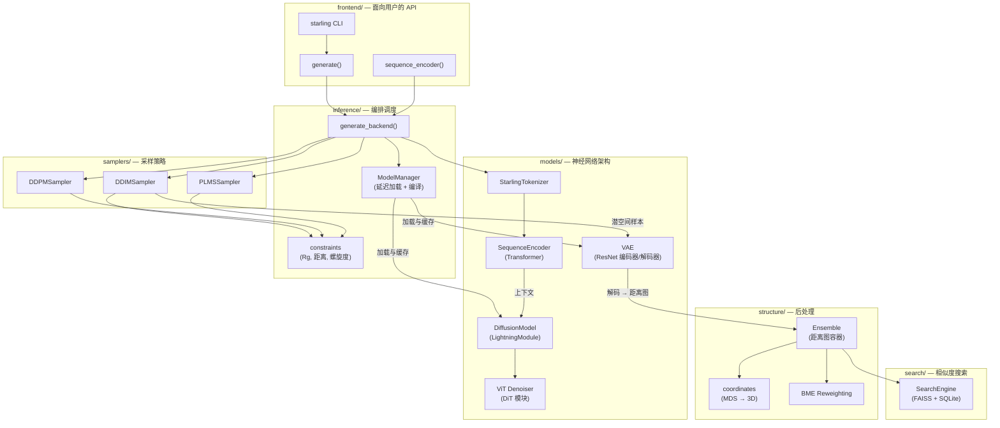

---
slug:4-architecture-overview
blog_type:normal
---

STARLING 实现了一个**潜空间概率去噪扩散模型**，用于预测内禀无序蛋白质的粗粒化构象系综。系统在架构上被组织为一个两阶段的生成流水线——VAE 将蛋白质距离图压缩至学习到的潜空间中，条件扩散模型则在该空间内学习去噪，并以序列编码的上下文作为引导。本页映射了完整的系统架构，从顶层 API 接口一直到模型内部细节和后处理子系统。

来源: [__init__.py](/starling/__init__.py#L1-L77), [README.md](/README.md#L1-L200)

## 系统架构

下图展示了 STARLING 中的主要数据流，从氨基酸序列输入到 3D 结构输出。每个标记节点对应 `starling/` 包内的一个具体模块。

来源: [ensemble_generation.py](/starling/frontend/ensemble_generation.py#L1-L200), [generation.py](/starling/inference/generation.py#L1-L200), [model_loading.py](/starling/inference/model_loading.py#L1-L131)

## 两阶段生成流水线

STARLING 的生成核心遵循 Rombach 等人 (2021) 提出的**潜空间扩散**范式。该设计将表征学习（VAE）与生成建模（扩散过程）解耦，带来了几项实用优势：扩散模型在紧凑的 24×24 潜空间网格而非完整的 N×N 距离图上运行；VAE 的解码器可在训练和推理阶段共享；潜空间展现出更平滑的流形几何结构，使去噪器更容易导航。

| 阶段 | 组件 | 输入 | 输出 | 目的 |
|-------|-----------|-------|--------|---------|
| **1 — 编码** | `SequenceEncoder` | 分词后的氨基酸序列 + 离子强度 | 上下文嵌入 `(B, L, 512)` | 将蛋白质序列转化为去噪器的条件信号 |
| **2a — 扩散** | `DiffusionModel` + `ViT` | 带噪潜变量 + 时间步 + 上下文 | 去噪潜变量 `(B, 1, 24, 24)` | 以序列为条件，在潜空间中迭代去噪 |
| **2b — 解码** | `VAE.decoder` | 去噪潜变量 | 距离图 `(N, N)` | 将潜变量映射回完整的残基对距离空间 |

**VAE** (`starling.models.vae.VAE`) 采用基于 ResNet 的编码器/解码器架构（ResNet18 或 ResNet34 变体），并具有对角高斯潜变量分布。在训练期间，ELBO 损失结合了重建损失（MSE 或 NLL）与 Kullback-Leibler 散度正则化项，其权重由 `KLDWeightScheduler` 通过周期性或线性预热计划进行控制。**扩散模型** (`starling.models.diffusion.DiffusionModel`) 将 `ViT` 去噪器封装在 PyTorch Lightning 模块中，管理完整的前向/噪声调度（余弦、线性或 S 型 β 调度），并将所有扩散过程缓冲区（α, ᾱ, 后验方差）注册为模型缓冲区。

来源: [vae.py](/starling/models/vae.py#L1-L200), [diffusion.py](/starling/models/diffusion.py#L1-L200), [vit.py](/starling/models/vit.py#L1-L123)

## 序列编码器与分词

`StarlingTokenizer` 提供了一个快速的字节级转换表，将 20 种标准氨基酸映射为整数 ID（1–20，0 保留用于填充）。它完全避免了正则表达式或字典查找，在编码和解码时均使用 Python 的 `bytes.translate()`。`SequenceEncoder` 是一个 12 层的 Transformer 编码器（嵌入维度 512，8 个注意力头），它接收分词后的序列并生成逐残基的嵌入。这些嵌入在每个去噪步骤中作为 ViT 去噪器的**交叉注意力上下文**，将生成过程锚定到特定的蛋白质序列上。

离子强度条件（20、150 或 300 mM）与序列 token 一起注入，允许模型根据溶剂条件调整其预测——这对于构象系综对静电屏蔽高度敏感的无序蛋白质而言是一个关键因素。

来源: [tokenizer.py](/starling/data/tokenizer.py#L1-L94), [transformer.py](/starling/models/transformer.py#L1-L200)

## ViT 去噪器架构

去噪器 (`starling.models.vit.ViT`) 是一个在 24×24 潜空间网格上运行的**视觉 Transformer**。其架构遵循**扩散 Transformer (DiT)** 设计模式：潜变量被分块化（默认块大小为 3），通过学习的位置编码投影为 token 嵌入，然后通过 12 个 `DiTBlock` 层进行处理，每一层都应用以时间步为条件的**自适应层归一化** (AdaLN)，外加针对序列编码器上下文的**交叉注意力**。

前向传播过程应用：(1) `Conv2d` 主干将单通道潜变量提升至 64 通道；(2) 通过 `PatchEmbed` 进行块嵌入；(3) 依赖时间步的缩放/偏移调制（自适应归一化）；(4) 包含自注意力和针对序列上下文的交叉注意力的 12 个 DiT 模块；(5) 线性投影回块 token；(6) 最终的 `Conv2d` 产生单通道残差预测。该架构取代了早期扩散模型中常见的 U-Net 去噪器，提供了更优异的缩放特性和跨空间分辨率更均匀的计算量。

来源: [vit.py](/starling/models/vit.py#L1-L123), [attention.py](/starling/models/attention.py#L1-L100)

## 采样策略

STARLING 提供了三种采样器，每种实现了不同的扩散过程轨迹：

| 采样器 | 模块 | 速度 | 随机性 | 核心特征 |
|---------|--------|-------|---------------|-------------------|
| **DDIM** | `samplers.ddim_sampler` | ★★★ 快 | 确定性 (η=0) | 非马尔可夫过程；生成步数远少于训练时间步 |
| **DDPM** | `samplers.ddpm_sampler` | ★ 慢 | 随机 | 完整马尔可夫链；与训练目标精确匹配 |
| **PLMS** | `samplers.plms_sampler` | ★★ 适中 | 伪线性 | 伪线性多步；在某些分布上优于 DDIM |

三种采样器共享一个通用接口：它们接受一个 `DiffusionModel`、一个 `VAE` 编码器和一个条件序列，并返回解码后的距离图。**DDIM** 是默认采样器（默认 30 步），因其相比 DDPM 具有 10–100 倍的速度优势而被推荐用于生产环境。所有采样器均支持**约束引导采样**——当提供 `Constraint` 对象时，采样器在去噪轨迹期间应用基于梯度的引导，以将生成的构象导向满足约束条件。

来源: [ddim_sampler.py](/starling/samplers/ddim_sampler.py#L1-L200), [ddpm_sampler.py](/starling/samplers/ddpm_sampler.py#L1-L80), [plms_sampler.py](/starling/samplers/plms_sampler.py#L1-L80)

## 系综对象与结构重建

`Ensemble` 类 (`starling.structure.ensemble.Ensemble`) 是贯穿 STARLING 的核心数据容器。它封装了一个 `(n_conformations, n_residues, n_residues)` 的对称化距离图 numpy 数组及相应的氨基酸序列，提供派生可观测量的延迟缓存计算：

- **回转半径** (Rg) 和 **流体力学半径** (Rh)
- **末端距**
- 可配置距离阈值下的**接触图**
- 通过多维缩放 (MDS) 得到的**3D 坐标轨迹**
- **BME 重加权**结果（已缓存）

3D 坐标重建 (`starling.structure.coordinates`) 通过两阶段方法将距离图转换为笛卡尔坐标：**sklearn MDS** 提供初始坐标，随后通过 **PyTorch 梯度下降**精细化，最小化目标与重建残基对距离之间的 MSE。运行多个并行 MDS 初始化（默认 4 个）以避免局部极小值。生成的轨迹表示为 SOURSOP `SSProtein` 对象，并可导出为 PDB 拓扑 + XTC 轨迹文件。

来源: [ensemble.py](/starling/structure/ensemble.py#L1-L200), [coordinates.py](/starling/structure/coordinates.py#L1-L200)

## 约束引导采样

约束系统 (`starling.inference.constraints`) 支持将扩散过程导向满足实验或结构要求的构象。系统提供了三种约束类型：

| 约束 | 类 | 可观测量 | 引导模式 |
|------------|-------|------------|---------------|
| **回转半径** | `RgConstraint` | ⟨Rg⟩ | 基于梯度的潜空间扰动 |
| **距离** | `DistanceConstraint` | 特定残基对的 d(i, j) | 基于梯度的潜空间扰动 |
| **螺旋度** | `HelicityConstraint` | 螺旋残基比例 | 基于梯度的潜空间扰动 |

所有约束均继承自抽象 `Constraint` 基类，该基类提供依赖于时间的调度（余弦、钟形）、自适应梯度裁剪以及可配置的引导窗口（`guidance_start` / `guidance_end`），用于控制在去噪过程中的何时应用约束。`ConstraintLogger` 跟踪去噪步骤中的约束满足情况以供诊断。

来源: [constraints.py](/starling/inference/constraints.py#L1-L200)

## BME 重加权

贝叶斯最大熵重加权 (`starling.structure.bme`) 为将实验可观测数据（SAXS、FRET、NMR 等）整合到系综中提供了一个原则性框架。`BME` 优化器对单个构象进行重加权，以最小化相对熵（与均匀先验的 KL 散度），同时满足匹配实验约束的条件，这些约束可以是**等式**（在不确定性范围内匹配）、**上界**或**下界**约束。结果缓存在 `Ensemble` 对象中，并在指定 `use_bme_weights=True` 时自动传播至所有下游可观测量的计算中。

来源: [bme.py](/starling/structure/bme.py#L1-L100)

## 模型管理与编译

`ModelManager` 单例 (`starling.inference.model_loading.ModelManager`) 实现了带缓存的**延迟加载**——模型在首次访问时从磁盘加载（或从 GitHub Releases 下载），并在后续调用中复用。这对于反复调用 `generate()` 的批处理工作流至关重要。管理器还通过 `torch.compile()` 支持 **PyTorch 编译**，该功能默认禁用，但可通过 `starling.set_compilation_options()` 编程开启。启用编译后，ViT 去噪器和 VAE 解码器将被编译（通常使用 `inductor` 后端），在 CUDA 上提供显著的推理加速，代价是一次性的编译开销。

模型权重默认从 GitHub Releases URL 下载，但可通过环境变量（`STARLING_ENCODER_PATH`、`STARLING_DDPM_PATH`）或本地 `~/.starling_weights/` 目录进行覆盖。

来源: [model_loading.py](/starling/inference/model_loading.py#L1-L131), [configs.py](/starling/configs.py#L1-L200)

## 相似度搜索

搜索子系统 (`starling.search`) 提供了在蛋白质嵌入空间上的高性能**近似最近邻 (ANN)** 搜索，基于 FAISS 索引并以 SQLite 作为序列元数据后端。`SearchEngine` 支持多级过滤（余弦相似度<边界>、序列长度门控、精确匹配排除、序列同一性阈值）、使用完整编码器对 top-k 候选进行精确重排序以及批量查询处理。预构建的索引托管在 Zenodo 上，并在本地 `~/.starling_search/` 下缓存。

来源: [search_engine.py](/starling/search/search_engine.py#L1-L80), [configs.py](/starling/configs.py#L150-L200)

## 模块映射

下表总结了 `starling/` 中的每个子包及其架构角色：

| 子包 | 角色 | 关键导出 |
|------------|------|-------------|
| `frontend/` | 高层 API 接口 | `generate()`, `sequence_encoder()`, `handle_input()` |
| `inference/` | 编排调度、模型加载、约束 | `ModelManager`, `generate_backend()`, `Constraint` 子类 |
| `models/` | 神经网络架构 | `VAE`, `DiffusionModel`, `ViT`, `SequenceEncoder`, 注意力模块 |
| `samplers/` | 扩散采样策略 | `DDIMSampler`, `DDPMSampler`, `PLMSSampler` |
| `data/` | 分词、数据加载、调度 | `StarlingTokenizer`, `DiagonalGaussianDistribution`, β-调度 |
| `structure/` | 系综表示与后处理 | `Ensemble`, `BME`, 坐标重建 |
| `search/` | FAISS 相似度搜索 | `SearchEngine`, `CandidateFilter` 子类 |
| `training/` | 训练循环 | `diffusion_train`, `vae_train` |
| `scripts/` | CLI 入口点 | `starling_main_cli`, `starling_converter`, `starling_search` |
| `configs/` | YAML 配置文件 | 模型、数据加载器、训练器、扩散配置 |

<CgxTip>在批处理工作流中使用 STARLING 时，对每个序列调用一次 `generate()`，但依赖 `ModelManager` 单例以避免重复加载权重。为实现最大 GPU 吞吐量，可通过 `starling.set_compilation_options(enabled=True, mode="reduce-overhead")` 启用编译——一次性的编译成本会在多次推理中迅速摊销。</CgxTip>

<CgxTip>`Ensemble` 对象延迟计算所有可观测数据并缓存结果。如果你在构造后修改了距离图，请使用 `force_recompute=True` 调用相关方法或构造一个新的 `Ensemble`，以避免命中过期的缓存。</CgxTip>

来源: [__init__.py](/starling/__init__.py#L1-L77), [configs.py](/starling/configs.py#L1-L200)

## 接下来去哪

架构概述映射了全局概貌——以下页面将按照生成流水线的自然顺序，深入到每个子系统的细节：

1. **[序列编码器](5-sequence-encoder)** — 分词和 Transformer 编码器如何生成序列上下文嵌入
2. **[VAE 潜空间](6-vae-latent-space)** — ResNet VAE 架构、KL 调度与潜空间几何结构
3. **[扩散模型设计](7-diffusion-model-design)** — DiffusionModel Lightning 模块、噪声调度与训练目标
4. **[采样策略](8-sampling-strategies)** — DDIM、DDPM 和 PLMS 采样器内部机制与性能权衡
5. **[系综对象 API](9-ensemble-object-api)** — `Ensemble` 类 API、延迟计算与序列化
6. **[约束引导采样](13-constraint-guided-sampling)** — 约束如何引导去噪轨迹
7. **[视觉 Transformer 去噪器](14-vision-transformer-denoiser)** — DiT 模块、AdaLN、块嵌入与交叉注意力细节