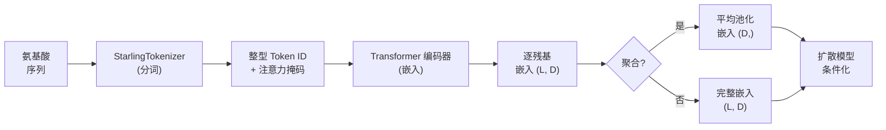
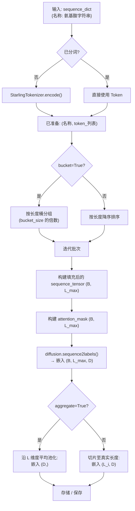

---
slug:5-sequence-encoder
blog_type:normal
---


**序列编码器** 是将原始氨基酸序列转换为连续向量表示（嵌入）的组件，这些向量表示用于条件化 STARLING 的潜扩散模型。它位于生成流水线的最前端——在 VAE 潜空间之前，在扩散采样之前——将离散的生物序列转换为去噪器所需的数学对象。理解该组件对于任何想要推演序列信息如何流入生成的距离图、并最终流入 3D 结构系综的人来说都是必不可少的。

## 架构角色

序列编码器在 STARLING 的生成流水线中占据着精确的位置：它是离散氨基酸序列与输入去噪网络的连续条件信号之间的**唯一桥梁**。没有它，扩散模型将没有序列特异性信息来引导其去噪轨迹，每个生成的结构都将从学习到的先验中无条件采样——这在生物学上是毫无意义的。



该编码器被 `DiffusionModel` 作为 `self.sequence_encoder` 持有，并通过 `sequence2labels` 方法调用，该方法只需单地委托给编码器的前向传播，传入分词后的序列、其注意力掩码以及离子强度条件标量。

来源: [diffusion.py](starling/models/diffusion.py#L55-L137), [diffusion.py](starling/models/diffusion.py#L228-L251)

## 分词：从残基到整数

在 Transformer 运行之前，氨基酸序列必须转换为整型 Token ID。这是 `StarlingTokenizer` 的职责，这是一个轻量级的字节级分词器，它将 20 种标准氨基酸映射到整数范围 `[1, 20]`，其中 `0` 保留用于填充。

| 氨基酸 | Token ID | 氨基酸 | Token ID | 氨基酸 | Token ID |
|:----------:|:--------:|:----------:|:--------:|:----------:|:--------:|
| A (Ala)    | 1        | G (Gly)    | 6        | P (Pro)    | 13       |
| C (Cys)    | 2        | H (His)    | 7        | Q (Gln)    | 14       |
| D (Asp)    | 3        | I (Ile)    | 8        | R (Arg)    | 15       |
| E (Glu)    | 4        | K (Lys)    | 9        | S (Ser)    | 16       |
| F (Phe)    | 5        | L (Leu)    | 10       | T (Thr)    | 17       |
| —          | —        | M (Met)    | 11       | V (Val)    | 18       |
| —          | —        | N (Asn)    | 12       | W (Trp)    | 19       |
| —          | —        | —          | —        | Y (Tyr)    | 20       |

该分词器使用 Python 的 `bytes.translate` 进行了批量处理优化——这是一个 C 级别的查找表，可在单次遍历中将每个 ASCII 字节映射到其词表 ID。这避免了逐字符的 Python 循环，对于长序列或大批量而言速度显著提升。解码使用相同的表驱动方法，在进行反向转换之前剥离填充 Token (`0`)。未知字符会在其出现的位置引发 `KeyError`。

```python
from starling.data.tokenizer import StarlingTokenizer

tok = StarlingTokenizer()
ids = tok.encode("ACDE")   # [1, 2, 3, 4]
seq = tok.decode(ids)       # "ACDE"
```

<CgxTip>非规范残基（B, J, O, U, X, Z）**不**在词表中，在编码期间将引发 `KeyError`。前端的 `handle_input` 会在这些字符到达分词器之前对其进行验证和过滤，但如果你直接调用分词器，则必须确保你的序列仅包含 20 种标准氨基酸。</CgxTip>

来源: [tokenizer.py](starling/data/tokenizer.py#L1-L94)

## Transformer 编码器架构

序列编码器是一个 **Transformer 编码器**，通过堆叠的自注意力和前馈层处理分词后的序列。其在 `starling/models/transformer.py` 中定义的关键架构元素包括：

- **自注意力** (`MultiHeadAttention`)：捕获整个序列中成对的残基关系，使编码器能够学习对蛋白质结构至关重要的长程依赖。
- **GeGLU 前馈** (`GeGLU` + `Linear`)：一种门控激活变体，其输出为 `x * GELU(gate)`，与基于标准 ReLU 的前馈层相比，提供了更丰富的梯度流。
- **自适应层归一化** (`AdaLayerNorm`)：通过从条件向量生成动态缩放 (γ) 和偏移 (β) 参数来注入条件信息（离子强度 + 时间步），而不是使用静态的学习参数。
- **正弦位置嵌入** (`SinusoidalPosEmb`)：使用具有可配置基频 θ 的正弦和余弦函数对位置信息进行编码，使模型能够按位置区分残基。

编码器在其前向传播期间接受三个输入：

| 输入 | 形状 | 描述 |
|-------|-------|-------------|
| `sequences` | `(B, L)` | 分词 ID 序列的批次（整数 0–20） |
| `sequence_mask` | `(B, L)` | 布尔注意力掩码——真实残基为 `True`，填充为 `False` |
| `ionic_strength` | `(1, 1)` | 以 mM 为单位的标量离子强度，用作全局条件信号 |

输出是形状为 `(B, L, D)` 的张量，其中 `D` 是嵌入维度——每个序列的每个残基对应一个稠密向量。

来源: [transformer.py](starling/models/transformer.py#L1-L200), [transformer.py](starling/models/transformer.py#L194-L200)

## 编码流水线：`sequence_encoder_backend`

编码序列的高级入口是 `starling.inference.generation` 中的 `sequence_encoder_backend`。该函数编排了从原始氨基酸字符串到嵌入张量的完整流水线，处理分词、批处理、填充和可选的聚合。

### 逐步流程



### 关键参数

| 参数 | 默认值 | 用途 |
|-----------|---------|---------|
| `sequence_dict` | 必需 | 将序列名称映射到氨基酸字符串（或预分词的 ID 列表）的字典 |
| `device` | 必需 | 计算设备 (`"cuda"`, `"cpu"`, `"mps"`) |
| `batch_size` | 必需 | 每次前向传播处理的序列数量 |
| `ionic_strength` | 必需 | 以 mM 为单位的离子强度，作为条件信号注入编码器 |
| `pretokenized` | `False` | 跳过分词——值已经是整型 Token ID 集合 |
| `bucket` | `False` | 将序列分组到粗略的长度桶中以减少填充浪费 |
| `bucket_size` | `32` | `bucket=True` 时的桶分辨率；`L // bucket_size` 相同的序列会被分到同一桶中一起批处理 |
| `aggregate` | `True` | 将逐残基嵌入平均池化为每个序列的单个向量 |
| `free_cuda_cache` | `False` | 在每个批次之后调用 `torch.cuda.empty_cache()` |
| `return_on_cpu` | `True` | 返回前将嵌入转移到 CPU |

### 批处理与填充策略

批次内的序列使用 Token `0`（填充/保留 Token）填充到该批次中最长序列的长度。相应的注意力掩码将真实残基标记为 `True`，填充位置标记为 `False`，从而确保 Transformer 的自注意力忽略填充位置。为了尽量减少计算浪费，序列在批处理前按长度降序排序。当 `bucket=True` 时，按长度分位数的额外粗粒度分组进一步减少了每个批次内序列长度的方差——这在处理具有广泛长度分布的数据集时尤为有利。

<CgxTip>当编码长度差异很大的大型蛋白质集合时，请启用 `bucket=True` 并设置适当的 `bucket_size`。与简单的按长度排序批处理相比，这可以减少 30–50% 的填充浪费，因为相似长度的序列可以确保共享批次，而不是与长得多或短得多的序列交错在一起。</CgxTip>

### 聚合模式

编码器生成形状为 `(L, D)` 的逐残基嵌入。可用两种模式：

- **聚合** (`aggregate=True`)：沿序列维度进行平均池化，为每个序列生成单个 `(D,)` 向量。这是默认设置，在嵌入用作全局条件信号时使用。
- **逐残基** (`aggregate=False`)：返回完整的 `(L, D)` 张量，保留位置特定信息。适用于需要残基级特征的下游任务，例如接触预测或逐残基相似性搜索。

来源: [generation.py](starling/inference/generation.py#L64-L232)

## 与扩散模型的集成

在常规生成期间，序列编码器不会被单独调用——它在训练和推理期间均由 `DiffusionModel` 内部调用。`DiffusionModel.sequence2labels` 方法是唯一的调度点：

```python
# 在 DiffusionModel 内部 (starling/models/diffusion.py)
def sequence2labels(self, sequences, sequence_mask, ionic_strength):
    encoded = self.sequence_encoder(sequences, sequence_mask, ionic_strength)
    return encoded
```

在**训练**期间，`p_loss` 方法调用 `sequence2labels`，在去噪器预测噪声之前将原始序列 Token 转换为条件标签。在**推理**（采样）期间，遵循相同的路径：编码后的序列嵌入作为 `labels` 参数传递给去噪器的前向传播，将反向扩散过程引向与输入序列一致的距离图。

`sequence_encoder_backend` 函数提供了一个独立接口，用于在不运行完整扩散流水线的情况下计算嵌入——这对于为相似性搜索、可视化或迁移学习预计算嵌入非常有用。

来源: [diffusion.py](starling/models/diffusion.py#L228-L251), [diffusion.py](starling/models/diffusion.py#L253-L326)

## 离子强度条件化

STARLING 序列编码器的一个显著特征是其**离子强度条件化**。离子强度（以 mM 为单位）作为额外的标量输入传递给编码器，编码器将其整合到自适应层归一化机制中。这使得编码器能够生成感知蛋白质所在溶液条件的序列表示——这至关重要，因为离子强度直接影响静电相互作用，进而影响可行构象的系综。

离子强度张量的形状为 `(1, 1)`，并在编码器的前向传播期间进行广播。在高级 `generate` API 中，其默认值为 `configs.DEFAULT_IONIC_STRENGTH`（150 mM，近似生理条件）。

来源: [generation.py](starling/inference/generation.py#L64-L128), [ensemble_generation.py](starling/frontend/ensemble_generation.py#L160-L245)

## 独热编码（旧版）

`starling.data.data_wrangler` 中存在一个独立的 `one_hot_encode` 函数，用于保持旧版兼容性。它使用相同的氨基酸词表将序列映射到 `(N, L, 21)` 的独热张量。当前生成流水线**不**使用此函数——Transformer 编码器直接操作整型 Token ID，这远比其内存高效，且与学习的嵌入层兼容。

| 方面 | 独热 (`data_wrangler`) | 分词 (`StarlingTokenizer`) |
|--------|---------------------------|----------------------------------|
| 输入表示 | `(N, L, 21)` float32 | `(N, L)` int64 |
| 每个残基的内存 | 21 × 4 = 84 字节 | 8 字节 |
| 在流水线中使用 | 否（旧版） | 是（活跃） |
| 支持批处理 | 需手动填充 | 与注意力掩码集成 |

来源: [data_wrangler.py](starling/data/data_wrangler.py#L9-L55)

## 数据流总结

下表追踪了单个序列从输入字符串到条件信号的每一次转换：

| 阶段 | 输入 | 输出 | 组件 |
|-------|-------|--------|-----------|
| 1. 输入验证 | 原始字符串 | 清洗后的字符串 | `handle_input` |
| 2. 分词 | `"ACDEFGHIK"` | `[1,2,3,4,5,6,7,8,9]` | `StarlingTokenizer.encode` |
| 3. 填充 + 掩码 | Token 列表 | `(1, L_max)` 张量 + `(1, L_max)` 布尔掩码 | `sequence_encoder_backend` |
| 4. Transformer 编码 | Token + 掩码 + 离子强度 | `(1, L_max, D)` 嵌入 | `DiffusionModel.sequence2labels` |
| 5. 截断 | 填充后的嵌入 | `(1, L, D)` 逐残基嵌入 | 按真实长度切片 |
| 6. 聚合 | `(1, L, D)` | `(D,)` | 平均池化 (若 `aggregate=True`) |

来源: [generation.py](starling/inference/generation.py#L176-L222), [tokenizer.py](starling/data/tokenizer.py#L63-L76)

---

**流水线的下一步**：序列编码器生成的嵌入会在 VAE 压缩的潜空间内条件化扩散模型的去噪过程。继续阅读 [VAE 潜空间](6-vae-latent-space) 以了解距离图是如何被压缩的，或跳至 [扩散模型设计](7-diffusion-model-design) 以查看这些嵌入如何引导反向扩散过程。