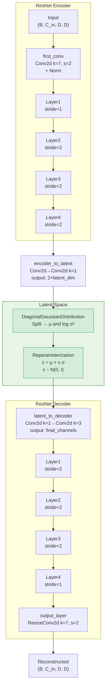

---
slug:6-vae-latent-space
blog_type:normal
---

变分自编码器 (VAE) 是 Starling 两阶段生成流水线的第一阶段，它将蛋白质距离图压缩为结构化的潜在表示，供下游扩散模型在其中运作。该潜在空间并非一维扁平向量，而是一个**空间特征图**，它在降低分辨率的同时保留了距离图的二维几何结构，使扩散模型能够在经过压缩且语义更丰富的空间中进行结构去噪，而非在原始像素域中操作。该设计遵循了潜在扩散模型范式 (Rombach et al., 2022)，其中 VAE 首先学习感知压缩表示，随后扩散模型在该压缩空间内进行生成。

来源: [vae.py](starling/models/vae.py#L86-L151), [vae.py](starling/models/vae.py#L446-L470)

## 架构概述

VAE 实现了对称的 **ResNet 编码器-解码器**架构，其间夹着对角高斯潜在分布。编码器通过四个 ResNet 阶段对输入距离图进行逐步下采样，通过瓶颈卷积将最终特征图投影到均值和对数方差通道，然后重参数化技巧生成采样潜在张量。解码器反向镜像此过程，通过四个 ResNet 阶段进行上采样，恢复至原始空间分辨率。

编码器将空间维度缩减为原来的 1/2⁴ = 1/16（一次初始步长为 2 的卷积加上三次步长为 2 的 ResNet 层），因此大小为 **D × D** 的距离图会生成大小为 **(D/16) × (D/16)** 的潜在特征图。通道数在每个阶段从基础宽度开始扩展，遵循标准 ResNet 的倍增模式。

来源: [vae.py](starling/models/vae.py#L202-L245), [vae_components.py](starling/models/vae_components.py#L13-L105)

## 编码器-解码器构建

编码器和解码器均由相同的 ResNet 模块族构建。**编码器**使用带有步长卷积进行下采样的 `ResBlockEncBasic` 模块 (expansion=1)，而**解码器**使用带有 `ResizeConv2d` 上采样的 `ResBlockDecBasic` 模块 (contraction=1)——该上采样执行最近邻插值后接卷积，以避免 `ConvTranspose2d` 常产生的棋盘格伪影。

| 架构 | 模块配置 | 编码器模块 | 解码器模块 |
|---|---|---|---|
| **ResNet18** | `[2, 2, 2, 2]` | 共 8 个残差模块 | 共 8 个残差模块 |
| **ResNet34** | `[3, 4, 6, 3]` | 共 16 个残差模块 | 共 16 个残差模块 |

每个编码器阶段将通道宽度加倍（基础模块为：base → 2×base → 4×base → 8×base），而解码器则反转此过程。`base` 参数 (默认: 64) 控制起始通道数，从而控制整体模型容量。

来源: [vae_components.py](starling/models/vae_components.py#L220-L256), [blocks.py](starling/models/blocks.py#L259-L368)

## 潜在瓶颈设计

编码器输出与潜在空间之间——以及潜在空间与解码器输入之间——的过渡，由两个充当可学习投影的小型卷积序列处理：

| 层 | 结构 | 输入通道 | 输出通道 | 用途 |
|---|---|---|---|---|
| **encoder_to_latent** | Conv2d(k=3, s=1, p=1) → Conv2d(k=1, s=1) | `final_channels` | `2 × latent_dim` | 将特征投影到 μ 和 log σ² |
| **latent_to_decoder** | Conv2d(k=1, s=1) → Conv2d(k=3, s=1, p=1) | `latent_dim` | `final_channels` | 将采样的 z 投影回解码器空间 |

`encoder_to_latent` 层输出 `2 × latent_dim` 个通道，因为 `DiagonalGaussianDistribution` 沿通道维度将它们均分为均值 (μ) 和对数方差 (log σ²)。`latent_to_decoder` 层仅接收 `latent_dim` 个通道——即采样的潜在 z——并必须扩展回解码器期望的完整通道宽度。

来源: [vae.py](starling/models/vae.py#L223-L245), [distributions.py](starling/data/distributions.py#L5-L26)

## 对角高斯分布

潜在空间被建模为**对角 (因式分解) 高斯分布**——潜在特征图中的每个空间位置都有其独立的均值和方差，位置之间没有协方差。`DiagonalGaussianDistribution` 类封装了此逻辑：

- **参数拆分**: 将包含 `2 × latent_dim` 个通道的传入张量沿 dim=1 拆分为 μ 和 log σ²。
- **数值稳定性**: 在求幂之前，log σ² 被截断至 **[−30, 20]**，以防止计算 σ = exp(0.5 · log σ²) 时出现上溢/下溢。
- **重参数化采样**: z = μ + σ · ε，其中 ε ~ N(0, I)。这使得梯度能够流过随机采样操作。
- **确定性模式**: 当 `deterministic=True` 时，σ 设为零，采样直接返回 μ——在你需要最可能的潜在编码而非随机采样时，这对于推理非常有用。

来源: [distributions.py](starling/data/distributions.py#L5-L87)

## ELBO 损失与 KLD 正则化

VAE 通过最大化证据下界 (ELBO) 进行训练，ELBO 可分解为**重构损失**加上一个 **Kullback-Leibler 散度 (KLD)** 惩罚项，该惩罚项将潜在空间向标准正态先验 N(0, I) 进行正则化：

**ℒ = ℒ_recon + β · D_KL(q(z|x) ‖ p(z))**

### 重构损失

支持两种重构损失模式：

| 模式 | 公式 | 备注 |
|---|---|---|
| **`mse`** | Σ (x̂ − x)² / (x + ε) | 距离加权 MSE；较近的残基 (较小的 x) 通过 1/(x+ε) 获得更高的权重 |
| **`nll`** | −log p(x\|z) under N(x̂, exp(log_std)) | 带有*可学习的*逐像素对数标准差的负对数似然 |

在上述两种情况下，损失**仅在距离图的上三角部分**计算（因为距离图是对称的），使用一个将下三角和任何填充区域（原始数据为零的区域）置零的掩码。

### KLD 损失

近似后验 q(z|x) 与先验 p(z) = N(0, I) 之间的 KLD 对于对角高斯分布具有闭式解：

**D_KL = −0.5 · Σ(1 + log σ² − μ² − σ²)**

对所有维度 [1, 2, 3] (通道、高度、宽度) 求和，并在批次中取平均。

来源: [vae.py](starling/models/vae.py#L361-L444)

## KLD 权重调度

KLD 项上的 β 权重对训练动态至关重要。过早且过高的权重会在潜在空间学到有意义的表示之前，强迫其匹配先验（**后验坍塌**）。Starling 实现了支持两种调度策略的 `KLDWeightScheduler`：

| 调度器 | 行为 |
|---|---|
| **`linear`** | 在总步数的 `warmup_fraction` 期间内从 0 线性增加至 `max_weight`，随后保持恒定。 |
| **`cyclical`** | 将训练划分为多个周期（每个周期为总步数的 20%）。在每个周期内，于前 `warmup_fraction` 阶段递增，随后保持在 `max_weight`。这在完整训练过程中创建了 5 个周期，允许模型周期性地探索正则化较弱的潜在空间。 |

调度器在训练开始时的 `on_train_start` 中配置，其中总训练步数根据数据加载器长度和最大轮数计算得出。在验证期间，始终使用完整的 `max_weight`。

<CgxTip>周期性 KLD 调度对于处理距离图等结构化数据的 VAE 尤为有效。KL 惩罚的周期性放宽使模型能够摆脱潜在空间过度正则化且缺乏信息量的局部极小值——这是在具有强空间相关性的图像上训练 VAE 时的常见失败模式。</CgxTip>

来源: [vae.py](starling/models/vae.py#L21-L84), [vae.py](starling/models/vae.py#L732-L736)

## 空间维度流

理解张量形状在 VAE 中的变换对于配置模型和推导潜在空间至关重要。对于大小为 **L × L** 的单通道距离图（其中 L 为序列长度），且 `base=64` 并使用基础模块 ResNet 时：

| 阶段 | 操作 | 形状 (B, C, H, W) | 备注 |
|---|---|---|---|
| 输入 | — | (B, 1, L, L) | 单通道距离图 |
| first_conv | Conv2d k=7, s=2 + AvgPool | (B, 64, L/2, L/2) | 初始空间降维 |
| Layer 1 | 2 个 ResBlock, stride=1 | (B, 64, L/2, L/2) | 仅通道扩展 |
| Layer 2 | 2 个 ResBlock, stride=2 | (B, 128, L/4, L/4) | 首次主要下采样 |
| Layer 3 | 2 个 ResBlock, stride=2 | (B, 256, L/8, L/8) | 第二次主要下采样 |
| Layer 4 | 2 个 ResBlock, stride=2 | (B, 512, L/16, L/16) | 最终编码器特征 |
| encoder_to_latent | Conv2d 投影 | (B, 2×latent_dim, L/16, L/16) | 拆分为 μ 和 log σ² |
| **潜在 z** | 重参数化采样 | **(B, latent_dim, L/16, L/16)** | **此即为潜在空间** |
| latent_to_decoder | Conv2d 投影 | (B, 512, L/16, L/16) | 投影回解码器空间 |
| 解码器 Layer 1–4 | 编码器的镜像 | (B, 64, L/2, L/2) | 逐步上采样 |
| output_layer | ResizeConv2d k=7, s=2 | (B, 1, L, L) | 最终重构 |

因此，潜在空间是一个 **3D 张量**，而非 1D 向量——它在原始分辨率 1/16 的尺度上保留了空间结构。这是一个经过深思熟虑的设计选择：扩散模型在此空间潜在图上运作，这意味着它能够学习独立地对距离图的*局部*区域进行去噪，同时仍通过卷积感受野维持全局一致性。

来源: [vae.py](starling/models/vae.py#L209-L221), [vae_components.py](starling/models/vae_components.py#L33-L64)

## 归一化策略

ResNet 模块支持多种归一化层，可通过 `norm` 参数选择。此选择显著影响训练稳定性和潜在空间质量：

| 归一化类型 | 模块 | 特性 |
|---|---|---|
| **`instance`** (默认) | `InstanceNorm2d` | 逐样本逐通道归一化；与批次大小无关；适用于具有不同序列长度的距离图 |
| **`batch`** | `BatchNorm2d` | 跨批次归一化；需要足够的批次大小；引入样本间耦合 |
| **`layer`** | `LayerNorm` (通道优先) | 逐样本跨通道归一化；与位置无关；改编自 ConvNeXt |
| **`group`** | `GroupNorm(32, C)` | 将通道分为 32 组；实例归一化与层归一化的折中；适用于任意批次大小 |

实例归一化是默认设置，因为来自不同蛋白质的距离图具有截然不同的统计特性——小蛋白距离图的值分布与大蛋白的截然不同。实例归一化能够独立地适应每个样本。

来源: [blocks.py](starling/models/blocks.py#L172-L178), [vae_components.py](starling/models/vae_components.py#L26-L31)

## 训练配置

VAE 使用带有 Hydra 配置的 PyTorch Lightning 进行训练。训练脚本支持三种模式：

| 模式 | 描述 |
|---|---|
| **从头训练** | 从 Hydra 配置实例化模型，并从随机初始化开始训练 |
| **恢复训练** | 自动检测输出目录中的 `last.ckpt` 并恢复训练 |
| **微调** | 将检查点中的权重加载到新实例化的模型中（可能具有不同的架构），通过 `strict=True` 权重加载启用迁移学习 |

模型检查点基于 `epoch_val_loss` (监控指标) 保存，并始终维护一个 `last.ckpt` 用于恢复。训练使用 WandB 进行实验跟踪，包含梯度和参数日志记录。

来源: [vae_train.py](starling/training/vae_train.py#L79-L98), [vae_train.py](starling/training/vae_train.py#L106-L195)

## 优化器与学习率调度

支持三种优化器，各自具有不同的参数处理方式：

| 优化器 | 配置 | 备注 |
|---|---|---|
| **SGD** | momentum=0.875, Nesterov=True | NVIDIA 推荐的 ResNet 设置 |
| **AdamW** | β=(0.9, 0.999), ε=1e-8 | 编码器参数: weight_decay=1e-4；其他参数: weight_decay=0.0 |
| **Adam** | β=(0.9, 0.999), ε=1e-8 | 标准 Adam，无差异化权重衰减 |

AdamW 配置应用了**差异化权重衰减**：编码器参数接收 L2 正则化 (weight_decay=1e-4)，而潜在瓶颈和解码器参数的权重衰减为零。这反映了一种设计直觉：编码器应学习稳定且可泛化的特征，而解码器和瓶颈需要灵活性以重构精细细节。

提供四种学习率调度器：

| 调度器 | 间隔 | 关键参数 |
|---|---|---|
| `CosineAnnealingWarmRestarts` | epoch | T_0=5, eta_min=1e-4 |
| `OneCycleLR` | step | max_lr=0.01 |
| `LinearWarmupCosineAnnealingLR` | step | 1% 线性预热 → 余弦衰减 |
| `CosineAnnealingLR` | epoch | eta_min=1e-6 |

来源: [vae.py](starling/models/vae.py#L574-L702)

## 推理：编码与解码

在推理时，VAE 在生成流水线中扮演两个不同的角色：

**编码** — `VAE.encode(data)` 接收距离图并返回包含 μ 和 log σ² 的 `DiagonalGaussianDistribution` 对象。下游扩散模型使用此分布的**模式** (μ) 作为引导生成的条件输入。

**解码** — `VAE.decode(latents)` 接收潜在张量（从编码器后验采样或由扩散模型生成）并重构距离图。在生成过程中，扩散模型产生新的潜在编码，VAE 解码器将其映射回合理的距离图。

完整的前向传播 (`VAE.forward`) 串联编码 → 采样 → 解码，返回重构结果和分布矩，用于训练期间的损失计算。

来源: [vae.py](starling/models/vae.py#L259-L301), [model_loading.py](starling/inference/model_loading.py#L49-L61)

## 距离图对称化

由于蛋白质距离图是对称矩阵 (d(i,j) = d(j,i))，VAE 的重构通过 `VAE.symmetrize()` 进行事后对称化，该操作提取上三角，将其镜像至下三角，并将对角线置零。这确保了输出是有效的距离图，而不受卷积解码器引入的任何不对称性影响。

损失函数也通过**仅在上三角部分**计算重构误差来强制对称性——下三角在损失计算前被掩码排除。这防止了模型浪费容量去学习冗余的对称项。

来源: [vae.py](starling/models/vae.py#L704-L730), [vae.py](starling/models/vae.py#L402-L427)

## 评估流水线

`evaluate_vae.py` 模块提供了独立的命令行接口，用于评估存储在 HDF5 中的距离图上的 VAE 重构质量。它报告逐序列和聚合统计数据：

| 指标 | 描述 |
|---|---|
| **mse** | 距离图上三角部分的均方误差 |
| **bond_mse** | 限制为主干键距 (第一条非对角线) 的 MSE |
| **std_mse / max_mse** | 集成中逐样本 MSE 的标准差和最大值 |
| **std_bond_mse / max_bond_mse** | 仅针对键距的相同统计量 |

键 MSE 尤为重要，因为主干键长 (沿链的 Cα–Cα 距离) 必须被精确重构，距离图才能在下游产生有效的 3D 坐标。

<CgxTip>在评估 VAE 质量时，应重点关注 bond_mse 而非整体 mse。距离图可能具有较低的整体 MSE，但如果主干键距错误，仍会产生物理上不可能的结构——这些距离直接决定了 MDS 能否恢复有效的 3D 坐标。</CgxTip>

来源: [evaluate_vae.py](starling/inference/evaluate_vae.py#L134-L156), [evaluate_vae.py](starling/inference/evaluate_vae.py#L269-L288)

## 模型加载与编译

`ModelManager` 使用 `VAE.load_from_checkpoint()` 从 PyTorch Lightning 检查点加载 VAE。如果本地未找到，则从 GitHub Releases 获取默认检查点 (`STARLING_v2.0.0_ViT_VAE_2025_10_14.ckpt`)。在推理时，可选的 `torch.compile()` 可以仅应用于**解码器**——编码器保持未编译状态，因为它通常每个序列仅调用一次，而解码器在每个扩散采样步骤中都会被调用。

来源: [model_loading.py](starling/inference/model_loading.py#L102-L130), [configs.py](starling/configs.py#L14-L15)

## VAE 在完整流水线中的位置

VAE 是 Starling 潜在扩散流水线的**第一阶段**。它建立了压缩表示，使基于扩散的高分辨率距离图生成变得可行。后续阶段为：

1. **[序列编码器](5-sequence-encoder)** — 将氨基酸序列嵌入为条件向量
2. **本 VAE** — 定义生成发生的潜在空间
3. **[扩散模型设计](7-diffusion-model-design)** — 学习在序列嵌入条件下对潜在编码去噪
4. **[采样策略](8-sampling-strategies)** — 使用 DDIM/DDPM/PLMS 采样器生成新的潜在编码
5. **[距离图到 3D 坐标](10-distance-map-to-3d-coordinates)** — 将解码后的距离图转换为原子结构