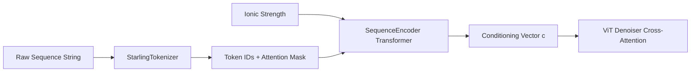

---
slug:7-diffusion-model-design
blog_type:normal
---


Starling 实现了一个**潜扩散模型**，该模型在预训练 VAE 的压缩表示空间中运行，生成以氨基酸序列为条件的蛋白质距离图。该设计遵循了 Sohl-Dickstein 等人 (2015)、Ho 等人 (2020) 和 Rombach 等人 (2021) 的基础框架，并将其适应于结构生物学领域，其中生成的潜变量被解码为表示蛋白质构象的成对距离图。

## 架构概述

Starling 中的扩散模型是一个离散时间去噪扩散概率模型 (DDPM)，它在 **24×24 潜空间表示**而非原始距离图上运行。这种潜空间设计大幅降低了计算成本，同时保持了结构保真度——VAE 编码器将 384×384 的距离图压缩为紧凑的 24×24 潜变量，扩散过程则学习在这种高效的表示内进行去噪。

```mermaid
graph TB
    subgraph Training Pipeline
        DM[Distance Map 384x384] --> VAE_E[VAE Encoder]
        VAE_E --> Z[Latent z 24x24]
        SEQ[Sequence Tokens] --> SE[Sequence Encoder]
        SE --> C[Conditioning c]
        Z --> QS[q_sample: Add Noise]
        QS --> ZT[Noised Latent z_t]
        ZT --> D[ViT Denoiser]
        C --> D
        T[Timestep t] --> D
        D --> EPS_PRED[Predicted Noise ε_θ]
        EPS[Predicted Noise ε_θ] --> LOSS[MSE / Min-SNR Loss]
    end

    subgraph Inference Pipeline
        NOISE[Noise ~ N 0 I] --> SAMPLE[Sampler]
        SEQ2[Sequence] --> SE2[Sequence Encoder]
        SE2 --> C2[Conditioning c]
        C2 --> SAMPLE
        SAMPLE --> Z_CLEAN[Clean Latent z_0]
        Z_CLEAN --> VAE_D[VAE Decoder]
        VAE_D --> DM_OUT[Distance Map 384x384]
    end

    style Training Pipeline fill:#f0f4ff,stroke:#4a6fa5
    style Inference Pipeline fill:#fff4f0,stroke:#a54a4a
```



核心 `DiffusionModel` 类继承自 `pl.LightningModule`，将完整的训练循环、损失计算和优化器配置整合在一个内聚的模块中。三个关键子组件是：(1) **ViT 去噪器**，根据加噪潜变量、时间步和序列条件预测噪声；(2) **SequenceEncoder**，将分词后的氨基酸序列转换为条件向量；(3) 可选的**冻结 VAE 距离图编码器**，在训练期间用于从原始距离图生成潜空间目标。

来源: [diffusion.py](starling/models/diffusion.py#L55-L188), [diffusion_train.py](starling/training/diffusion_train.py#L81-L112)

## 前向扩散过程 (q-sample)

前向过程在 **T** 个离散时间步内，逐渐将干净的潜变量 **z₀** 破坏为纯高斯噪声。在每个时间步 *t*，加噪潜变量通过闭式重参数化计算得出：

**z_t = √(ᾱ_t) · z₀ + √(1 - ᾱ_t) · ε**，其中 ε ~ N(0, I)

这在 `q_sample` 中实现，该函数提取预计算的 √ᾱ_t 和 √(1 - ᾱ_t) 缓冲区并应用仿射噪声变换。由于在噪声调度数学中观察到 float16 存在数值不稳定性，此操作显式**禁用**了混合精度 (`autocast(enabled=False)`)。

来源: [diffusion.py](starling/models/diffusion.py#L196-L226)

## 噪声调度设计

扩散过程由一个 **beta 调度**控制，它定义了方差在时间步间的演变方式。Starling 提供了三种调度类型，每种都生成一个 β 值张量，所有派生量 (α, ᾱ, 后验方差) 均由此计算得出：

| 调度 | 公式 / 行为 | 用例 |
|----------|-------------------|----------|
| **cosine** (默认) | ᾱ_t = cos²(((t/T) + s)/(1+s) · π/2), s=0.008 | 平滑噪声爬升；避免在早期步骤信号接近零；**推荐用于潜扩散** |
| **linear** | β 在 0.0001 到 0.02 之间线性间隔 (按 1000/T 缩放) | 简单基线；可能在后期步骤过快破坏结构 |
| **sigmoid** | ᾱ_t 派生自具有 start/end/τ 参数的 sigmoid 变换 | 灵活的形状控制；实验性 |

余弦调度是潜扩散模型的默认且最合理的选择——其偏移参数 *s = 0.008* 防止调度在开始时过于激进，确保模型不会过早破坏潜变量结构。所有调度都以 `float64` 精度生成 β 值，以避免在累积乘积 ᾱ_t 中出现累积误差。

来源: [schedulers.py](starling/data/schedulers.py#L1-L83), [diffusion.py](starling/models/diffusion.py#L65-L69), [diffusion.yaml](starling/configs/diffusion/diffusion.yaml#L1-L12)

## 预计算的扩散缓冲区

在初始化时，`DiffusionModel` 计算并将训练和推理所需的全部量注册为**非持久化缓冲区**。这避免了在每一步中进行冗余计算：

| 缓冲区 | 定义 | 用途 |
|--------|-----------|---------|
| `betas` | β_t | 每步的噪声方差 |
| `alphas_cumprod` | ᾱ_t = ∏(1 - β_s) | 信号保留因子 |
| `alphas_cumprod_prev` | ᾱ_{t-1} | 上一步的信号因子 |
| `sqrt_recip_alphas` | 1/√α_t | 去噪均值系数 |
| `sqrt_alphas_cumprod` | √ᾱ_t | 前向过程信号权重 |
| `sqrt_one_minus_alphas_cumprod` | √(1 - ᾱ_t) | 前向过程噪声权重 |
| `posterior_variance` | β_t · (1 - ᾱ_{t-1}) / (1 - ᾱ_t) | 反向过程方差 |
| `latent_space_scaling_factor` | 1/σ_z | Z-score 标准化 (在第一个训练步骤计算) |

`extract` 辅助函数对这些 1D 缓冲区进行索引，并重塑它们的形状以便在批次和空间维度上进行广播——这一模式借鉴自成熟的 DDPM 实现。

来源: [diffusion.py](starling/models/diffusion.py#L162-L187)

## 潜空间标准化

遵循 Rombach 等人 (2021) 的一个关键设计细节是**潜空间缩放因子**。VAE 编码器的潜分布可能不具有单位方差，这将与扩散模型在时间步 0 时假设 z₀ ~ N(0, I) 不匹配。在**第一个训练步骤** (`global_step == 0 and batch_idx == 0`)，模型计算：

1. 通过 `all_gather` 跨所有进程计算编码批次的标准差 σ_z
2. 缩放因子 = 1/σ_z
3. 所有后续的潜编码都乘以此因子：**z_scaled = z · (1/σ_z)**

在推理期间，采样器会反转此操作：在传递给 VAE 解码器之前执行 **z_original = z_denoised / (1/σ_z)**。这确保了扩散模型在标准化的潜空间上训练，而 VAE 在其原始域中运行。

<CgxTip>潜空间缩放因子被注册为缓冲区并随模型检查点保存。当加载预训练模型进行推理时，该因子会自动恢复——无需手动标准化。然而，如果使用*不同*的 VAE 编码器进行微调，缩放因子将在第一步重新计算，覆盖之前的值。</CgxTip>

来源: [diffusion.py](starling/models/diffusion.py#L354-L399), [ddpm_sampler.py](starling/samplers/ddpm_sampler.py#L233-L243), [ddim_sampler.py](starling/samplers/ddim_sampler.py#L242-L248)

## 训练目标与 Min-SNR 加权

核心训练损失是**简化的 ε 预测目标**：模型学习预测添加到潜变量中的噪声 ε，损失为预测噪声与实际噪声之间的 MSE。在每个训练步骤中：

1. 为每个批次元素随机采样时间步 *t* ~ Uniform({0, ..., T-1})
2. 抽取噪声 ε ~ N(0, I) 并通过 `q_sample` 应用
3. ViT 去噪器基于序列条件预测 ε_θ(z_t, t, c)
4. 损失计算为 MSE(ε, ε_θ)

Starling 可选支持 **Min-SNR-γ 加权** (Hang 等人, 2023)，它通过 min(SNR(t), γ) / SNR(t) 重新加权每个时间步的损失。这解决了一个众所周知的问题，即标准的 ε 预测损失过分强调高噪声时间步。SNR 计算为 (α_t / σ_t)²，权重将有效 SNR 钳制在 γ (默认 5.0)，确保低噪声时间步 (模型已经能很好地去噪的地方) 不会主导梯度。当 `min_snr_loss=True` 时，在计算批次均值之前，会对每个样本应用 SNR 权重来计算损失。

来源: [diffusion.py](starling/models/diffusion.py#L253-L326), [diffusion.py](starling/models/diffusion.py#L450-L462)

## 序列条件架构

扩散模型在设计上是**无分类器**的——条件通过序列编码器路径注入，而不是通过单独的分类器模型。条件流如下：



`sequence2labels` 方法对输入序列进行分词，应用序列编码器（一个处理带有位置和注意力信息的氨基酸 token 的 Transformer），并生成条件表示，供 ViT 去噪器通过交叉注意力层进行关注。离子强度 (默认 150 mM) 也作为标量条件信号传入，允许模型根据溶液条件调整其预测。

来源: [diffusion.py](starling/models/diffusion.py#L228-L251), [ddpm_sampler.py](starling/samplers/ddpm_sampler.py#L67-L90)

## 训练期间冻结的 VAE 编码器

当提供了 `distance_map_encoder` 检查点路径时，VAE 将被加载并**冻结** (`requires_grad = False`，评估模式)。这意味着训练流水线可以接受原始距离图作为输入，并即时自动将其编码到潜空间。`training_step` 和 `validation_step` 都会检查编码器是否存在，如果找到，则应用 `encode().mode()` (变分后验的众数) 以生成确定性潜变量目标。如果没有冻结的编码器，训练数据必须是预编码好的潜向量。

来源: [diffusion.py](starling/models/diffusion.py#L138-L192), [diffusion.py](starling/models/diffusion.py#L379-L448)

## 优化器与学习率调度

优化器为 **AdamW**，权重衰减为 0.01，联合应用于 ViT 去噪器和序列编码器参数。提供四种学习率调度器策略：

| 调度器 | 间隔 | 特点 |
|-----------|----------|-----------------|
| **LinearWarmupCosineAnnealingLR** (默认) | step | 1% 线性预热 → 余弦退火至 η_min=1e-8；对扩散训练最鲁棒 |
| **CosineAnnealingLR** | epoch | 整个最大 epoch 期间的纯余弦退火；无预热 |
| **CosineAnnealingWarmRestarts** | epoch | 周期性重启 (T₀=5)；实现循环探索 |
| **OneCycleLR** | step | 单周期策略，max_lr=0.01；激进但收敛快 |

<CgxTip>`LinearWarmupCosineAnnealingLR` 调度器将预热实现为总步数 (而非 epoch 数) 的 1%，这对于扩散模型至关重要，因为在早期训练步骤中，随机权重可能会产生极端的噪声预测从而破坏训练稳定性。预热比例被硬编码为 `0.01`——对于非常小的数据集，请考虑增加此比例。</CgxTip>

来源: [diffusion.py](starling/models/diffusion.py#L464-L554)

## 配置参考

扩散模型通过 `configs/diffusion/diffusion.yaml` 进行配置，该配置由基于 Hydra 的训练脚本使用：

```yaml
type: discrete              # 目前仅支持 "discrete"

discrete:
  beta_scheduler: cosine     # "linear"、"cosine" 或 "sigmoid"
  timesteps: 1000            # 总扩散时间步 T
  set_lr: 0.0001             # 初始学习率
  config_scheduler: CosineAnnealingLR  # 学习率调度器名称
  min_snr_loss: False        # 启用 Min-SNR-γ 损失加权
  min_snr_gamma: 5.0         # SNR 钳制值 γ
  distance_map_encoder: /path/to/vae.ckpt  # 冻结的 VAE 检查点 (可选)
```

在训练设置期间，ViT 去噪器被实例化为 `ViT(12, 512, 8, 512)`——12 个 DiT 块、512 维嵌入、8 个注意力头和 512 维上下文——而 `SequenceEncoder` 则通过 Hydra `instantiate` 从其自身的配置块进行配置。

来源: [diffusion.yaml](starling/configs/diffusion/diffusion.yaml#L1-L12), [diffusion_train.py](starling/training/diffusion_train.py#L81-L112)

## 设计理念：为何对蛋白质结构使用潜扩散

在潜空间而非像素/体素空间中运行的决定是 Starling 效率的基础。全分辨率 (384×384) 的蛋白质距离图将需要在约 147K 维空间上进行扩散过程——考虑到距离图结构中存在强相关性，这在计算上是令人望而却步且浪费的。VAE 压缩至 24×24 潜变量 (**256 倍压缩**) 保留了必要的自由度，同时实现了：

- **更快的训练**：ViT 去噪器在 576 个空间位置 (24×24，patch 大小为 3 → 64 个 patch) 上运行，而非 147K
- **更快的采样**：每个去噪步骤处理一个 24×24 张量，而 VAE 解码器仅为单次前向传播
- **更好的学习表示**：VAE 已经学会了解耦距离图结构，因此扩散模型只需在结构良好的潜变量上学习分布

这一设计直接遵循了 Rombach 等人 (2021) 的洞见：潜空间中的扩散同时实现了感知保真度和计算效率，这一原理自然地迁移到结构生物学领域，其中“感知质量”的类比是物理上有效的蛋白质几何结构。

来源: [diffusion.py](starling/models/diffusion.py#L55-L63), [ddpm_sampler.py](starling/samplers/ddpm_sampler.py#L272-L286)

## 与其他组件的关系

扩散模型位于 Starling 生成流水线的中心。理解其与相邻组件的联系有助于阐明完整的生成流程：

- **[序列编码器](5-sequence-encoder)**：生成 ViT 去噪器交叉关注的条件向量 `c`。序列表示的质量直接影响条件生成的保真度。
- **[VAE 潜空间](6-vae-latent-space)**：定义扩散模型运行的潜空间几何。VAE 的编码器/解码器对在距离图空间和潜空间之间进行调解。
- **[采样策略](8-sampling-strategies)**：DDPM、DDIM 和 PLMS 采样器实现了反向扩散过程——模型提供噪声预测 ε_θ，采样器决定如何遍历去噪轨迹。
- **[视觉 Transformer 去噪器](14-vision-transformer-denoiser)**：实现 ε_θ 预测网络的 ViT 架构，使用 DiT 块和自适应层归一化处理分块潜变量。
- **[约束引导采样](13-constraint-guided-sampling)**：在每个采样器的去噪循环*期间*应用约束，在中间时间步修改潜变量以强制执行物理属性。