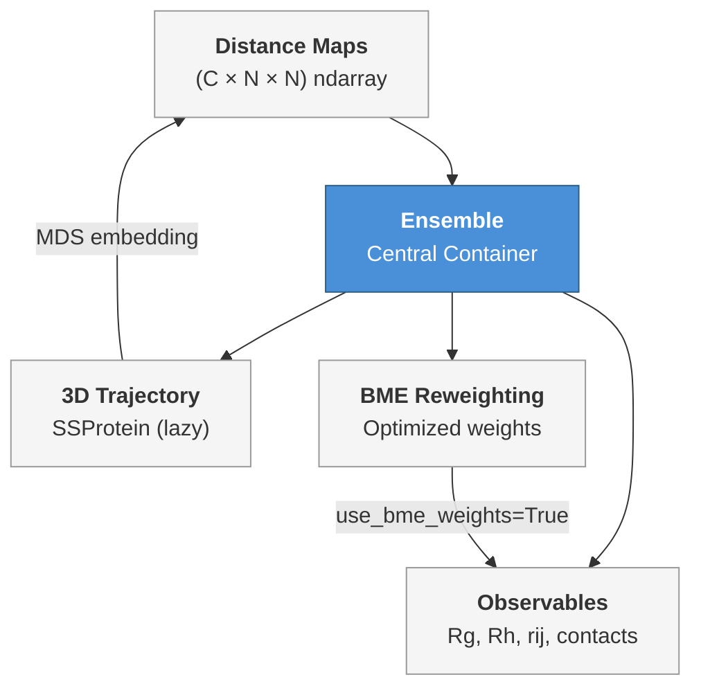

---
slug:9-ensemble-object-api
blog_type:normal
---


**`Ensemble`** 类是 STARLING 的核心数据结构 —— 一个轻量级的、由距离图支持的内在无序蛋白质构象系综容器。`Ensemble` 并不急切地存储完整的 3D 坐标，而是保存由扩散采样器生成的残基对距离图，并且仅在需要时**惰性重建 3D 轨迹**。这种设计在生成过程中将内存开销降至最低，同时仍通过一个单一且一致的对象，提供对坐标、生物物理观测量、BME 重加权以及序列化的无缝访问。

来源: [ensemble.py](starling/structure/ensemble.py#L1-L75)

## 构造与初始化

`Ensemble` 通常通过顶层 [`generate()`](starling/frontend/ensemble_generation.py#L160-L400) 函数获取，但也可以直接从距离图的 NumPy 数组构造：

```python
from starling.structure.ensemble import Ensemble
import numpy as np

# distance_maps: 形状 (n_conformations, n_residues, n_residues)
ensemble = Ensemble(distance_maps, sequence="GSWGSWGSWGSW")
```

| 参数 | 类型 | 描述 |
|-----------|------|-------------|
| `distance_maps` | `np.ndarray` | 形状 `(C, N, N)` — 包含 `C` 个构象、`N` 个残基的对称化残基对距离图 |
| `sequence` | `str` | 氨基酸序列；必须仅包含标准残基 |
| `ssprot_ensemble` | `SSProtein`, 可选 | 要附加的已存在 SOURSOP 轨迹（跳过后续重建） |

构造函数会对每个输入执行**验证**：数组必须是 3 维的，每个距离图必须是维度与序列长度匹配的方阵，且每个残基字符必须属于标准氨基酸字母表。无效输入会立即引发 `ValueError`，而不会在后续流程中静默失败。

来源: [ensemble.py](starling/structure/ensemble.py#L77-L129), [ensemble.py](starling/structure/ensemble.py#L131-L179)

### 使用 `generate()` 生成系综

主要的高层入口是 `starling.generate()`，它处理输入归一化、扩散采样、可选的 MDS 优化，并返回一个或多个 `Ensemble` 对象：

```python
from starling import generate

# 单条序列 → 单个 Ensemble
ensemble = generate("GSWGSWGSW" * 10, conformations=200, return_single_ensemble=True)

# 多条序列 → Ensemble 字典
ensembles = generate(["GSWGSWGSW" * 10, "AEAEAEAE" * 10], conformations=100)
```

| 关键参数 | 默认值 | 用途 |
|---------------|---------|---------|
| `conformations` | `configs.DEFAULT_NUMBER_CONFS` | 每条序列要采样的构象数量 |
| `steps` | `configs.DEFAULT_STEPS` | 去噪扩散步数 |
| `return_structures` | `False` | 若为 `True`，在生成期间重建 3D 坐标 |
| `return_single_ensemble` | `False` | 当提供单条序列时，返回单个 `Ensemble` 而非字典 |
| `output_directory` | `None` | 磁盘输出目录；`None` 表示不保存任何内容 |
| `constraint` | `None` | 用于引导采样的 `Constraint` 对象 |

来源: [ensemble_generation.py](starling/frontend/ensemble_generation.py#L160-L260), [ensemble_generation.py](starling/frontend/ensemble_generation.py#L261-L400)

## 核心架构

`Ensemble` 对象位于四个功能域的交汇处。下图展示了单个对象如何桥接距离图、生物物理观测量、3D 重建和 BME 重加权：



**惰性求值**是其核心模式。昂贵的计算 —— 通过多维缩放进行轨迹重建、回转半径循环、流体力学半径求和 —— 仅执行一次，缓存为私有属性，并在后续调用中复用。在任何方法上设置 `force_recompute=True` 会使缓存失效并从头重新计算。

来源: [ensemble.py](starling/structure/ensemble.py#L42-L75), [ensemble.py](starling/structure/ensemble.py#L100-L129)

## 观测量方法

### 残基间距离：`rij(i, j)`

返回所有构象中残基 `i` 和 `j` 之间的距离。设置 `return_mean=True` 时，计算系综平均值（可选择 BME 加权）：

```python
# 每个构象的距离
d_05 = ensemble.rij(0, 5)                # 形状: (n_conformations,)

# 系综平均值
d_05_mean = ensemble.rij(0, 5, return_mean=True)

# BME 重加权平均值
d_05_bme = ensemble.rij(0, 5, return_mean=True, use_bme_weights=True)
```

来源: [ensemble.py](starling/structure/ensemble.py#L344-L383)

### 端到端距离

围绕 `rij(0, N-1)` 的便捷封装，返回每帧的 N 端至 C 端距离或其平均值：

```python
ete = ensemble.end_to_end_distance()                  # 数组
ete_mean = ensemble.end_to_end_distance(return_mean=True)
```

来源: [ensemble.py](starling/structure/ensemble.py#L385-L416)

### 回转半径：`radius_of_gyration()`

使用标准公式 $R_g = \sqrt{\frac{\sum_{i<j} d_{ij}^2}{2N^2}}$ 根据距离图计算 Rg。支持 BME 加权平均值和强制重新计算：

```python
rg_all = ensemble.radius_of_gyration()                                   # 每帧
rg_mean = ensemble.radius_of_gyration(return_mean=True)                   # 标量
rg_bme  = ensemble.radius_of_gyration(return_mean=True, use_bme_weights=True)
```

**局部变体**可计算链上子区域的 Rg：

```python
rg_local = ensemble.local_radius_of_gyration(start=10, end=30, return_mean=True)
```

来源: [ensemble.py](starling/structure/ensemble.py#L496-L540), [ensemble.py](starling/structure/ensemble.py#L542-L586)

### 流体力学半径：`hydrodynamic_radius()`

提供由已发表方法支持的两种计算模式：

| 模式 | 方法 | 参考文献 |
|------|--------|-----------|
| `"nygaard"` (默认) | 基于缩放的 Rg，带有三个可调 α 参数 | Nygaard et al., *Biophys J* 2017 |
| `"kr"` | Kirkwood-Riseman 反距离求和 | Kirkwood & Riseman, *J Chem Phys* 1948 |

```python
rh_nygaard = ensemble.hydrodynamic_radius(mode="nygaard", return_mean=True)
rh_kr      = ensemble.hydrodynamic_radius(mode="kr", return_mean=True)
```

Nygaard 模式接受 `alpha1`、`alpha2`、`alpha3` 参数（默认值：0.216, 4.06, 0.821）。切换模式会自动使内部缓存失效，以防止返回来自不同公式的过期值。

<CgxTip>对于与 NMR 导出的 Rh 值进行比较，Kirkwood-Riseman 模式更为准确 (Pesce et al., 2023)，而 Nygaard 模式则更符合动态光散射测量结果。</CgxTip>

来源: [ensemble.py](starling/structure/ensemble.py#L589-L727)

### 距离图与接触图

```python
# 原始或平均距离图
all_maps  = ensemble.distance_maps()                                      # (C, N, N)
mean_map  = ensemble.distance_maps(return_mean=True)                      # (N, N)
bme_map   = ensemble.distance_maps(return_mean=True, use_bme_weights=True)

# 具有可配置阈值的接触图
contacts  = ensemble.contact_map(contact_thresh=11)                       # 每帧二值化
avg_cm    = ensemble.contact_map(contact_thresh=11, return_mean=True)     # 分数占有率
sum_cm    = ensemble.contact_map(contact_thresh=11, return_summed=True)   # 整数计数
```

默认的接触阈值是 **11 Å**。`return_mean` 和 `return_summed` 标志互斥。

来源: [ensemble.py](starling/structure/ensemble.py#L418-L494)

## 3D 轨迹重建

距离图是 STARLING 扩散模型的主要输出，但许多下游分析需要实际的 3D 坐标。`Ensemble` 类通过由 `soursop` 库支持的**按需多维缩放 (MDS)** 弥合了这一差距：

```python
# 访问轨迹（若尚未构建则自动重建）
traj = ensemble.trajectory          # 返回 soursop.ssprotein.SSProtein

# 显式构造，可控制 MDS 参数
ensemble.build_ensemble_trajectory(
    num_cpus_mds=4,          # 用于 MDS 的 CPU 工作数
    num_mds_init=4,          # 独立的 MDS 初始化次数
    device="cpu",            # 坐标生成设备
    force_recompute=True,    # 即使已缓存也强制重建
    progress_bar=True,
)
```

| 方法 / 属性 | 返回值 | 是否惰性? |
|-------------------|---------|-------|
| `trajectory` | `soursop.ssprotein.SSProtein` | 是 — 首次访问时自动重建 |
| `build_ensemble_trajectory(...)` | `soursop.ssprotein.SSProtein` | 是 — 若已缓存则跳过，除非 `force_recompute=True` |
| `has_structures` | `bool` | 否 — 简单的空值检查 |

增加 `num_mds_init` 可通过运行多次独立的优化来提高 MDS 嵌入的质量，代价是额外的计算时间。重建管线将距离图送入 `generate_3d_coordinates_from_distances()`，并将结果包装在具有仅 CA 拓扑的 `soursop.SSTrajectory` → `SSProtein` 对象中。

来源: [ensemble.py](starling/structure/ensemble.py#L729-L807), [ensemble.py](starling/structure/ensemble.py#L809-L837)

## 错误检测

STARLING 的生成管线偶尔会产生具有物理上不可能的残基间距离的帧。`Ensemble` 类提供了两个互补的错误扫描器：

### `check_for_errors()` — 距离图级别

扫描原始 STARLING 距离图，查找任何残基对超过物理允许最大距离（受键长几何约束）的帧：

```python
bad_indices = ensemble.check_for_errors(remove_errors=True, verbose=True)
```

当 `remove_errors=True` 时，被标记的帧将从距离图数组中删除，并且缓存的派生值 (Rg, Rh) 将失效。如果附加了轨迹，设置 `rebuild_trajectory=True` 将从清理后的距离图中重建轨迹；否则将删除该轨迹对象。

来源: [ensemble.py](starling/structure/ensemble.py#L181-L243)

### `check_for_errors_trajectory()` — 重建坐标级别

检查从 3D 轨迹派生的每帧 CA-CA 距离图，而非原始扩散输出。这可以捕获**重建伪影** —— 即源距离图表现良好，但 MDS 嵌入引入了非物理几何的情况：

```python
bad_indices = ensemble.check_for_errors_trajectory(remove_errors=True, verbose=True)
```

当移除帧时，轨迹和距离图将同步修剪，以使两种表示保持一致。如果尚未构建轨迹，则引发 `RuntimeError`。

来源: [ensemble.py](starling/structure/ensemble.py#L245-L342)

## BME 重加权集成

`Ensemble` 类通过 `reweight_bme()` 方法为贝叶斯最大熵重加权提供了一等接口，该方法创建优化的逐帧权重，在拟合实验观测量与保持系综多样性之间取得平衡。结果被缓存，并通过 `use_bme_weights=True` 传播到所有观测量方法。

```python
from starling.structure.bme import ExperimentalObservable
import numpy as np

# 定义实验目标
obs_rg  = ExperimentalObservable(25.0, 2.0, name="Rg")
obs_ete = ExperimentalObservable(70.0, 5.0, constraint="upper", name="ETE")

# 计算逐帧的计算值
rg_vals  = ensemble.radius_of_gyration()
ete_vals = ensemble.end_to_end_distance()
calculated = np.column_stack([rg_vals, ete_vals])

# 自动 theta 选择（推荐）
result = ensemble.reweight_bme([obs_rg, obs_ete], calculated)

# 现在在任何观测量中使用 BME 权重
reweighted_rg = ensemble.radius_of_gyration(return_mean=True, use_bme_weights=True)
```

### Theta 选择模式

| 模式 | 调用方式 | 行为 |
|------|-----------|----------|
| **自动** | `theta=None` (默认) | 在 `theta_range` 范围内进行 L 曲线扫描，通过拐点检测选择最优 θ |
| **手动** | `theta=<float>` | 直接使用指定的 θ；速度更快，无扫描 |

自动模式在范围内测试 `theta_n_points` 个值（默认值：15，范围：0.01–10.0），并使用以下两种方法之一识别拐点：

- `"perpendicular"` (默认) — 到连接曲线端点弦的最大垂直距离
- `"curvature"` — L 曲线的 Menger 曲率

```python
# 具有自定义扫描参数的自动模式
result = ensemble.reweight_bme(
    [obs_rg, obs_ete], calculated,
    theta=None,
    theta_range=(0.1, 5.0),
    theta_n_points=20,
    theta_method="curvature",
    save_theta_scan_plot="theta_scan.png",
)

# 已知 theta 的手动模式
result = ensemble.reweight_bme([obs_rg, obs_ete], calculated, theta=0.5)
```

### BME 相关属性

| 属性 | 类型 | 描述 |
|----------|------|-------------|
| `has_bme_weights` | `bool` | 若已调用 `reweight_bme()` 且收敛，则为 `True` |
| `bme_result` | `BMEResult` 或 `None` | 包含权重、χ²、φ 的缓存优化结果 |
| `theta_scan_result` | `ThetaScanResult` 或 `None` | 来自最近一次自动 theta 扫描的诊断信息 |

`view_theta_scan()` 方法渲染最近一次自动扫描的 L 曲线诊断图。

<CgxTip>所有观测量方法（`rij`、`radius_of_gyration`、`distance_maps`、`end_to_end_distance`、`local_radius_of_gyration`）均接受 `use_bme_weights=True`，无需手动乘以权重即可无缝计算 BME 加权平均值。</CgxTip>

来源: [ensemble.py](starling/structure/ensemble.py#L939-L1221), [ensemble.py](starling/structure/ensemble.py#L1264-L1326)

## 序列化

### 保存

```python
# 保存完整的 STARLING 对象（距离图 + 元数据）
ensemble.save("my_ensemble", compress=True, reduce_precision=True, compression_algorithm="lzma")

# 仅保存 3D 轨迹
ensemble.save_trajectory("my_traj")                # PDB 拓扑 + XTC 轨迹
ensemble.save_trajectory("my_traj", pdb_trajectory=True)  # 仅 PDB
```

`.starling` 格式存储距离图、序列、元数据（模型版本、创建日期、权重路径）以及可选的重建轨迹。压缩选项：

| 算法 | 压缩率 | 速度 | 最佳场景 |
|-----------|-------------------|-------|-----------|
| `"lzma"` | 较高 | 较慢 | `reduce_precision=True` |
| `"gzip"` | 适中 | 较快 | `reduce_precision=False` |

### 加载

```python
from starling.structure.ensemble import load_ensemble

ensemble = load_ensemble("my_ensemble.starling")
ensemble_no_structures = load_ensemble("my_ensemble.starling", ignore_structures=True)
```

设置 `ignore_structures=True` 可跳过轨迹反序列化，当不需要 3D 坐标时，这可以显著加快加载速度。

来源: [ensemble.py](starling/structure/ensemble.py#L839-L915), [ensemble.py](starling/structure/ensemble.py#L1332-L1383)

## 完整 API 摘要

| 方法 / 属性 | 返回值 | 关键标志 |
|---|---|---|
| `sequence` | `str` | — |
| `sequence_length` | `int` | — |
| `number_of_conformations` | `int` | — |
| `__len__()` | `int` | — |
| `__str__()` / `__repr__()` | `str` | — |
| `rij(i, j)` | `np.ndarray` 或 `float` | `return_mean`, `use_bme_weights` |
| `end_to_end_distance()` | `np.ndarray` 或 `float` | `return_mean`, `use_bme_weights` |
| `distance_maps()` | `np.ndarray` | `return_mean`, `use_bme_weights` |
| `contact_map()` | `np.ndarray` | `contact_thresh`, `return_mean`, `return_summed` |
| `radius_of_gyration()` | `np.ndarray` 或 `float` | `return_mean`, `force_recompute`, `use_bme_weights` |
| `local_radius_of_gyration(start, end)` | `np.ndarray` 或 `float` | `return_mean`, `use_bme_weights` |
| `hydrodynamic_radius()` | `np.ndarray` 或 `float` | `return_mean`, `force_recompute`, `mode` |
| `build_ensemble_trajectory()` | `SSProtein` | `num_cpus_mds`, `num_mds_init`, `device`, `force_recompute` |
| `trajectory` | `SSProtein` | 访问时自动重建 |
| `has_structures` | `bool` | — |
| `check_for_errors()` | `list[int]` | `remove_errors`, `verbose`, `rebuild_trajectory` |
| `check_for_errors_trajectory()` | `list[int]` | `remove_errors`, `verbose` |
| `reweight_bme()` | `BMEResult` | `theta`, `theta_range`, `theta_method`, `force_recompute` |
| `has_bme_weights` | `bool` | — |
| `bme_result` | `BMEResult` 或 `None` | — |
| `theta_scan_result` | `ThetaScanResult` 或 `None` | — |
| `view_theta_scan()` | `Figure` | `save_path`, `show` |
| `save()` | `None` | `compress`, `reduce_precision`, `compression_algorithm` |
| `save_trajectory()` | `None` | `pdb_trajectory` |
| `load_ensemble(filename)` | `Ensemble` | `ignore_structures` |

来源: [ensemble.py](starling/structure/ensemble.py#L42-L1384)

## 接下来阅读什么

- **[距离图到 3D 坐标](10-distance-map-to-3d-coordinates)** — 深入探讨 `build_ensemble_trajectory()` 在内部调用的 MDS 重建管线
- **[BME 重加权](11-bme-reweighting)** — 全面介绍贝叶斯最大熵框架、`ExperimentalObservable` 类型以及 θ 扫描诊断
- **[约束引导采样](13-constraint-guided-sampling)** — 如何将 `constraint` 对象传递给 `generate()`，在系综到达 `Ensemble` 容器之前对其进行塑形