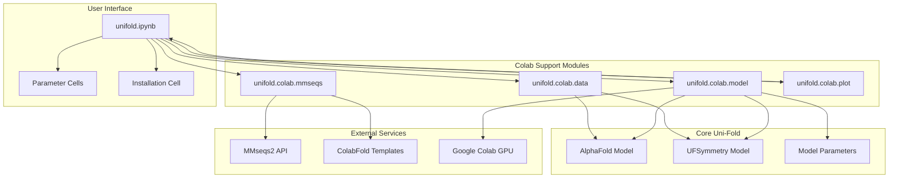
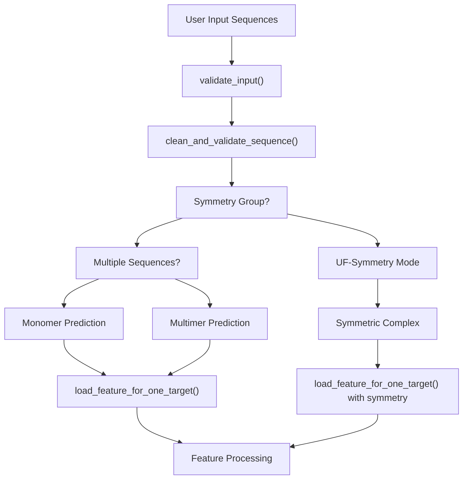
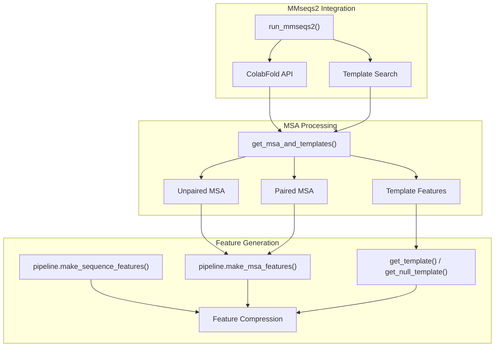
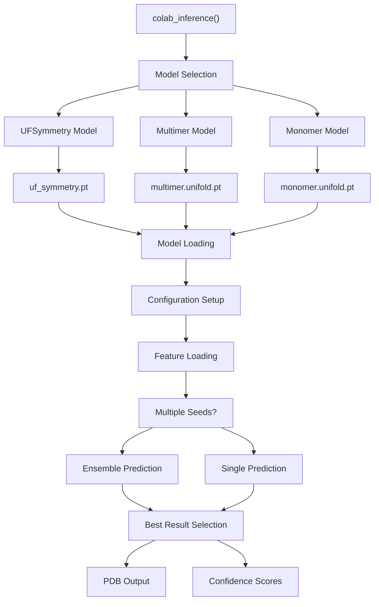
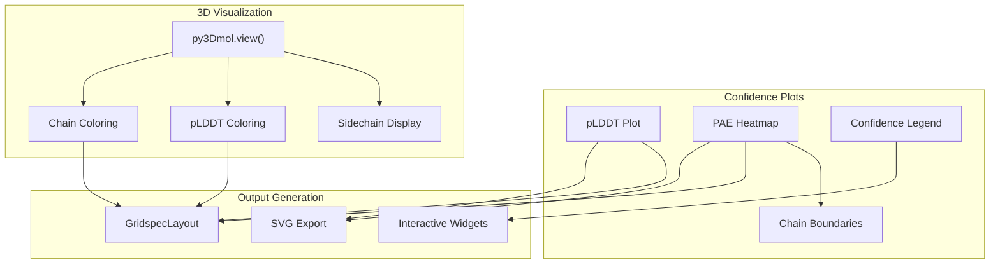

# Colab Notebook Interface

> **Relevant source files**
> * [notebooks/unifold.ipynb](https://github.com/dptech-corp/Uni-Fold/blob/7b55789e/notebooks/unifold.ipynb)
> * [unifold/colab/__init__.py](https://github.com/dptech-corp/Uni-Fold/blob/7b55789e/unifold/colab/__init__.py)
> * [unifold/colab/data.py](https://github.com/dptech-corp/Uni-Fold/blob/7b55789e/unifold/colab/data.py)
> * [unifold/colab/mmseqs.py](https://github.com/dptech-corp/Uni-Fold/blob/7b55789e/unifold/colab/mmseqs.py)
> * [unifold/colab/model.py](https://github.com/dptech-corp/Uni-Fold/blob/7b55789e/unifold/colab/model.py)
> * [unifold/colab/plot.py](https://github.com/dptech-corp/Uni-Fold/blob/7b55789e/unifold/colab/plot.py)

The Colab Notebook Interface provides an interactive, web-based environment for protein structure prediction using Uni-Fold. This system allows users to predict protein structures without local installation, using Google Colab's cloud infrastructure and the ColabFold MSA service.

For command-line batch processing, see [Command Line Interface](/dptech-corp/Uni-Fold/3.1-command-line-interface). For symmetric protein complex prediction, see [UF-Symmetry Interface](/dptech-corp/Uni-Fold/3.3-uf-symmetry-interface).

## Overview

The Colab interface consists of a Jupyter notebook that orchestrates the complete protein folding pipeline, from sequence input to 3D structure visualization. It integrates MSA generation, model inference, and result visualization in a single interactive environment.

### System Architecture



Sources: [notebooks/unifold.ipynb L1-L349](https://github.com/dptech-corp/Uni-Fold/blob/7b55789e/notebooks/unifold.ipynb#L1-L349)

 [unifold/colab/__init__.py L1](https://github.com/dptech-corp/Uni-Fold/blob/7b55789e/unifold/colab/__init__.py#L1-L1)

### Notebook Structure

The main notebook follows a sequential cell execution pattern:

| Cell | Purpose | Key Functions |
| --- | --- | --- |
| Parameter Input | User configuration | Sequence input, symmetry groups, MSA parameters |
| Installation | Environment setup | Package installation, model download |
| MSA Generation | Homology search | `get_msa_and_templates()` |
| Model Inference | Structure prediction | `colab_inference()` |
| Visualization | Result display | `colab_plot()` |
| Download | Result export | ZIP file generation |

Sources: [notebooks/unifold.ipynb L41-L71](https://github.com/dptech-corp/Uni-Fold/blob/7b55789e/notebooks/unifold.ipynb#L41-L71)

 [notebooks/unifold.ipynb L83-L120](https://github.com/dptech-corp/Uni-Fold/blob/7b55789e/notebooks/unifold.ipynb#L83-L120)

## Input Validation and Processing

The `unifold.colab.data` module handles input validation and feature preparation for the Colab environment.

### Input Validation Flow



Sources: [unifold/colab/data.py L37-L83](https://github.com/dptech-corp/Uni-Fold/blob/7b55789e/unifold/colab/data.py#L37-L83)

### Key Validation Functions

**`validate_input()`** [unifold/colab/data.py L37-L83](https://github.com/dptech-corp/Uni-Fold/blob/7b55789e/unifold/colab/data.py#L37-L83)

* Validates sequence length and composition
* Determines prediction mode (monomer/multimer/symmetry)
* Handles symmetry group parsing for UF-Symmetry

**`clean_and_validate_sequence()`** [unifold/colab/data.py L12-L35](https://github.com/dptech-corp/Uni-Fold/blob/7b55789e/unifold/colab/data.py#L12-L35)

* Removes whitespace and validates amino acids
* Enforces length constraints
* Converts to uppercase standard format

**`load_feature_for_one_target()`** [unifold/colab/data.py L85-L126](https://github.com/dptech-corp/Uni-Fold/blob/7b55789e/unifold/colab/data.py#L85-L126)

* Loads processed features for model input
* Handles both standard and symmetry predictions
* Integrates with `UnifoldDataset.collater()`

Sources: [unifold/colab/data.py L1-L126](https://github.com/dptech-corp/Uni-Fold/blob/7b55789e/unifold/colab/data.py#L1-L126)

## MSA Generation with MMseqs2

The Colab interface uses the ColabFold MMseqs2 service for fast MSA generation, avoiding the need for local databases.

### MSA Pipeline Architecture



Sources: [unifold/colab/mmseqs.py L23-L189](https://github.com/dptech-corp/Uni-Fold/blob/7b55789e/unifold/colab/mmseqs.py#L23-L189)

 [unifold/colab/mmseqs.py L246-L336](https://github.com/dptech-corp/Uni-Fold/blob/7b55789e/unifold/colab/mmseqs.py#L246-L336)

### MSA Service Integration

**`run_mmseqs2()`** [unifold/colab/mmseqs.py L23-L189](https://github.com/dptech-corp/Uni-Fold/blob/7b55789e/unifold/colab/mmseqs.py#L23-L189)

* Submits sequences to ColabFold API
* Handles job queuing and status polling
* Downloads MSA results as tarball
* Supports both unpaired and paired MSA modes

**`get_msa_and_templates()`** [unifold/colab/mmseqs.py L246-L336](https://github.com/dptech-corp/Uni-Fold/blob/7b55789e/unifold/colab/mmseqs.py#L246-L336)

* Orchestrates complete MSA pipeline
* Generates template features
* Handles homooligomer cases
* Returns processed MSAs and templates

**Template Processing** [unifold/colab/mmseqs.py L190-L245](https://github.com/dptech-corp/Uni-Fold/blob/7b55789e/unifold/colab/mmseqs.py#L190-L245)

* `get_template()`: Processes structural templates
* `get_null_template()`: Creates empty templates when none found
* Integrates with HHsearch for template alignment

Sources: [unifold/colab/mmseqs.py L1-L338](https://github.com/dptech-corp/Uni-Fold/blob/7b55789e/unifold/colab/mmseqs.py#L1-L338)

## Model Inference

The `unifold.colab.model` module manages model loading, configuration, and inference execution.

### Inference Pipeline



Sources: [unifold/colab/model.py L23-L171](https://github.com/dptech-corp/Uni-Fold/blob/7b55789e/unifold/colab/model.py#L23-L171)

### Model Configuration

**Model Selection Logic** [unifold/colab/model.py L37-L46](https://github.com/dptech-corp/Uni-Fold/blob/7b55789e/unifold/colab/model.py#L37-L46)

```
if symmetry_group is not None:    model_name = "uf_symmetry"    param_path = os.path.join(param_dir, "uf_symmetry.pt")elif is_multimer:    model_name = "multimer_ft"    param_path = os.path.join(param_dir, "multimer.unifold.pt")else:    model_name = "model_2_ft"    param_path = os.path.join(param_dir, "monomer.unifold.pt")
```

**Performance Optimization** [unifold/colab/model.py L56-L93](https://github.com/dptech-corp/Uni-Fold/blob/7b55789e/unifold/colab/model.py#L56-L93)

* Automatic chunk size determination via `automatic_chunk_size()`
* GPU memory management
* BF16 precision support
* Batch processing optimization

Sources: [unifold/colab/model.py L1-L171](https://github.com/dptech-corp/Uni-Fold/blob/7b55789e/unifold/colab/model.py#L1-L171)

## Result Visualization

The `unifold.colab.plot` module provides interactive 3D visualization and confidence plotting.

### Visualization Components



Sources: [unifold/colab/plot.py L16-L94](https://github.com/dptech-corp/Uni-Fold/blob/7b55789e/unifold/colab/plot.py#L16-L94)

### Visualization Functions

**`colab_plot()`** [unifold/colab/plot.py L16-L94](https://github.com/dptech-corp/Uni-Fold/blob/7b55789e/unifold/colab/plot.py#L16-L94)

* Creates 3D molecular visualization using py3Dmol
* Generates pLDDT confidence plots
* Produces PAE heatmaps for multimers
* Exports SVG plots for download

**Confidence Visualization** [unifold/colab/plot.py L96-L123](https://github.com/dptech-corp/Uni-Fold/blob/7b55789e/unifold/colab/plot.py#L96-L123)

* Color-coded confidence bands
* pLDDT legend with thresholds
* Chain boundary visualization
* Interactive widget layout

Sources: [unifold/colab/plot.py L1-L124](https://github.com/dptech-corp/Uni-Fold/blob/7b55789e/unifold/colab/plot.py#L1-L124)

## Installation and Dependencies

The notebook handles automatic installation of required software and model parameters.

### Installation Process

**System Dependencies** [notebooks/unifold.ipynb L90-L102](https://github.com/dptech-corp/Uni-Fold/blob/7b55789e/notebooks/unifold.ipynb#L90-L102)

* Kalign for sequence alignment
* HHsuite for template search
* py3dmol for visualization
* libmsym for symmetry operations

**Python Dependencies** [notebooks/unifold.ipynb L104-L120](https://github.com/dptech-corp/Uni-Fold/blob/7b55789e/notebooks/unifold.ipynb#L104-L120)

* Unicore framework installation
* Uni-Fold package installation
* Model parameter download
* UF-Symmetry parameter download

### Parameter Management

| Model Type | Parameter File | Source |
| --- | --- | --- |
| Monomer | `monomer.unifold.pt` | `unifold_params_2022-08-01.tar.gz` |
| Multimer | `multimer.unifold.pt` | `unifold_params_2022-08-01.tar.gz` |
| UF-Symmetry | `uf_symmetry.pt` | `uf_symmetry_params_2022-09-06.tar.gz` |

Sources: [notebooks/unifold.ipynb L106-L107](https://github.com/dptech-corp/Uni-Fold/blob/7b55789e/notebooks/unifold.ipynb#L106-L107)

## Usage Workflow

The complete Colab workflow follows this sequence:

1. **Parameter Configuration** [notebooks/unifold.ipynb L41-L71](https://github.com/dptech-corp/Uni-Fold/blob/7b55789e/notebooks/unifold.ipynb#L41-L71) * Input sequences (up to 4 chains) * Symmetry group specification * MSA and inference parameters
2. **Environment Setup** [notebooks/unifold.ipynb L83-L120](https://github.com/dptech-corp/Uni-Fold/blob/7b55789e/notebooks/unifold.ipynb#L83-L120) * Dependency installation * Model parameter download * Environment validation
3. **MSA Generation** [notebooks/unifold.ipynb L132-L239](https://github.com/dptech-corp/Uni-Fold/blob/7b55789e/notebooks/unifold.ipynb#L132-L239) * Sequence validation * MMseqs2 API interaction * Feature file creation
4. **Structure Prediction** [notebooks/unifold.ipynb L251-L274](https://github.com/dptech-corp/Uni-Fold/blob/7b55789e/notebooks/unifold.ipynb#L251-L274) * Model loading and configuration * GPU inference execution * Result processing
5. **Visualization** [notebooks/unifold.ipynb L286-L295](https://github.com/dptech-corp/Uni-Fold/blob/7b55789e/notebooks/unifold.ipynb#L286-L295) * 3D structure display * Confidence plotting * Interactive visualization
6. **Result Export** [notebooks/unifold.ipynb L306-L320](https://github.com/dptech-corp/Uni-Fold/blob/7b55789e/notebooks/unifold.ipynb#L306-L320) * PDB file packaging * JSON confidence scores * SVG plot export

Sources: [notebooks/unifold.ipynb L1-L349](https://github.com/dptech-corp/Uni-Fold/blob/7b55789e/notebooks/unifold.ipynb#L1-L349)