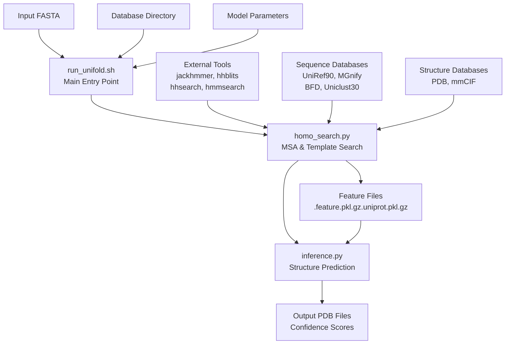
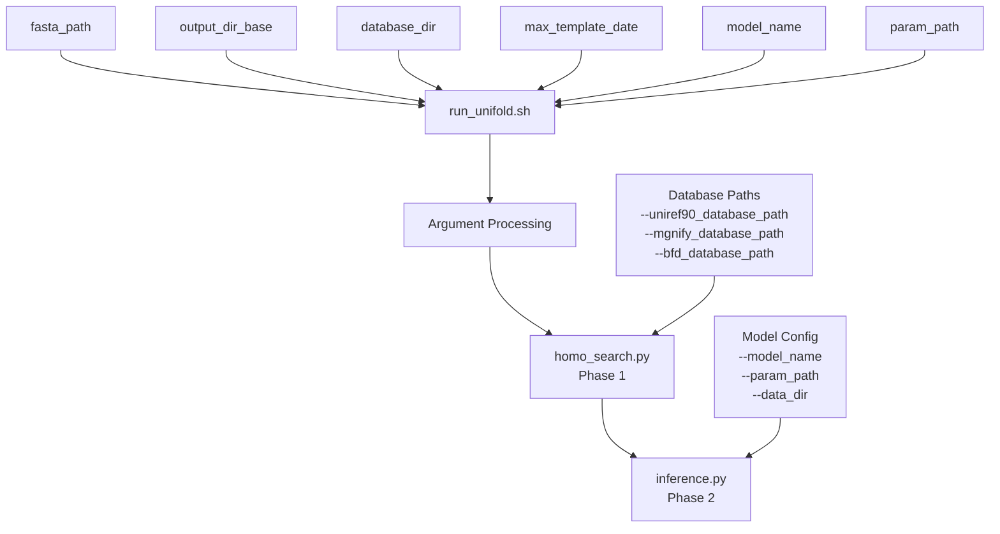
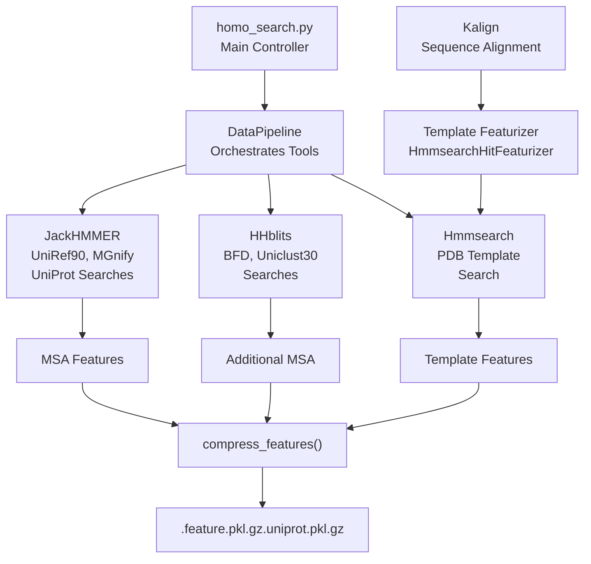
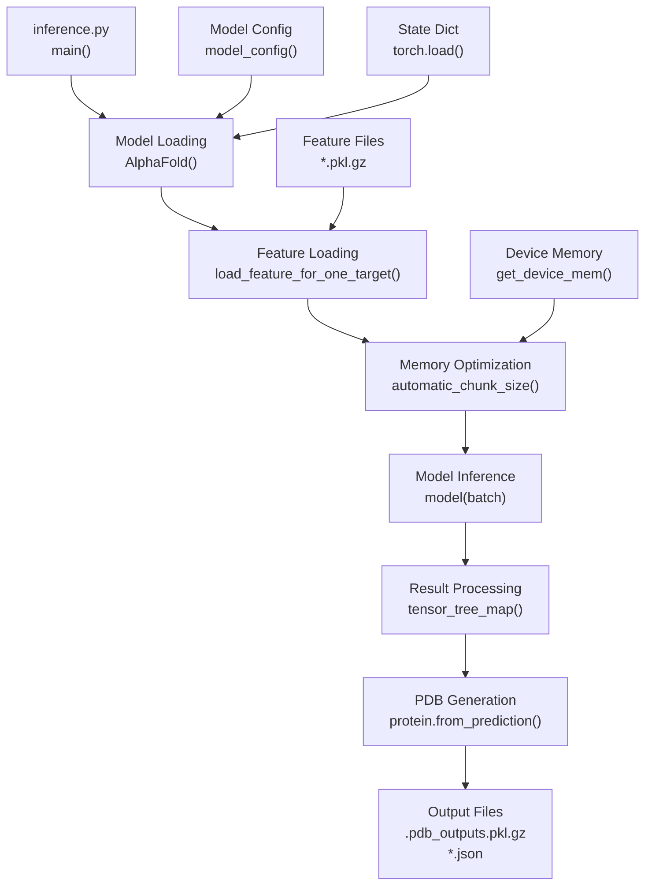
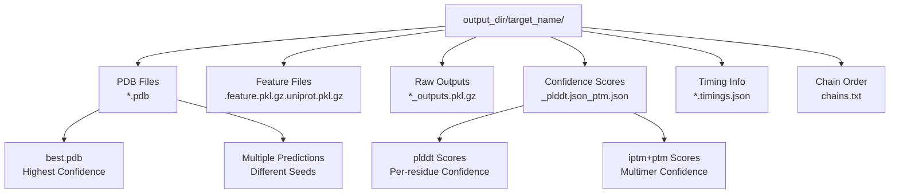

# Command Line Interface

> **Relevant source files**
> * [LICENSE](https://github.com/dptech-corp/Uni-Fold/blob/7b55789e/LICENSE)
> * [README.md](https://github.com/dptech-corp/Uni-Fold/blob/7b55789e/README.md?plain=1)
> * [run_unifold.sh](https://github.com/dptech-corp/Uni-Fold/blob/7b55789e/run_unifold.sh)
> * [unifold/homo_search.py](https://github.com/dptech-corp/Uni-Fold/blob/7b55789e/unifold/homo_search.py)
> * [unifold/inference.py](https://github.com/dptech-corp/Uni-Fold/blob/7b55789e/unifold/inference.py)

This document covers the command line interface for Uni-Fold, which provides batch processing capabilities for protein structure prediction. The CLI is the primary interface for production environments and automated workflows.

For interactive prediction using Jupyter notebooks, see [Colab Notebook Interface](/dptech-corp/Uni-Fold/3.2-colab-notebook-interface). For symmetric protein complex prediction, see [UF-Symmetry Interface](/dptech-corp/Uni-Fold/3.3-uf-symmetry-interface).

## Overview

The Uni-Fold CLI consists of a main shell script that orchestrates two Python modules: homology search and structure prediction. The interface supports both monomer and multimer prediction with extensive configuration options for databases, model parameters, and inference settings.

**CLI Workflow Overview**



Sources: [run_unifold.sh L1-L32](https://github.com/dptech-corp/Uni-Fold/blob/7b55789e/run_unifold.sh#L1-L32)

 [README.md L127-L141](https://github.com/dptech-corp/Uni-Fold/blob/7b55789e/README.md?plain=1#L127-L141)

## Main CLI Script

The primary entry point is `run_unifold.sh`, which accepts six positional arguments and orchestrates the complete prediction pipeline.

**Script Arguments and Flow**



### Usage Pattern

```
bash run_unifold.sh \    /path/to/input.fasta \    /path/to/output/directory/ \    /path/to/database/directory/ \    2020-05-01 \    model_2_ft \    /path/to/model_parameters.pt
```

The script performs two sequential phases:

1. **Homology Search**: Generates MSA and template features using [unifold/homo_search.py L9-L21](https://github.com/dptech-corp/Uni-Fold/blob/7b55789e/unifold/homo_search.py#L9-L21)
2. **Inference**: Predicts structure using the processed features via [unifold/inference.py L26-L31](https://github.com/dptech-corp/Uni-Fold/blob/7b55789e/unifold/inference.py#L26-L31)

Sources: [run_unifold.sh L1-L32](https://github.com/dptech-corp/Uni-Fold/blob/7b55789e/run_unifold.sh#L1-L32)

 [README.md L129-L138](https://github.com/dptech-corp/Uni-Fold/blob/7b55789e/README.md?plain=1#L129-L138)

## Homology Search Phase

The `homo_search.py` module handles MSA generation and template searching using external bioinformatics tools. It processes input FASTA sequences and generates feature files required for structure prediction.

**Homology Search Architecture**



### Key Components

The homology search uses several configurable components:

* **DataPipeline**: Main orchestrator class defined in [unifold/msa/pipeline.py](https://github.com/dptech-corp/Uni-Fold/blob/7b55789e/unifold/msa/pipeline.py)
* **Template Searcher**: `Hmmsearch` class for PDB template identification [unifold/homo_search.py L234-L238](https://github.com/dptech-corp/Uni-Fold/blob/7b55789e/unifold/homo_search.py#L234-L238)
* **Template Featurizer**: `HmmsearchHitFeaturizer` for processing structural templates [unifold/homo_search.py L240-L247](https://github.com/dptech-corp/Uni-Fold/blob/7b55789e/unifold/homo_search.py#L240-L247)

### Database Configuration

The script supports two database presets controlled by the `db_preset` flag:

* `full_dbs`: Complete database set including BFD and Uniclust30
* `reduced_dbs`: Smaller database set using small_bfd for faster processing

Sources: [unifold/homo_search.py L39-L313](https://github.com/dptech-corp/Uni-Fold/blob/7b55789e/unifold/homo_search.py#L39-L313)

 [unifold/homo_search.py L227-L232](https://github.com/dptech-corp/Uni-Fold/blob/7b55789e/unifold/homo_search.py#L227-L232)

## Inference Phase

The `inference.py` module loads the generated features and runs the AlphaFold model to predict protein structure. It supports extensive configuration options for model behavior and output formats.

**Inference Process Flow**



### Core Functions

The inference module provides several key functions:

* **`automatic_chunk_size()`**: Dynamically adjusts memory usage based on sequence length and available GPU memory [unifold/inference.py L29-L47](https://github.com/dptech-corp/Uni-Fold/blob/7b55789e/unifold/inference.py#L29-L47)
* **`load_feature_for_one_target()`**: Loads and processes pickled features for prediction [unifold/inference.py L49-L74](https://github.com/dptech-corp/Uni-Fold/blob/7b55789e/unifold/inference.py#L49-L74)
* **`get_device_mem()`**: Determines available device memory for optimization [unifold/inference.py L20-L27](https://github.com/dptech-corp/Uni-Fold/blob/7b55789e/unifold/inference.py#L20-L27)

### Model Configuration

The inference supports multiple model variants through the `model_name` parameter:

* Monomer models: `model_1`, `model_2`, `model_2_ft`
* Multimer models: `multimer`, `multimer_ft`

Sources: [unifold/inference.py L77-L266](https://github.com/dptech-corp/Uni-Fold/blob/7b55789e/unifold/inference.py#L77-L266)

 [unifold/inference.py L86-L94](https://github.com/dptech-corp/Uni-Fold/blob/7b55789e/unifold/inference.py#L86-L94)

## Command Line Arguments

Both homology search and inference modules accept extensive command line arguments for customization.

### Homology Search Arguments

| Argument | Purpose | Example |
| --- | --- | --- |
| `--fasta_path` | Input FASTA file path | `/path/to/sequence.fasta` |
| `--output_dir` | Output directory for features | `/path/to/output/` |
| `--db_preset` | Database configuration | `full_dbs` or `reduced_dbs` |
| `--use_uniprot` | Enable UniProt MSA generation | `True` |
| `--use_precomputed_msas` | Reuse existing MSA files | `True` |

### Inference Arguments

| Argument | Purpose | Default | Description |
| --- | --- | --- | --- |
| `--model_device` | Computing device | `cuda:0` | GPU/CPU for inference |
| `--model_name` | Model variant | `model_2` | Architecture configuration |
| `--max_recycling_iters` | Recycling iterations | `3` | Model refinement cycles |
| `--num_ensembles` | Ensemble count | `2` | Multiple prediction averaging |
| `--bf16` | Half precision | `False` | Memory optimization |
| `--sample_templates` | Template sampling | `False` | Diversity enhancement |

Sources: [unifold/homo_search.py L39-L136](https://github.com/dptech-corp/Uni-Fold/blob/7b55789e/unifold/homo_search.py#L39-L136)

 [unifold/inference.py L202-L256](https://github.com/dptech-corp/Uni-Fold/blob/7b55789e/unifold/inference.py#L202-L256)

## Output Files and Structure

The CLI generates a structured output directory with multiple file types containing prediction results and metadata.

**Output Directory Structure**



### File Types Generated

1. **PDB Files**: 3D structure coordinates with confidence scores as B-factors
2. **Feature Files**: Compressed pickled features from homology search
3. **Raw Outputs**: Complete model predictions including intermediate results
4. **JSON Scores**: Confidence metrics summary for quality assessment
5. **Timing Files**: Performance benchmarks for optimization

The `best.pdb` file contains the prediction with highest confidence score across all generated models.

Sources: [unifold/inference.py L169-L198](https://github.com/dptech-corp/Uni-Fold/blob/7b55789e/unifold/inference.py#L169-L198)

 [README.md L142-L144](https://github.com/dptech-corp/Uni-Fold/blob/7b55789e/README.md?plain=1#L142-L144)

## Specialized CLI Tools

Uni-Fold provides additional command line tools for specialized prediction tasks beyond the standard monomer/multimer workflow.

### UF-Symmetry CLI

The `run_uf_symmetry.sh` script enables prediction of large symmetric protein complexes using only the asymmetric unit as input.

```
bash run_uf_symmetry.sh \    /path/to/asymmetric_unit.fasta \    C3 \    /path/to/output/directory/ \    /path/to/database/directory/ \    2020-05-01 \    /path/to/uf_symmetry_parameters.pt
```

Key differences from standard CLI:

* Input FASTA contains only asymmetric unit sequences
* Symmetry group must be specified (C3, D4, I, O, T, etc.)
* Uses specialized UF-Symmetry model parameters
* Outputs complete symmetric assembly structure

### Memory and Performance Optimization

The CLI automatically optimizes memory usage and performance based on:

* **Sequence Length**: Determines chunking strategy [unifold/inference.py L32-L46](https://github.com/dptech-corp/Uni-Fold/blob/7b55789e/unifold/inference.py#L32-L46)
* **Available GPU Memory**: Adjusts batch and block sizes dynamically
* **Precision Mode**: Supports BF16 for reduced memory usage [unifold/inference.py L95-L96](https://github.com/dptech-corp/Uni-Fold/blob/7b55789e/unifold/inference.py#L95-L96)

Sources: [README.md L271-L281](https://github.com/dptech-corp/Uni-Fold/blob/7b55789e/README.md?plain=1#L271-L281)

 [unifold/inference.py L127-L133](https://github.com/dptech-corp/Uni-Fold/blob/7b55789e/unifold/inference.py#L127-L133)