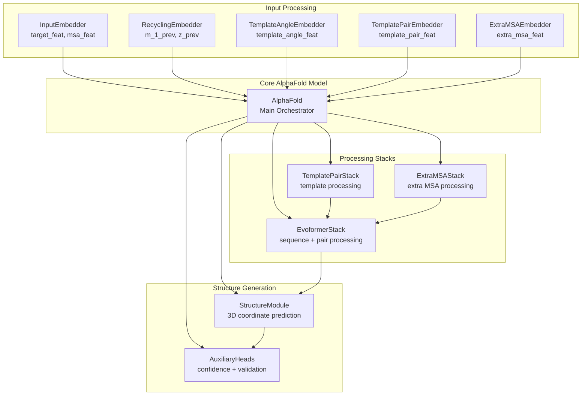
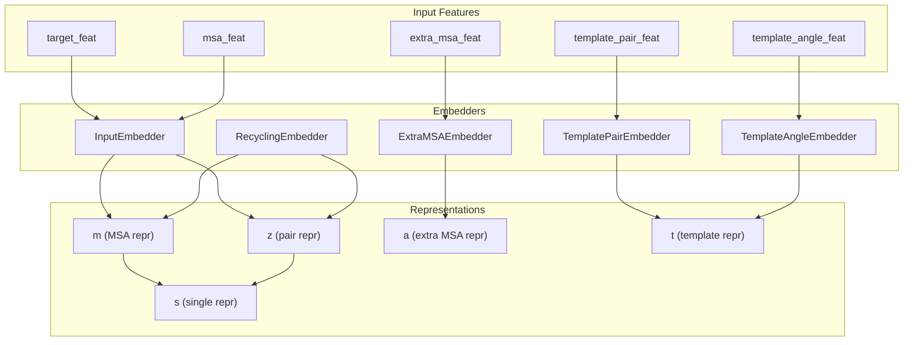
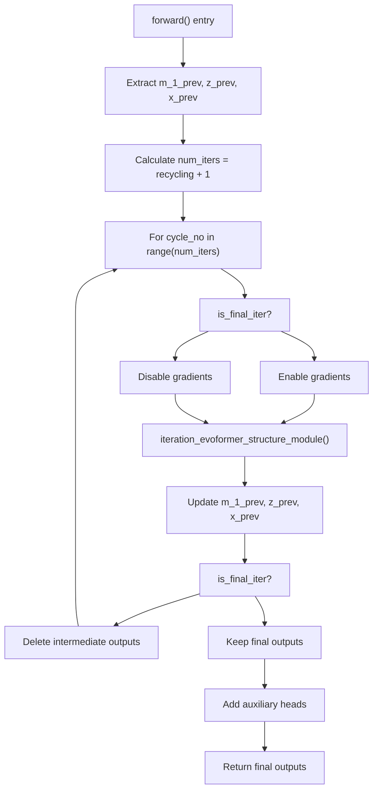
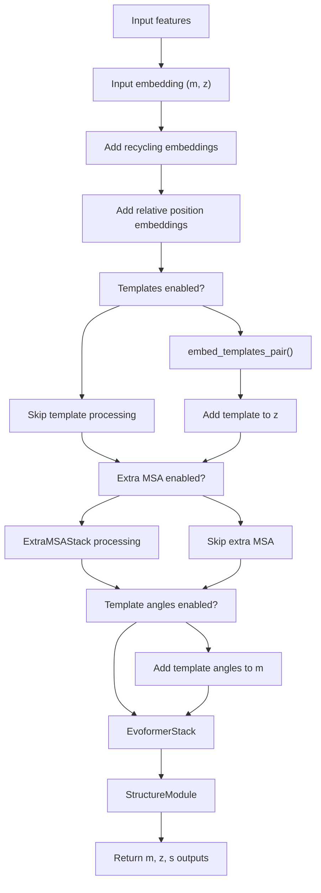
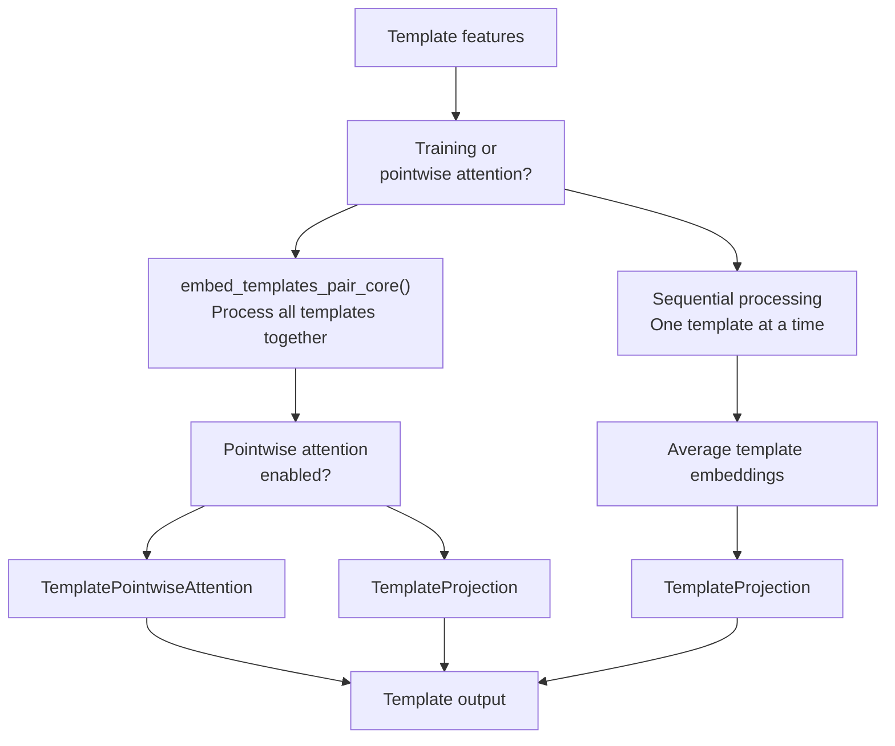

# Core AlphaFold Model

> **Relevant source files**
> * [unifold/config.py](https://github.com/dptech-corp/Uni-Fold/blob/7b55789e/unifold/config.py)
> * [unifold/model.py](https://github.com/dptech-corp/Uni-Fold/blob/7b55789e/unifold/model.py)
> * [unifold/modules/alphafold.py](https://github.com/dptech-corp/Uni-Fold/blob/7b55789e/unifold/modules/alphafold.py)

This document covers the `AlphaFold` class in `unifold/modules/alphafold.py`, which serves as the main orchestrator for protein structure prediction. This class coordinates all major components including embedders, the Evoformer stack, structure module, and auxiliary heads to transform input features into 3D protein coordinates.

For information about individual components like the Evoformer, see [Evoformer Stack](/dptech-corp/Uni-Fold/5.2-evoformer-stack). For details about 3D coordinate generation, see [Structure Module](/dptech-corp/Uni-Fold/5.3-structure-module). For template handling specifics, see [Template Processing](/dptech-corp/Uni-Fold/5.4-template-processing).

## Overview

The `AlphaFold` class acts as the central coordinator that orchestrates the entire protein folding pipeline. It manages the flow of information through multiple specialized neural network components, handles recycling iterations to refine predictions, and provides the main interface between input features and final structure predictions.

**Core AlphaFold Architecture**



Sources: [unifold/modules/alphafold.py L41-L458](https://github.com/dptech-corp/Uni-Fold/blob/7b55789e/unifold/modules/alphafold.py#L41-L458)

## Component Architecture

The `AlphaFold` class initializes and manages several key components based on the provided configuration. Each component serves a specific role in the structure prediction pipeline.

### Component Initialization

The model components are conditionally initialized based on configuration flags:

| Component | Configuration Flag | Purpose |
| --- | --- | --- |
| `InputEmbedder` | Always enabled | Processes target sequence and MSA features |
| `RecyclingEmbedder` | Always enabled | Incorporates previous iteration results |
| `TemplateAngleEmbedder` | `template.enabled` | Processes template angle features |
| `TemplatePairEmbedder` | `template.enabled` | Processes template pair features |
| `TemplatePairStack` | `template.enabled` | Refines template representations |
| `TemplatePointwiseAttention` | `template_pointwise_attention.enabled` | Template attention mechanism |
| `ExtraMSAEmbedder` | `extra_msa.enabled` | Processes additional MSA sequences |
| `ExtraMSAStack` | `extra_msa.enabled` | Refines extra MSA representations |
| `EvoformerStack` | Always enabled | Core sequence-pair processing |
| `StructureModule` | Always enabled | Generates 3D coordinates |
| `AuxiliaryHeads` | Always enabled | Produces confidence scores |

**Component Dependencies and Data Flow**



Sources: [unifold/modules/alphafold.py L42-L102](https://github.com/dptech-corp/Uni-Fold/blob/7b55789e/unifold/modules/alphafold.py#L42-L102)

## Forward Pass Structure

The `AlphaFold.forward()` method implements a recycling mechanism where predictions are iteratively refined. Each iteration processes the input through the complete pipeline, using outputs from the previous iteration to improve predictions.

### Recycling Iteration Loop

**Recycling Mechanism Flow**



The recycling mechanism allows the model to refine its predictions by using outputs from previous iterations as additional input context. This is implemented in the `forward` method:

```
num_iters = int(batch["num_recycling_iters"]) + 1for cycle_no in range(num_iters):    is_final_iter = cycle_no == (num_iters - 1)    with torch.set_grad_enabled(is_grad_enabled and is_final_iter):        outputs, m_1_prev, z_prev, x_prev = self.iteration_evoformer_structure_module(...)
```

Sources: [unifold/modules/alphafold.py L418-L457](https://github.com/dptech-corp/Uni-Fold/blob/7b55789e/unifold/modules/alphafold.py#L418-L457)

### Single Iteration Processing

Each iteration processes features through the complete pipeline via `iteration_evoformer_structure_module()` and `iteration_evoformer()` methods.

**Single Iteration Data Flow**



The key processing steps in `iteration_evoformer()` include:

1. **Input Embedding**: Convert raw features to learned representations
2. **Recycling Integration**: Add previous iteration outputs
3. **Relative Position Encoding**: Add positional information
4. **Template Processing**: Incorporate structural templates if available
5. **Extra MSA Processing**: Process additional MSA sequences
6. **Evoformer Processing**: Main sequence-pair attention processing
7. **Output Generation**: Produce final representations

Sources: [unifold/modules/alphafold.py L247-L357](https://github.com/dptech-corp/Uni-Fold/blob/7b55789e/unifold/modules/alphafold.py#L247-L357)

 [unifold/modules/alphafold.py L359-L416](https://github.com/dptech-corp/Uni-Fold/blob/7b55789e/unifold/modules/alphafold.py#L359-L416)

## Template Processing

The model supports two modes of template processing: standard batch processing for training and memory-efficient sequential processing for inference.

### Template Embedding Pipeline

**Template Processing Architecture**



The template processing handles two different feature versions:

* **v1 features**: Original AlphaFold template features
* **v2 features**: Enhanced features with additional multichain information

Sources: [unifold/modules/alphafold.py L147-L238](https://github.com/dptech-corp/Uni-Fold/blob/7b55789e/unifold/modules/alphafold.py#L147-L238)

 [unifold/modules/alphafold.py L240-L245](https://github.com/dptech-corp/Uni-Fold/blob/7b55789e/unifold/modules/alphafold.py#L240-L245)

## Configuration and Model Variants

The `AlphaFold` class behavior is controlled through hierarchical configuration objects defined in `model_config()`. Different model variants have different architectural and training configurations.

### Key Configuration Categories

| Category | Purpose | Key Parameters |
| --- | --- | --- |
| `input_embedder` | Input feature processing | `d_pair`, `d_msa`, `tf_dim`, `msa_dim` |
| `recycling_embedder` | Previous iteration integration | `d_pair`, `d_msa`, `min_bin`, `max_bin` |
| `template` | Template feature processing | `enabled`, `embed_angles`, distogram bins |
| `extra_msa` | Additional MSA processing | `enabled`, `d_extra_msa` |
| `evoformer_stack` | Core attention processing | `num_blocks`, `d_hid_*`, `num_heads_*` |
| `structure_module` | 3D coordinate generation | `num_blocks`, `d_ipa`, `num_heads_ipa` |
| `heads` | Auxiliary predictions | `plddt`, `distogram`, `pae` configurations |

### Model Variants

The configuration system supports multiple pre-defined model variants:

* **model_1**: Basic monomer model
* **model_2**: Enhanced monomer with v2 features
* **multimer**: Protein complex prediction
* **model_*_af2**: AlphaFold2-compatible variants
* **model_*_ft**: Fine-tuned variants

Each variant modifies specific parameters like MSA limits, crop sizes, loss weights, and feature processing modes.

Sources: [unifold/config.py L480-L672](https://github.com/dptech-corp/Uni-Fold/blob/7b55789e/unifold/config.py#L480-L672)

 [unifold/model.py L12-L58](https://github.com/dptech-corp/Uni-Fold/blob/7b55789e/unifold/model.py#L12-L58)

## Precision and Performance Features

The `AlphaFold` class includes several features for managing computational precision and performance:

### Mixed Precision Support

The model supports multiple precision modes through dedicated methods:

```python
def half(self):      # FP16 modedef bfloat16(self):  # BF16 mode  def float(self):     # FP32 mode
```

Input embedders are kept in FP32 during mixed precision training for numerical stability, implemented in `__make_input_float__()`.

### AlphaFold Original Mode

The `alphafold_original_mode()` method ensures compatibility with original AlphaFold implementations by:

* Switching activation functions to ReLU
* Applying AlphaFold-specific parameter settings
* Enabling exact numerical reproduction of AlphaFold results

Sources: [unifold/modules/alphafold.py L103-L139](https://github.com/dptech-corp/Uni-Fold/blob/7b55789e/unifold/modules/alphafold.py#L103-L139)