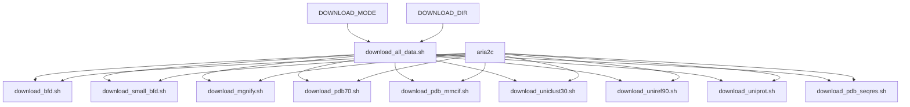
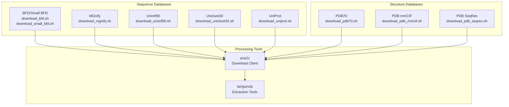
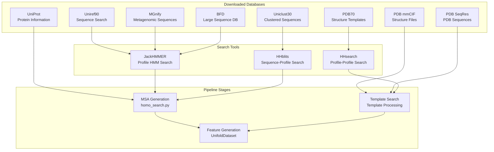

# Data Download Scripts

> **Relevant source files**
> * [scripts/download/download_all_data.sh](https://github.com/dptech-corp/Uni-Fold/blob/7b55789e/scripts/download/download_all_data.sh)
> * [scripts/download/download_pdb70.sh](https://github.com/dptech-corp/Uni-Fold/blob/7b55789e/scripts/download/download_pdb70.sh)

This document covers the automated scripts for downloading external databases and datasets required by Uni-Fold for protein structure prediction. These scripts handle the acquisition of sequence databases, structural templates, and other reference data needed for MSA generation and template-based modeling.

For information about how these databases are used in the prediction pipeline, see [Homology Search and MSA Generation](/dptech-corp/Uni-Fold/4.1-homology-search-and-msa-generation). For basic installation requirements, see [Installation and Setup](/dptech-corp/Uni-Fold/2.1-installation-and-setup).

## Overview

Uni-Fold requires several large external databases to perform homology search, MSA generation, and template identification. The download scripts in `scripts/download/` automate the process of acquiring these datasets from their respective sources.

## Download Script Architecture

The download system follows a modular architecture where a main orchestrator script coordinates individual database-specific download scripts:



**Download Script Coordination Flow**

Sources: [scripts/download/download_all_data.sh L1-L78](https://github.com/dptech-corp/Uni-Fold/blob/7b55789e/scripts/download/download_all_data.sh#L1-L78)

## Main Download Script

The primary entry point is `download_all_data.sh`, which orchestrates the download of all required databases.

### Usage and Parameters

The script accepts two parameters:

* **Required**: Download directory path
* **Optional**: Download mode (`full_dbs` or `reduced_dbs`)

```
bash download_all_data.sh /path/to/download/directory [full_dbs|reduced_dbs]
```

### Prerequisites

The script requires `aria2c` for efficient downloading:

```
sudo apt install aria2
```

Sources: [scripts/download/download_all_data.sh L27-L30](https://github.com/dptech-corp/Uni-Fold/blob/7b55789e/scripts/download/download_all_data.sh#L27-L30)

### Download Modes

| Mode | Description | BFD Database |
| --- | --- | --- |
| `full_dbs` | Complete databases (default) | Full BFD |
| `reduced_dbs` | Smaller datasets for testing | Small BFD |

The mode selection affects primarily the BFD database size, with other databases remaining consistent across modes.

Sources: [scripts/download/download_all_data.sh L33-L55](https://github.com/dptech-corp/Uni-Fold/blob/7b55789e/scripts/download/download_all_data.sh#L33-L55)

## Database Download Components



**Database Categories and Download Scripts**

### Individual Download Scripts

Each database has a dedicated download script following a consistent pattern:

#### PDB70 Download Example

The `download_pdb70.sh` script demonstrates the typical download pattern:

1. **Validation**: Checks for required directory argument and `aria2c` availability
2. **Directory Setup**: Creates target directory structure
3. **Download**: Uses `aria2c` to fetch the database archive
4. **Extraction**: Unpacks and cleans up temporary files

```
ROOT_DIR="${DOWNLOAD_DIR}/pdb70"SOURCE_URL="http://wwwuser.gwdg.de/~compbiol/data/hhsuite/databases/hhsuite_dbs/old-releases/pdb70_from_mmcif_200401.tar.gz"
```

Sources: [scripts/download/download_pdb70.sh L32-L41](https://github.com/dptech-corp/Uni-Fold/blob/7b55789e/scripts/download/download_pdb70.sh#L32-L41)

## Database Usage in Pipeline



**Database Integration in Prediction Pipeline**

Sources: [scripts/download/download_all_data.sh L57-L76](https://github.com/dptech-corp/Uni-Fold/blob/7b55789e/scripts/download/download_all_data.sh#L57-L76)

## Parameter Download Considerations

The download scripts notably exclude AlphaFold parameters by default, as indicated in the main script:

```markdown
# Uni-Fold has own parameters, so one does not need alphafold parameters.# One may enable the following command and convert alphafold parameters for# specific benchmark purposes.
```

This reflects Uni-Fold's use of native PyTorch parameters rather than requiring conversion from JAX-based AlphaFold weights. For parameter conversion workflows, see [Parameter Conversion](/dptech-corp/Uni-Fold/6.3-parameter-conversion).

Sources: [scripts/download/download_all_data.sh L42-L47](https://github.com/dptech-corp/Uni-Fold/blob/7b55789e/scripts/download/download_all_data.sh#L42-L47)

## Storage Requirements and Performance

The download scripts use `aria2c` for efficient multi-connection downloads, which provides:

* Parallel connection handling for faster downloads
* Resume capability for interrupted transfers
* Certificate validation controls for secure downloads

The total storage requirement varies significantly between download modes, with full databases requiring several terabytes of space for complete sequence and structure databases.

Sources: [scripts/download/download_all_data.sh L27-L30](https://github.com/dptech-corp/Uni-Fold/blob/7b55789e/scripts/download/download_all_data.sh#L27-L30)

 [scripts/download/download_pdb70.sh L38](https://github.com/dptech-corp/Uni-Fold/blob/7b55789e/scripts/download/download_pdb70.sh#L38-L38)