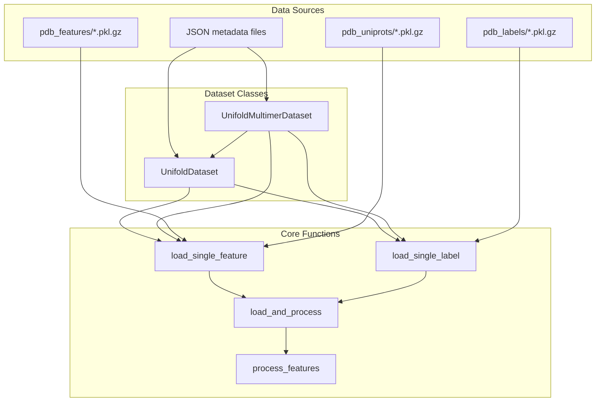
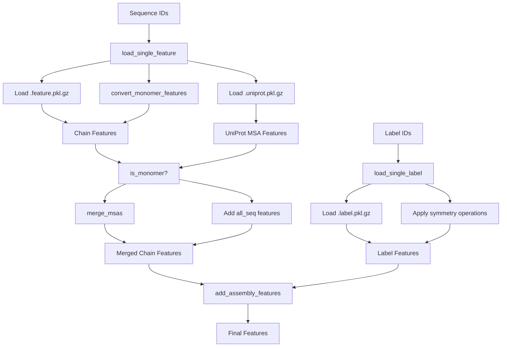
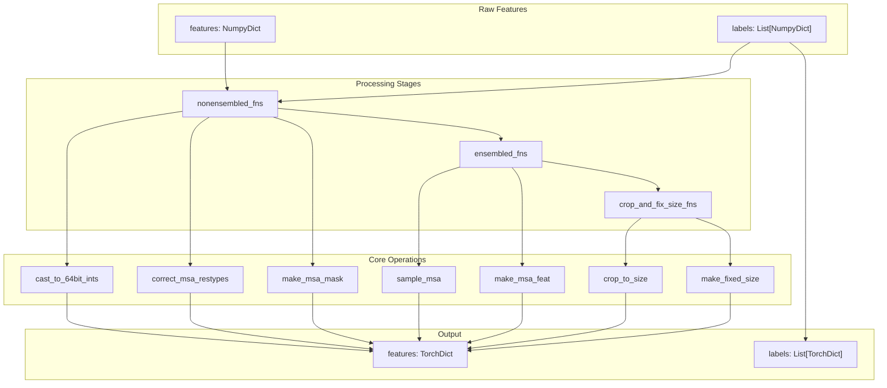
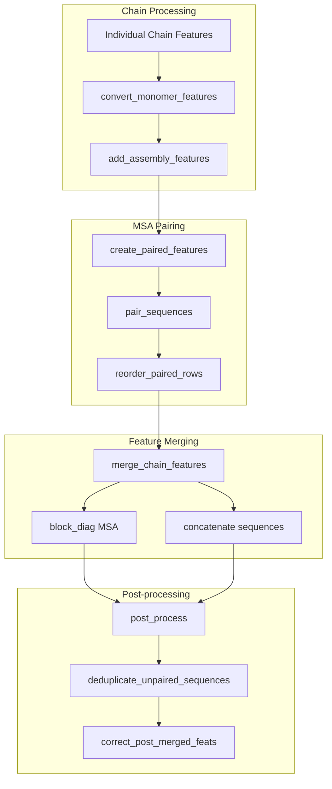
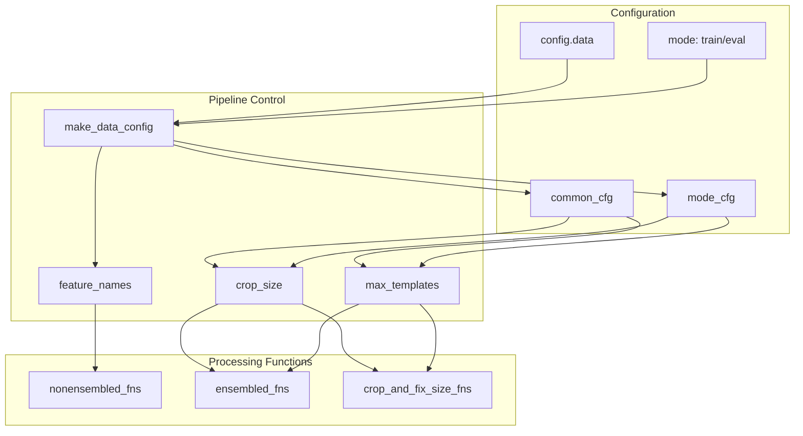

# Data Loading and Processing

> **Relevant source files**
> * [scripts/convert_openfold_to_unifold.py](https://github.com/dptech-corp/Uni-Fold/blob/7b55789e/scripts/convert_openfold_to_unifold.py)
> * [unifold/data/data_ops.py](https://github.com/dptech-corp/Uni-Fold/blob/7b55789e/unifold/data/data_ops.py)
> * [unifold/data/msa_pairing.py](https://github.com/dptech-corp/Uni-Fold/blob/7b55789e/unifold/data/msa_pairing.py)
> * [unifold/data/process.py](https://github.com/dptech-corp/Uni-Fold/blob/7b55789e/unifold/data/process.py)
> * [unifold/data/utils.py](https://github.com/dptech-corp/Uni-Fold/blob/7b55789e/unifold/data/utils.py)
> * [unifold/dataset.py](https://github.com/dptech-corp/Uni-Fold/blob/7b55789e/unifold/dataset.py)

This section covers how Uni-Fold loads pre-computed features from disk and processes them into model-ready tensors. It handles the transformation of MSA features, templates, and sequence data into the standardized format expected by the neural network architecture.

For information about generating MSAs and searching for homologous sequences, see [Homology Search and MSA Generation](/dptech-corp/Uni-Fold/4.1-homology-search-and-msa-generation). For details about processing structural templates and mmCIF files, see [mmCIF and Template Processing](/dptech-corp/Uni-Fold/4.3-mmcif-and-template-processing).

## Dataset Architecture

Uni-Fold implements two primary dataset classes that handle different prediction modes: monomer and multimer prediction. These classes manage feature loading, sampling, and preprocessing for training and inference.

**Dataset Class Hierarchy**

The `UnifoldDataset` class serves as the base implementation for monomer prediction, while `UnifoldMultimerDataset` extends it to handle protein complexes with multiple chains.

Sources: [unifold/dataset.py L240-L397](https://github.com/dptech-corp/Uni-Fold/blob/7b55789e/unifold/dataset.py#L240-L397)

## Feature Loading Pipeline

The feature loading process reads pre-computed MSA and template data from compressed pickle files, applying necessary conversions and merging operations.

**Key Loading Functions**

* `load_single_feature`: Loads monomer features and optional UniProt MSAs
* `load_single_label`: Loads structural labels with optional symmetry transformations
* `add_assembly_features`: Processes features for multimer assembly

Sources: [unifold/dataset.py L64-L116](https://github.com/dptech-corp/Uni-Fold/blob/7b55789e/unifold/dataset.py#L64-L116)

 [unifold/data/process_multimer.py](https://github.com/dptech-corp/Uni-Fold/blob/7b55789e/unifold/data/process_multimer.py)

## Data Processing Pipeline

The processing pipeline transforms raw features into model-ready tensors through a series of configurable transformations organized into three main stages.

**Processing Function Categories**

1. **Non-ensembled functions**: Basic data cleaning and type conversion
2. **Ensembled functions**: MSA sampling and feature generation for multiple recycling iterations
3. **Crop and fix size functions**: Spatial cropping and padding to fixed dimensions

Sources: [unifold/data/process.py L9-L207](https://github.com/dptech-corp/Uni-Fold/blob/7b55789e/unifold/data/process.py#L9-L207)

 [unifold/data/data_ops.py](https://github.com/dptech-corp/Uni-Fold/blob/7b55789e/unifold/data/data_ops.py)

## Multimer-Specific Processing

Multimer prediction requires additional processing to handle multiple protein chains, including MSA pairing and chain assembly operations.

**Multimer Processing Steps**

| Step | Function | Purpose |
| --- | --- | --- |
| Pairing | `pair_sequences` | Match MSA sequences across chains by species |
| Merging | `merge_chain_features` | Combine features from multiple chains |
| Assembly | `add_assembly_features` | Add inter-chain connectivity information |
| Cleanup | `deduplicate_unpaired_sequences` | Remove redundant sequences |

Sources: [unifold/data/process_multimer.py](https://github.com/dptech-corp/Uni-Fold/blob/7b55789e/unifold/data/process_multimer.py)

 [unifold/data/msa_pairing.py L72-L494](https://github.com/dptech-corp/Uni-Fold/blob/7b55789e/unifold/data/msa_pairing.py#L72-L494)

## Data Transformations and Operations

The data processing pipeline applies numerous transformations to prepare features for the neural network, organized by functional category.

```mermaid
flowchart TD

O["make_target_feat"]
P["nearest_neighbor_clusters"]
Q["make_hhblits_profile"]
L["crop_to_size_single"]
N["make_fixed_size"]
M["crop_to_size_multimer"]
H["make_atom14_masks"]
I["make_atom14_positions"]
J["atom37_to_frames"]
K["make_pseudo_beta"]
E["crop_templates"]
F["make_template_mask"]
G["atom37_to_torsion_angles"]
A["sample_msa"]
D["make_msa_feat"]
B["block_delete_msa"]
C["make_masked_msa"]

subgraph subGraph4 ["Feature Engineering"]
    O
    P
    Q
    O --> P
    P --> Q
end

subgraph subGraph3 ["Spatial Operations"]
    L
    N
    M
    L --> N
    M --> N
end

subgraph subGraph2 ["Structural Operations"]
    H
    I
    J
    K
    H --> I
    I --> J
    J --> K
end

subgraph subGraph1 ["Template Operations"]
    E
    F
    G
    E --> F
    F --> G
end

subgraph subGraph0 ["MSA Operations"]
    A
    D
    B
    C
    A --> D
    B --> A
    C --> D
end
```

**Key Transformation Categories**

1. **MSA Processing**: Sampling, masking, and feature generation from multiple sequence alignments
2. **Template Handling**: Processing structural templates and extracting geometric features
3. **Atomic Representations**: Converting between atom37 and atom14 coordinate systems
4. **Spatial Cropping**: Managing sequence length and memory constraints
5. **Feature Engineering**: Creating derived features like profiles and clusters

Sources: [unifold/data/data_ops.py L36-L1200](https://github.com/dptech-corp/Uni-Fold/blob/7b55789e/unifold/data/data_ops.py#L36-L1200)

## Configuration and Data Flow Control

The processing pipeline is controlled through configuration objects that specify which transformations to apply and their parameters.

**Configuration Parameters**

| Parameter | Purpose | Location |
| --- | --- | --- |
| `crop_size` | Maximum sequence length | `mode_cfg` |
| `max_templates` | Template count limit | `mode_cfg` |
| `max_msa_clusters` | MSA size limit | `mode_cfg` |
| `use_templates` | Enable template features | `common_cfg` |
| `is_multimer` | Multimer mode flag | `common_cfg` |

Sources: [unifold/dataset.py L34-L52](https://github.com/dptech-corp/Uni-Fold/blob/7b55789e/unifold/dataset.py#L34-L52)

 [unifold/data/process.py L55-L91](https://github.com/dptech-corp/Uni-Fold/blob/7b55789e/unifold/data/process.py#L55-L91)