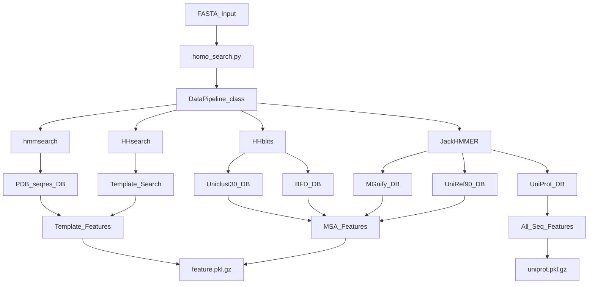
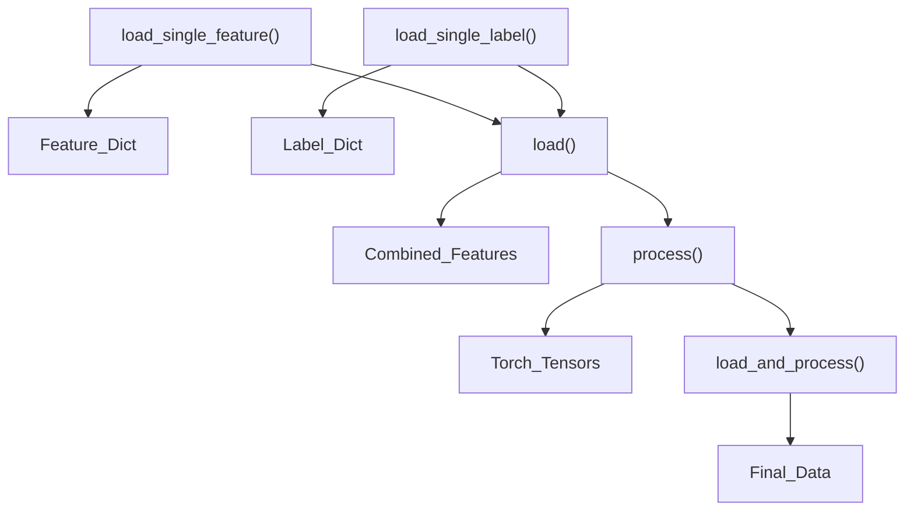
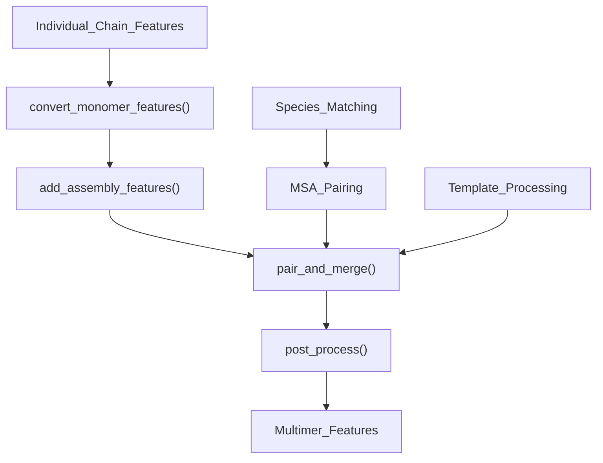
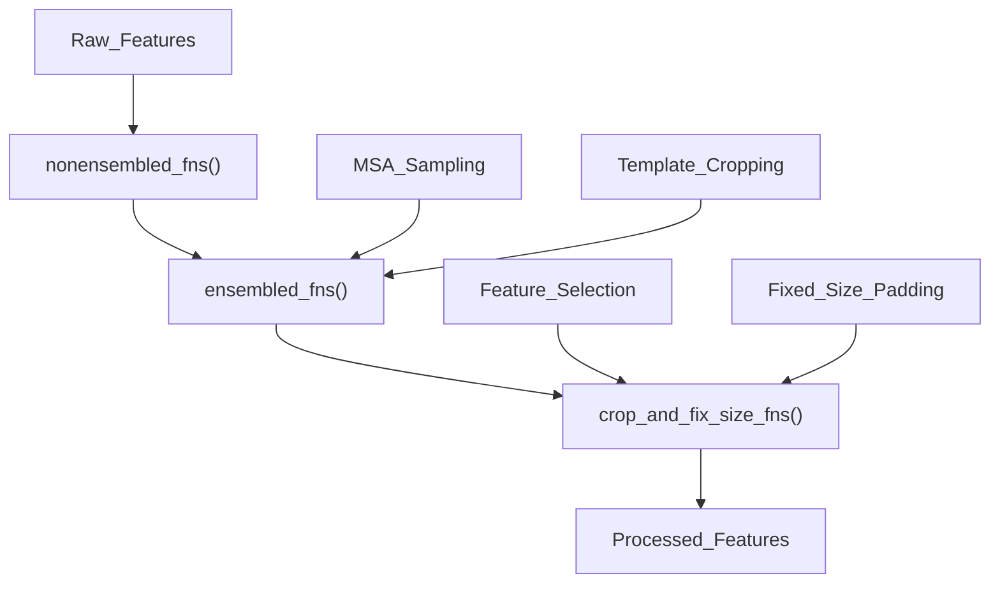
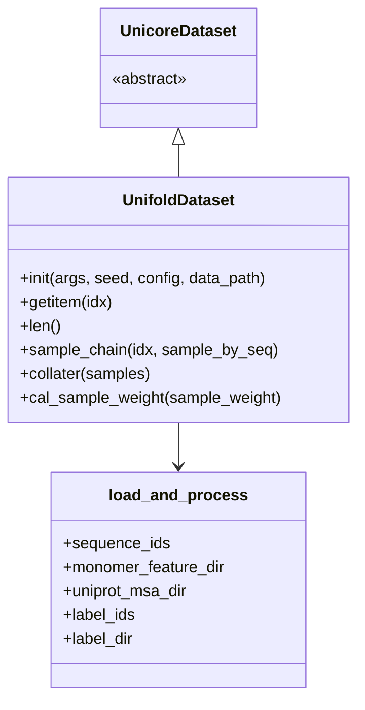
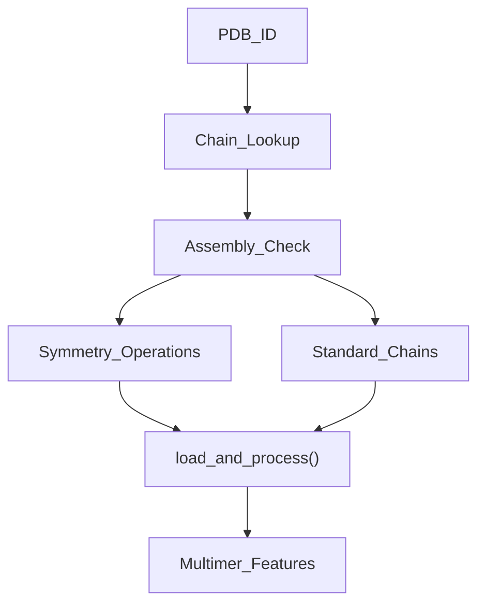
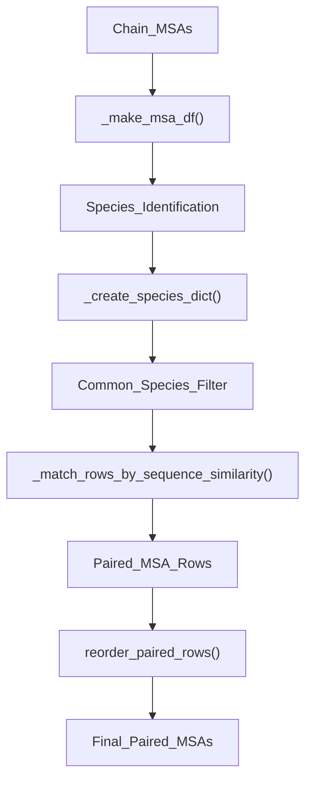

# Data Pipeline

> **Relevant source files**
> * [LICENSE](https://github.com/dptech-corp/Uni-Fold/blob/7b55789e/LICENSE)
> * [run_unifold.sh](https://github.com/dptech-corp/Uni-Fold/blob/7b55789e/run_unifold.sh)
> * [scripts/convert_openfold_to_unifold.py](https://github.com/dptech-corp/Uni-Fold/blob/7b55789e/scripts/convert_openfold_to_unifold.py)
> * [unifold/data/data_ops.py](https://github.com/dptech-corp/Uni-Fold/blob/7b55789e/unifold/data/data_ops.py)
> * [unifold/data/msa_pairing.py](https://github.com/dptech-corp/Uni-Fold/blob/7b55789e/unifold/data/msa_pairing.py)
> * [unifold/data/process.py](https://github.com/dptech-corp/Uni-Fold/blob/7b55789e/unifold/data/process.py)
> * [unifold/data/utils.py](https://github.com/dptech-corp/Uni-Fold/blob/7b55789e/unifold/data/utils.py)
> * [unifold/dataset.py](https://github.com/dptech-corp/Uni-Fold/blob/7b55789e/unifold/dataset.py)
> * [unifold/homo_search.py](https://github.com/dptech-corp/Uni-Fold/blob/7b55789e/unifold/homo_search.py)

The Data Pipeline subsystem handles the transformation of input protein sequences into model-ready features. This includes homology searching, Multiple Sequence Alignment (MSA) generation, template processing, and data loading for both monomer and multimer predictions. For information about the core model architecture that consumes these features, see [Model Architecture](/dptech-corp/Uni-Fold/5-model-architecture). For training configuration and scripts, see [Training and Fine-tuning](/dptech-corp/Uni-Fold/6-training-and-fine-tuning).

## Overview

The data pipeline consists of several interconnected stages that process protein sequences through external database searches, feature extraction, and tensor preparation. The pipeline supports both single-chain (monomer) and multi-chain (multimer) protein complex prediction, with specialized handling for symmetric assemblies.

## MSA and Template Search Pipeline

### External Database Search

The pipeline begins with `homo_search.py`, which orchestrates searches against multiple protein databases to find homologous sequences and structural templates. This script serves as the main entry point for feature generation.

**External Database Search Components**

Sources: [unifold/homo_search.py L249-L263](https://github.com/dptech-corp/Uni-Fold/blob/7b55789e/unifold/homo_search.py#L249-L263)

 [run_unifold.sh L9-L21](https://github.com/dptech-corp/Uni-Fold/blob/7b55789e/run_unifold.sh#L9-L21)

The `DataPipeline` class in the MSA module coordinates multiple search tools:

| Tool | Purpose | Database(s) | Output |
| --- | --- | --- | --- |
| `JackHMMER` | Sequence homology search | UniRef90, MGnify, UniProt | MSA sequences |
| `HHblits` | Profile-based search | BFD, Uniclust30 | MSA sequences |
| `HHsearch` | Template detection | PDB structures | Structural templates |
| `hmmsearch` | Template search | PDB seqres | Template hits |

### Feature File Generation

The search process generates compressed pickle files containing processed features:

* **`{chain_id}.feature.pkl.gz`**: Main features including MSAs and templates
* **`{chain_id}.uniprot.pkl.gz`**: Additional UniProt-derived sequences (optional)

Sources: [unifold/homo_search.py L171-L200](https://github.com/dptech-corp/Uni-Fold/blob/7b55789e/unifold/homo_search.py#L171-L200)

## Data Loading and Processing

### Core Data Loading Functions

The `unifold/dataset.py` module provides the fundamental data loading infrastructure through several key functions:

**Data Loading Function Hierarchy**

Sources: [unifold/dataset.py L65-L98](https://github.com/dptech-corp/Uni-Fold/blob/7b55789e/unifold/dataset.py#L65-L98)

 [unifold/dataset.py L119-L169](https://github.com/dptech-corp/Uni-Fold/blob/7b55789e/unifold/dataset.py#L119-L169)

 [unifold/dataset.py L172-L216](https://github.com/dptech-corp/Uni-Fold/blob/7b55789e/unifold/dataset.py#L172-L216)

| Function | Purpose | Key Operations |
| --- | --- | --- |
| `load_single_feature()` | Load individual chain features | Pickle loading, monomer conversion |
| `load_single_label()` | Load ground truth labels | Label processing, symmetry operations |
| `load()` | Combine multiple chains | Assembly features, multimer pairing |
| `process()` | Convert to model format | Tensor conversion, data augmentation |

### Multimer Data Processing

For protein complexes, the system implements sophisticated MSA pairing and chain assembly logic:

**Multimer Processing Pipeline**

Sources: [unifold/data/process_multimer.py](https://github.com/dptech-corp/Uni-Fold/blob/7b55789e/unifold/data/process_multimer.py)

 [unifold/data/msa_pairing.py L207-L262](https://github.com/dptech-corp/Uni-Fold/blob/7b55789e/unifold/data/msa_pairing.py#L207-L262)

The multimer pipeline includes:

* **MSA Pairing**: Matches sequences across chains based on species identifiers
* **Assembly Features**: Adds inter-chain connectivity information
* **Template Handling**: Processes structural templates for complexes
* **Chain Merging**: Combines individual chain features into unified representation

## Data Transformation Pipeline

### Processing Configuration

The `process_features()` function orchestrates data transformations based on configuration parameters and training mode:

**Data Processing Functions**

Sources: [unifold/data/process.py L162-L207](https://github.com/dptech-corp/Uni-Fold/blob/7b55789e/unifold/data/process.py#L162-L207)

 [unifold/data/process.py L9-L52](https://github.com/dptech-corp/Uni-Fold/blob/7b55789e/unifold/data/process.py#L9-L52)

 [unifold/data/process.py L94-L159](https://github.com/dptech-corp/Uni-Fold/blob/7b55789e/unifold/data/process.py#L94-L159)

| Function Group | Operations | Purpose |
| --- | --- | --- |
| `nonensembled_fns()` | MSA corrections, template masking | Basic feature preparation |
| `ensembled_fns()` | MSA sampling, clustering | Augmentation and ensemble prep |
| `crop_and_fix_size_fns()` | Cropping, padding | Memory optimization |

### Data Transformation Operations

The `data_ops.py` module provides low-level transformation primitives:

**Key Data Operations**

Sources: [unifold/data/data_ops.py L220-L245](https://github.com/dptech-corp/Uni-Fold/blob/7b55789e/unifold/data/data_ops.py#L220-L245)

 [unifold/data/data_ops.py L335-L358](https://github.com/dptech-corp/Uni-Fold/blob/7b55789e/unifold/data/data_ops.py#L335-L358)

 [unifold/data/data_ops.py L608-L658](https://github.com/dptech-corp/Uni-Fold/blob/7b55789e/unifold/data/data_ops.py#L608-L658)

| Operation | Function | Purpose |
| --- | --- | --- |
| MSA Sampling | `sample_msa()` | Random/Gumbel MSA sequence selection |
| Template Processing | `crop_templates()` | Template count limiting |
| Feature Padding | `make_fixed_size()` | Batch size normalization |
| Atom Representations | `make_atom14_masks()` | Coordinate format conversion |

## Dataset Classes

### UnifoldDataset

The primary dataset class for single-chain protein training and inference:

**UnifoldDataset Key Components**

Sources: [unifold/dataset.py L240-L378](https://github.com/dptech-corp/Uni-Fold/blob/7b55789e/unifold/dataset.py#L240-L378)

* **Sample Weight Management**: Handles training data distribution and sampling probabilities
* **Self-Distillation Support**: Optional self-distillation data loading with configurable probability
* **Chain Sampling**: Random selection with sequence-level or chain-level granularity

### UnifoldMultimerDataset

Extends `UnifoldDataset` for protein complex handling:

**Multimer-Specific Features**

Sources: [unifold/dataset.py L399-L534](https://github.com/dptech-corp/Uni-Fold/blob/7b55789e/unifold/dataset.py#L399-L534)

| Feature | Implementation | Purpose |
| --- | --- | --- |
| Assembly Processing | `pdb_assembly.json` | Symmetric complex handling |
| Chain Filtering | `filter_pdb_by_max_chains()` | Memory management |
| Dynamic Chain Loading | Chain selection by PDB ID | Flexible complex composition |

**Multimer Data Flow**

Sources: [unifold/dataset.py L432-L481](https://github.com/dptech-corp/Uni-Fold/blob/7b55789e/unifold/dataset.py#L432-L481)

## Data Utilities and Caching

### Feature Compression and Storage

The system implements efficient feature storage and retrieval:

**Storage Optimization**

Sources: [unifold/data/utils.py L122-L139](https://github.com/dptech-corp/Uni-Fold/blob/7b55789e/unifold/data/utils.py#L122-L139)

 [unifold/data/utils.py L42-L69](https://github.com/dptech-corp/Uni-Fold/blob/7b55789e/unifold/data/utils.py#L42-L69)

| Optimization | Implementation | Benefit |
| --- | --- | --- |
| LRU Caching | `@lru_cache` decorators | Reduces I/O overhead |
| Feature Compression | Sparse matrix storage | Disk space efficiency |
| Data Type Optimization | `uint8` for MSA data | Memory footprint reduction |

### MSA Pairing for Multimers

Complex MSA pairing logic ensures proper sequence alignment across protein chains:

**MSA Pairing Algorithm**

Sources: [unifold/data/msa_pairing.py L137-L204](https://github.com/dptech-corp/Uni-Fold/blob/7b55789e/unifold/data/msa_pairing.py#L137-L204)

 [unifold/data/msa_pairing.py L265-L289](https://github.com/dptech-corp/Uni-Fold/blob/7b55789e/unifold/data/msa_pairing.py#L265-L289)

The pairing process matches MSA sequences across protein chains by:

1. Extracting species identifiers from MSA sequences
2. Finding sequences from the same species across different chains
3. Ranking matches by sequence similarity to target
4. Creating paired alignments for multimer training

This sophisticated data pipeline ensures that Uni-Fold receives properly formatted, augmented, and optimized input features for accurate protein structure prediction across both monomer and complex scenarios.