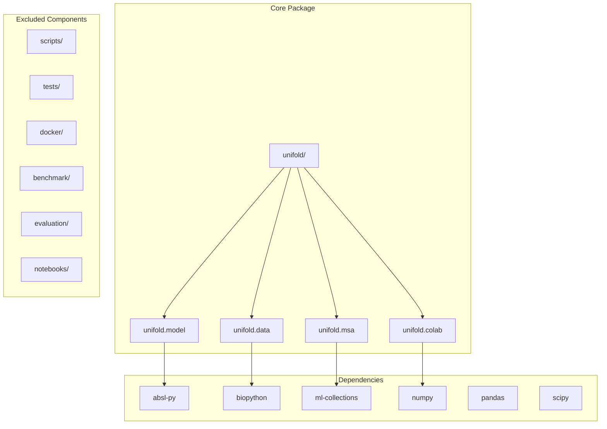
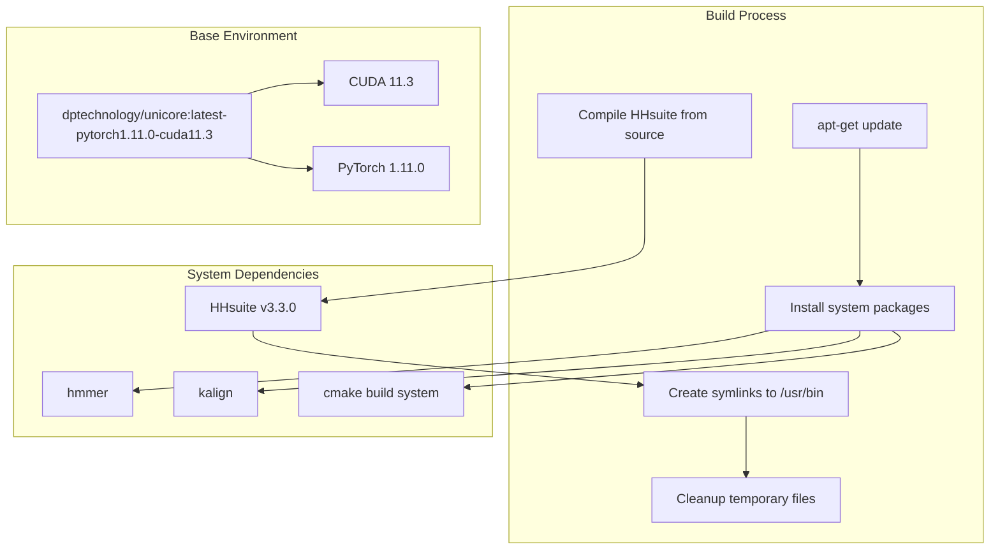
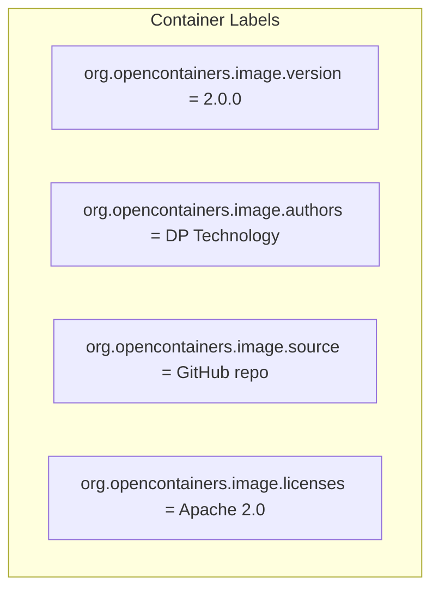
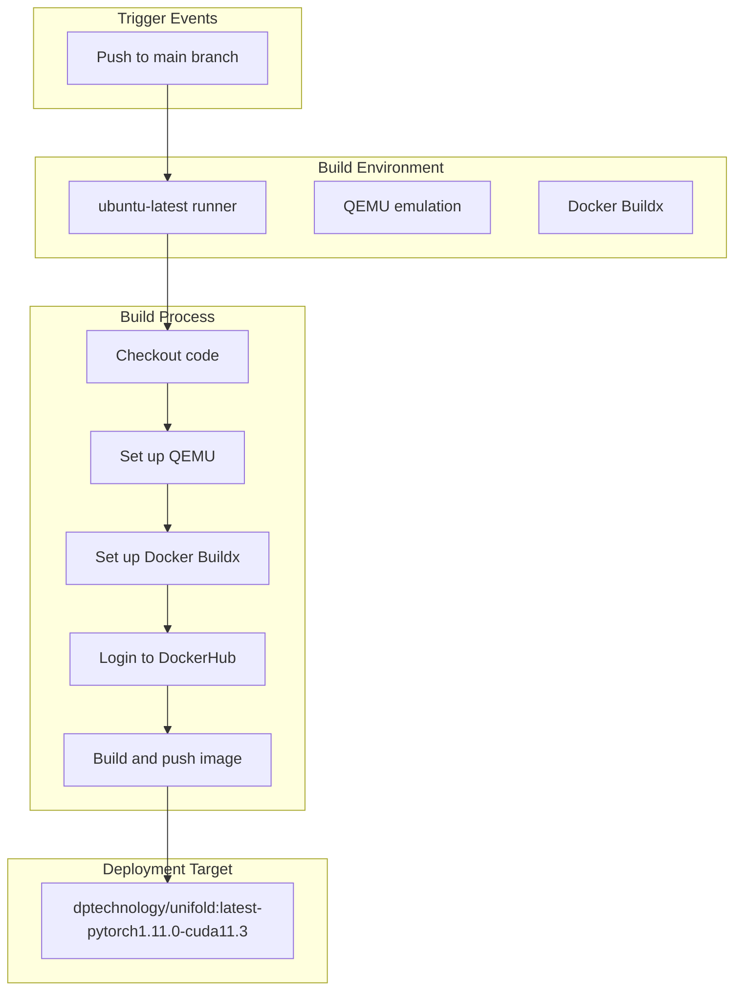
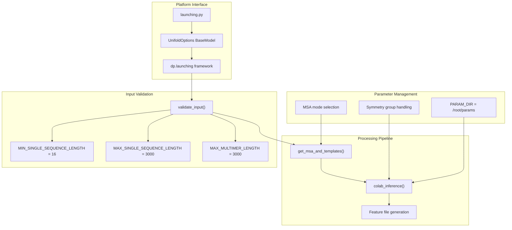
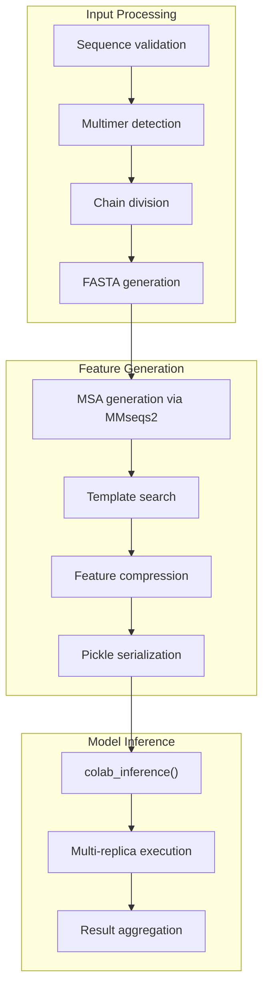
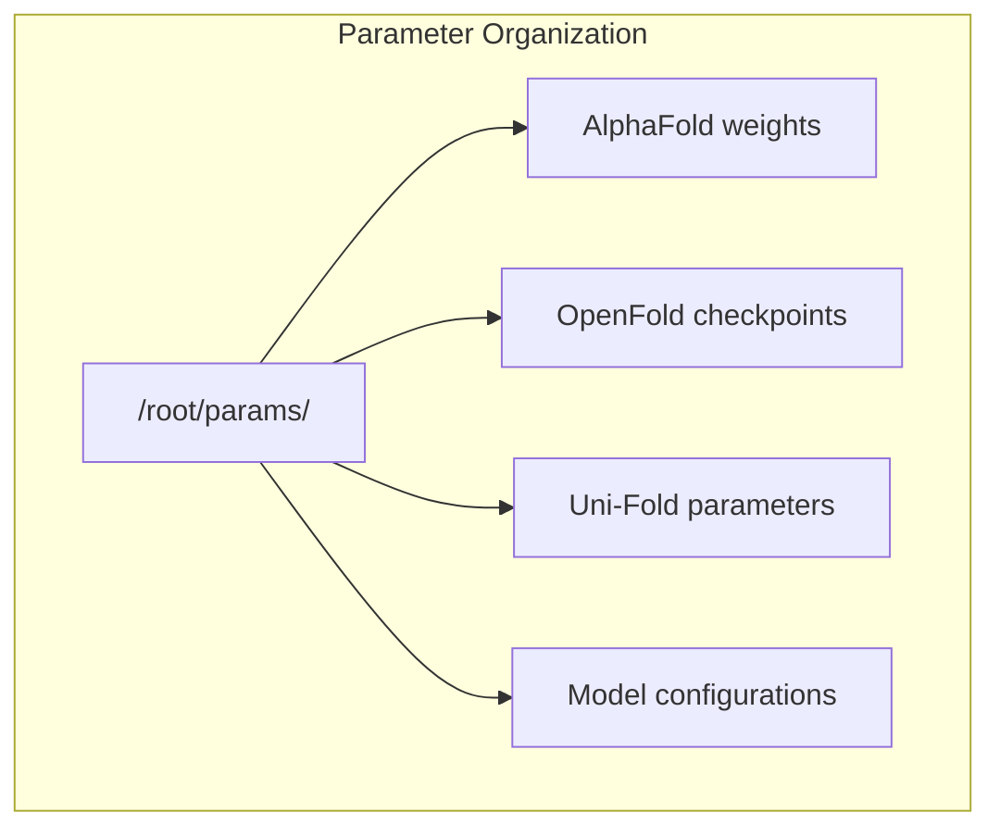

# Development and Deployment

> **Relevant source files**
> * [.github/workflows/docker.yml](https://github.com/dptech-corp/Uni-Fold/blob/7b55789e/.github/workflows/docker.yml)
> * [docker/Dockerfile](https://github.com/dptech-corp/Uni-Fold/blob/7b55789e/docker/Dockerfile)
> * [launching.py](https://github.com/dptech-corp/Uni-Fold/blob/7b55789e/launching.py)
> * [setup.py](https://github.com/dptech-corp/Uni-Fold/blob/7b55789e/setup.py)

This page covers the tools, configurations, and deployment strategies for Uni-Fold in production and development environments. It focuses on containerization, cloud platform integration, CI/CD pipelines, and package management rather than end-user installation or model usage.

For basic installation and setup, see [Installation and Setup](/dptech-corp/Uni-Fold/2.1-installation-and-setup). For Docker usage instructions, see [Docker Deployment](/dptech-corp/Uni-Fold/2.3-docker-deployment). For understanding the codebase organization, see [Package Structure](/dptech-corp/Uni-Fold/8.1-package-structure).

## Package Configuration and Distribution

Uni-Fold is distributed as a Python package with specific dependency requirements and modular structure designed for both research and production deployment.

### Package Structure

The main package is configured through `setup.py` with core dependencies and optional components excluded from distribution:

Sources: [setup.py L27-L29](https://github.com/dptech-corp/Uni-Fold/blob/7b55789e/setup.py#L27-L29)

 [setup.py L30-L37](https://github.com/dptech-corp/Uni-Fold/blob/7b55789e/setup.py#L30-L37)

### Version Management

The package uses semantic versioning with current version `2.2.1` and supports Python 3.6-3.10 across POSIX Linux systems:

| Component | Value |
| --- | --- |
| Package Name | `unifold` |
| Current Version | `2.2.1` |
| License | Apache License 2.0 |
| Python Support | 3.6, 3.7, 3.8, 3.9, 3.10 |
| Target Audience | Science/Research |
| Development Status | Production/Stable |

Sources: [setup.py L20-L26](https://github.com/dptech-corp/Uni-Fold/blob/7b55789e/setup.py#L20-L26)

 [setup.py L38-L49](https://github.com/dptech-corp/Uni-Fold/blob/7b55789e/setup.py#L38-L49)

## Docker Containerization

### Container Architecture

Uni-Fold uses a multi-stage Docker build process based on the `dptechnology/unicore` base image with CUDA support:

Sources: [docker/Dockerfile L1](https://github.com/dptech-corp/Uni-Fold/blob/7b55789e/docker/Dockerfile#L1-L1)

 [docker/Dockerfile L12-L14](https://github.com/dptech-corp/Uni-Fold/blob/7b55789e/docker/Dockerfile#L12-L14)

 [docker/Dockerfile L17-L24](https://github.com/dptech-corp/Uni-Fold/blob/7b55789e/docker/Dockerfile#L17-L24)

### Container Metadata

The Docker image includes comprehensive metadata for version tracking and licensing:

Sources: [docker/Dockerfile L4-L7](https://github.com/dptech-corp/Uni-Fold/blob/7b55789e/docker/Dockerfile#L4-L7)

### Build Optimization

The Dockerfile implements several optimization strategies:

* Uses bash shell for advanced string operations: [docker/Dockerfile L10](https://github.com/dptech-corp/Uni-Fold/blob/7b55789e/docker/Dockerfile#L10-L10)
* Parallel compilation with `-j 4` flag: [docker/Dockerfile L21](https://github.com/dptech-corp/Uni-Fold/blob/7b55789e/docker/Dockerfile#L21-L21)
* Comprehensive cleanup to minimize image size: [docker/Dockerfile L26-L30](https://github.com/dptech-corp/Uni-Fold/blob/7b55789e/docker/Dockerfile#L26-L30)
* Library cache refresh with `ldconfig`: [docker/Dockerfile L26](https://github.com/dptech-corp/Uni-Fold/blob/7b55789e/docker/Dockerfile#L26-L26)

Sources: [docker/Dockerfile L10](https://github.com/dptech-corp/Uni-Fold/blob/7b55789e/docker/Dockerfile#L10-L10)

 [docker/Dockerfile L21](https://github.com/dptech-corp/Uni-Fold/blob/7b55789e/docker/Dockerfile#L21-L21)

 [docker/Dockerfile L26-L30](https://github.com/dptech-corp/Uni-Fold/blob/7b55789e/docker/Dockerfile#L26-L30)

## CI/CD Pipeline

### Automated Docker Builds

GitHub Actions automates the Docker build and publishing process with multi-platform support:

Sources: [.github/workflows/docker.yml L3-L7](https://github.com/dptech-corp/Uni-Fold/blob/7b55789e/.github/workflows/docker.yml#L3-L7)

 [.github/workflows/docker.yml L11-L33](https://github.com/dptech-corp/Uni-Fold/blob/7b55789e/.github/workflows/docker.yml#L11-L33)

### Authentication and Security

The pipeline uses secure credential management:

* DockerHub authentication via GitHub secrets: [.github/workflows/docker.yml L22-L26](https://github.com/dptech-corp/Uni-Fold/blob/7b55789e/.github/workflows/docker.yml#L22-L26)
* Automated credential rotation support
* Build context isolation: [.github/workflows/docker.yml L31](https://github.com/dptech-corp/Uni-Fold/blob/7b55789e/.github/workflows/docker.yml#L31-L31)

Sources: [.github/workflows/docker.yml L22-L26](https://github.com/dptech-corp/Uni-Fold/blob/7b55789e/.github/workflows/docker.yml#L22-L26)

 [.github/workflows/docker.yml L31](https://github.com/dptech-corp/Uni-Fold/blob/7b55789e/.github/workflows/docker.yml#L31-L31)

## Cloud Platform Integration

### Bohrium Apps Deployment

Uni-Fold integrates with DP Technology's Bohrium cloud platform through a specialized entry point:

Sources: [launching.py L16-L18](https://github.com/dptech-corp/Uni-Fold/blob/7b55789e/launching.py#L16-L18)

 [launching.py L51-L55](https://github.com/dptech-corp/Uni-Fold/blob/7b55789e/launching.py#L51-L55)

 [launching.py L57-L77](https://github.com/dptech-corp/Uni-Fold/blob/7b55789e/launching.py#L57-L77)

### Configuration Parameters

The `UnifoldOptions` class defines the cloud platform interface:

| Parameter | Type | Default | Range | Description |
| --- | --- | --- | --- | --- |
| `sequence` | String | Required | 6-3000 chars | Input sequences, `;` separated |
| `name` | String | "unifold" | 0-31 chars | Target name |
| `symmetry_group` | String | "C1" | - | Symmetry specification |
| `use_template` | Boolean | True | - | Template usage flag |
| `use_msa` | Boolean | True | - | MSA generation flag |
| `num_recycling` | Int | 4 | 1-8 | Recycling iterations |
| `num_ensembles` | Int | 2 | 1-5 | Ensemble count |
| `num_replica` | Int | 1 | 1-5 | Repeat executions |
| `seed` | Int | 0 | ≥0 | Random seed |

Sources: [launching.py L57-L77](https://github.com/dptech-corp/Uni-Fold/blob/7b55789e/launching.py#L57-L77)

### Processing Workflow

The cloud deployment implements a complete processing pipeline:

Sources: [launching.py L94-L135](https://github.com/dptech-corp/Uni-Fold/blob/7b55789e/launching.py#L94-L135)

 [launching.py L137-L166](https://github.com/dptech-corp/Uni-Fold/blob/7b55789e/launching.py#L137-L166)

 [launching.py L168-L181](https://github.com/dptech-corp/Uni-Fold/blob/7b55789e/launching.py#L168-L181)

## Development Environment Setup

### External Tool Dependencies

Uni-Fold requires several external bioinformatics tools that must be properly configured:

| Tool | Version | Purpose | Installation Method |
| --- | --- | --- | --- |
| HHsuite | v3.3.0 | Homology detection | Compiled from source |
| HMMER | Latest | Profile HMM searches | Package manager |
| Kalign | Latest | Multiple sequence alignment | Package manager |

Sources: [docker/Dockerfile L12-L14](https://github.com/dptech-corp/Uni-Fold/blob/7b55789e/docker/Dockerfile#L12-L14)

 [docker/Dockerfile L17](https://github.com/dptech-corp/Uni-Fold/blob/7b55789e/docker/Dockerfile#L17-L17)

### Build Dependencies

The development environment requires specific build tools:

* `cmake` for HHsuite compilation: [docker/Dockerfile L20](https://github.com/dptech-corp/Uni-Fold/blob/7b55789e/docker/Dockerfile#L20-L20)
* `make` with parallel build support: [docker/Dockerfile L21](https://github.com/dptech-corp/Uni-Fold/blob/7b55789e/docker/Dockerfile#L21-L21)
* System development libraries
* CUDA toolkit for GPU acceleration

Sources: [docker/Dockerfile L20-L21](https://github.com/dptech-corp/Uni-Fold/blob/7b55789e/docker/Dockerfile#L20-L21)

### Parameter Directory Structure

The system expects parameters in a standardized directory structure:

Sources: [launching.py L54](https://github.com/dptech-corp/Uni-Fold/blob/7b55789e/launching.py#L54-L54)