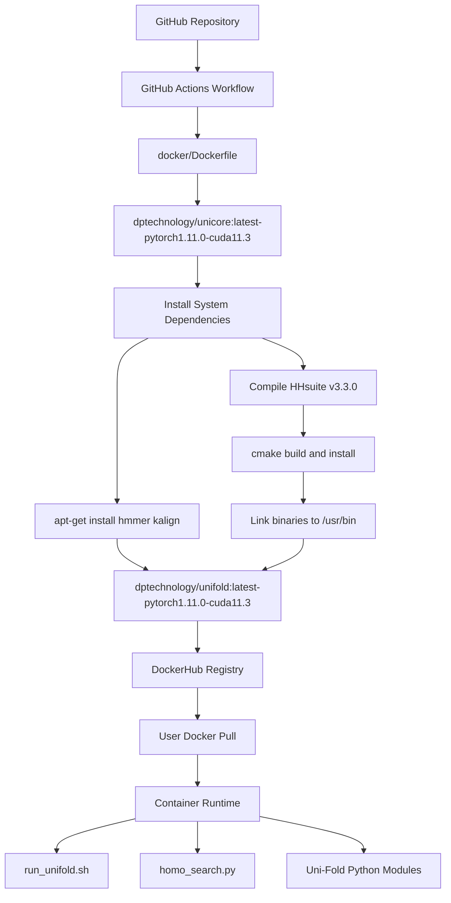
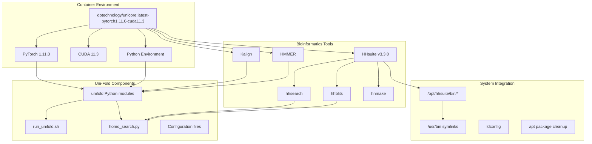
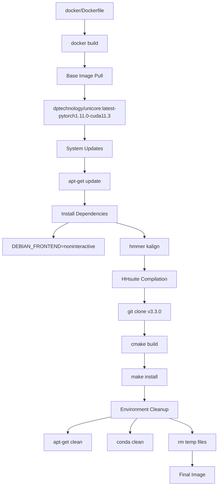

# Docker Deployment

> **Relevant source files**
> * [.github/workflows/docker.yml](https://github.com/dptech-corp/Uni-Fold/blob/7b55789e/.github/workflows/docker.yml)
> * [docker/Dockerfile](https://github.com/dptech-corp/Uni-Fold/blob/7b55789e/docker/Dockerfile)

This document covers deploying and using Uni-Fold through Docker containers for reproducible, containerized protein structure prediction. Docker deployment provides an isolated environment with all necessary dependencies pre-installed, making it easier to run Uni-Fold across different systems without complex setup procedures.

For command-line usage outside Docker, see [Command Line Interface](/dptech-corp/Uni-Fold/3.1-command-line-interface). For interactive notebook interfaces, see [Colab Notebook Interface](/dptech-corp/Uni-Fold/3.2-colab-notebook-interface).

## Docker Image Overview

Uni-Fold provides pre-built Docker images that package the complete prediction environment including the neural network framework, bioinformatics tools, and system dependencies. The official image is automatically built and published to DockerHub.

### Pre-built Image Details

The official Uni-Fold Docker image is available at `dptechnology/unifold:latest-pytorch1.11.0-cuda11.3`. This image includes:

| Component | Version/Details |
| --- | --- |
| Base Image | `dptechnology/unicore:latest-pytorch1.11.0-cuda11.3` |
| CUDA Support | CUDA 11.3 |
| PyTorch | 1.11.0 |
| HHsuite | v3.3.0 (compiled from source) |
| HMMER | Latest via apt |
| Kalign | Latest via apt |

The image is configured with all binaries properly linked and the environment ready for immediate use.

**Sources:** [docker/Dockerfile L1-L31](https://github.com/dptech-corp/Uni-Fold/blob/7b55789e/docker/Dockerfile#L1-L31)

 [.github/workflows/docker.yml L33](https://github.com/dptech-corp/Uni-Fold/blob/7b55789e/.github/workflows/docker.yml#L33-L33)

## Docker Deployment Workflow



**Sources:** [.github/workflows/docker.yml L1-L33](https://github.com/dptech-corp/Uni-Fold/blob/7b55789e/.github/workflows/docker.yml#L1-L33)

 [docker/Dockerfile L1-L31](https://github.com/dptech-corp/Uni-Fold/blob/7b55789e/docker/Dockerfile#L1-L31)

## Using the Pre-built Container

### Basic Container Usage

Pull and run the official Uni-Fold Docker image:

```markdown
# Pull the latest imagedocker pull dptechnology/unifold:latest-pytorch1.11.0-cuda11.3 # Run with GPU supportdocker run --gpus all -it dptechnology/unifold:latest-pytorch1.11.0-cuda11.3
```

### Volume Mounting for Data Access

Mount local directories to access input sequences and output structures:

```
docker run --gpus all \  -v /path/to/input:/input \  -v /path/to/output:/output \  -v /path/to/databases:/databases \  dptechnology/unifold:latest-pytorch1.11.0-cuda11.3
```

### Running Uni-Fold Scripts

Execute prediction workflows within the container:

```markdown
# Interactive shelldocker run --gpus all -it dptechnology/unifold:latest-pytorch1.11.0-cuda11.3 bash # Direct script executiondocker run --gpus all \  -v /local/data:/data \  dptechnology/unifold:latest-pytorch1.11.0-cuda11.3 \  bash /app/run_unifold.sh --input /data/sequence.fasta
```

**Sources:** [docker/Dockerfile L1](https://github.com/dptech-corp/Uni-Fold/blob/7b55789e/docker/Dockerfile#L1-L1)

## Container Architecture and Dependencies



### Installed Bioinformatics Tools

The container includes essential tools for MSA generation and homology search:

| Tool | Purpose | Installation Method |
| --- | --- | --- |
| `hmmer` | Profile HMM searches | apt package |
| `kalign` | Multiple sequence alignment | apt package |
| `hhblits` | HMM-HMM database searches | Compiled from source |
| `hhsearch` | Template structure search | Compiled from source |
| `hhmake` | HMM profile generation | Compiled from source |

All tools are symlinked to `/usr/bin` for global access within the container.

**Sources:** [docker/Dockerfile L12-L24](https://github.com/dptech-corp/Uni-Fold/blob/7b55789e/docker/Dockerfile#L12-L24)

## Building Custom Images

### Custom Dockerfile Modifications

The base Dockerfile can be extended for custom requirements:

```sql
FROM dptechnology/unifold:latest-pytorch1.11.0-cuda11.3 # Add custom dependenciesRUN apt-get update && apt-get install -y \    your-custom-package # Install additional Python packagesRUN pip install your-python-package # Copy custom configurationsCOPY custom_config.py /app/
```

### Build Process Architecture



### GitHub Actions Integration

The automated build process triggers on main branch pushes and publishes to DockerHub:

* **Trigger**: Push to main branch
* **Build Context**: `./docker/` directory
* **Registry**: DockerHub
* **Tag**: `dptechnology/unifold:latest-pytorch1.11.0-cuda11.3`
* **Authentication**: Uses `DOCKERHUB_USERNAME` and `DOCKERHUB_TOKEN` secrets

**Sources:** [.github/workflows/docker.yml L3-L6](https://github.com/dptech-corp/Uni-Fold/blob/7b55789e/.github/workflows/docker.yml#L3-L6)

 [.github/workflows/docker.yml L28-L33](https://github.com/dptech-corp/Uni-Fold/blob/7b55789e/.github/workflows/docker.yml#L28-L33)

 [docker/Dockerfile L16-L30](https://github.com/dptech-corp/Uni-Fold/blob/7b55789e/docker/Dockerfile#L16-L30)

## Integration with Uni-Fold Workflows

### Entry Point Compatibility

The Docker container supports all major Uni-Fold entry points:

| Interface | Container Usage |
| --- | --- |
| `run_unifold.sh` | Direct script execution in container |
| `homo_search.py` | MSA generation with containerized tools |
| UF-Symmetry | Symmetric complex prediction workflows |
| Python modules | Import and use within container Python environment |

### Database and Model Access

External resources must be mounted into the container:

* **Sequence databases**: UniRef90, MGnify, BFD, Uniclust30
* **Structure databases**: PDB, template libraries
* **Model parameters**: Pre-trained weights and configurations
* **Input/Output**: FASTA files and generated PDB structures

```
docker run --gpus all \  -v /databases/uniref90:/databases/uniref90 \  -v /models/params:/models/params \  -v /input:/input \  -v /output:/output \  dptechnology/unifold:latest-pytorch1.11.0-cuda11.3
```

**Sources:** [docker/Dockerfile L1](https://github.com/dptech-corp/Uni-Fold/blob/7b55789e/docker/Dockerfile#L1-L1)

 [.github/workflows/docker.yml L31](https://github.com/dptech-corp/Uni-Fold/blob/7b55789e/.github/workflows/docker.yml#L31-L31)