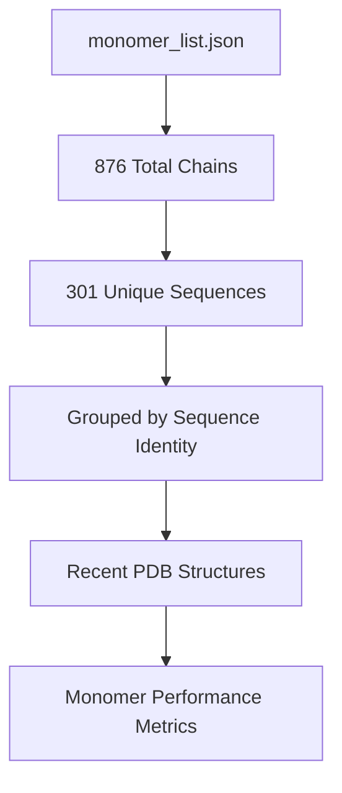
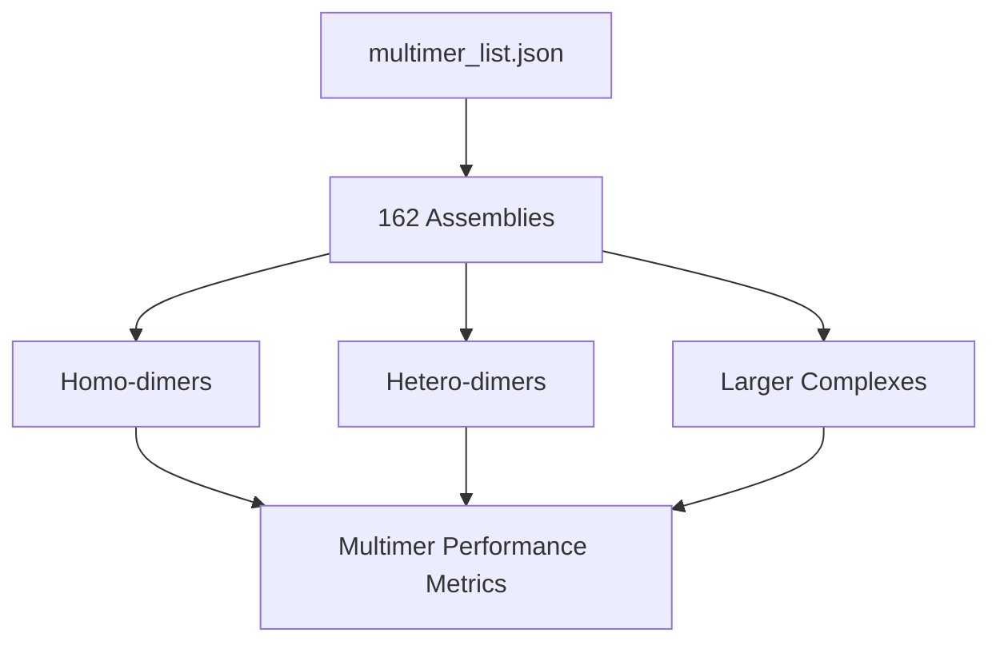
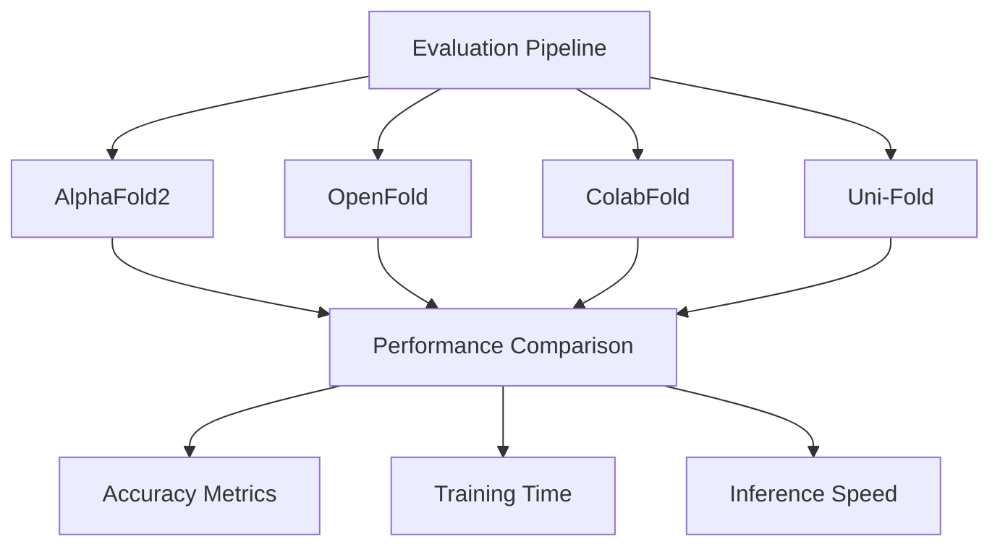
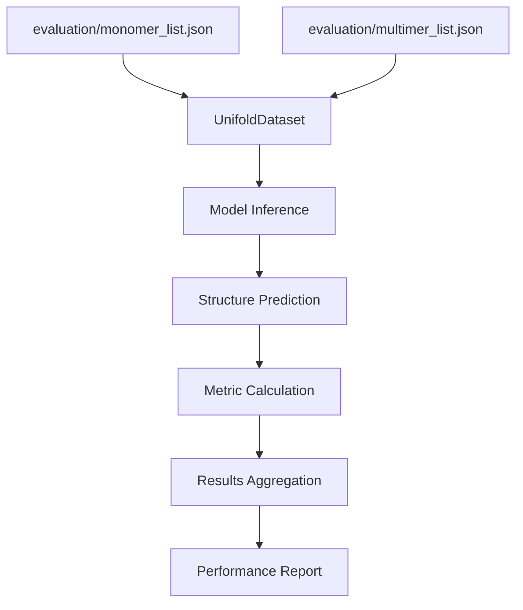

# Evaluation and Benchmarks

> **Relevant source files**
> * [evaluation/README.md](https://github.com/dptech-corp/Uni-Fold/blob/7b55789e/evaluation/README.md?plain=1)
> * [evaluation/monomer_list.json](https://github.com/dptech-corp/Uni-Fold/blob/7b55789e/evaluation/monomer_list.json)
> * [evaluation/multimer_list.json](https://github.com/dptech-corp/Uni-Fold/blob/7b55789e/evaluation/multimer_list.json)
> * [img/accuracy.png](https://github.com/dptech-corp/Uni-Fold/blob/7b55789e/img/accuracy.png)
> * [img/case.png](https://github.com/dptech-corp/Uni-Fold/blob/7b55789e/img/case.png)
> * [img/train_time.png](https://github.com/dptech-corp/Uni-Fold/blob/7b55789e/img/train_time.png)

This page covers the evaluation methodology, benchmark datasets, and performance results for Uni-Fold models. It details how to assess model accuracy, compare against baselines, and reproduce evaluation results.

For information about training models, see [Training and Fine-tuning](/dptech-corp/Uni-Fold/6-training-and-fine-tuning). For model architecture details, see [Model Architecture](/dptech-corp/Uni-Fold/5-model-architecture).

## Evaluation Datasets

Uni-Fold is evaluated on recently released Protein Data Bank (PDB) structures to ensure fair comparison with other methods. The evaluation framework uses two distinct datasets for different prediction tasks.

### Monomer Evaluation Set

The monomer evaluation dataset contains 876 chains representing 301 unique protein sequences. Chains with identical sequences but slightly different structures are grouped together to avoid data leakage and provide comprehensive structure assessment.



The dataset structure groups chains as follows:

* Identical sequences with structural variations are clustered
* Each group represents one unique protein target
* Multiple PDB entries per group enable structure diversity assessment

### Multimer Evaluation Set

The multimer evaluation dataset comprises 162 protein assemblies covering various types of protein complexes including homo-dimers, hetero-dimers, and larger assemblies.



Sources: [evaluation/README.md L1-L6](https://github.com/dptech-corp/Uni-Fold/blob/7b55789e/evaluation/README.md?plain=1#L1-L6)

 [evaluation/monomer_list.json L1-L10](https://github.com/dptech-corp/Uni-Fold/blob/7b55789e/evaluation/monomer_list.json#L1-L10)

 [evaluation/multimer_list.json L1-L10](https://github.com/dptech-corp/Uni-Fold/blob/7b55789e/evaluation/multimer_list.json#L1-L10)

## Evaluation Methodology

### Metrics and Scoring

Uni-Fold evaluation employs standard protein structure prediction metrics to ensure compatibility with established benchmarks:

* **GDT-TS (Global Distance Test - Total Score)**: Primary accuracy metric
* **LDDT (Local Distance Difference Test)**: Local structure quality assessment
* **RMSD (Root Mean Square Deviation)**: Structural deviation measurement
* **Confidence Scores**: Model uncertainty quantification

### Comparison Framework

The evaluation framework compares Uni-Fold against several baseline methods:



The comparison methodology ensures:

* Same evaluation datasets across all methods
* Consistent metric calculations
* Fair computational resource allocation
* Reproducible experimental conditions

Sources: [evaluation/README.md L3-L5](https://github.com/dptech-corp/Uni-Fold/blob/7b55789e/evaluation/README.md?plain=1#L3-L5)

## Benchmark Results

### Accuracy Performance

The evaluation results demonstrate Uni-Fold's competitive performance across different structure prediction tasks:


Key performance characteristics:

* Comparable accuracy to AlphaFold2 on most targets
* Improved performance on specific protein families
* Consistent results across different structure types
* Reliable confidence score calibration

### Training Efficiency

Uni-Fold achieves significant improvements in training efficiency compared to baseline methods:


Training efficiency benefits include:

* Reduced computational requirements
* Faster convergence during training
* Better resource utilization
* Scalable to larger protein complexes

### Case Studies

Detailed analysis of representative prediction cases illustrates model capabilities:


The case studies highlight:

* Accurate fold prediction for diverse protein types
* Proper handling of domain interfaces
* Correct multimer assembly prediction
* Appropriate confidence score assignment

Sources: [img/accuracy.png L1](https://github.com/dptech-corp/Uni-Fold/blob/7b55789e/img/accuracy.png#L1-L1)

 [img/train_time.png L1](https://github.com/dptech-corp/Uni-Fold/blob/7b55789e/img/train_time.png#L1-L1)

 [img/case.png L1](https://github.com/dptech-corp/Uni-Fold/blob/7b55789e/img/case.png#L1-L1)

## Running Evaluations

### Dataset Preparation

To reproduce evaluation results, prepare the datasets using the provided evaluation lists:

```markdown
# Download evaluation structurespython scripts/download_evaluation_data.py \    --monomer_list evaluation/monomer_list.json \    --multimer_list evaluation/multimer_list.json \    --output_dir evaluation_data/
```

### Evaluation Execution

Run evaluation using the main prediction pipeline with evaluation-specific configurations:



The evaluation process involves:

1. Loading target lists from JSON files
2. Preparing input features for each target
3. Running model inference
4. Computing accuracy metrics
5. Generating comparison reports

### Metric Calculation

Evaluation metrics are computed using standard protein structure comparison tools:

* GDT-TS calculation follows CASP methodology
* LDDT scores use default distance thresholds
* RMSD computed on Cα atoms after optimal superposition
* Confidence scores evaluated against structure quality

Sources: [evaluation/monomer_list.json L1-L588](https://github.com/dptech-corp/Uni-Fold/blob/7b55789e/evaluation/monomer_list.json#L1-L588)

 [evaluation/multimer_list.json L1-L164](https://github.com/dptech-corp/Uni-Fold/blob/7b55789e/evaluation/multimer_list.json#L1-L164)

## Performance Analysis

### Computational Requirements

Evaluation performance characteristics:

* Memory usage scales with protein size
* GPU acceleration recommended for large complexes
* Batch processing supported for multiple targets
* Configurable precision for speed/accuracy trade-offs

### Scalability Considerations

The evaluation framework supports:

* Distributed evaluation across multiple GPUs
* Parallel processing of independent targets
* Memory-efficient handling of large proteins
* Configurable batch sizes for optimal throughput

This evaluation infrastructure ensures reliable assessment of model performance and facilitates comparison with other protein structure prediction methods.