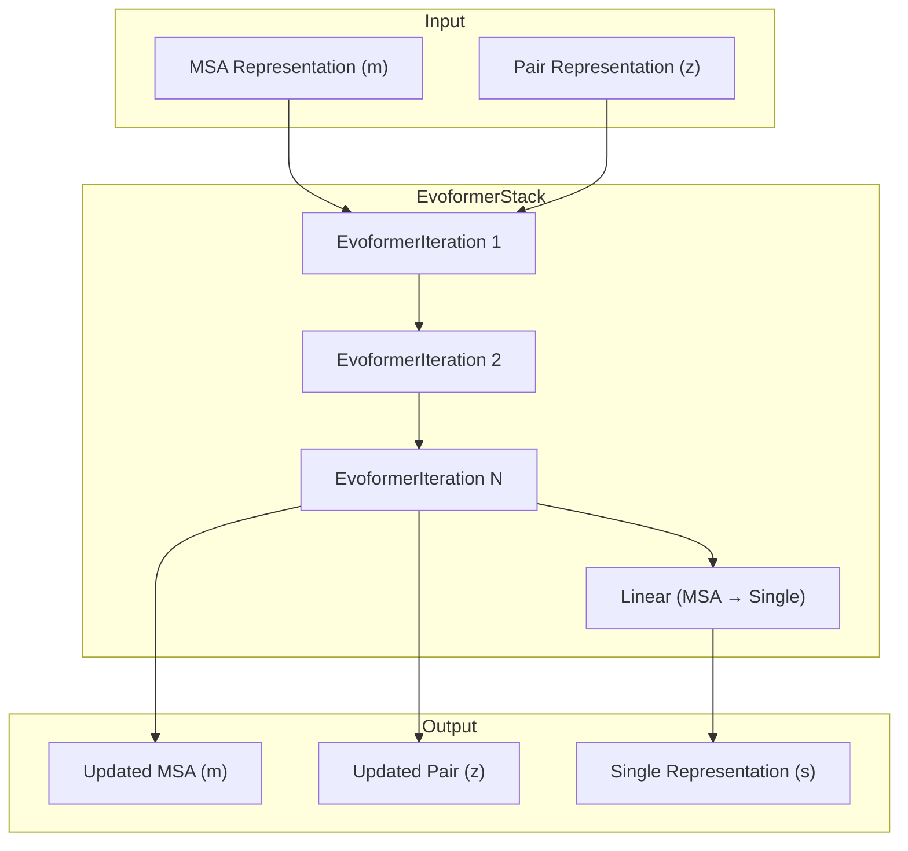
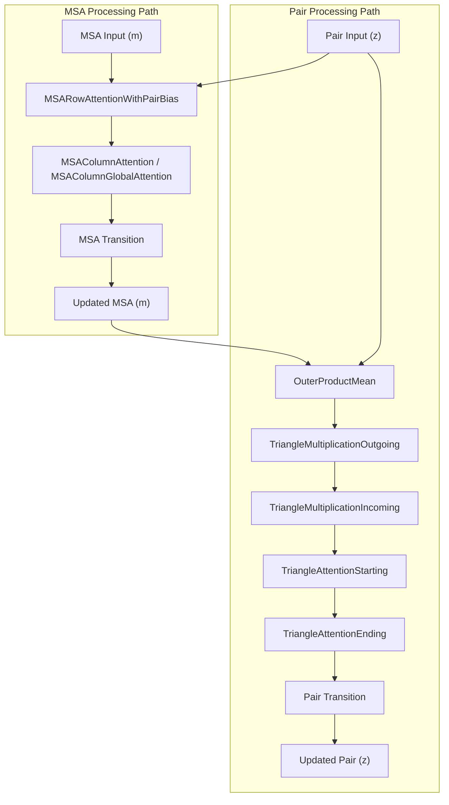
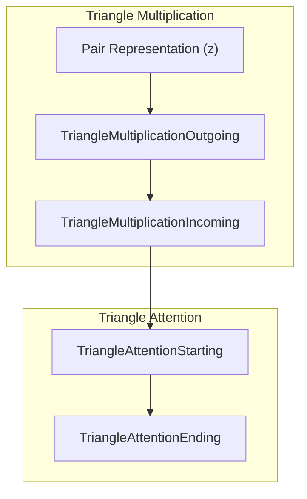
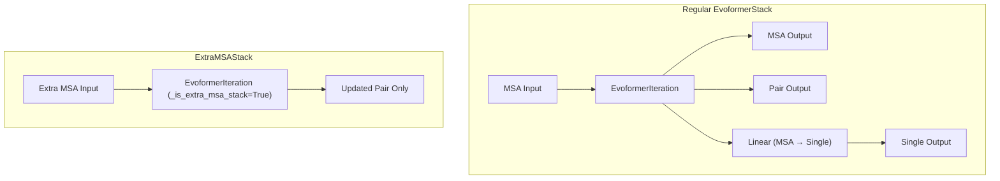

# Evoformer Stack

> **Relevant source files**
> * [unifold/modules/attentions.py](https://github.com/dptech-corp/Uni-Fold/blob/7b55789e/unifold/modules/attentions.py)
> * [unifold/modules/common.py](https://github.com/dptech-corp/Uni-Fold/blob/7b55789e/unifold/modules/common.py)
> * [unifold/modules/evoformer.py](https://github.com/dptech-corp/Uni-Fold/blob/7b55789e/unifold/modules/evoformer.py)
> * [unifold/modules/triangle_multiplication.py](https://github.com/dptech-corp/Uni-Fold/blob/7b55789e/unifold/modules/triangle_multiplication.py)

The Evoformer Stack is the core sequence processing component of Uni-Fold's neural network architecture, responsible for iteratively refining Multiple Sequence Alignment (MSA) and pairwise residue representations through attention mechanisms and geometric reasoning. This module implements the Evoformer algorithm from AlphaFold2, which processes evolutionary information to predict protein structure.

For information about the overall model architecture, see [Core AlphaFold Model](/dptech-corp/Uni-Fold/5.1-core-alphafold-model). For details about structure prediction using the processed representations, see [Structure Module](/dptech-corp/Uni-Fold/5.3-structure-module).

## Architecture Overview

The Evoformer Stack consists of multiple identical iterations that jointly process MSA features and pairwise residue relationships. Each iteration applies a sequence of operations that allow information to flow between sequence positions and different sequences in the MSA.

**Evoformer Stack Architecture**



Sources: [unifold/modules/evoformer.py L214-L307](https://github.com/dptech-corp/Uni-Fold/blob/7b55789e/unifold/modules/evoformer.py#L214-L307)

## EvoformerIteration Components

Each `EvoformerIteration` applies a fixed sequence of operations to process both MSA and pair representations. The iteration follows a specific order designed to maximize information flow while maintaining training stability.

**EvoformerIteration Data Flow**



Sources: [unifold/modules/evoformer.py L29-L212](https://github.com/dptech-corp/Uni-Fold/blob/7b55789e/unifold/modules/evoformer.py#L29-L212)

 [unifold/modules/evoformer.py L116-L211](https://github.com/dptech-corp/Uni-Fold/blob/7b55789e/unifold/modules/evoformer.py#L116-L211)

## Core Operations

### MSA Attention Mechanisms

The Evoformer uses two types of MSA attention to process sequence information:

| Operation | Purpose | Implementation |
| --- | --- | --- |
| `MSARowAttentionWithPairBias` | Cross-sequence attention with pairwise bias | [unifold/modules/attentions.py L252-L261](https://github.com/dptech-corp/Uni-Fold/blob/7b55789e/unifold/modules/attentions.py#L252-L261) |
| `MSAColumnAttention` | Position-wise attention across sequences | [unifold/modules/attentions.py L263-L284](https://github.com/dptech-corp/Uni-Fold/blob/7b55789e/unifold/modules/attentions.py#L263-L284) |
| `MSAColumnGlobalAttention` | Global attention for extra MSA processing | [unifold/modules/attentions.py L286-L341](https://github.com/dptech-corp/Uni-Fold/blob/7b55789e/unifold/modules/attentions.py#L286-L341) |

The row attention incorporates pairwise information through bias terms, allowing the model to consider residue-residue relationships when attending across sequences. Column attention processes each residue position independently across all sequences in the MSA.

Sources: [unifold/modules/evoformer.py L53-L73](https://github.com/dptech-corp/Uni-Fold/blob/7b55789e/unifold/modules/evoformer.py#L53-L73)

 [unifold/modules/attentions.py L252-L284](https://github.com/dptech-corp/Uni-Fold/blob/7b55789e/unifold/modules/attentions.py#L252-L284)

### Triangle Operations

Triangle operations enable reasoning about transitivity in pairwise relationships, implementing the geometric principle that if residues i and j are close, and j and k are close, then i and k should also be considered related.

**Triangle Operations Flow**



Sources: [unifold/modules/evoformer.py L86-L104](https://github.com/dptech-corp/Uni-Fold/blob/7b55789e/unifold/modules/evoformer.py#L86-L104)

 [unifold/modules/triangle_multiplication.py L14-L159](https://github.com/dptech-corp/Uni-Fold/blob/7b55789e/unifold/modules/triangle_multiplication.py#L14-L159)

 [unifold/modules/attentions.py L349-L410](https://github.com/dptech-corp/Uni-Fold/blob/7b55789e/unifold/modules/attentions.py#L349-L410)

### Outer Product Mean

The `OuterProductMean` operation projects information from the MSA representation to the pair representation, creating pairwise features from sequence-level information.

```markdown
# Key operation: MSA → Pair projectionouter = torch.einsum("...bac,...dae->...bdce", a, b)
```

This operation is controlled by the `outer_product_mean_first` parameter, which determines whether it occurs before or after MSA processing within each iteration.

Sources: [unifold/modules/evoformer.py L80-L84](https://github.com/dptech-corp/Uni-Fold/blob/7b55789e/unifold/modules/evoformer.py#L80-L84)

 [unifold/modules/common.py L113-L198](https://github.com/dptech-corp/Uni-Fold/blob/7b55789e/unifold/modules/common.py#L113-L198)

 [unifold/modules/evoformer.py L130-L168](https://github.com/dptech-corp/Uni-Fold/blob/7b55789e/unifold/modules/evoformer.py#L130-L168)

## EvoformerStack Implementation

The `EvoformerStack` class manages multiple `EvoformerIteration` blocks and handles the final projection to single representation.

### Configuration Parameters

| Parameter | Purpose | Typical Value |
| --- | --- | --- |
| `num_blocks` | Number of Evoformer iterations | 48 for main stack |
| `d_msa` | MSA representation dimension | 256 |
| `d_pair` | Pair representation dimension | 128 |
| `num_heads_msa` | MSA attention heads | 8 |
| `num_heads_pair` | Pair attention heads | 4 |

### Gradient Checkpointing

The stack uses `checkpoint_sequential` from unicore to manage memory usage during training by recomputing intermediate activations rather than storing them.

```
m, z = checkpoint_sequential(    blocks,    input=(m, z),)
```

Sources: [unifold/modules/evoformer.py L295-L298](https://github.com/dptech-corp/Uni-Fold/blob/7b55789e/unifold/modules/evoformer.py#L295-L298)

 [unifold/modules/evoformer.py L215-L266](https://github.com/dptech-corp/Uni-Fold/blob/7b55789e/unifold/modules/evoformer.py#L215-L266)

## ExtraMSAStack Variant

The `ExtraMSAStack` is a specialized variant designed for processing additional MSA sequences that don't fit in the main MSA due to memory constraints.

### Key Differences

1. **Global Attention**: Uses `MSAColumnGlobalAttention` instead of regular column attention
2. **No Single Output**: Does not produce a single representation
3. **Pair-Only Processing**: Focuses solely on updating pair representations

**ExtraMSAStack vs EvoformerStack**



Sources: [unifold/modules/evoformer.py L310-L375](https://github.com/dptech-corp/Uni-Fold/blob/7b55789e/unifold/modules/evoformer.py#L310-L375)

 [unifold/modules/evoformer.py L60-L67](https://github.com/dptech-corp/Uni-Fold/blob/7b55789e/unifold/modules/evoformer.py#L60-L67)

 [unifold/modules/evoformer.py L146-L159](https://github.com/dptech-corp/Uni-Fold/blob/7b55789e/unifold/modules/evoformer.py#L146-L159)

## Memory Optimization

The Evoformer Stack includes several memory optimization strategies:

### Chunking Support

All operations support chunking via `chunk_size` parameters to process large inputs in smaller batches, reducing peak memory usage.

### Block Size Operations

Triangle operations support `block_size` parameters for 2D chunking of pair representations, particularly important for long sequences.

### Dropout and Residual Patterns

The implementation uses specialized residual functions that optimize memory usage during training:

* `bias_dropout_residual` for attention operations
* `tri_mul_residual` for triangle multiplication operations
* `residual` for standard residual connections

Sources: [unifold/modules/evoformer.py L126-L127](https://github.com/dptech-corp/Uni-Fold/blob/7b55789e/unifold/modules/evoformer.py#L126-L127)

 [unifold/modules/common.py L229-L292](https://github.com/dptech-corp/Uni-Fold/blob/7b55789e/unifold/modules/common.py#L229-L292)

 [unifold/modules/triangle_multiplication.py L30-L107](https://github.com/dptech-corp/Uni-Fold/blob/7b55789e/unifold/modules/triangle_multiplication.py#L30-L107)