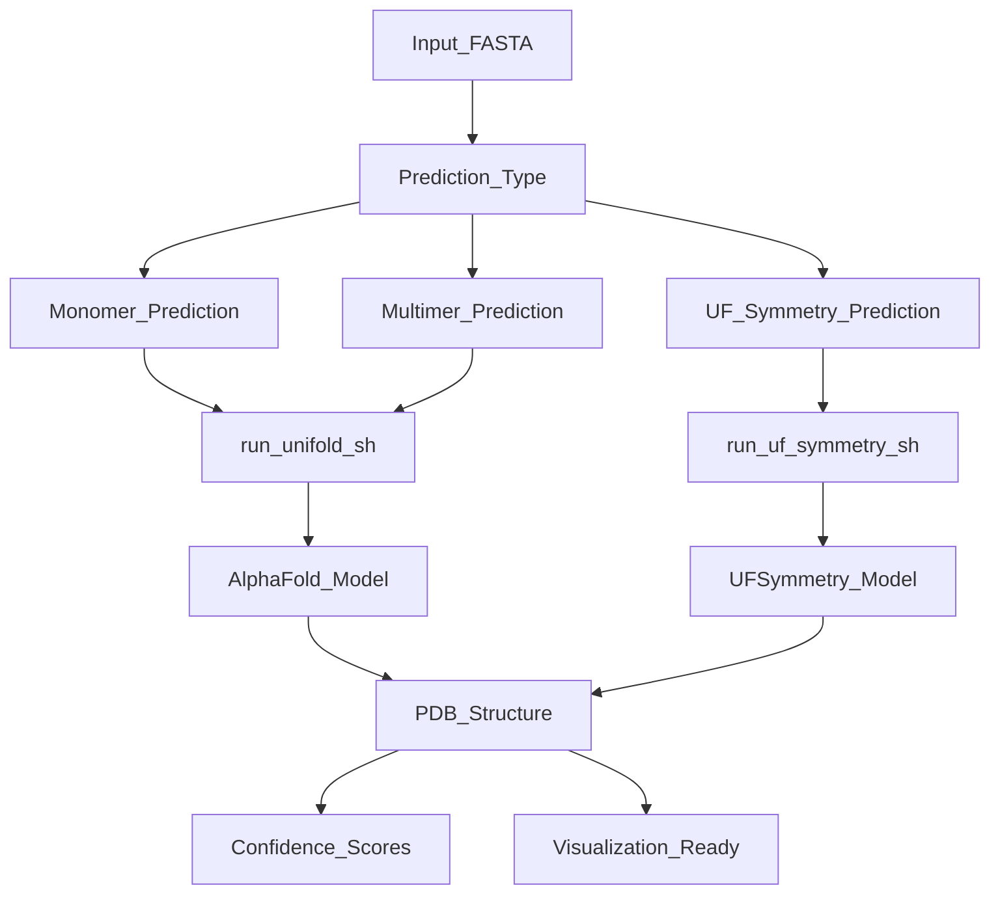
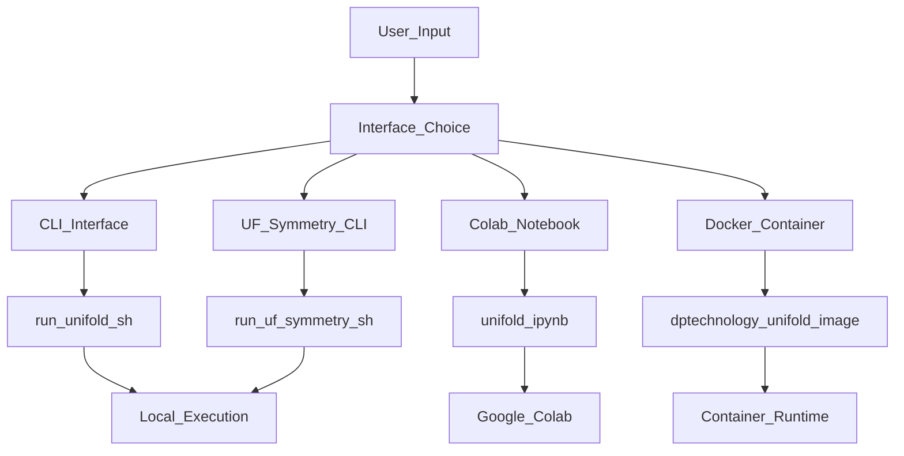
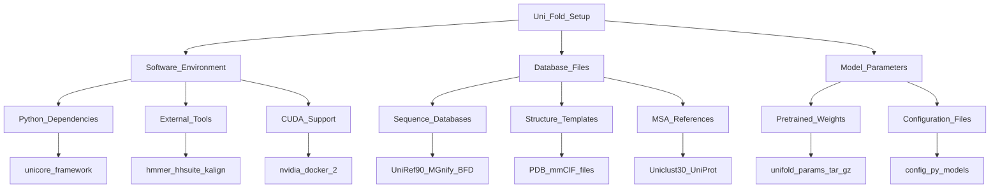
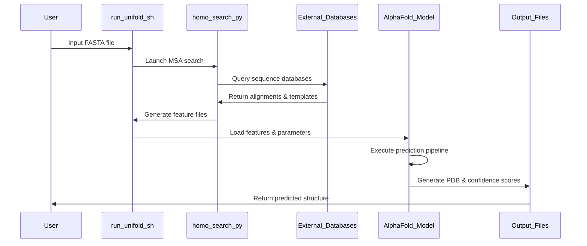
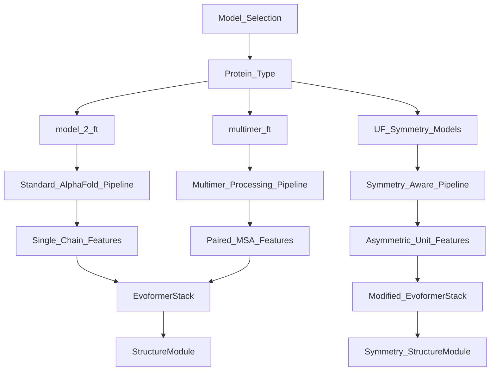

# Getting Started

> **Relevant source files**
> * [.github/workflows/docker.yml](https://github.com/dptech-corp/Uni-Fold/blob/7b55789e/.github/workflows/docker.yml)
> * [README.md](https://github.com/dptech-corp/Uni-Fold/blob/7b55789e/README.md?plain=1)
> * [docker/Dockerfile](https://github.com/dptech-corp/Uni-Fold/blob/7b55789e/docker/Dockerfile)
> * [setup.py](https://github.com/dptech-corp/Uni-Fold/blob/7b55789e/setup.py)

This document provides an overview of how to begin using Uni-Fold for protein structure prediction. It covers the basic workflow, available interfaces, and essential setup requirements. For detailed installation instructions, see [Installation and Setup](/dptech-corp/Uni-Fold/2.1-installation-and-setup). For hands-on examples, see [Quick Start Guide](/dptech-corp/Uni-Fold/2.2-quick-start-guide). For containerized deployment, see [Docker Deployment](/dptech-corp/Uni-Fold/2.3-docker-deployment).

Uni-Fold is an open-source protein structure prediction platform that reimplements and extends AlphaFold in PyTorch. It supports monomer prediction, multimer prediction, and specialized symmetric complex prediction through UF-Symmetry. The platform provides multiple interfaces including command-line tools, Jupyter notebooks, and Docker containers.

## Core Capabilities Overview

Uni-Fold provides three main prediction modes, each optimized for different types of protein structures:



**Workflow Components:**

* **Monomer Prediction**: Single protein chain folding using standard AlphaFold architecture
* **Multimer Prediction**: Multi-chain protein complex prediction with inter-chain modeling
* **UF-Symmetry**: Efficient prediction of large symmetric protein assemblies

Sources: [README.md L20-L27](https://github.com/dptech-corp/Uni-Fold/blob/7b55789e/README.md?plain=1#L20-L27)

 [README.md L125-L141](https://github.com/dptech-corp/Uni-Fold/blob/7b55789e/README.md?plain=1#L125-L141)

 [README.md L260-L282](https://github.com/dptech-corp/Uni-Fold/blob/7b55789e/README.md?plain=1#L260-L282)

## Available Interfaces

Uni-Fold provides multiple ways to access its prediction capabilities, each suited for different use cases:

### Interface Options

| Interface | Best For | Key Script/File | Deployment |
| --- | --- | --- | --- |
| Command Line | Batch processing, automation | `run_unifold.sh` | Local/server |
| Colab Notebook | Interactive exploration, learning | `notebooks/unifold.ipynb` | Cloud-based |
| Docker Container | Reproducible environments | `docker/Dockerfile` | Any platform |
| UF-Symmetry CLI | Large symmetric complexes | `run_uf_symmetry.sh` | Local/server |



**Interface Details:**

* **CLI**: Direct script execution for production workflows
* **Colab**: Web-based notebook with guided examples and visualizations
* **Docker**: Consistent environment with all dependencies pre-installed
* **UF-Symmetry**: Specialized interface for symmetric protein complexes

Sources: [README.md L76-L88](https://github.com/dptech-corp/Uni-Fold/blob/7b55789e/README.md?plain=1#L76-L88)

 [README.md L125-L139](https://github.com/dptech-corp/Uni-Fold/blob/7b55789e/README.md?plain=1#L125-L139)

 [README.md L269-L281](https://github.com/dptech-corp/Uni-Fold/blob/7b55789e/README.md?plain=1#L269-L281)

 [.github/workflows/docker.yml L28-L33](https://github.com/dptech-corp/Uni-Fold/blob/7b55789e/.github/workflows/docker.yml#L28-L33)

## Essential Requirements

Before running Uni-Fold, you need three core components:

### Prerequisites



**Component Requirements:**

* **Software**: Uni-Core framework, PyTorch, external bioinformatics tools
* **Databases**: ~3TB storage for sequence and structure databases
* **Parameters**: Pre-trained model weights (~1.5GB per model)

Sources: [README.md L69-L99](https://github.com/dptech-corp/Uni-Fold/blob/7b55789e/README.md?plain=1#L69-L99)

 [README.md L101-L109](https://github.com/dptech-corp/Uni-Fold/blob/7b55789e/README.md?plain=1#L101-L109)

 [docker/Dockerfile L12-L24](https://github.com/dptech-corp/Uni-Fold/blob/7b55789e/docker/Dockerfile#L12-L24)

## Basic Workflow

The typical Uni-Fold prediction workflow follows these steps:

### Standard Prediction Process



**Process Steps:**

1. **Input Preparation**: Provide protein sequence(s) in FASTA format
2. **Homology Search**: Generate multiple sequence alignments and structural templates
3. **Feature Processing**: Convert raw data into model-ready features
4. **Model Inference**: Run neural network prediction pipeline
5. **Output Generation**: Produce PDB files and confidence metrics

Sources: [README.md L127-L145](https://github.com/dptech-corp/Uni-Fold/blob/7b55789e/README.md?plain=1#L127-L145)

## Model Selection

Uni-Fold provides different model variants optimized for specific use cases:

### Available Models

| Model Name | Purpose | Architecture | Best For |
| --- | --- | --- | --- |
| `model_2_ft` | Monomer prediction | Standard AlphaFold | Single protein chains |
| `multimer_ft` | Complex prediction | AlphaFold-Multimer | Protein-protein interactions |
| UF-Symmetry models | Symmetric assemblies | Modified architecture | Large symmetric complexes |



**Model Characteristics:**

* **Monomer models**: Optimized for single-chain protein folding
* **Multimer models**: Handle inter-chain interactions and complex assembly
* **UF-Symmetry models**: Exploit symmetry for computational efficiency

Sources: [README.md L108-L109](https://github.com/dptech-corp/Uni-Fold/blob/7b55789e/README.md?plain=1#L108-L109)

 [README.md L240-L241](https://github.com/dptech-corp/Uni-Fold/blob/7b55789e/README.md?plain=1#L240-L241)

 [README.md L262-L267](https://github.com/dptech-corp/Uni-Fold/blob/7b55789e/README.md?plain=1#L262-L267)

## Quick Start Command Examples

Here are the essential commands to get started with each interface:

### Basic Prediction Commands

```markdown
# Monomer predictionbash run_unifold.sh \    input.fasta \    output_dir/ \    database_dir/ \    2020-05-01 \    model_2_ft \    model_parameters.pt # Multimer prediction  bash run_unifold.sh \    complex.fasta \    output_dir/ \    database_dir/ \    2020-05-01 \    multimer_ft \    multimer_parameters.pt # Symmetric complex predictionbash run_uf_symmetry.sh \    asymmetric_unit.fasta \    C3 \    output_dir/ \    database_dir/ \    2020-05-01 \    uf_symmetry_parameters.pt
```

Sources: [README.md L129-L139](https://github.com/dptech-corp/Uni-Fold/blob/7b55789e/README.md?plain=1#L129-L139)

 [README.md L271-L279](https://github.com/dptech-corp/Uni-Fold/blob/7b55789e/README.md?plain=1#L271-L279)

## Next Steps

To begin using Uni-Fold:

1. **Installation**: Follow the detailed setup instructions in [Installation and Setup](/dptech-corp/Uni-Fold/2.1-installation-and-setup)
2. **Quick Examples**: Try the hands-on examples in [Quick Start Guide](/dptech-corp/Uni-Fold/2.2-quick-start-guide)
3. **Docker Setup**: Use containerized deployment via [Docker Deployment](/dptech-corp/Uni-Fold/2.3-docker-deployment)
4. **Advanced Features**: Explore specialized capabilities in [UF-Symmetry System](/dptech-corp/Uni-Fold/7.1-uf-symmetry-system) and [Multimer Prediction](/dptech-corp/Uni-Fold/7.2-multimer-prediction)

For training custom models, see [Training and Fine-tuning](/dptech-corp/Uni-Fold/6-training-and-fine-tuning). For detailed architecture information, see [Model Architecture](/dptech-corp/Uni-Fold/5-model-architecture).

Sources: [README.md L69-L145](https://github.com/dptech-corp/Uni-Fold/blob/7b55789e/README.md?plain=1#L69-L145)

 [README.md L146-L259](https://github.com/dptech-corp/Uni-Fold/blob/7b55789e/README.md?plain=1#L146-L259)

 [README.md L260-L282](https://github.com/dptech-corp/Uni-Fold/blob/7b55789e/README.md?plain=1#L260-L282)