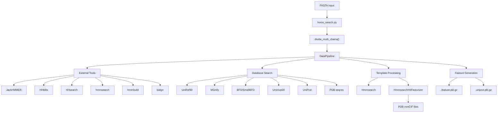
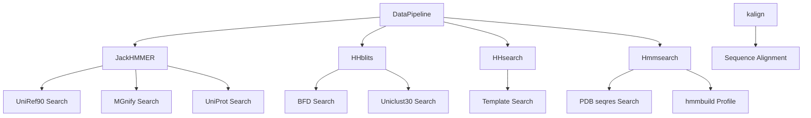
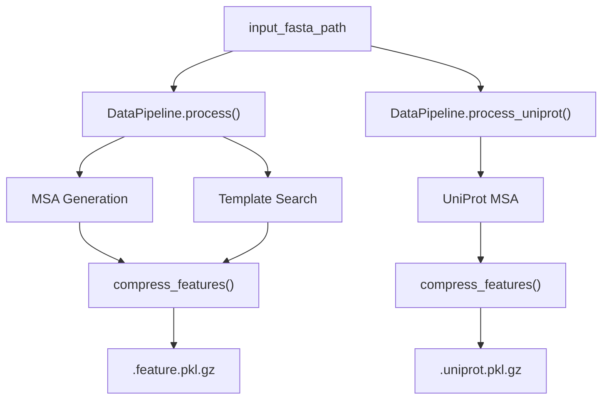
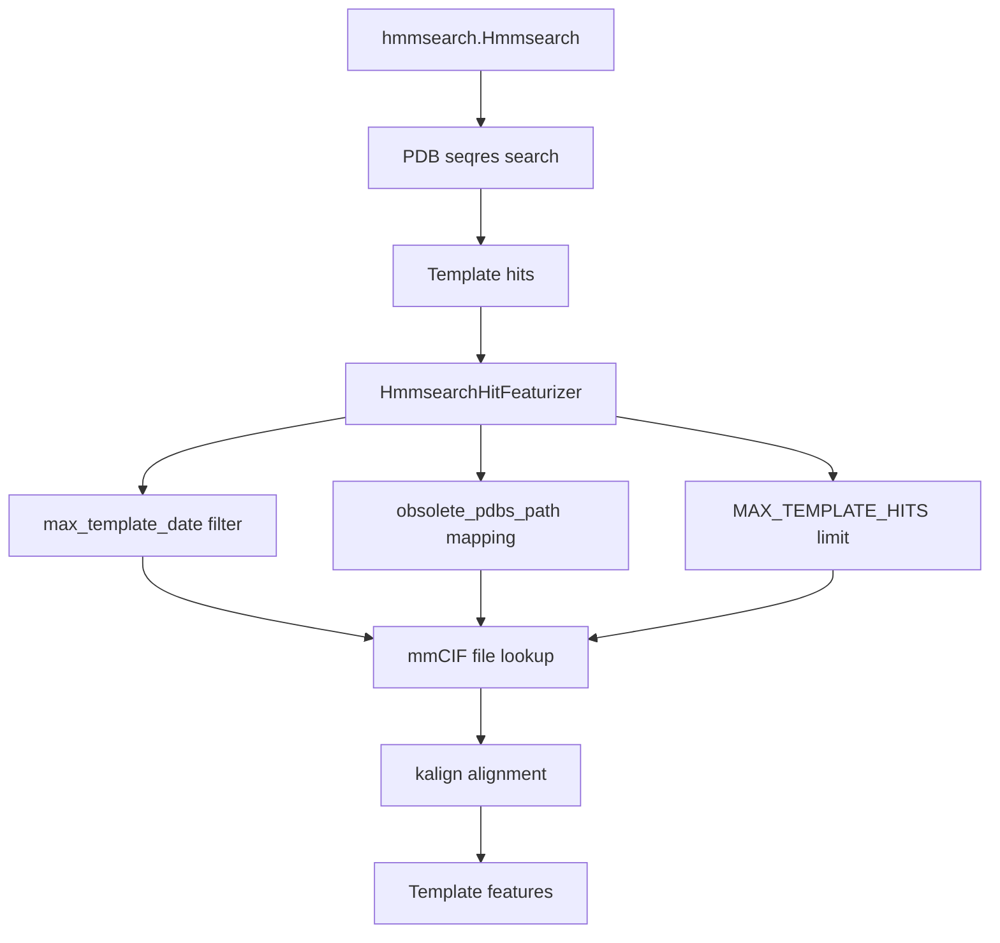
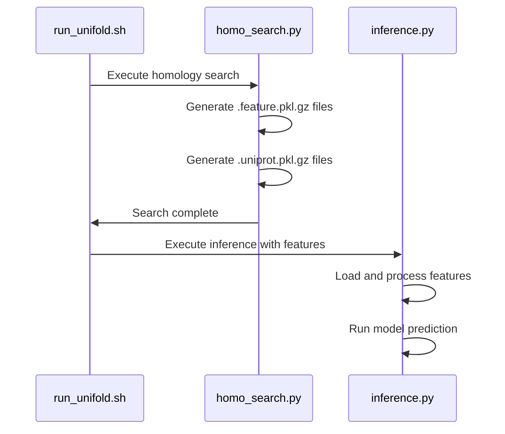

# Homology Search and MSA Generation

> **Relevant source files**
> * [LICENSE](https://github.com/dptech-corp/Uni-Fold/blob/7b55789e/LICENSE)
> * [run_unifold.sh](https://github.com/dptech-corp/Uni-Fold/blob/7b55789e/run_unifold.sh)
> * [scripts/download/download_all_data.sh](https://github.com/dptech-corp/Uni-Fold/blob/7b55789e/scripts/download/download_all_data.sh)
> * [scripts/download/download_pdb70.sh](https://github.com/dptech-corp/Uni-Fold/blob/7b55789e/scripts/download/download_pdb70.sh)
> * [unifold/homo_search.py](https://github.com/dptech-corp/Uni-Fold/blob/7b55789e/unifold/homo_search.py)

This document covers the homology search and multiple sequence alignment (MSA) generation system in Uni-Fold, which is the first stage of the data pipeline that processes input protein sequences into model-ready features. This system searches external databases to find homologous sequences and structural templates that inform the protein folding predictions.

For information about loading and processing the generated features, see [Data Loading and Processing](/dptech-corp/Uni-Fold/4.2-data-loading-and-processing). For details about template processing and mmCIF handling, see [mmCIF and Template Processing](/dptech-corp/Uni-Fold/4.3-mmcif-and-template-processing).

## Overview

The homology search and MSA generation system takes protein sequences in FASTA format and performs comprehensive database searches to create multiple sequence alignments and identify structural templates. The system outputs compressed feature files that contain all the evolutionary and structural information needed by the Uni-Fold model.

## System Architecture

**Sources:** [unifold/homo_search.py L1-L314](https://github.com/dptech-corp/Uni-Fold/blob/7b55789e/unifold/homo_search.py#L1-L314)

 [run_unifold.sh L9-L21](https://github.com/dptech-corp/Uni-Fold/blob/7b55789e/run_unifold.sh#L9-L21)

## Core Components

### Main Entry Point

The `homo_search.py` script serves as the primary entry point for homology search operations. It handles command-line arguments for database paths, external tool locations, and output directories.

Key functions:

* `main()` - Orchestrates the entire search process [unifold/homo_search.py L209-L313](https://github.com/dptech-corp/Uni-Fold/blob/7b55789e/unifold/homo_search.py#L209-L313)
* `generate_pkl_features()` - Processes individual protein chains [unifold/homo_search.py L151-L207](https://github.com/dptech-corp/Uni-Fold/blob/7b55789e/unifold/homo_search.py#L151-L207)
* `_check_flag()` - Validates configuration flags [unifold/homo_search.py L142-L148](https://github.com/dptech-corp/Uni-Fold/blob/7b55789e/unifold/homo_search.py#L142-L148)

The script supports both single-chain and multi-chain protein inputs, automatically dividing multi-chain FASTA files using `divide_multi_chains()` from the MSA utilities.

**Sources:** [unifold/homo_search.py L39-L137](https://github.com/dptech-corp/Uni-Fold/blob/7b55789e/unifold/homo_search.py#L39-L137)

 [unifold/homo_search.py L209-L313](https://github.com/dptech-corp/Uni-Fold/blob/7b55789e/unifold/homo_search.py#L209-L313)

### Database Configuration

The system supports two database presets controlled by the `db_preset` flag:

| Preset | BFD Database | Uniclust30 | Use Case |
| --- | --- | --- | --- |
| `full_dbs` | Full BFD | Yes | Maximum accuracy, requires ~2TB storage |
| `reduced_dbs` | Small BFD | No | Faster execution, reduced storage requirements |

**Sources:** [unifold/homo_search.py L119-L125](https://github.com/dptech-corp/Uni-Fold/blob/7b55789e/unifold/homo_search.py#L119-L125)

 [unifold/homo_search.py L227-L232](https://github.com/dptech-corp/Uni-Fold/blob/7b55789e/unifold/homo_search.py#L227-L232)

### External Tool Integration

The system requires six external bioinformatics tools, which are automatically detected or can be explicitly specified:

* **JackHMMER**: Searches UniRef90, MGnify, and UniProt databases for homologous sequences
* **HHblits**: Searches BFD and Uniclust30 databases using HMM-HMM comparison
* **HHsearch**: Performs template searches against PDB70 database
* **hmmsearch/hmmbuild**: Searches PDB seqres database for template identification
* **kalign**: Performs multiple sequence alignment of identified homologs

**Sources:** [unifold/homo_search.py L50-L69](https://github.com/dptech-corp/Uni-Fold/blob/7b55789e/unifold/homo_search.py#L50-L69)

 [unifold/homo_search.py L213-L225](https://github.com/dptech-corp/Uni-Fold/blob/7b55789e/unifold/homo_search.py#L213-L225)

## Data Processing Pipeline

### Pipeline Orchestration

The `DataPipeline` class coordinates all search and featurization operations:

The pipeline creates two types of output files:

* **Feature files** (`.feature.pkl.gz`): Contains MSAs from all databases plus template information
* **UniProt files** (`.uniprot.pkl.gz`): Contains additional UniProt-specific MSA data

**Sources:** [unifold/homo_search.py L249-L262](https://github.com/dptech-corp/Uni-Fold/blob/7b55789e/unifold/homo_search.py#L249-L262)

 [unifold/homo_search.py L177-L200](https://github.com/dptech-corp/Uni-Fold/blob/7b55789e/unifold/homo_search.py#L177-L200)

### Template Processing System

The template processing system identifies and processes structural templates:

1. **Template Search**: Uses `Hmmsearch` to find PDB structures similar to the query sequence
2. **Hit Filtering**: Applies date constraints and removes obsolete entries
3. **Feature Generation**: `HmmsearchHitFeaturizer` processes mmCIF files and creates template features
4. **Alignment**: Uses kalign to align query sequence with template structures

**Sources:** [unifold/homo_search.py L234-L247](https://github.com/dptech-corp/Uni-Fold/blob/7b55789e/unifold/homo_search.py#L234-L247)

 [unifold/homo_search.py L139](https://github.com/dptech-corp/Uni-Fold/blob/7b55789e/unifold/homo_search.py#L139-L139)

## Configuration and Usage

### Required Parameters

The following parameters must be provided when running homology search:

| Parameter | Purpose | Example |
| --- | --- | --- |
| `fasta_path` | Input protein sequence | `protein.fasta` |
| `output_dir` | Results directory | `./output` |
| `uniref90_database_path` | UniRef90 database | `uniref90/uniref90.fasta` |
| `mgnify_database_path` | MGnify database | `mgnify/mgy_clusters_2018_12.fa` |
| `template_mmcif_dir` | PDB structures | `pdb_mmcif/mmcif_files` |
| `max_template_date` | Template cutoff date | `2020-05-14` |
| `obsolete_pdbs_path` | PDB obsolete mapping | `pdb_mmcif/obsolete.dat` |

**Sources:** [unifold/homo_search.py L301-L310](https://github.com/dptech-corp/Uni-Fold/blob/7b55789e/unifold/homo_search.py#L301-L310)

 [run_unifold.sh L13-L20](https://github.com/dptech-corp/Uni-Fold/blob/7b55789e/run_unifold.sh#L13-L20)

### Multi-Chain Handling

For input FASTA files containing multiple protein chains, the system automatically:

1. Parses the multi-chain FASTA file using `parsers.parse_fasta()`
2. Calls `divide_multi_chains()` to create individual chain files
3. Processes each chain independently
4. Creates a `chains.txt` file listing the chain order

This enables support for protein complexes while maintaining individual chain MSA generation.

**Sources:** [unifold/homo_search.py L266-L282](https://github.com/dptech-corp/Uni-Fold/blob/7b55789e/unifold/homo_search.py#L266-L282)

### Performance Optimizations

The system includes several features to improve performance and reliability:

* **Precomputed MSA support**: Reuses existing MSA files when `use_precomputed_msas=True`
* **Compressed output**: Uses gzip compression for feature files to reduce storage
* **Timing tracking**: Records and outputs timing information for each processing step
* **Automatic tool detection**: Uses `shutil.which()` to locate external binaries

**Sources:** [unifold/homo_search.py L126-L134](https://github.com/dptech-corp/Uni-Fold/blob/7b55789e/unifold/homo_search.py#L126-L134)

 [unifold/homo_search.py L175-L182](https://github.com/dptech-corp/Uni-Fold/blob/7b55789e/unifold/homo_search.py#L175-L182)

 [unifold/homo_search.py L202-L206](https://github.com/dptech-corp/Uni-Fold/blob/7b55789e/unifold/homo_search.py#L202-L206)

## Integration with Main Pipeline

The homology search system integrates with the broader Uni-Fold pipeline through the main execution script:

The main script `run_unifold.sh` first calls `homo_search.py` to generate features, then proceeds to model inference using the generated feature files.

**Sources:** [run_unifold.sh L8-L31](https://github.com/dptech-corp/Uni-Fold/blob/7b55789e/run_unifold.sh#L8-L31)