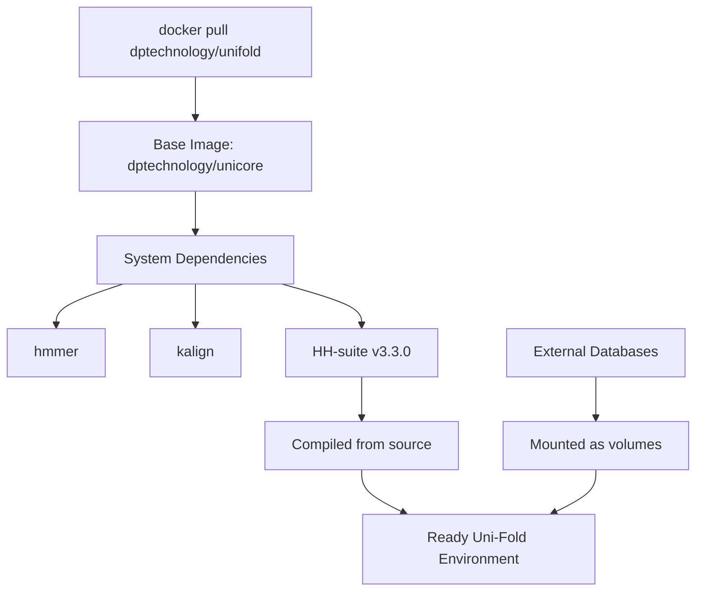
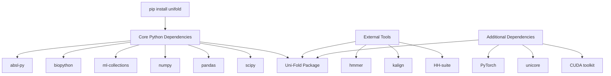
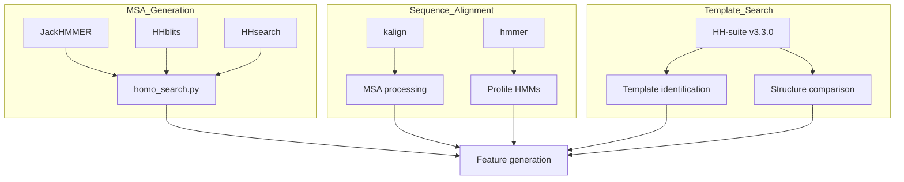
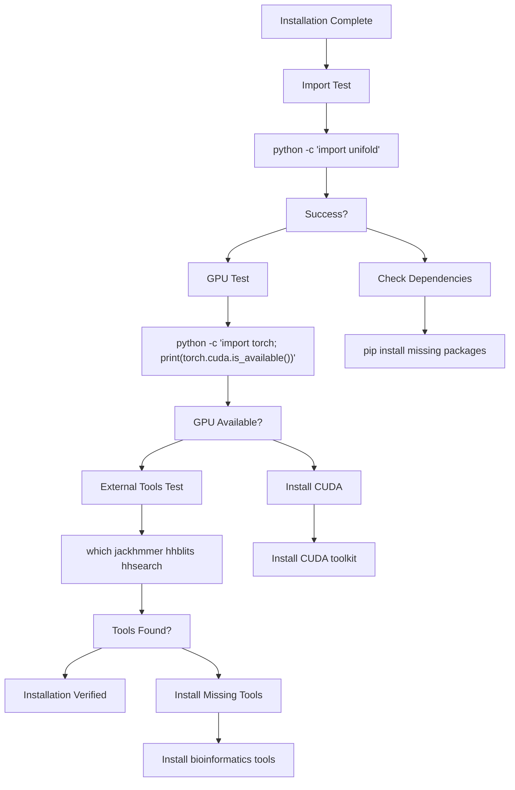

# Installation and Setup

> **Relevant source files**
> * [.github/workflows/docker.yml](https://github.com/dptech-corp/Uni-Fold/blob/7b55789e/.github/workflows/docker.yml)
> * [docker/Dockerfile](https://github.com/dptech-corp/Uni-Fold/blob/7b55789e/docker/Dockerfile)
> * [setup.py](https://github.com/dptech-corp/Uni-Fold/blob/7b55789e/setup.py)

This document covers the installation and configuration of Uni-Fold, including system requirements, dependency management, and deployment options. It focuses on getting a working Uni-Fold environment ready for protein structure prediction.

For information about using the installed system, see [Quick Start Guide](/dptech-corp/Uni-Fold/2.2-quick-start-guide). For Docker-specific deployment strategies, see [Docker Deployment](/dptech-corp/Uni-Fold/2.3-docker-deployment).

## System Requirements

Uni-Fold requires a Linux environment with CUDA support for optimal performance. The system is designed to work with the following specifications:

| Component | Requirement | Notes |
| --- | --- | --- |
| Operating System | Linux (POSIX-compliant) | Ubuntu 18.04+ recommended |
| Python Version | 3.6 - 3.10 | Python 3.8+ preferred |
| CUDA | 11.3+ | For GPU acceleration |
| Memory | 16GB+ RAM | 32GB+ for large proteins |
| Storage | 100GB+ | For databases and models |

Sources: [setup.py L42-L47](https://github.com/dptech-corp/Uni-Fold/blob/7b55789e/setup.py#L42-L47)

## Installation Methods

### Docker Installation (Recommended)

The simplest way to install Uni-Fold is using the pre-built Docker image, which includes all dependencies and external tools.



**Docker Installation Process**

```markdown
# Pull the official Uni-Fold Docker imagedocker pull dptechnology/unifold:latest-pytorch1.11.0-cuda11.3 # Run with GPU support and volume mountsdocker run --gpus all -v /path/to/databases:/data -v /path/to/output:/output dptechnology/unifold
```

The Docker image provides a complete environment with all dependencies pre-installed and configured.

Sources: [docker/Dockerfile L1-L31](https://github.com/dptech-corp/Uni-Fold/blob/7b55789e/docker/Dockerfile#L1-L31)

 [.github/workflows/docker.yml L33](https://github.com/dptech-corp/Uni-Fold/blob/7b55789e/.github/workflows/docker.yml#L33-L33)

### Python Package Installation

For users who prefer to manage their own environment, Uni-Fold can be installed as a Python package.



**Installation Steps**

1. **Install core package:**

```
pip install unifold
```

1. **Install PyTorch with CUDA support:**

```
pip install torch torchvision torchaudio --index-url https://download.pytorch.org/whl/cu118
```

1. **Install unicore framework:**

```
pip install unicore
```

Sources: [setup.py L30-L37](https://github.com/dptech-corp/Uni-Fold/blob/7b55789e/setup.py#L30-L37)

### From Source Installation

For development or customization, install directly from the GitHub repository.

```markdown
# Clone the repositorygit clone https://github.com/dptech-corp/Uni-Fold.gitcd Uni-Fold # Install in development modepip install -e .
```

Sources: [setup.py L19-L50](https://github.com/dptech-corp/Uni-Fold/blob/7b55789e/setup.py#L19-L50)

## External Dependencies Setup

Uni-Fold requires several external bioinformatics tools that must be installed separately from the Python package.



### Required External Tools

| Tool | Purpose | Installation |
| --- | --- | --- |
| `hmmer` | Sequence searching and alignment | `apt install hmmer` |
| `kalign` | Multiple sequence alignment | `apt install kalign` |
| `HH-suite` | Homology detection and structure prediction | Compile from source |

### HH-suite Compilation

HH-suite must be compiled from source for optimal performance:

```javascript
# Download and compile HH-suite v3.3.0git clone --branch v3.3.0 https://github.com/soedinglab/hh-suite.gitcd hh-suitemkdir build && cd buildcmake -DCMAKE_INSTALL_PREFIX=/opt/hhsuite ..make -j 4 && make install # Add to PATHexport PATH="/opt/hhsuite/bin:$PATH"
```

Sources: [docker/Dockerfile L16-L24](https://github.com/dptech-corp/Uni-Fold/blob/7b55789e/docker/Dockerfile#L16-L24)

## Environment Configuration

### CUDA and GPU Setup

Ensure CUDA drivers and toolkit are properly installed:

```javascript
# Check CUDA installationnvidia-sminvcc --version # Verify PyTorch CUDA supportpython -c "import torch; print(torch.cuda.is_available())"
```

### Memory and Performance Tuning

For optimal performance, configure system memory settings:

```markdown
# Increase shared memory for large datasetsecho 'kernel.shmmax = 68719476736' >> /etc/sysctl.confecho 'kernel.shmall = 4294967296' >> /etc/sysctl.conf
```

## Installation Verification

Verify your Uni-Fold installation with these tests:



### Basic Import Test

```javascript
python -c "import unifoldfrom unifold.model import modelfrom unifold.data import pipelineprint('Uni-Fold installation successful')"
```

### GPU Verification

```javascript
python -c "import torchprint(f'CUDA available: {torch.cuda.is_available()}')print(f'CUDA devices: {torch.cuda.device_count()}')if torch.cuda.is_available():    print(f'Current device: {torch.cuda.get_device_name()}')"
```

### External Tools Check

```php
# Verify all required tools are in PATHfor tool in jackhmmer hhblits hhsearch kalign; do    if command -v $tool >/dev/null 2>&1; then        echo "$tool: OK"    else        echo "$tool: MISSING"    fidone
```

Sources: [setup.py L20-L50](https://github.com/dptech-corp/Uni-Fold/blob/7b55789e/setup.py#L20-L50)

 [docker/Dockerfile L12-L30](https://github.com/dptech-corp/Uni-Fold/blob/7b55789e/docker/Dockerfile#L12-L30)

The installation is complete when all tests pass successfully. You can now proceed to the [Quick Start Guide](/dptech-corp/Uni-Fold/2.2-quick-start-guide) to begin using Uni-Fold for protein structure prediction.