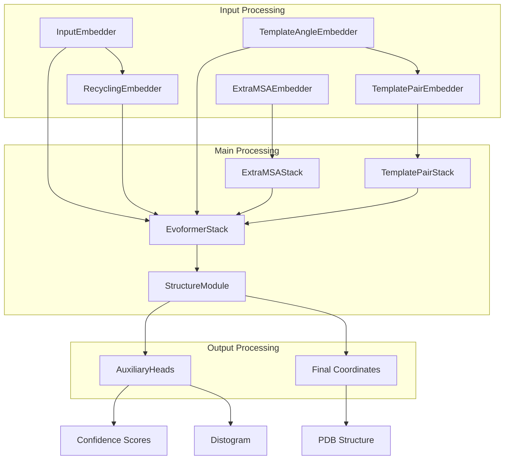
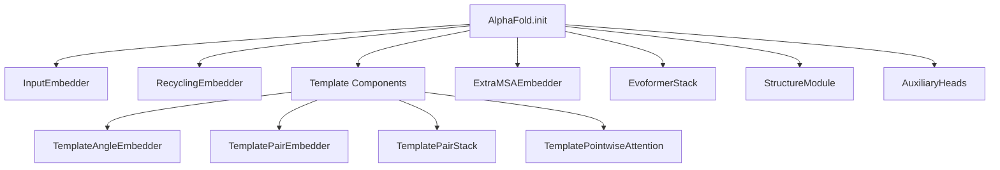
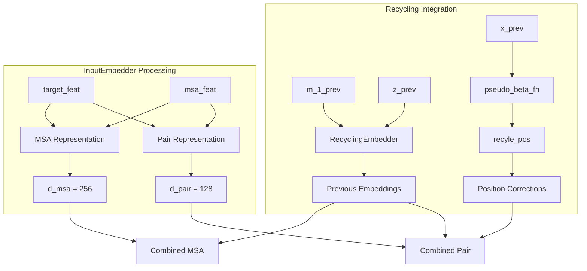
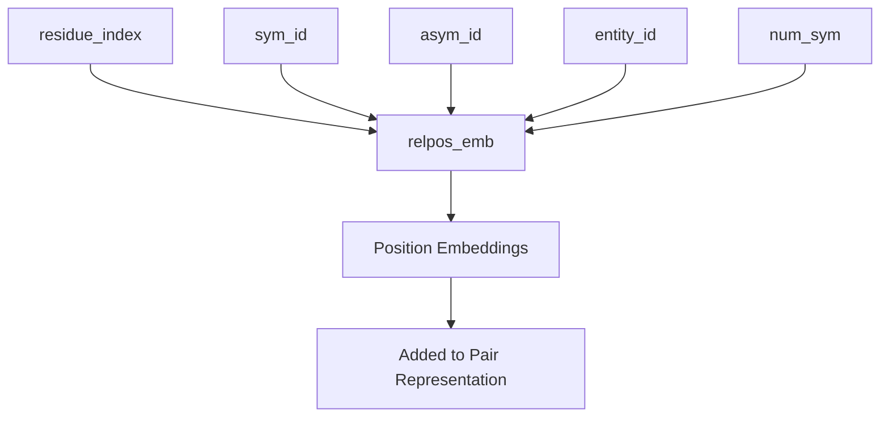
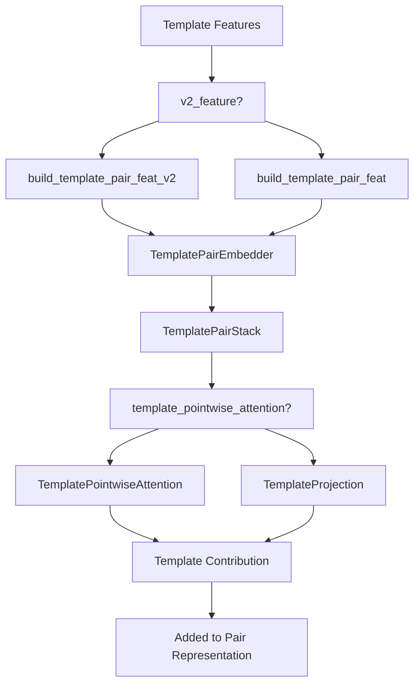
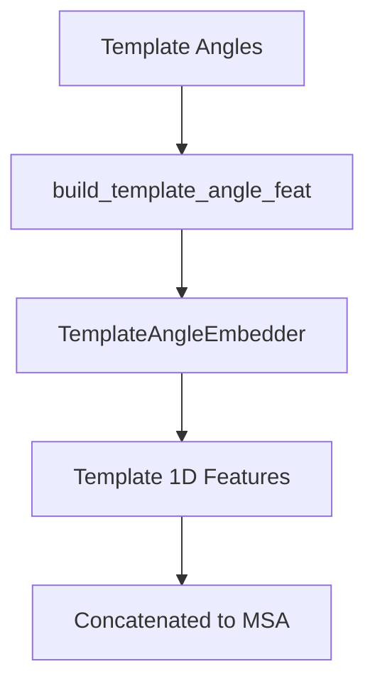
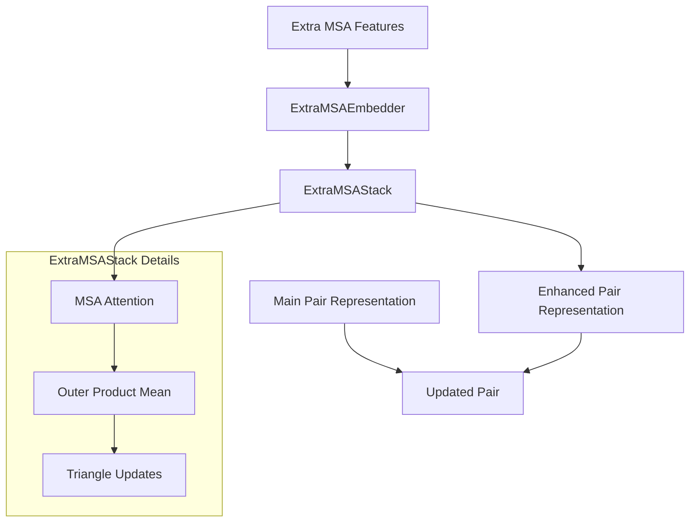
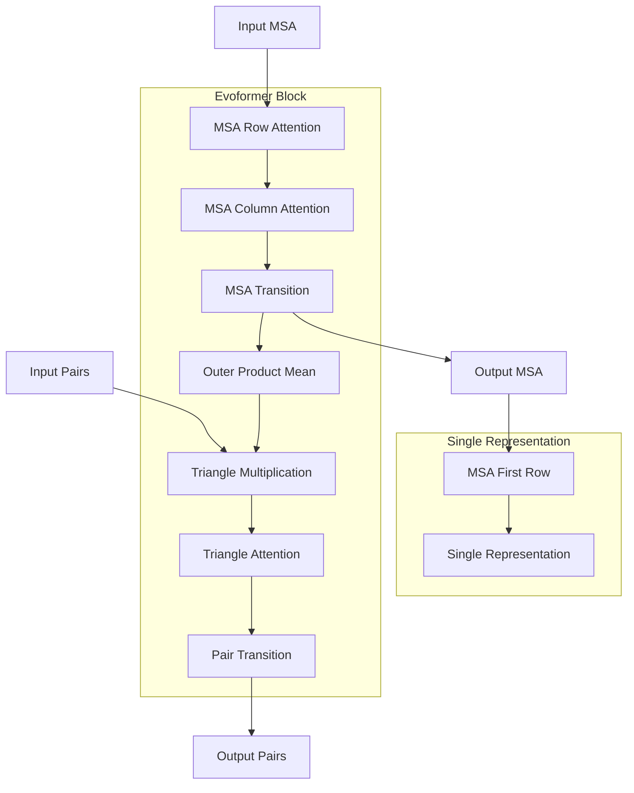
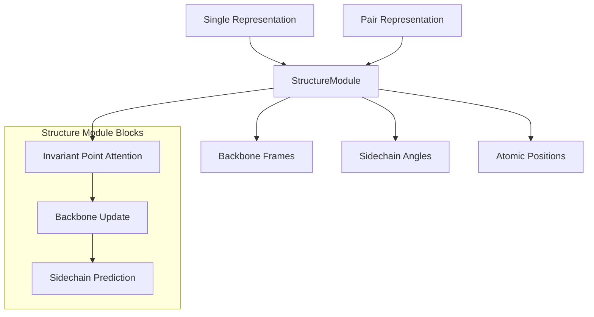
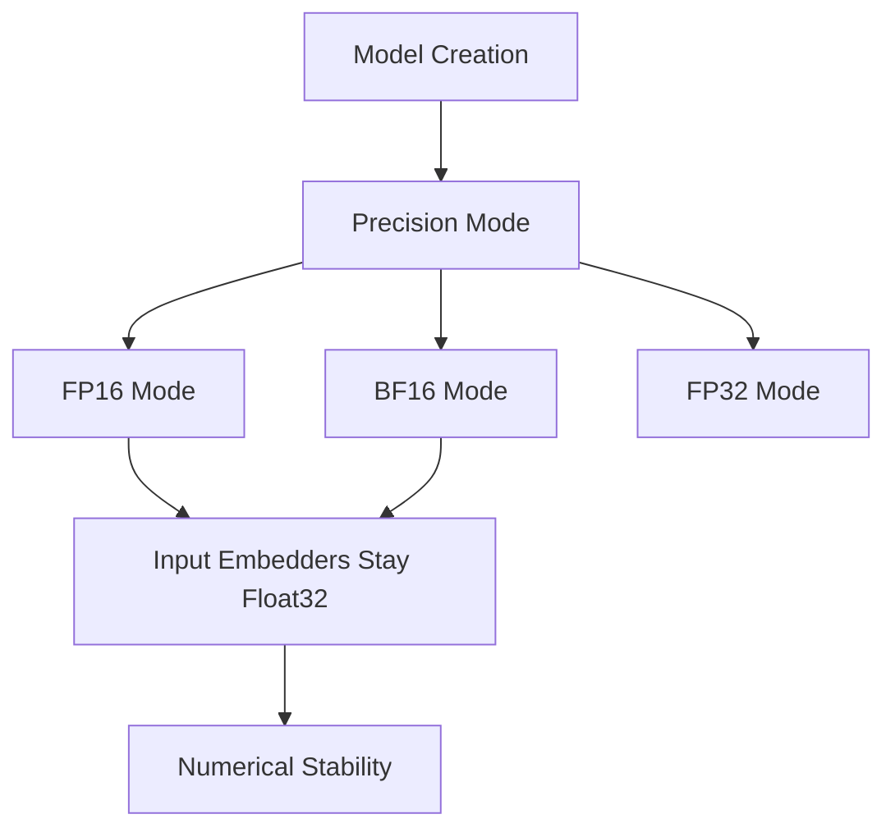

# Model Architecture

> **Relevant source files**
> * [unifold/config.py](https://github.com/dptech-corp/Uni-Fold/blob/7b55789e/unifold/config.py)
> * [unifold/model.py](https://github.com/dptech-corp/Uni-Fold/blob/7b55789e/unifold/model.py)
> * [unifold/modules/alphafold.py](https://github.com/dptech-corp/Uni-Fold/blob/7b55789e/unifold/modules/alphafold.py)

This document provides a comprehensive overview of the neural network components that power Uni-Fold's protein structure prediction capabilities. It covers the core `AlphaFold` model class, its constituent modules, and how they work together to transform sequence and evolutionary information into 3D protein structures.

For information about data preprocessing and feature generation, see [Data Pipeline](/dptech-corp/Uni-Fold/4-data-pipeline). For training procedures and configuration management, see [Training and Fine-tuning](/dptech-corp/Uni-Fold/6-training-and-fine-tuning).

## Overview

Uni-Fold's architecture closely follows the AlphaFold2 design, implementing a transformer-based neural network that processes multiple sequence alignments (MSAs) and pairwise representations to predict protein structure. The model operates through iterative refinement cycles, gradually improving its predictions by incorporating previous outputs.

### Core Architecture Flow

Sources: [unifold/modules/alphafold.py L1-L458](https://github.com/dptech-corp/Uni-Fold/blob/7b55789e/unifold/modules/alphafold.py#L1-L458)

## Core Model Orchestration

The `AlphaFold` class in [unifold/modules/alphafold.py L41-L457](https://github.com/dptech-corp/Uni-Fold/blob/7b55789e/unifold/modules/alphafold.py#L41-L457)

 serves as the main orchestrator, managing the entire prediction pipeline through iterative refinement cycles.

### Model Initialization

The model initializes its components based on configuration parameters:

Sources: [unifold/modules/alphafold.py L42-L96](https://github.com/dptech-corp/Uni-Fold/blob/7b55789e/unifold/modules/alphafold.py#L42-L96)

### Iterative Refinement Process

The model processes inputs through multiple recycling iterations, where outputs from previous cycles inform subsequent predictions:

| Component | Purpose | Input Dimensions | Output Dimensions |
| --- | --- | --- | --- |
| `InputEmbedder` | Convert raw features to learned representations | `[N_res, feat_dim]` | `[N_res, d_msa]`, `[N_res, N_res, d_pair]` |
| `RecyclingEmbedder` | Incorporate previous predictions | Previous MSA/pair representations | Embedded corrections |
| `EvoformerStack` | Process sequence and pair information | MSA and pair representations | Refined representations |
| `StructureModule` | Generate 3D coordinates | Single and pair representations | Atomic coordinates |

Sources: [unifold/modules/alphafold.py L247-L357](https://github.com/dptech-corp/Uni-Fold/blob/7b55789e/unifold/modules/alphafold.py#L247-L357)

 [unifold/modules/alphafold.py L418-L457](https://github.com/dptech-corp/Uni-Fold/blob/7b55789e/unifold/modules/alphafold.py#L418-L457)

## Input Processing Components

### InputEmbedder and RecyclingEmbedder

The `InputEmbedder` transforms raw sequence and MSA features into learned representations, while the `RecyclingEmbedder` incorporates information from previous refinement cycles:

The recycling mechanism operates through [unifold/modules/alphafold.py L276-L285](https://github.com/dptech-corp/Uni-Fold/blob/7b55789e/unifold/modules/alphafold.py#L276-L285)

 where previous predictions are embedded and added to current representations:

* MSA first row gets previous MSA embedding: `m[..., 0, :, :] += m_1_prev_emb`
* Pair representation gets both previous pair and position corrections: `z += z_prev_emb`

Sources: [unifold/modules/alphafold.py L254-L285](https://github.com/dptech-corp/Uni-Fold/blob/7b55789e/unifold/modules/alphafold.py#L254-L285)

 [unifold/config.py L243-L257](https://github.com/dptech-corp/Uni-Fold/blob/7b55789e/unifold/config.py#L243-L257)

### Relative Position Embedding

The model incorporates positional information through relative position embeddings that handle both single chains and multi-chain complexes:

Sources: [unifold/modules/alphafold.py L287-L293](https://github.com/dptech-corp/Uni-Fold/blob/7b55789e/unifold/modules/alphafold.py#L287-L293)

## Template Processing Pipeline

When templates are enabled, the model processes structural information from known protein structures to guide predictions:

### Template Pair Processing

The template processing adapts based on training vs inference mode. During inference, templates are processed individually to save memory [unifold/modules/alphafold.py L210-L238](https://github.com/dptech-corp/Uni-Fold/blob/7b55789e/unifold/modules/alphafold.py#L210-L238)

### Template Angle Processing

Template angle information is processed separately and concatenated to the MSA representation:

Sources: [unifold/modules/alphafold.py L147-L238](https://github.com/dptech-corp/Uni-Fold/blob/7b55789e/unifold/modules/alphafold.py#L147-L238)

 [unifold/modules/alphafold.py L240-L245](https://github.com/dptech-corp/Uni-Fold/blob/7b55789e/unifold/modules/alphafold.py#L240-L245)

 [unifold/modules/alphafold.py L335-L338](https://github.com/dptech-corp/Uni-Fold/blob/7b55789e/unifold/modules/alphafold.py#L335-L338)

## Extra MSA Processing

The model processes additional MSA sequences through a separate stack to augment the main MSA representation:

The extra MSA stack operates on [unifold/modules/alphafold.py L315-L333](https://github.com/dptech-corp/Uni-Fold/blob/7b55789e/unifold/modules/alphafold.py#L315-L333)

 with its own attention mechanisms and outer product calculations to extract evolutionary couplings.

Sources: [unifold/modules/alphafold.py L315-L333](https://github.com/dptech-corp/Uni-Fold/blob/7b55789e/unifold/modules/alphafold.py#L315-L333)

 [unifold/config.py L300-L323](https://github.com/dptech-corp/Uni-Fold/blob/7b55789e/unifold/config.py#L300-L323)

## Main Evoformer Processing

The `EvoformerStack` forms the core of the model, processing MSA and pair representations through 48 transformer blocks:

The Evoformer generates three key outputs:

* Updated MSA representation (`m`)
* Updated pair representation (`z`)
* Single sequence representation (`s`) extracted from the first MSA row

Sources: [unifold/modules/alphafold.py L345-L356](https://github.com/dptech-corp/Uni-Fold/blob/7b55789e/unifold/modules/alphafold.py#L345-L356)

 [unifold/config.py L324-L341](https://github.com/dptech-corp/Uni-Fold/blob/7b55789e/unifold/config.py#L324-L341)

## Structure Module Integration

The `StructureModule` converts the processed representations into 3D atomic coordinates through iterative geometric reasoning:

The structure module outputs are processed through [unifold/modules/alphafold.py L394-L404](https://github.com/dptech-corp/Uni-Fold/blob/7b55789e/unifold/modules/alphafold.py#L394-L404)

:

* Raw atomic positions converted from atom14 to atom37 format
* Frame tensors for geometric analysis
* Final atom masks indicating which atoms exist

Sources: [unifold/modules/alphafold.py L394-L404](https://github.com/dptech-corp/Uni-Fold/blob/7b55789e/unifold/modules/alphafold.py#L394-L404)

 [unifold/config.py L342-L360](https://github.com/dptech-corp/Uni-Fold/blob/7b55789e/unifold/config.py#L342-L360)

## Configuration Architecture

The model architecture is highly configurable through the config system in [unifold/config.py L26-L672](https://github.com/dptech-corp/Uni-Fold/blob/7b55789e/unifold/config.py#L26-L672)

:

### Key Architectural Parameters

| Parameter | Default Value | Purpose |
| --- | --- | --- |
| `d_msa` | 256 | MSA representation dimension |
| `d_pair` | 128 | Pair representation dimension |
| `d_single` | 384 | Single sequence dimension |
| `num_blocks` | 48 | Number of Evoformer blocks |
| `max_recycling_iters` | 3 | Recycling iterations |

### Model Variants

The configuration system supports multiple model variants through [unifold/config.py L480-L672](https://github.com/dptech-corp/Uni-Fold/blob/7b55789e/unifold/config.py#L480-L672)

:

* **model_1**: Basic configuration
* **model_2**: Enhanced with v2 features
* **multimer**: Optimized for protein complexes
* **model_*_af2**: AlphaFold2-compatible variants

Each variant modifies specific architectural components and training parameters while maintaining the core structure.

Sources: [unifold/config.py L26-L672](https://github.com/dptech-corp/Uni-Fold/blob/7b55789e/unifold/config.py#L26-L672)

 [unifold/model.py L12-L52](https://github.com/dptech-corp/Uni-Fold/blob/7b55789e/unifold/model.py#L12-L52)

## Precision and Memory Management

The model supports multiple precision modes for training and inference:

Input embedders are kept in float32 precision during mixed-precision training to maintain numerical stability [unifold/modules/alphafold.py L103-L124](https://github.com/dptech-corp/Uni-Fold/blob/7b55789e/unifold/modules/alphafold.py#L103-L124)

Sources: [unifold/modules/alphafold.py L103-L124](https://github.com/dptech-corp/Uni-Fold/blob/7b55789e/unifold/modules/alphafold.py#L103-L124)

 [unifold/modules/alphafold.py L140-L145](https://github.com/dptech-corp/Uni-Fold/blob/7b55789e/unifold/modules/alphafold.py#L140-L145)