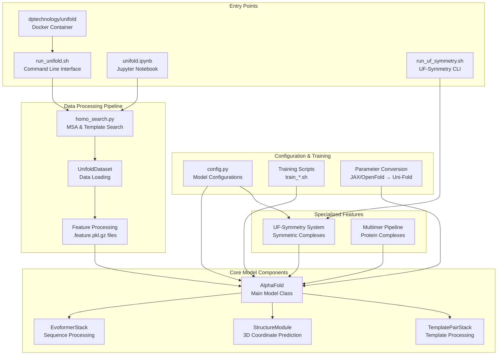
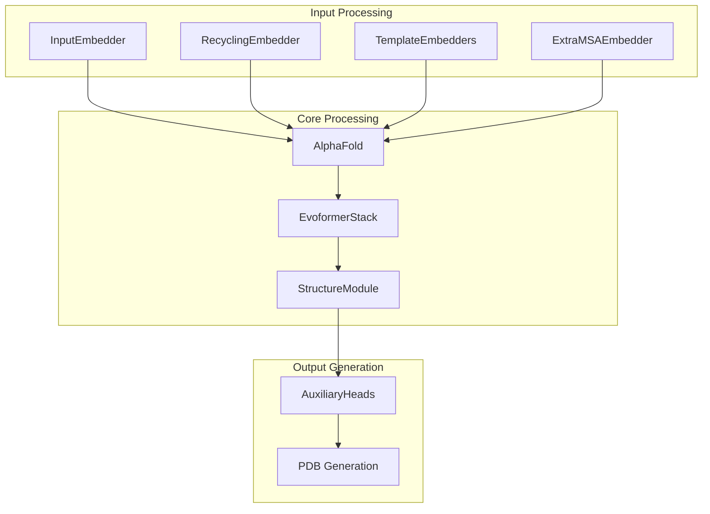

# Overview

> **Relevant source files**
> * [README.md](https://github.com/dptech-corp/Uni-Fold/blob/7b55789e/README.md?plain=1)
> * [setup.py](https://github.com/dptech-corp/Uni-Fold/blob/7b55789e/setup.py)

This document provides a comprehensive overview of Uni-Fold, an open-source platform for developing protein structure prediction models beyond AlphaFold. It covers the system's purpose, architecture, key components, and entry points for users and developers.

For specific installation and setup instructions, see [Installation and Setup](/dptech-corp/Uni-Fold/2.1-installation-and-setup). For detailed usage examples, see [Quick Start Guide](/dptech-corp/Uni-Fold/2.2-quick-start-guide). For information about training models from scratch, see [Training and Fine-tuning](/dptech-corp/Uni-Fold/6-training-and-fine-tuning).

## Purpose and Capabilities

Uni-Fold is a PyTorch-based reimplementation and extension of DeepMind's AlphaFold protein structure prediction system. It serves as a research platform that enables training, fine-tuning, and deploying protein folding models with enhanced capabilities beyond the original AlphaFold implementation.

### Key Features

| Feature | Description |
| --- | --- |
| **AlphaFold Compatibility** | Full reimplementation of AlphaFold and AlphaFold-Multimer in PyTorch |
| **Training Support** | First open-source implementation supporting AlphaFold-Multimer training from scratch |
| **Performance** | Claims 2.2x faster training efficiency compared to official AlphaFold |
| **Distributed Training** | Built on Uni-Core framework with support for multi-GPU training |
| **Mixed Precision** | Support for `float16`/`bfloat16` training and fused CUDA kernels |
| **UF-Symmetry** | Specialized system for predicting large symmetric protein complexes |
| **Multiple Interfaces** | Command-line tools, Colab notebooks, and Docker deployment options |

Sources: [README.md L1-L58](https://github.com/dptech-corp/Uni-Fold/blob/7b55789e/README.md?plain=1#L1-L58)

 [setup.py L19-L26](https://github.com/dptech-corp/Uni-Fold/blob/7b55789e/setup.py#L19-L26)

## System Architecture Overview



Sources: [README.md L20-L27](https://github.com/dptech-corp/Uni-Fold/blob/7b55789e/README.md?plain=1#L20-L27)

 diagrams from repository analysis

## Core Components

### Model Architecture

The Uni-Fold system centers around the `AlphaFold` class, which orchestrates the entire prediction pipeline. The architecture follows the original AlphaFold design but with PyTorch implementation and additional optimizations.



Sources: Architecture diagrams from repository analysis

### Data Pipeline

The data processing pipeline handles multiple sequence alignment (MSA) generation, template search, and feature preparation. The system supports both local database searches and online MSA services.

| Component | Purpose | Key Files |
| --- | --- | --- |
| **Homology Search** | MSA and template generation | `homo_search.py` |
| **Feature Processing** | Convert raw data to model inputs | `UnifoldDataset` |
| **Database Management** | Download and manage sequence/structure databases | `download_all_data.sh` |
| **Template Handling** | Process structural templates | mmCIF processing modules |

Sources: [README.md L90-L99](https://github.com/dptech-corp/Uni-Fold/blob/7b55789e/README.md?plain=1#L90-L99)

 data pipeline analysis

### Configuration System

Uni-Fold uses a configuration-driven approach with multiple model variants supported through the `config.py` system.

**Supported Model Types:**

* `model_1`, `model_2`, `model_2_ft`: Monomer prediction models
* `multimer`, `multimer_ft`: Protein complex prediction models
* UF-Symmetry variants: Specialized for symmetric complexes

Sources: [README.md L240](https://github.com/dptech-corp/Uni-Fold/blob/7b55789e/README.md?plain=1#L240-L240)

## Entry Points and Interfaces

### Command Line Interface

The primary interface is `run_unifold.sh`, which provides a complete prediction pipeline:

```
bash run_unifold.sh \    /path/to/input.fasta \    /path/to/output/directory/ \    /path/to/database/directory/ \    2020-05-01 \    model_name \    /path/to/model_parameters.pt
```

### Specialized Interfaces

**UF-Symmetry Interface:**

```
bash run_uf_symmetry.sh \    /path/to/input.fasta \    C3 \    /path/to/output/directory/ \    /path/to/database/directory/ \    2020-05-01 \    /path/to/model_parameters.pt
```

**Interactive Notebook:**

* Colab notebook: `notebooks/unifold.ipynb`
* Provides web-based interface for structure prediction

**Docker Deployment:**

* Container: `dptechnology/unifold:latest-pytorch1.11.0-cuda11.3`
* Ensures reproducible execution environment

Sources: [README.md L125-L282](https://github.com/dptech-corp/Uni-Fold/blob/7b55789e/README.md?plain=1#L125-L282)

## Key Differentiators

### Training Capabilities

Unlike the original AlphaFold, Uni-Fold provides complete training infrastructure:

* **From-scratch training**: Full dataset and training scripts included
* **Fine-tuning support**: Ability to adapt pre-trained models
* **Multimer training**: First open-source implementation supporting AlphaFold-Multimer training
* **Distributed training**: Multi-GPU support through Uni-Core framework

### Performance Optimizations

* **Efficiency**: Claims 2.2x faster training compared to official AlphaFold
* **Memory optimization**: Chunking and gradient checkpointing support
* **Mixed precision**: `float16`/`bfloat16` training support
* **Fused kernels**: CUDA kernel optimizations for improved performance

### Extended Functionality

* **UF-Symmetry**: Specialized handling of large symmetric protein complexes
* **Parameter conversion**: Tools to convert weights between AlphaFold, OpenFold, and Uni-Fold formats
* **Multiple deployment options**: CLI, notebook, Docker, and cloud service integration

Sources: [README.md L22-L26](https://github.com/dptech-corp/Uni-Fold/blob/7b55789e/README.md?plain=1#L22-L26)

 [README.md L36-L54](https://github.com/dptech-corp/Uni-Fold/blob/7b55789e/README.md?plain=1#L36-L54)

## Framework Dependencies

Uni-Fold is built on the Uni-Core distributed training framework and requires specific versions of PyTorch and CUDA. The system integrates with various external tools and databases for sequence and structure analysis.

**Core Dependencies:**

* PyTorch framework
* Uni-Core for distributed training
* CUDA for GPU acceleration
* Various bioinformatics tools (HHblits, JackHMMER, etc.)

Sources: [README.md L73-L74](https://github.com/dptech-corp/Uni-Fold/blob/7b55789e/README.md?plain=1#L73-L74)

 [setup.py L30-L37](https://github.com/dptech-corp/Uni-Fold/blob/7b55789e/setup.py#L30-L37)