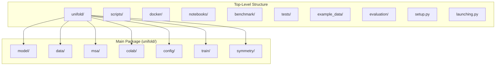
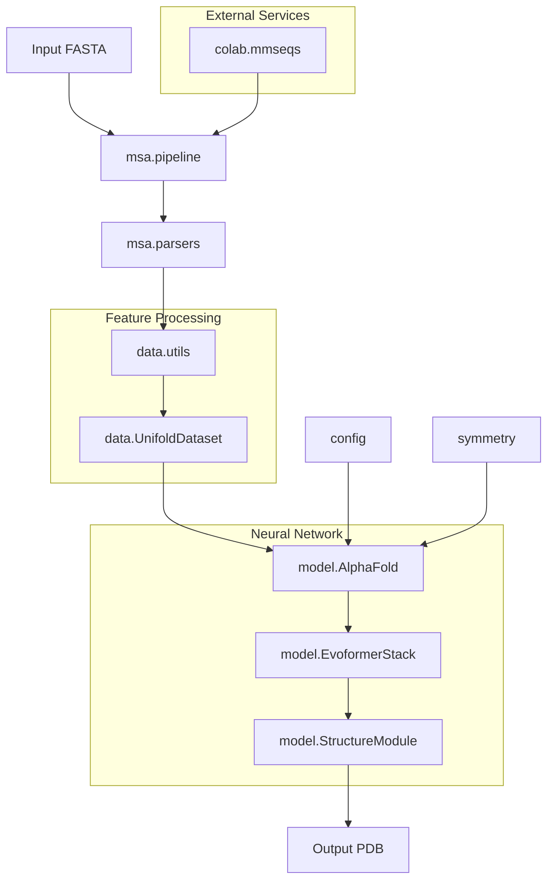
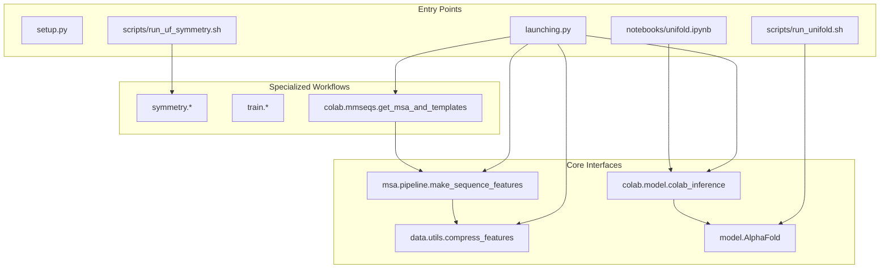

# Package Structure

> **Relevant source files**
> * [launching.py](https://github.com/dptech-corp/Uni-Fold/blob/7b55789e/launching.py)
> * [setup.py](https://github.com/dptech-corp/Uni-Fold/blob/7b55789e/setup.py)

This document provides a comprehensive overview of the Uni-Fold codebase organization, module hierarchy, and how different components are structured within the Python package. This covers the physical organization of code files and directories, their relationships, and the main entry points for different functionalities.

For information about the logical architecture and data flow between components, see [Model Architecture](/dptech-corp/Uni-Fold/5-model-architecture). For details about training and configuration management, see [Training and Fine-tuning](/dptech-corp/Uni-Fold/6-training-and-fine-tuning).

## Package Overview

Uni-Fold is organized as a Python package with a clear modular structure that separates concerns across different aspects of protein structure prediction. The main package `unifold` contains all core functionality, while supporting scripts, data, and deployment materials are organized in separate top-level directories.

Sources: [setup.py L27-L29](https://github.com/dptech-corp/Uni-Fold/blob/7b55789e/setup.py#L27-L29)

 [launching.py L38-L48](https://github.com/dptech-corp/Uni-Fold/blob/7b55789e/launching.py#L38-L48)

## Core Module Organization

The `unifold` package is structured into distinct modules that handle different aspects of the protein folding pipeline. Each module encapsulates related functionality and provides clear interfaces to other components.

```mermaid
flowchart TD

A["model/"]
B["data/"]
C["msa/"]
D["colab/"]
E["config/"]
F["train/"]
G["symmetry/"]
A1["AlphaFold"]
A2["EvoformerStack"]
A3["StructureModule"]
A4["TemplatePairStack"]
A5["AuxiliaryHeads"]
B1["UnifoldDataset"]
B2["protein.py"]
B3["utils.py"]
B4["residue_constants.py"]
C1["pipeline.py"]
C2["parsers.py"]
C3["utils.py"]
C4["templates.py"]
D1["data.py"]
D2["model.py"]
D3["mmseqs.py"]

A --> A1
A --> A2
A --> A3
A --> A4
A --> A5
B --> B1
B --> B2
B --> B3
B --> B4
C --> C1
C --> C2
C --> C3
C --> C4
D --> D1
D --> D2
D --> D3

subgraph subGraph4 ["Interactive Interface"]
    D1
    D2
    D3
end

subgraph subGraph3 ["MSA Pipeline"]
    C1
    C2
    C3
    C4
end

subgraph subGraph2 ["Data Processing"]
    B1
    B2
    B3
    B4
end

subgraph subGraph1 ["Model Components"]
    A1
    A2
    A3
    A4
    A5
end

subgraph subGraph0 ["unifold Package Structure"]
    A
    B
    C
    D
    E
    F
    G
end
```

Sources: [launching.py L38-L48](https://github.com/dptech-corp/Uni-Fold/blob/7b55789e/launching.py#L38-L48)

## Module Responsibilities

The following table summarizes the primary responsibilities of each major module within the `unifold` package:

| Module | Purpose | Key Components |
| --- | --- | --- |
| `model/` | Neural network architecture and model components | `AlphaFold`, `EvoformerStack`, `StructureModule` |
| `data/` | Data loading, processing, and feature extraction | `UnifoldDataset`, protein utilities, constants |
| `msa/` | Multiple sequence alignment and template processing | MSA search, parsing, template handling |
| `colab/` | Interactive notebook interface and web services | Data validation, MMseqs2 integration, inference |
| `config/` | Model configurations and hyperparameters | Base configs, model variants, training settings |
| `train/` | Training infrastructure and optimization | Training loops, loss functions, checkpointing |
| `symmetry/` | UF-Symmetry system for symmetric complexes | Symmetry group handling, assembly generation |

## Data Flow Through Package Modules

The package modules work together to process protein sequences through a structured pipeline. This diagram shows how data flows between the major modules during a typical prediction workflow.

Sources: [launching.py L124-L180](https://github.com/dptech-corp/Uni-Fold/blob/7b55789e/launching.py#L124-L180)

## Entry Points and Interfaces

Uni-Fold provides multiple entry points for different use cases, each utilizing different subsets of the package modules:

Sources: [setup.py L19-L29](https://github.com/dptech-corp/Uni-Fold/blob/7b55789e/setup.py#L19-L29)

 [launching.py L168-L180](https://github.com/dptech-corp/Uni-Fold/blob/7b55789e/launching.py#L168-L180)

## Dependencies and External Interfaces

The package structure reflects clear separation between core functionality and external dependencies. The setup configuration defines minimal core dependencies while keeping optional components separate.

| Dependency Type | Components | Purpose |
| --- | --- | --- |
| Core Dependencies | `absl-py`, `biopython`, `ml-collections` | Essential utilities and data structures |
| Scientific Computing | `numpy`, `pandas`, `scipy` | Numerical operations and data manipulation |
| Deep Learning | PyTorch (external) | Neural network implementation |
| External Tools | JackHMMER, HHblits, MMseqs2 | MSA generation and homology search |
| Optional Services | Bohrium Apps integration | Cloud deployment and web interfaces |

The `launching.py` module serves as a bridge between the internal package structure and external deployment platforms, providing a standardized interface that abstracts the underlying complexity.

Sources: [setup.py L30-L37](https://github.com/dptech-corp/Uni-Fold/blob/7b55789e/setup.py#L30-L37)

 [launching.py L57-L78](https://github.com/dptech-corp/Uni-Fold/blob/7b55789e/launching.py#L57-L78)

## Excluded Directories

Several directories are excluded from the main package distribution to maintain a clean separation between core functionality and supporting materials:

* `scripts/`: Command-line tools and shell scripts for various workflows
* `tests/`: Unit tests and integration tests
* `example_data/`: Sample inputs and expected outputs for testing
* `docker/`: Container definitions and deployment configurations
* `benchmark/`: Performance evaluation and comparison tools
* `img/`: Documentation images and diagrams
* `evaluation/`: Result analysis and validation scripts
* `notebooks/`: Jupyter notebooks for interactive usage

This exclusion pattern ensures that the installed package contains only the essential Python modules needed for protein folding functionality, while development and deployment tools remain available in the source repository.

Sources: [setup.py L27-L29](https://github.com/dptech-corp/Uni-Fold/blob/7b55789e/setup.py#L27-L29)