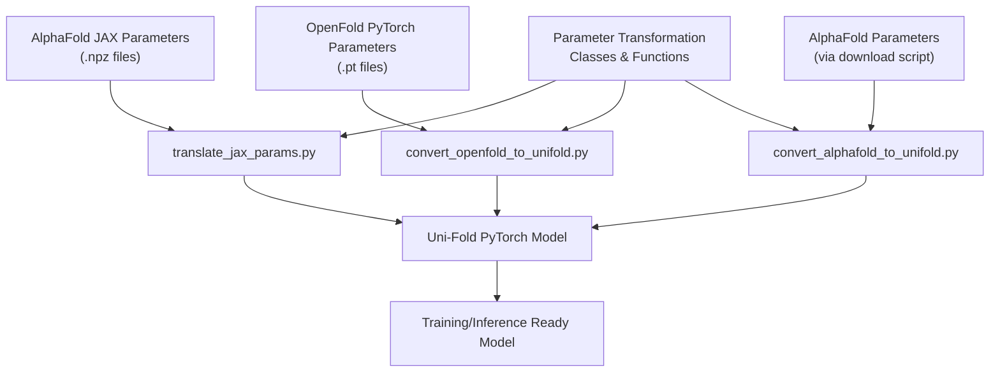
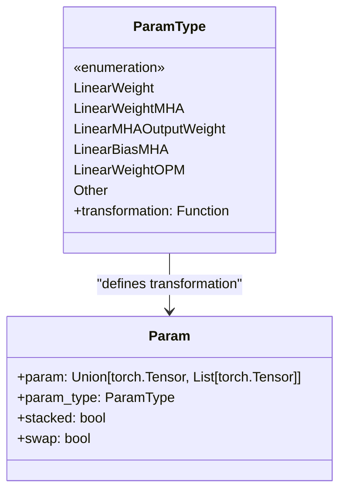
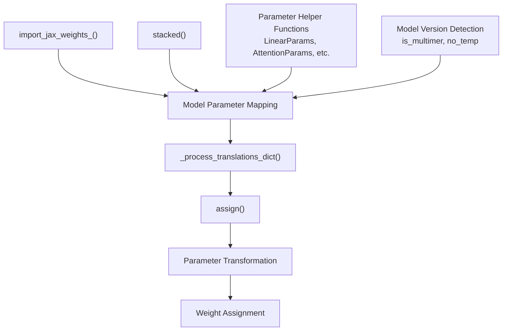
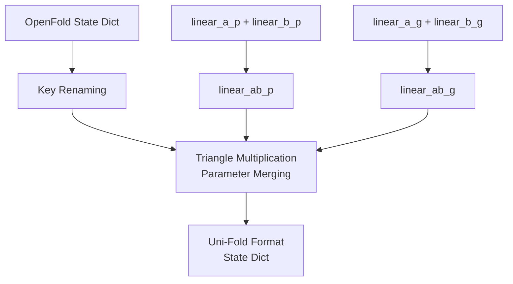
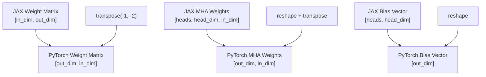

# Parameter Conversion

> **Relevant source files**
> * [scripts/convert_alphafold_to_unifold.py](https://github.com/dptech-corp/Uni-Fold/blob/7b55789e/scripts/convert_alphafold_to_unifold.py)
> * [scripts/convert_openfold_to_unifold.py](https://github.com/dptech-corp/Uni-Fold/blob/7b55789e/scripts/convert_openfold_to_unifold.py)
> * [scripts/download/download_alphafold_params.sh](https://github.com/dptech-corp/Uni-Fold/blob/7b55789e/scripts/download/download_alphafold_params.sh)
> * [scripts/translate_jax_params.py](https://github.com/dptech-corp/Uni-Fold/blob/7b55789e/scripts/translate_jax_params.py)
> * [unifold/data/utils.py](https://github.com/dptech-corp/Uni-Fold/blob/7b55789e/unifold/data/utils.py)
> * [unifold/dataset.py](https://github.com/dptech-corp/Uni-Fold/blob/7b55789e/unifold/dataset.py)

This document covers the parameter conversion system in Uni-Fold, which enables the use of pre-trained weights from AlphaFold (JAX) and OpenFold (PyTorch) with Uni-Fold's PyTorch implementation. The conversion system handles framework differences, parameter naming conventions, and structural transformations required to make external model weights compatible with Uni-Fold.

For information about training configurations and model setup, see [Training Configuration](/dptech-corp/Uni-Fold/6.1-training-configuration). For details about the training process itself, see [Training Scripts](/dptech-corp/Uni-Fold/6.2-training-scripts).

## Overview and Purpose

Uni-Fold implements a comprehensive parameter conversion system that allows leveraging pre-trained weights from multiple sources:

* **AlphaFold weights**: Converting from JAX/Haiku format (.npz files) to PyTorch format
* **OpenFold weights**: Converting from OpenFold's PyTorch format to Uni-Fold's format
* **Framework compatibility**: Handling differences in parameter structure and naming between implementations

The conversion system ensures that Uni-Fold can benefit from the extensive pre-training performed by DeepMind's AlphaFold and other implementations without requiring training from scratch.



Sources: [scripts/translate_jax_params.py L1-L577](https://github.com/dptech-corp/Uni-Fold/blob/7b55789e/scripts/translate_jax_params.py#L1-L577)

 [scripts/convert_openfold_to_unifold.py L1-L66](https://github.com/dptech-corp/Uni-Fold/blob/7b55789e/scripts/convert_openfold_to_unifold.py#L1-L66)

 [scripts/convert_alphafold_to_unifold.py L1-L27](https://github.com/dptech-corp/Uni-Fold/blob/7b55789e/scripts/convert_alphafold_to_unifold.py#L1-L27)

## Parameter Sources and Target Format

### Source Formats

The conversion system handles three main parameter sources:

| Source | Framework | Format | Key Characteristics |
| --- | --- | --- | --- |
| AlphaFold | JAX/Haiku | `.npz` | Hierarchical naming with specific prefixes |
| OpenFold | PyTorch | `.pt` | Different layer naming conventions |
| Uni-Fold | PyTorch | `.pt` | Target format with specific structure |

### Target Structure

All converted parameters are saved in Uni-Fold's checkpoint format with the following structure:

```
{    "ema": {        "params": {            "model.layer_name.parameter": tensor_data        }    },    "extra_state": {        "train_iterator": {            "epoch": 1        }    }}
```

Sources: [scripts/convert_openfold_to_unifold.py L54-L65](https://github.com/dptech-corp/Uni-Fold/blob/7b55789e/scripts/convert_openfold_to_unifold.py#L54-L65)

 [scripts/convert_alphafold_to_unifold.py L19-L26](https://github.com/dptech-corp/Uni-Fold/blob/7b55789e/scripts/convert_alphafold_to_unifold.py#L19-L26)

## JAX to PyTorch Conversion System

The primary conversion system is implemented in `translate_jax_params.py`, which handles the complex transformation from AlphaFold's JAX format to Uni-Fold's PyTorch format.

### Parameter Type System

The conversion uses a sophisticated type system to handle different parameter transformation patterns:



Each `ParamType` defines a specific transformation function:

* `LinearWeight`: Standard weight matrix transpose
* `LinearWeightMHA`: Multi-head attention weight reshaping
* `LinearBiasMHA`: Multi-head attention bias reshaping
* `LinearWeightOPM`: Outer product mean weight transformation

Sources: [scripts/translate_jax_params.py L35-L62](https://github.com/dptech-corp/Uni-Fold/blob/7b55789e/scripts/translate_jax_params.py#L35-L62)

### Key Translation Components

The translation system consists of several key functions:



The main function `import_jax_weights_` at [scripts/translate_jax_params.py L138-L577](https://github.com/dptech-corp/Uni-Fold/blob/7b55789e/scripts/translate_jax_params.py#L138-L577)

 orchestrates the entire conversion process:

1. **Version Detection**: Determines model type (monomer, multimer, template variants)
2. **Parameter Mapping**: Creates translation dictionaries for each model component
3. **Transformation**: Applies appropriate transformations based on parameter types
4. **Assignment**: Copies converted weights to the target PyTorch model

Sources: [scripts/translate_jax_params.py L138-L577](https://github.com/dptech-corp/Uni-Fold/blob/7b55789e/scripts/translate_jax_params.py#L138-L577)

 [scripts/translate_jax_params.py L112-L137](https://github.com/dptech-corp/Uni-Fold/blob/7b55789e/scripts/translate_jax_params.py#L112-L137)

### Model Component Mapping

The translation system provides specialized parameter mapping functions for each model component:

| Component | Mapping Function | Key Transformations |
| --- | --- | --- |
| Evoformer Blocks | `EvoformerBlockParams` | MSA attention, triangle operations |
| Structure Module | `FoldIterationParams` | IPA, backbone update, sidechain prediction |
| Template Processing | `TemplatePairBlockParams` | Template pair stack, embeddings |
| Auxiliary Heads | Individual head mappings | LDDT, distogram, PAE heads |

Sources: [scripts/translate_jax_params.py L364-L426](https://github.com/dptech-corp/Uni-Fold/blob/7b55789e/scripts/translate_jax_params.py#L364-L426)

 [scripts/translate_jax_params.py L450-L515](https://github.com/dptech-corp/Uni-Fold/blob/7b55789e/scripts/translate_jax_params.py#L450-L515)

## OpenFold to Uni-Fold Conversion

The OpenFold conversion system in `convert_openfold_to_unifold.py` handles differences in naming conventions and parameter organization between OpenFold and Uni-Fold.

### Key Transformations



The main transformations include:

1. **MSA Attention**: `msa_att_col._msa_att` → `msa_att_col`
2. **Stack Naming**: `extra_msa_stack.stack` → `extra_msa_stack`
3. **Triangle Multiplication**: Merging separate projection and gate parameters
4. **Module Prefixes**: Removing `.core.` prefixes from parameter names

Sources: [scripts/convert_openfold_to_unifold.py L4-L51](https://github.com/dptech-corp/Uni-Fold/blob/7b55789e/scripts/convert_openfold_to_unifold.py#L4-L51)

### Triangle Multiplication Handling

OpenFold uses separate parameters for triangle multiplication operations (`linear_a_p`, `linear_b_p`), while Uni-Fold concatenates them into single parameters (`linear_ab_p`). The conversion process:

```markdown
# Projection parametersweight = torch.cat([model_states[k1], model_states[k2]], dim=0) # Gate parameters  weight = torch.cat([model_states[k1], model_states[k2]], dim=0)
```

Sources: [scripts/convert_openfold_to_unifold.py L33-L49](https://github.com/dptech-corp/Uni-Fold/blob/7b55789e/scripts/convert_openfold_to_unifold.py#L33-L49)

## AlphaFold to Uni-Fold Conversion

The high-level AlphaFold conversion script `convert_alphafold_to_unifold.py` provides a complete pipeline from AlphaFold parameters to Uni-Fold checkpoints.

### Conversion Pipeline

```mermaid
sequenceDiagram
  participant User
  participant convert_alphafold_to_unifold.py
  participant model_config()
  participant AlphaFold Model
  participant import_jax_weights_()
  participant Checkpoint File

  User->>convert_alphafold_to_unifold.py: load_ckpt, save_ckpt, model_name
  convert_alphafold_to_unifold.py->>model_config(): Get model configuration
  convert_alphafold_to_unifold.py->>AlphaFold Model: Create AlphaFold instance
  convert_alphafold_to_unifold.py->>import_jax_weights_(): Load JAX weights
  import_jax_weights_()->>AlphaFold Model: Apply converted weights
  convert_alphafold_to_unifold.py->>AlphaFold Model: Extract state_dict
  convert_alphafold_to_unifold.py->>Checkpoint File: Save Uni-Fold checkpoint
```

The script performs:

1. **Model Creation**: Instantiates a Uni-Fold model with the specified configuration
2. **Weight Loading**: Uses the JAX translation system to load and convert weights
3. **Checkpoint Creation**: Packages the converted weights in Uni-Fold's checkpoint format

Sources: [scripts/convert_alphafold_to_unifold.py L1-L27](https://github.com/dptech-corp/Uni-Fold/blob/7b55789e/scripts/convert_alphafold_to_unifold.py#L1-L27)

## Parameter Transformation Patterns

### Weight Matrix Transformations

Different parameter types require specific transformations to account for framework differences:



### Specialized Transformations

The system includes specialized transformations for complex model components:

* **Invariant Point Attention**: Different parameter organization for multimer vs monomer models
* **Triangle Multiplication**: Handling of incoming vs outgoing operations with parameter swapping
* **Template Processing**: Version-specific handling for different AlphaFold releases

Sources: [scripts/translate_jax_params.py L27-L49](https://github.com/dptech-corp/Uni-Fold/blob/7b55789e/scripts/translate_jax_params.py#L27-L49)

 [scripts/translate_jax_params.py L229-L285](https://github.com/dptech-corp/Uni-Fold/blob/7b55789e/scripts/translate_jax_params.py#L229-L285)

## Usage Examples

### Converting AlphaFold Parameters

```markdown
# Download AlphaFold parametersbash scripts/download/download_alphafold_params.sh /path/to/params # Convert to Uni-Fold formatpython scripts/convert_alphafold_to_unifold.py \    /path/to/alphafold/params.npz \    /path/to/unifold/checkpoint.pt \    model_1
```

### Converting OpenFold Parameters

```markdown
# Convert OpenFold checkpoint to Uni-Fold formatpython scripts/convert_openfold_to_unifold.py \    /path/to/openfold/checkpoint.pt \    /path/to/unifold/checkpoint.pt
```

### Supported Model Versions

The conversion system supports multiple AlphaFold model versions:

* `model_1`, `model_2` (with templates)
* `model_3_af2`, `model_4_af2`, `model_5_af2` (without templates)
* `multimer_af2`, `multimer_af2_v3` (multimer models)
* Models with PTM heads (`_ptm` suffix)

Sources: [scripts/translate_jax_params.py L139-L141](https://github.com/dptech-corp/Uni-Fold/blob/7b55789e/scripts/translate_jax_params.py#L139-L141)

 [scripts/translate_jax_params.py L517-L534](https://github.com/dptech-corp/Uni-Fold/blob/7b55789e/scripts/translate_jax_params.py#L517-L534)

 [scripts/download/download_alphafold_params.sh L1-L42](https://github.com/dptech-corp/Uni-Fold/blob/7b55789e/scripts/download/download_alphafold_params.sh#L1-L42)