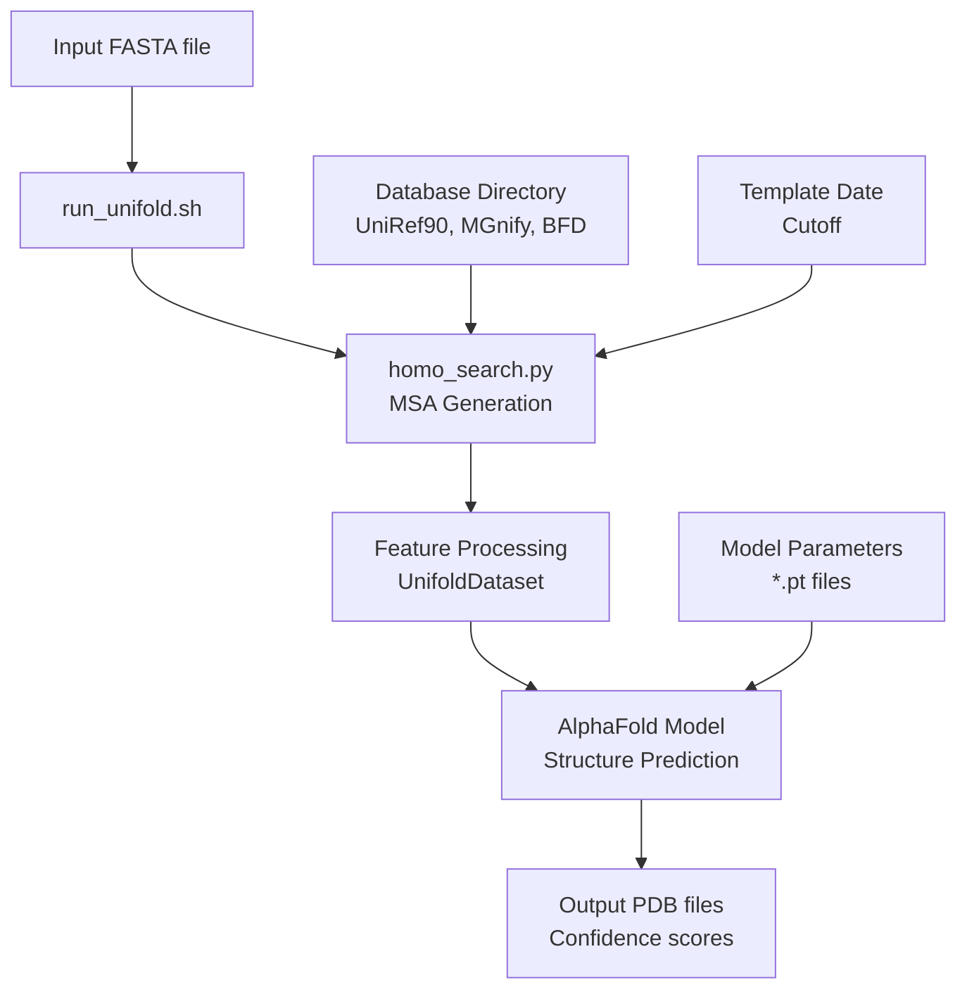
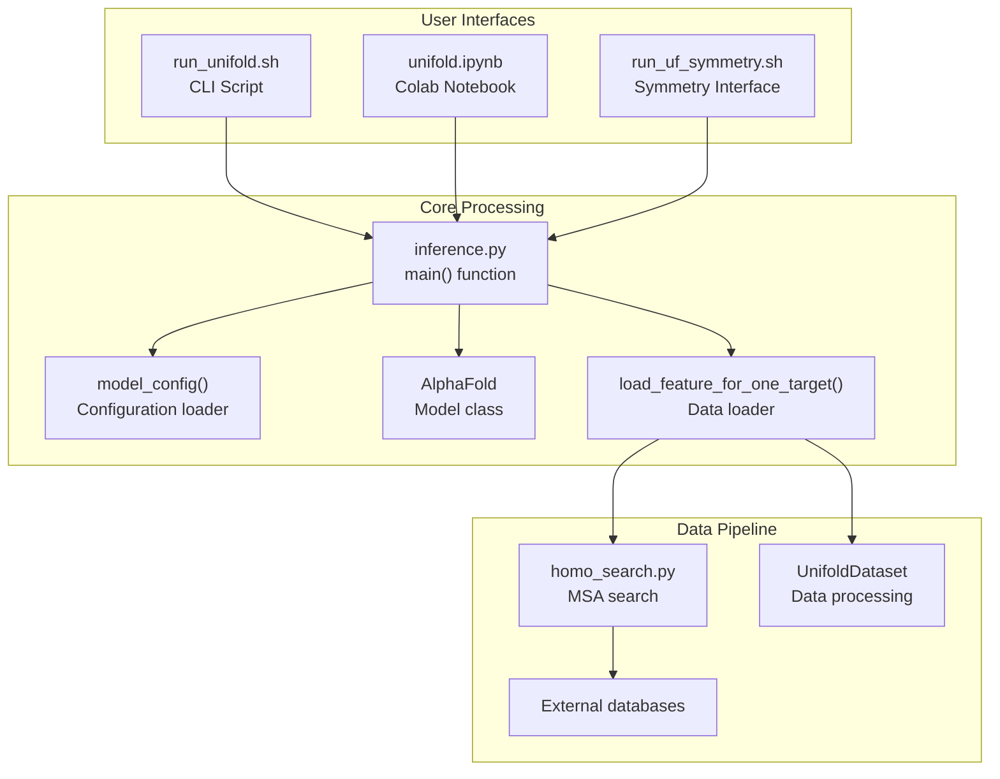
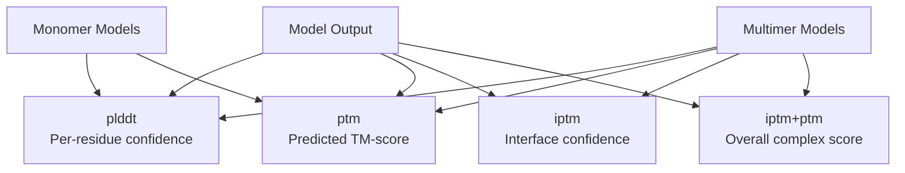

# Quick Start Guide

> **Relevant source files**
> * [README.md](https://github.com/dptech-corp/Uni-Fold/blob/7b55789e/README.md?plain=1)
> * [unifold/inference.py](https://github.com/dptech-corp/Uni-Fold/blob/7b55789e/unifold/inference.py)

This guide provides the fastest path to running your first protein structure predictions with Uni-Fold. It covers the essential commands and workflows needed to predict monomer and multimer structures from FASTA sequences.

For detailed installation instructions, see [Installation and Setup](/dptech-corp/Uni-Fold/2.1-installation-and-setup). For Docker-based deployment, see [Docker Deployment](/dptech-corp/Uni-Fold/2.3-docker-deployment). For advanced configuration and training, see [Training and Fine-tuning](/dptech-corp/Uni-Fold/6-training-and-fine-tuning).

## Prerequisites

Before starting, ensure you have:

* Uni-Fold installed (see [Installation and Setup](/dptech-corp/Uni-Fold/2.1-installation-and-setup))
* Downloaded sequence and structure databases (~3TB)
* Downloaded pre-trained model parameters
* Access to GPU resources (recommended)

## Basic Workflow Overview

The standard Uni-Fold prediction workflow follows these steps:



Sources: [README.md L125-L141](https://github.com/dptech-corp/Uni-Fold/blob/7b55789e/README.md?plain=1#L125-L141)

 [unifold/inference.py L77-L94](https://github.com/dptech-corp/Uni-Fold/blob/7b55789e/unifold/inference.py#L77-L94)

## Entry Points and Core Components

Uni-Fold provides multiple interfaces that connect to the same underlying prediction engine:



Sources: [README.md L127-L138](https://github.com/dptech-corp/Uni-Fold/blob/7b55789e/README.md?plain=1#L127-L138)

 [unifold/inference.py L49-L74](https://github.com/dptech-corp/Uni-Fold/blob/7b55789e/unifold/inference.py#L49-L74)

 [unifold/inference.py L77-L94](https://github.com/dptech-corp/Uni-Fold/blob/7b55789e/unifold/inference.py#L77-L94)

## Monomer Prediction

To predict the structure of a single protein chain:

### Basic Command Structure

```
bash run_unifold.sh \    /path/to/input.fasta \    /path/to/output/directory/ \    /path/to/database/directory/ \    2020-05-01 \    model_2_ft \    /path/to/model_parameters.pt
```

### Example Monomer Prediction

```markdown
# Prepare input FASTA fileecho ">target_protein" > example.fastaecho "MKLLLLLLLLLLLLLLLLLLLLLLLLLLLLLLLLLLLLLLLLLLLLLLLLLLLLLLLLLLLLLLLLLL" >> example.fasta # Run predictionbash run_unifold.sh \    example.fasta \    ./output/ \    /data/databases/ \    2020-05-01 \    model_2_ft \    ./unifold_params/model_2_ft.pt
```

### Key Parameters

| Parameter | Description | Example Value |
| --- | --- | --- |
| Input FASTA | Single sequence file | `protein.fasta` |
| Output directory | Results destination | `./predictions/` |
| Database directory | MSA search databases | `/data/unifold_dbs/` |
| Template date cutoff | Exclude newer templates | `2020-05-01` |
| Model name | Configuration variant | `model_2_ft` |
| Parameter file | Pre-trained weights | `model_2_ft.pt` |

Sources: [README.md L127-L141](https://github.com/dptech-corp/Uni-Fold/blob/7b55789e/README.md?plain=1#L127-L141)

 [unifold/inference.py L202-L257](https://github.com/dptech-corp/Uni-Fold/blob/7b55789e/unifold/inference.py#L202-L257)

## Multimer Prediction

For protein complexes with multiple chains:

### Input Format

For multimers, the FASTA file must contain **all sequences** of the complex, including duplicated chains:

```markdown
# Example: heterodimer A-Becho ">chain_A" > complex.fastaecho "MKLLLLLLLLLLLLLLLLLLLLLLLLLLLLLLLLLLLLLLLLLLLLLLLLLLLLLLLLLLLLLLLLLL" >> complex.fastaecho ">chain_B" > complex.fastaecho "MADEQLLLLLLLLLLLLLLLLLLLLLLLLLLLLLLLLLLLLLLLLLLLLLLLLLLLLLLLLLLLLLL" >> complex.fasta # Example: homodimer A-A (duplicate identical sequences)echo ">chain_A_1" > homodimer.fastaecho "MKLLLLLLLLLLLLLLLLLLLLLLLLLLLLLLLLLLLLLLLLLLLLLLLLLLLLLLLLLLLLLLLLLL" >> homodimer.fastaecho ">chain_A_2" >> homodimer.fastaecho "MKLLLLLLLLLLLLLLLLLLLLLLLLLLLLLLLLLLLLLLLLLLLLLLLLLLLLLLLLLLLLLLLLLL" >> homodimer.fasta
```

### Multimer Command

```
bash run_unifold.sh \    complex.fasta \    ./multimer_output/ \    /data/databases/ \    2020-05-01 \    multimer_ft \    ./unifold_params/multimer_ft.pt
```

**Important**: Use `multimer_ft` model for complex predictions, not `model_2_ft`.

Sources: [README.md L140-L141](https://github.com/dptech-corp/Uni-Fold/blob/7b55789e/README.md?plain=1#L140-L141)

 [unifold/inference.py L82](https://github.com/dptech-corp/Uni-Fold/blob/7b55789e/unifold/inference.py#L82-L82)

## Understanding Outputs

### Output Files

After successful prediction, the output directory contains:

```markdown
output_directory/
├── target_name/
│   ├── best.pdb                    # Highest confidence structure
│   ├── model_*.pdb                 # Individual predictions
│   ├── *_plddt.json               # Per-residue confidence scores
│   ├── *_ptm.json                 # Interface confidence (multimers)
│   └── *_outputs.pkl.gz           # Raw model outputs (optional)
```

### Confidence Metrics



| Metric | Range | Interpretation |
| --- | --- | --- |
| `plddt` | 0-100 | Per-residue confidence (>90: very high, >70: confident, <50: low) |
| `ptm` | 0-1 | Predicted TM-score vs. true structure |
| `iptm` | 0-1 | Interface confidence for multimers |
| `iptm+ptm` | 0-1 | Overall multimer confidence |

Sources: [README.md L142-L144](https://github.com/dptech-corp/Uni-Fold/blob/7b55789e/README.md?plain=1#L142-L144)

 [unifold/inference.py L152-L198](https://github.com/dptech-corp/Uni-Fold/blob/7b55789e/unifold/inference.py#L152-L198)

## Advanced Options

### Performance Optimization

The inference system automatically optimizes memory usage based on sequence length and available GPU memory:

```markdown
# Automatic chunk size calculation in inference.pychunk_size, block_size = automatic_chunk_size(    seq_len,     args.model_device,     args.bf16)
```

### Common Parameters

| Flag | Purpose | Usage |
| --- | --- | --- |
| `--bf16` | Enable mixed precision | Faster inference, lower memory |
| `--max_recycling_iters` | Control iterative refinement | Default: 3, increase for accuracy |
| `--num_ensembles` | Multiple predictions | Default: 2, increase for diversity |
| `--sample_templates` | Template sampling | Enable for prediction diversity |

Sources: [unifold/inference.py L29-L47](https://github.com/dptech-corp/Uni-Fold/blob/7b55789e/unifold/inference.py#L29-L47)

 [unifold/inference.py L127-L133](https://github.com/dptech-corp/Uni-Fold/blob/7b55789e/unifold/inference.py#L127-L133)

## Next Steps

Once you have basic predictions working:

1. **Explore specialized features**: UF-Symmetry for large symmetric complexes ([UF-Symmetry Interface](/dptech-corp/Uni-Fold/3.3-uf-symmetry-interface))
2. **Understand the data pipeline**: Learn about MSA generation and feature processing ([Data Pipeline](/dptech-corp/Uni-Fold/4-data-pipeline))
3. **Optimize performance**: Configure advanced parameters and GPU settings
4. **Train custom models**: Fine-tune or train from scratch ([Training and Fine-tuning](/dptech-corp/Uni-Fold/6-training-and-fine-tuning))
5. **Use interactive interfaces**: Try the Colab notebook for interactive exploration ([Colab Notebook Interface](/dptech-corp/Uni-Fold/3.2-colab-notebook-interface))

For troubleshooting common issues and detailed configuration options, see the [Command Line Interface](/dptech-corp/Uni-Fold/3.1-command-line-interface) documentation.

Sources: [README.md L260-L282](https://github.com/dptech-corp/Uni-Fold/blob/7b55789e/README.md?plain=1#L260-L282)

 [README.md L125-L164](https://github.com/dptech-corp/Uni-Fold/blob/7b55789e/README.md?plain=1#L125-L164)