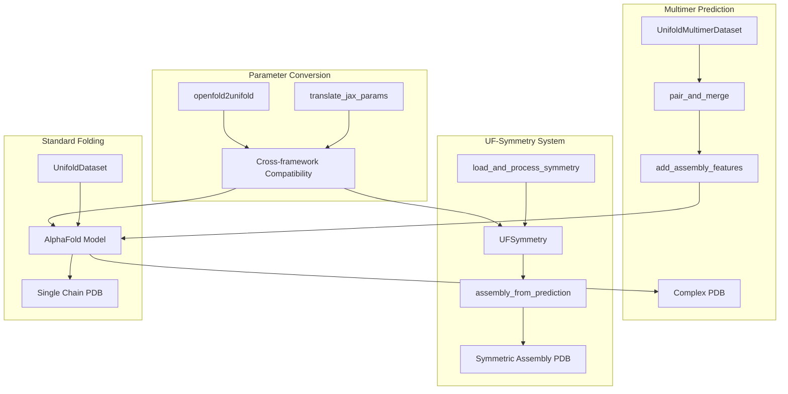
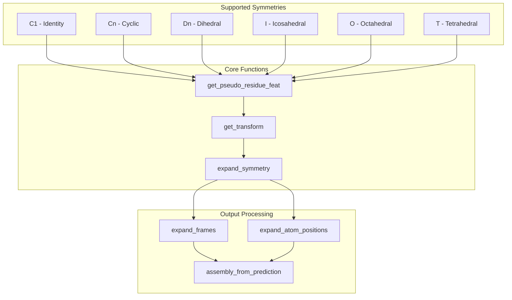
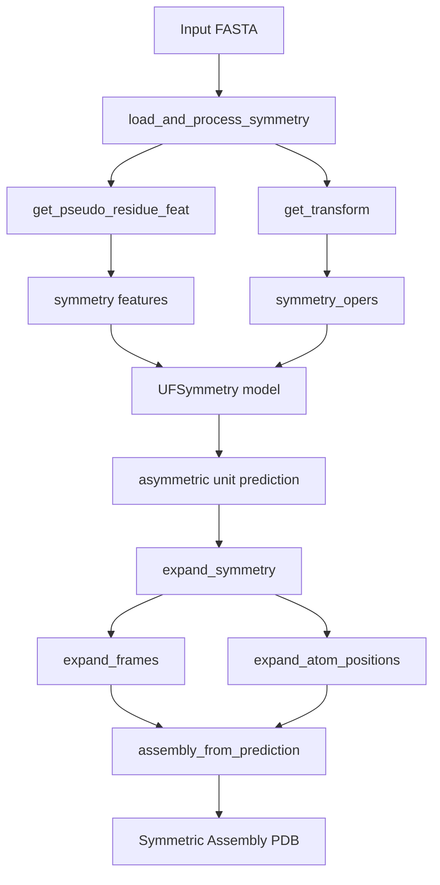
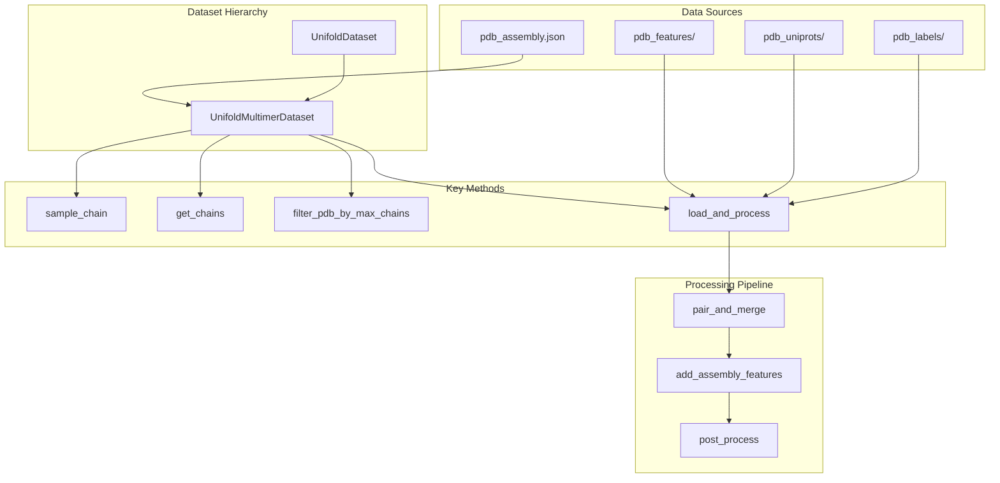
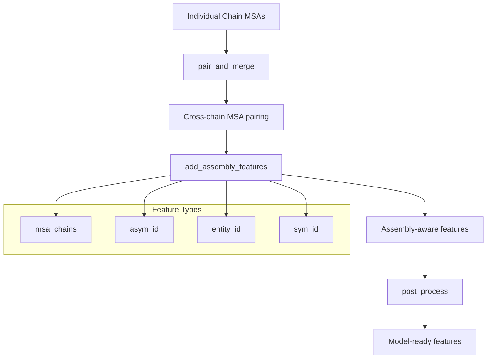
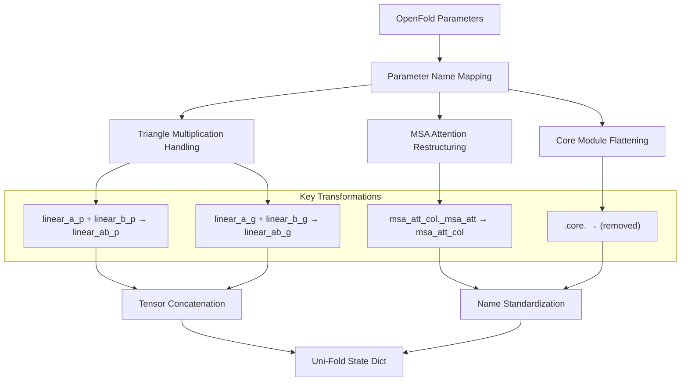
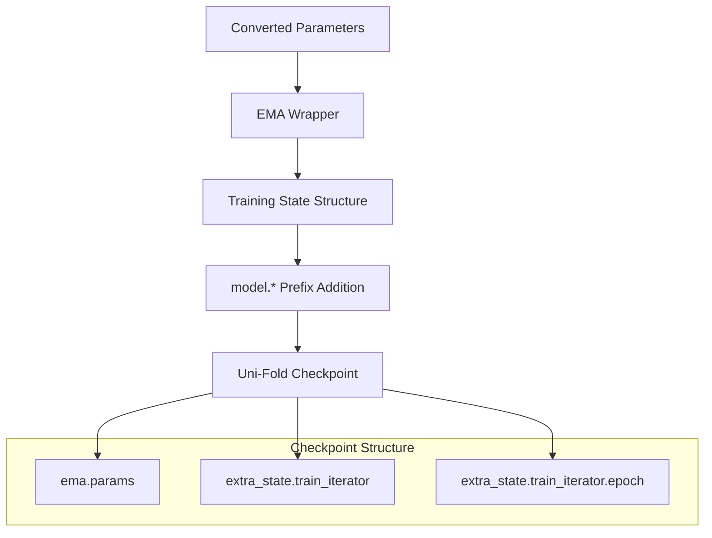

# Specialized Features

> **Relevant source files**
> * [.gitignore](https://github.com/dptech-corp/Uni-Fold/blob/7b55789e/.gitignore)
> * [img/uf-symmetry-effect.gif](https://github.com/dptech-corp/Uni-Fold/blob/7b55789e/img/uf-symmetry-effect.gif)
> * [scripts/convert_openfold_to_unifold.py](https://github.com/dptech-corp/Uni-Fold/blob/7b55789e/scripts/convert_openfold_to_unifold.py)
> * [unifold/data/utils.py](https://github.com/dptech-corp/Uni-Fold/blob/7b55789e/unifold/data/utils.py)
> * [unifold/dataset.py](https://github.com/dptech-corp/Uni-Fold/blob/7b55789e/unifold/dataset.py)
> * [unifold/inference_symmetry.py](https://github.com/dptech-corp/Uni-Fold/blob/7b55789e/unifold/inference_symmetry.py)
> * [unifold/symmetry/__init__.py](https://github.com/dptech-corp/Uni-Fold/blob/7b55789e/unifold/symmetry/__init__.py)
> * [unifold/symmetry/assemble.py](https://github.com/dptech-corp/Uni-Fold/blob/7b55789e/unifold/symmetry/assemble.py)
> * [unifold/symmetry/config.py](https://github.com/dptech-corp/Uni-Fold/blob/7b55789e/unifold/symmetry/config.py)
> * [unifold/symmetry/dataset.py](https://github.com/dptech-corp/Uni-Fold/blob/7b55789e/unifold/symmetry/dataset.py)

This document covers the advanced capabilities of Uni-Fold beyond standard single-chain protein structure prediction. These specialized features enable prediction of complex protein assemblies and provide interoperability with other frameworks.

For basic protein folding workflows, see [User Interfaces](/dptech-corp/Uni-Fold/3-user-interfaces). For model architecture details, see [Model Architecture](/dptech-corp/Uni-Fold/5-model-architecture). For training these specialized models, see [Training and Fine-tuning](/dptech-corp/Uni-Fold/6-training-and-fine-tuning).

## Overview

Uni-Fold provides three main specialized features that extend its capabilities beyond standard AlphaFold functionality:

| Feature | Purpose | Key Components |
| --- | --- | --- |
| UF-Symmetry System | Predict large symmetric protein complexes efficiently | `UFSymmetry`, `load_and_process_symmetry` |
| Multimer Prediction | Handle protein complexes with multiple interacting chains | `UnifoldMultimerDataset`, `pair_and_merge` |
| Parameter Conversion | Convert weights between AlphaFold, OpenFold, and Uni-Fold | `convert_openfold_to_unifold.py`, `translate_jax_params.py` |

Sources: [unifold/dataset.py L240-L535](https://github.com/dptech-corp/Uni-Fold/blob/7b55789e/unifold/dataset.py#L240-L535)

 [unifold/symmetry/__init__.py L14-L18](https://github.com/dptech-corp/Uni-Fold/blob/7b55789e/unifold/symmetry/__init__.py#L14-L18)

 [scripts/convert_openfold_to_unifold.py L1-L66](https://github.com/dptech-corp/Uni-Fold/blob/7b55789e/scripts/convert_openfold_to_unifold.py#L1-L66)

## UF-Symmetry System

The UF-Symmetry system enables efficient prediction of large symmetric protein complexes by predicting only the asymmetric unit and then applying symmetry operations to generate the full assembly.

### Symmetry Groups and Operations

The system supports multiple symmetry groups with specific mathematical transformations:

The `get_pseudo_residue_feat` function in [unifold/symmetry/dataset.py L10-L31](https://github.com/dptech-corp/Uni-Fold/blob/7b55789e/unifold/symmetry/dataset.py#L10-L31)

 encodes symmetry information as 8-dimensional feature vectors, where different positions encode the symmetry type and parameters.

### Data Processing Pipeline

The key data processing functions handle symmetry-specific transformations:

* `load_and_process_symmetry` [unifold/symmetry/dataset.py L34-L53](https://github.com/dptech-corp/Uni-Fold/blob/7b55789e/unifold/symmetry/dataset.py#L34-L53)  loads features and adds symmetry-specific tensors
* `expand_symmetry` [unifold/symmetry/assemble.py L52-L105](https://github.com/dptech-corp/Uni-Fold/blob/7b55789e/unifold/symmetry/assemble.py#L52-L105)  applies symmetry operations to generate the full assembly
* `assembly_from_prediction` [unifold/symmetry/assemble.py L108-L126](https://github.com/dptech-corp/Uni-Fold/blob/7b55789e/unifold/symmetry/assemble.py#L108-L126)  creates the final protein structure

### Model Architecture Extensions

The UF-Symmetry model extends the base AlphaFold architecture with specialized components:

| Component | Purpose | Configuration |
| --- | --- | --- |
| `pseudo_residue_embedder` | Process symmetry features | 8 input → 48 hidden → 48 output dims |
| `input_embedder.pr_dim` | Integrate pseudo-residue features | 48 dimensions |
| Enhanced MSA processing | Handle symmetric assemblies | max_msa_clusters: 256 |

The configuration is defined in [unifold/symmetry/config.py L4-L28](https://github.com/dptech-corp/Uni-Fold/blob/7b55789e/unifold/symmetry/config.py#L4-L28)

 and modifies the base multimer config to support symmetry-specific features.

Sources: [unifold/symmetry/dataset.py L10-L53](https://github.com/dptech-corp/Uni-Fold/blob/7b55789e/unifold/symmetry/dataset.py#L10-L53)

 [unifold/symmetry/assemble.py L52-L126](https://github.com/dptech-corp/Uni-Fold/blob/7b55789e/unifold/symmetry/assemble.py#L52-L126)

 [unifold/symmetry/config.py L4-L28](https://github.com/dptech-corp/Uni-Fold/blob/7b55789e/unifold/symmetry/config.py#L4-L28)

 [unifold/symmetry/model.py](https://github.com/dptech-corp/Uni-Fold/blob/7b55789e/unifold/symmetry/model.py)

 [unifold/inference_symmetry.py L56-L172](https://github.com/dptech-corp/Uni-Fold/blob/7b55789e/unifold/inference_symmetry.py#L56-L172)

## Multimer Prediction

The multimer prediction system handles protein complexes with multiple interacting chains through specialized data processing and MSA pairing algorithms.

### Dataset Architecture

The `UnifoldMultimerDataset` class [unifold/dataset.py L399-L535](https://github.com/dptech-corp/Uni-Fold/blob/7b55789e/unifold/dataset.py#L399-L535)

 extends the base dataset with multimer-specific functionality:

* **Chain Management**: Groups chains by PDB ID using `get_chains` [unifold/dataset.py L503-L510](https://github.com/dptech-corp/Uni-Fold/blob/7b55789e/unifold/dataset.py#L503-L510)
* **Assembly Handling**: Processes symmetry operations from `pdb_assembly.json` [unifold/dataset.py L416-L418](https://github.com/dptech-corp/Uni-Fold/blob/7b55789e/unifold/dataset.py#L416-L418)
* **Size Filtering**: Limits complexes by `max_chains` parameter [unifold/dataset.py L513-L534](https://github.com/dptech-corp/Uni-Fold/blob/7b55789e/unifold/dataset.py#L513-L534)

### MSA Pairing and Processing

The multimer system uses sophisticated MSA pairing to identify co-evolving residues across different chains:

Key processing functions from [unifold/data/process_multimer.py](https://github.com/dptech-corp/Uni-Fold/blob/7b55789e/unifold/data/process_multimer.py)

:

* `pair_and_merge`: Aligns MSAs across chains to identify co-evolving positions
* `add_assembly_features`: Adds chain, entity, and symmetry identifiers
* `convert_monomer_features`: Adapts single-chain features for multimer use
* `merge_msas`: Combines MSAs with different sources (species-specific, UniProt)

### Assembly and Symmetry Operations

The multimer dataset handles both asymmetric complexes and symmetric assemblies through the `symmetry_operations` parameter [unifold/dataset.py L442-L454](https://github.com/dptech-corp/Uni-Fold/blob/7b55789e/unifold/dataset.py#L442-L454)

:

| Operation Type | Description | Processing |
| --- | --- | --- |
| Identity (`"I"`) | No transformation | Direct coordinates |
| Rotation + Translation | 3x3 matrix + 3D vector | Applied via `process_label` |
| Assembly-specific | From `pdb_assembly.json` | Chain-specific operations |

The `load` function [unifold/dataset.py L119-L169](https://github.com/dptech-corp/Uni-Fold/blob/7b55789e/unifold/dataset.py#L119-L169)

 coordinates the entire loading process, handling both features and labels while applying symmetry operations when specified.

Sources: [unifold/dataset.py L399-L535](https://github.com/dptech-corp/Uni-Fold/blob/7b55789e/unifold/dataset.py#L399-L535)

 [unifold/data/process_multimer.py L11-L17](https://github.com/dptech-corp/Uni-Fold/blob/7b55789e/unifold/data/process_multimer.py#L11-L17)

 [unifold/dataset.py L119-L169](https://github.com/dptech-corp/Uni-Fold/blob/7b55789e/unifold/dataset.py#L119-L169)

 [unifold/dataset.py L55-L61](https://github.com/dptech-corp/Uni-Fold/blob/7b55789e/unifold/dataset.py#L55-L61)

## Parameter Conversion System

Uni-Fold provides utilities to convert model parameters between different framework formats, enabling interoperability with AlphaFold (JAX) and OpenFold (PyTorch) implementations.

### OpenFold to Uni-Fold Conversion

The `openfold2unifold` function [scripts/convert_openfold_to_unifold.py L4-L51](https://github.com/dptech-corp/Uni-Fold/blob/7b55789e/scripts/convert_openfold_to_unifold.py#L4-L51)

 handles parameter name mapping and tensor concatenation:

### Parameter Structure Mapping

The conversion process handles several architectural differences:

| Component | OpenFold Format | Uni-Fold Format | Transformation |
| --- | --- | --- | --- |
| Triangle Multiplication | Separate `linear_a_p`, `linear_b_p` | Combined `linear_ab_p` | Concatenate along dim 0 |
| Triangle Gates | Separate `linear_a_g`, `linear_b_g` | Combined `linear_ab_g` | Concatenate along dim 0 |
| MSA Column Attention | `msa_att_col._msa_att` | `msa_att_col` | Remove nested structure |
| Core Modules | `core.module_name` | `module_name` | Flatten hierarchy |

### State Dictionary Restructuring

The conversion script creates a properly formatted checkpoint compatible with Uni-Fold's training framework [scripts/convert_openfold_to_unifold.py L54-L65](https://github.com/dptech-corp/Uni-Fold/blob/7b55789e/scripts/convert_openfold_to_unifold.py#L54-L65)

:

This conversion enables users to leverage pre-trained OpenFold models within the Uni-Fold framework while maintaining compatibility with the training and inference pipelines.

Sources: [scripts/convert_openfold_to_unifold.py L4-L65](https://github.com/dptech-corp/Uni-Fold/blob/7b55789e/scripts/convert_openfold_to_unifold.py#L4-L65)