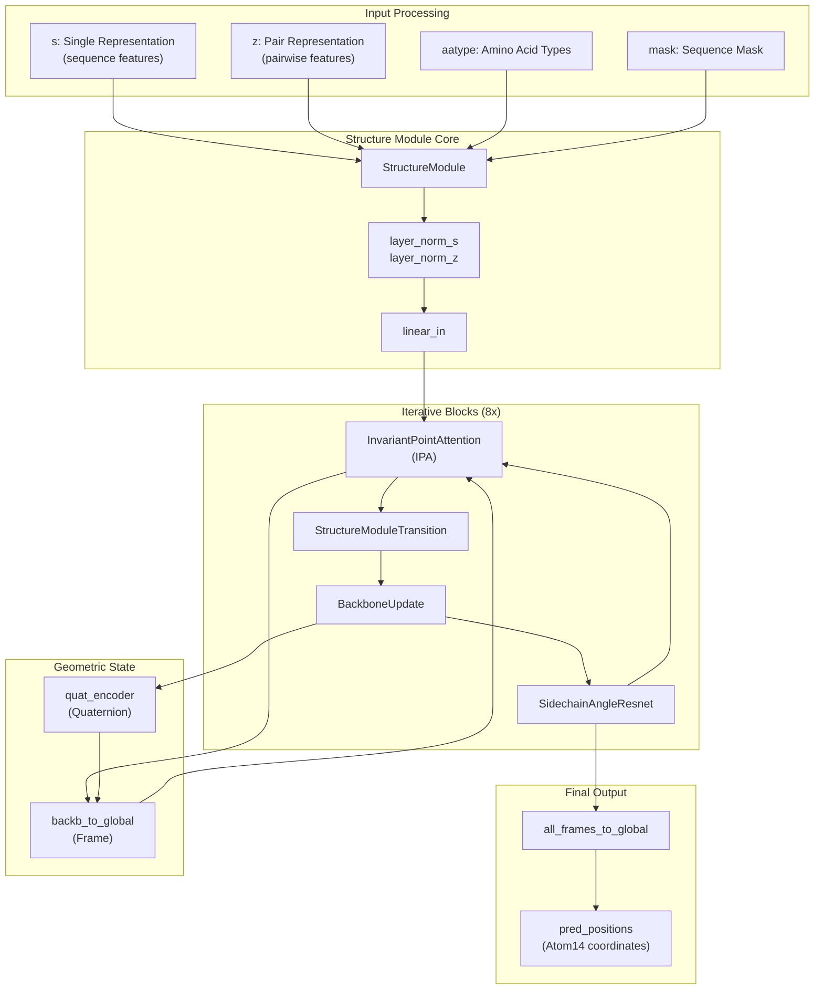
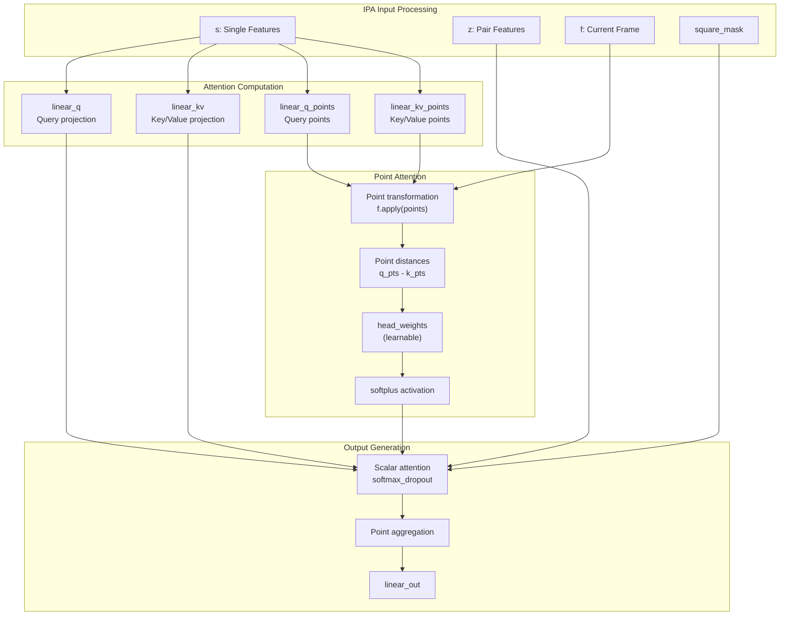
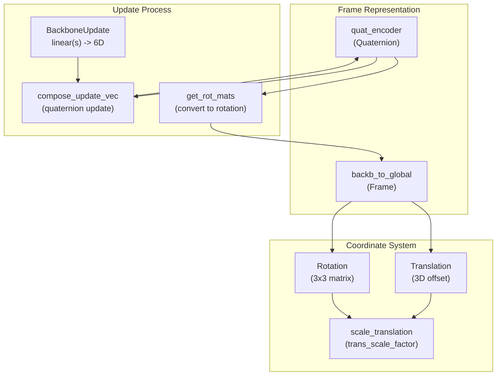
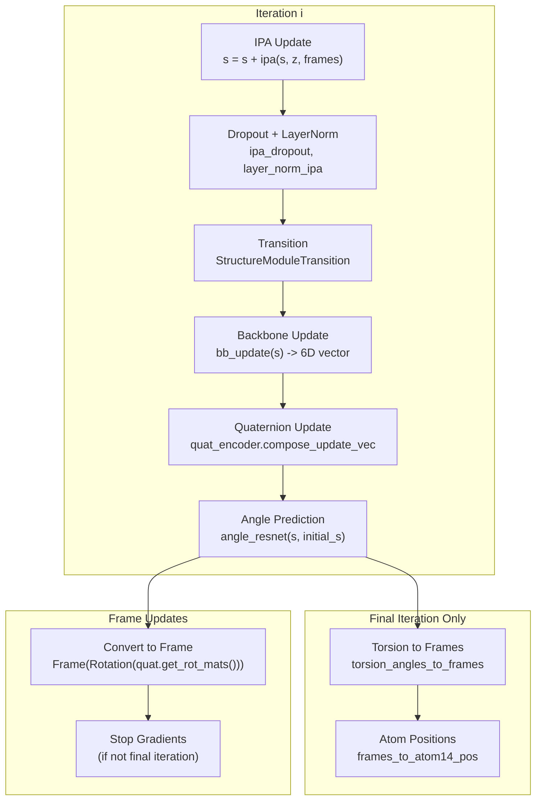
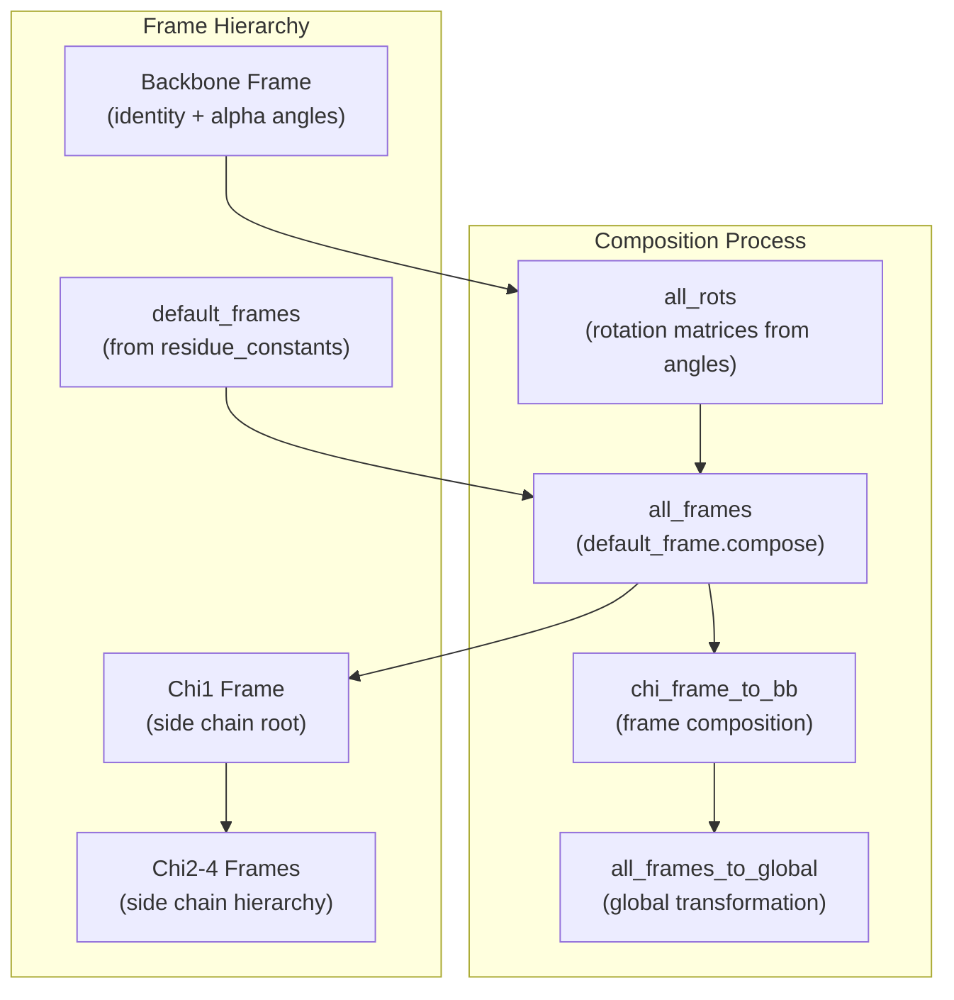

# Structure Module

> **Relevant source files**
> * [unifold/modules/common.py](https://github.com/dptech-corp/Uni-Fold/blob/7b55789e/unifold/modules/common.py)
> * [unifold/modules/embedders.py](https://github.com/dptech-corp/Uni-Fold/blob/7b55789e/unifold/modules/embedders.py)
> * [unifold/modules/structure_module.py](https://github.com/dptech-corp/Uni-Fold/blob/7b55789e/unifold/modules/structure_module.py)
> * [unifold/modules/triangle_multiplication.py](https://github.com/dptech-corp/Uni-Fold/blob/7b55789e/unifold/modules/triangle_multiplication.py)

The Structure Module is responsible for converting processed sequence and pair representations from the Evoformer into 3D protein coordinates. This module implements the core geometry-aware components that predict backbone frames, side chain conformations, and final atomic positions through an iterative refinement process.

For information about the overall model orchestration, see [Core AlphaFold Model](/dptech-corp/Uni-Fold/5.1-core-alphafold-model). For details on sequence processing that precedes structure prediction, see [Evoformer Stack](/dptech-corp/Uni-Fold/5.2-evoformer-stack). For template-based structural guidance, see [Template Processing](/dptech-corp/Uni-Fold/5.4-template-processing).

## Architecture Overview

The Structure Module operates through iterative blocks that progressively refine 3D structure predictions. Each iteration combines geometry-aware attention, backbone updates, and side chain angle prediction to improve coordinate accuracy.

Sources: [unifold/modules/structure_module.py L396-L592](https://github.com/dptech-corp/Uni-Fold/blob/7b55789e/unifold/modules/structure_module.py#L396-L592)

## Key Components

### Invariant Point Attention (IPA)

The `InvariantPointAttention` class implements geometry-aware attention that operates on both sequence features and 3D point coordinates, maintaining invariance to global rotations and translations.

The IPA mechanism combines traditional attention over sequence features with attention over 3D point coordinates, allowing the model to reason about spatial relationships while remaining invariant to coordinate system transformations.

Sources: [unifold/modules/structure_module.py L165-L338](https://github.com/dptech-corp/Uni-Fold/blob/7b55789e/unifold/modules/structure_module.py#L165-L338)

### Backbone Updates and Frame Management

The Structure Module maintains backbone geometry through `Frame` and `Quaternion` representations that are updated iteratively.

Sources: [unifold/modules/structure_module.py L341-L347](https://github.com/dptech-corp/Uni-Fold/blob/7b55789e/unifold/modules/structure_module.py#L341-L347)

 [unifold/modules/structure_module.py L500-L515](https://github.com/dptech-corp/Uni-Fold/blob/7b55789e/unifold/modules/structure_module.py#L500-L515)

### Side Chain Angle Prediction

The `SidechainAngleResnet` predicts torsion angles that define side chain conformations, which are then converted to atomic coordinates.

| Component | Purpose | Input | Output |
| --- | --- | --- | --- |
| `linear_in` | Input projection | Single features | Hidden dimension |
| `linear_initial` | Initial state | Initial single features | Hidden dimension |
| `SideChainAngleResnetIteration` | Residual blocks | Hidden features | Updated features |
| `linear_out` | Angle prediction | Hidden features | `num_angles * 2` (sin/cos) |

The angle prediction process normalizes outputs to unit vectors representing sine/cosine pairs for each torsion angle, ensuring valid geometric constraints.

Sources: [unifold/modules/structure_module.py L123-L163](https://github.com/dptech-corp/Uni-Fold/blob/7b55789e/unifold/modules/structure_module.py#L123-L163)

## Iterative Refinement Process

The Structure Module performs `num_blocks` iterations (typically 8) of structure refinement, with each iteration following this sequence:

Each iteration produces outputs including frames, unnormalized angles, and normalized angles. Only the final iteration generates full atomic coordinates to save computation.

Sources: [unifold/modules/structure_module.py L493-L547](https://github.com/dptech-corp/Uni-Fold/blob/7b55789e/unifold/modules/structure_module.py#L493-L547)

## Coordinate Generation

The final coordinate generation involves converting predicted torsion angles to rigid body transformations and then to atomic positions.

### Torsion Angles to Frames

The `torsion_angles_to_frames` function builds a hierarchy of coordinate frames for each residue's rigid groups:

### Atomic Position Calculation

The `frames_and_literature_positions_to_atom14_pos` function applies the computed frames to standard atomic positions:

| Input | Description | Source |
| --- | --- | --- |
| `frame` | Global rigid body frames | Frame composition |
| `aatype` | Amino acid types | Input features |
| `group_idx` | Atom to rigid group mapping | `restype_atom14_to_rigid_group` |
| `atom_mask` | Valid atom mask | `restype_atom14_mask` |
| `lit_positions` | Standard atomic positions | `restype_atom14_rigid_group_positions` |

Sources: [unifold/modules/structure_module.py L30-L101](https://github.com/dptech-corp/Uni-Fold/blob/7b55789e/unifold/modules/structure_module.py#L30-L101)

 [unifold/modules/structure_module.py L578-L591](https://github.com/dptech-corp/Uni-Fold/blob/7b55789e/unifold/modules/structure_module.py#L578-L591)

## Module Configuration

The `StructureModule` constructor accepts these key parameters:

| Parameter | Default | Description |
| --- | --- | --- |
| `num_blocks` | 8 | Number of iterative refinement blocks |
| `d_ipa` | 16 | IPA hidden dimension |
| `num_heads_ipa` | 12 | Number of attention heads in IPA |
| `num_qk_points` | 4 | Query/key points per head |
| `num_v_points` | 8 | Value points per head |
| `dropout_rate` | 0.1 | Dropout probability |
| `trans_scale_factor` | 10 | Translation scaling factor |
| `separate_kv` | False | Whether to use separate key/value projections |

The module integrates with residue constants from `unifold.data.residue_constants` for standard atomic positions and rigid group definitions.

Sources: [unifold/modules/structure_module.py L396-L417](https://github.com/dptech-corp/Uni-Fold/blob/7b55789e/unifold/modules/structure_module.py#L396-L417)

 [unifold/data/residue_constants.py L8-L13](https://github.com/dptech-corp/Uni-Fold/blob/7b55789e/unifold/data/residue_constants.py#L8-L13)