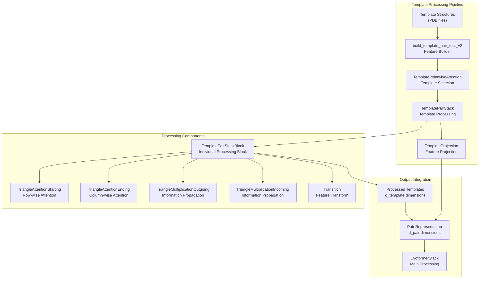
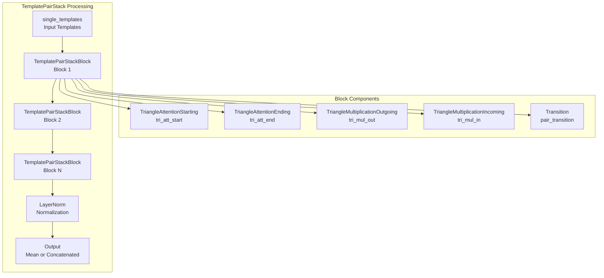
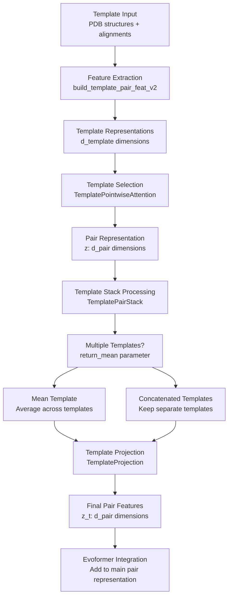

# Template Processing

> **Relevant source files**
> * [benchmark/perf_others.py](https://github.com/dptech-corp/Uni-Fold/blob/7b55789e/benchmark/perf_others.py)
> * [benchmark/perf_unifold.py](https://github.com/dptech-corp/Uni-Fold/blob/7b55789e/benchmark/perf_unifold.py)
> * [unifold/modules/common.py](https://github.com/dptech-corp/Uni-Fold/blob/7b55789e/unifold/modules/common.py)
> * [unifold/modules/template.py](https://github.com/dptech-corp/Uni-Fold/blob/7b55789e/unifold/modules/template.py)
> * [unifold/modules/triangle_multiplication.py](https://github.com/dptech-corp/Uni-Fold/blob/7b55789e/unifold/modules/triangle_multiplication.py)

This document covers the template processing system in Uni-Fold, which incorporates known structural information from similar proteins to guide structure prediction. Template processing takes structural templates (known protein structures similar to the target) and transforms them into features that can be used by the main AlphaFold model to improve prediction accuracy.

For information about the overall model architecture, see [Core AlphaFold Model](/dptech-corp/Uni-Fold/5.1-core-alphafold-model). For details about the Evoformer stack that processes the output of template processing, see [Evoformer Stack](/dptech-corp/Uni-Fold/5.2-evoformer-stack).

## Purpose and Role in Protein Folding

Template processing addresses a key challenge in protein structure prediction: leveraging existing structural knowledge. When predicting a protein's structure, if there are known structures of similar proteins (templates), this information can significantly improve prediction accuracy. The template processing system transforms these structural templates into learned representations that guide the main prediction model.

The system takes as input:

* Template structures (from PDB or other structural databases)
* Template-target alignments
* Template metadata and confidence scores

It outputs processed template representations that are incorporated into the pair representation used by the Evoformer stack.

Sources: [unifold/modules/template.py L1-L341](https://github.com/dptech-corp/Uni-Fold/blob/7b55789e/unifold/modules/template.py#L1-L341)

## System Architecture

Sources: [unifold/modules/template.py:21], [unifold/modules/template.py L256-L341](https://github.com/dptech-corp/Uni-Fold/blob/7b55789e/unifold/modules/template.py#L256-L341)

 [unifold/modules/template.py L113-L254](https://github.com/dptech-corp/Uni-Fold/blob/7b55789e/unifold/modules/template.py#L113-L254)

## Core Template Processing Components

### TemplatePointwiseAttention

The `TemplatePointwiseAttention` class implements attention over template structures to select and weight relevant template information for each position pair in the target protein.

| Component | Purpose | Key Parameters |
| --- | --- | --- |
| `mha` | Multi-head attention mechanism | `d_pair`, `d_template`, `d_hid`, `num_heads` |
| `_chunk` | Memory-efficient chunked processing | `chunk_size` |
| `forward` | Main attention computation | `template_mask` for masking invalid templates |

The attention mechanism uses the pair representation as queries and template features as keys and values, allowing the model to selectively attend to relevant template information.

Sources: [unifold/modules/template.py L34-L91](https://github.com/dptech-corp/Uni-Fold/blob/7b55789e/unifold/modules/template.py#L34-L91)

### TemplatePairStack

The `TemplatePairStack` orchestrates the processing of template pair representations through multiple layers of specialized attention and interaction blocks.

Sources: [unifold/modules/template.py L256-L341](https://github.com/dptech-corp/Uni-Fold/blob/7b55789e/unifold/modules/template.py#L256-L341)

 [unifold/modules/template.py L113-L254](https://github.com/dptech-corp/Uni-Fold/blob/7b55789e/unifold/modules/template.py#L113-L254)

### TemplatePairStackBlock

Each `TemplatePairStackBlock` processes template pair representations using the same architectural components as the main Evoformer, adapted for template-specific processing:

| Operation | Purpose | Implementation |
| --- | --- | --- |
| Triangle Attention (Starting) | Row-wise interactions between residue pairs | `TriangleAttentionStarting` |
| Triangle Attention (Ending) | Column-wise interactions between residue pairs | `TriangleAttentionEnding` |
| Triangle Multiplication (Outgoing) | Information propagation across triangle edges | `TriangleMultiplicationOutgoing` |
| Triangle Multiplication (Incoming) | Information propagation across triangle edges | `TriangleMultiplicationIncoming` |
| Pair Transition | Non-linear feature transformation | `Transition` |

The `tri_attn_first` parameter controls whether attention operations occur before or after multiplication operations, affecting the information flow within each block.

Sources: [unifold/modules/template.py L113-L254](https://github.com/dptech-corp/Uni-Fold/blob/7b55789e/unifold/modules/template.py#L113-L254)

## Template Processing Flow

Sources: [unifold/modules/template.py L289-L340](https://github.com/dptech-corp/Uni-Fold/blob/7b55789e/unifold/modules/template.py#L289-L340)

 [unifold/modules/template.py L94-L111](https://github.com/dptech-corp/Uni-Fold/blob/7b55789e/unifold/modules/template.py#L94-L111)

## Key Implementation Details

### Memory Management and Chunking

Template processing implements several memory optimization strategies:

* **Chunked Attention**: The `TemplatePointwiseAttention._chunk` method processes attention in chunks to reduce memory usage
* **Block-wise Processing**: `TemplatePairStackBlock` supports `block_size` parameter for 2D chunking during inference
* **Sequential Checkpointing**: Uses `checkpoint_sequential` for gradient checkpointing during training

Sources: [unifold/modules/template.py L49-L67](https://github.com/dptech-corp/Uni-Fold/blob/7b55789e/unifold/modules/template.py#L49-L67)

 [unifold/modules/template.py L301-L314](https://github.com/dptech-corp/Uni-Fold/blob/7b55789e/unifold/modules/template.py#L301-L314)

### Template Aggregation Strategies

The system supports two approaches for handling multiple templates:

| Strategy | Parameter | Behavior | Use Case |
| --- | --- | --- | --- |
| Mean Aggregation | `return_mean=True` | Average template representations | Reduce noise from multiple templates |
| Concatenation | `return_mean=False` | Keep templates separate | Preserve individual template information |

### Residual Connections and Normalization

Template processing follows the same residual connection patterns as the main Evoformer:

* `bias_dropout_residual` for attention operations
* `tri_mul_residual` for triangle multiplication operations
* `residual` for transition operations
* `LayerNorm` for feature normalization

Sources: [unifold/modules/template.py L167-L252](https://github.com/dptech-corp/Uni-Fold/blob/7b55789e/unifold/modules/template.py#L167-L252)

 [unifold/modules/template.py L287](https://github.com/dptech-corp/Uni-Fold/blob/7b55789e/unifold/modules/template.py#L287-L287)

## Integration with Main Model

The template processing system integrates with the main AlphaFold model through the pair representation. Processed template features are projected to the same dimensionality as the main pair representation (`d_pair`) and added to guide the Evoformer's processing.

The `TemplateProjection` class handles cases where no templates are available, returning zero tensors to maintain consistent tensor shapes throughout the model.

Sources: [unifold/modules/template.py L94-L111](https://github.com/dptech-corp/Uni-Fold/blob/7b55789e/unifold/modules/template.py#L94-L111)