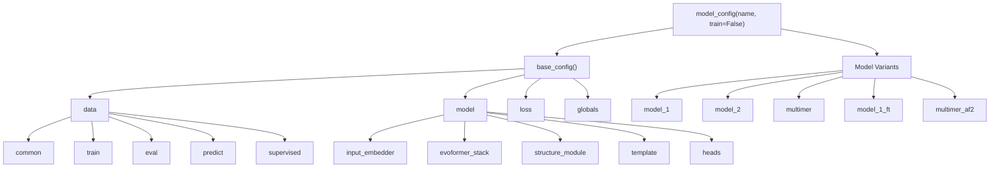
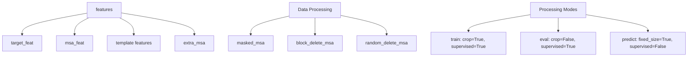
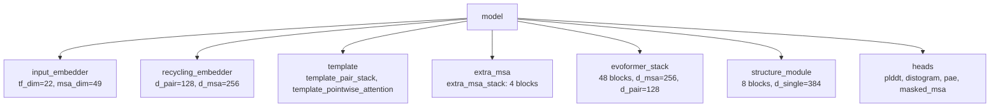
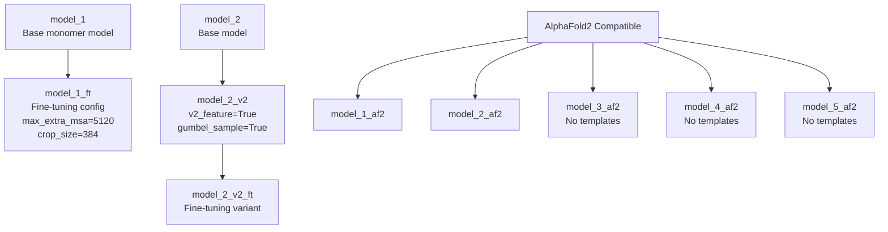
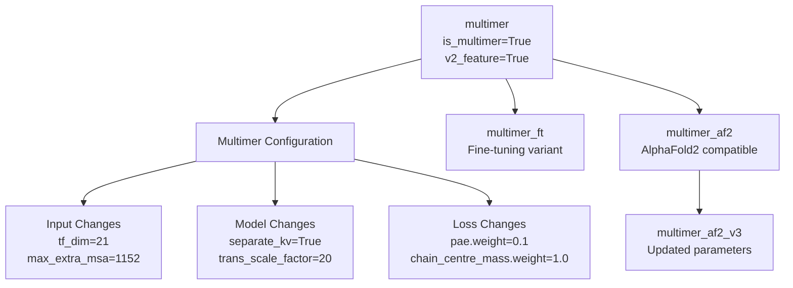
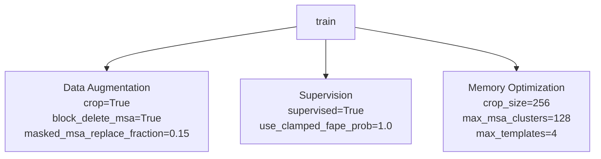
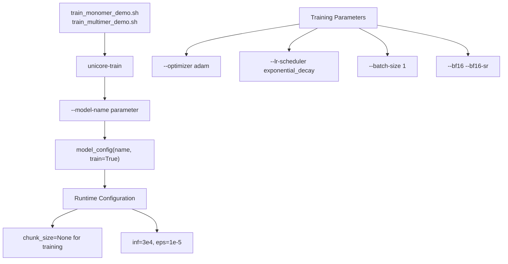

# Training Configuration

> **Relevant source files**
> * [train_monomer_demo.sh](https://github.com/dptech-corp/Uni-Fold/blob/7b55789e/train_monomer_demo.sh)
> * [train_multimer_demo.sh](https://github.com/dptech-corp/Uni-Fold/blob/7b55789e/train_multimer_demo.sh)
> * [unifold/config.py](https://github.com/dptech-corp/Uni-Fold/blob/7b55789e/unifold/config.py)

This document covers the training configuration system in Uni-Fold, which defines model architectures, hyperparameters, and training behaviors. The configuration system is implemented in [unifold/config.py](https://github.com/dptech-corp/Uni-Fold/blob/7b55789e/unifold/config.py)

 and provides a flexible framework for creating different model variants and training modes.

For information about the actual training scripts and execution, see [Training Scripts](/dptech-corp/Uni-Fold/6.2-training-scripts). For parameter conversion between different model formats, see [Parameter Conversion](/dptech-corp/Uni-Fold/6.3-parameter-conversion).

## Configuration Architecture

The Uni-Fold configuration system is built using `ml_collections.ConfigDict` and provides a hierarchical structure for defining all aspects of model training and inference.



**Sources:** [unifold/config.py L26-L466](https://github.com/dptech-corp/Uni-Fold/blob/7b55789e/unifold/config.py#L26-L466)

 [unifold/config.py L480-L672](https://github.com/dptech-corp/Uni-Fold/blob/7b55789e/unifold/config.py#L480-L672)

## Base Configuration Structure

The `base_config()` function defines the foundational configuration that all model variants inherit from. It contains four main sections:

### Data Configuration

The data section controls how input features are processed and prepared for training:

| Section | Purpose | Key Parameters |
| --- | --- | --- |
| `common` | Shared data processing settings | `max_recycling_iters`, `use_templates`, `is_multimer` |
| `train` | Training-specific data processing | `crop=True`, `crop_size=256`, `supervised=True` |
| `eval` | Evaluation data processing | `crop=False`, `num_ensembles=1` |
| `predict` | Inference data processing | `fixed_size=True`, `supervised=False` |



**Sources:** [unifold/config.py L29-L227](https://github.com/dptech-corp/Uni-Fold/blob/7b55789e/unifold/config.py#L29-L227)

### Model Configuration

The model section defines the neural network architecture:



**Sources:** [unifold/config.py L241-L391](https://github.com/dptech-corp/Uni-Fold/blob/7b55789e/unifold/config.py#L241-L391)

### Global Parameters

Global parameters are defined as `mlc.FieldReference` objects that can be shared across the configuration:

| Parameter | Value | Description |
| --- | --- | --- |
| `d_pair` | 128 | Pair representation dimension |
| `d_msa` | 256 | MSA representation dimension |
| `d_single` | 384 | Single representation dimension |
| `max_recycling_iters` | 3 | Maximum recycling iterations |
| `chunk_size` | 4 | Memory management chunk size |

**Sources:** [unifold/config.py L12-L24](https://github.com/dptech-corp/Uni-Fold/blob/7b55789e/unifold/config.py#L12-L24)

 [unifold/config.py L228-L240](https://github.com/dptech-corp/Uni-Fold/blob/7b55789e/unifold/config.py#L228-L240)

## Model Variants

The `model_config(name, train=False)` function creates specific model variants by modifying the base configuration:

### Monomer Models



**Sources:** [unifold/config.py L515-L585](https://github.com/dptech-corp/Uni-Fold/blob/7b55789e/unifold/config.py#L515-L585)

### Multimer Models

Multimer configurations enable protein complex prediction:



**Sources:** [unifold/config.py L492-L513](https://github.com/dptech-corp/Uni-Fold/blob/7b55789e/unifold/config.py#L492-L513)

 [unifold/config.py L586-L665](https://github.com/dptech-corp/Uni-Fold/blob/7b55789e/unifold/config.py#L586-L665)

## Training Mode Configurations

Different training phases require different data processing behaviors:

### Training Configuration



**Sources:** [unifold/config.py L208-L226](https://github.com/dptech-corp/Uni-Fold/blob/7b55789e/unifold/config.py#L208-L226)

### Evaluation and Prediction

| Mode | Cropping | Data Augmentation | Supervision | Use Case |
| --- | --- | --- | --- | --- |
| `eval` | No | Minimal | Yes | Validation during training |
| `predict` | No | No | No | Inference on new sequences |

**Sources:** [unifold/config.py L191-L207](https://github.com/dptech-corp/Uni-Fold/blob/7b55789e/unifold/config.py#L191-L207)

 [unifold/config.py L176-L190](https://github.com/dptech-corp/Uni-Fold/blob/7b55789e/unifold/config.py#L176-L190)

## Configuration Usage in Training

The configuration system integrates with the training scripts through the `--model-name` parameter:



**Sources:** [train_monomer_demo.sh L7-L15](https://github.com/dptech-corp/Uni-Fold/blob/7b55789e/train_monomer_demo.sh#L7-L15)

 [train_multimer_demo.sh L7-L15](https://github.com/dptech-corp/Uni-Fold/blob/7b55789e/train_multimer_demo.sh#L7-L15)

 [unifold/config.py L668-L672](https://github.com/dptech-corp/Uni-Fold/blob/7b55789e/unifold/config.py#L668-L672)

### Key Training Parameters

The training scripts demonstrate how configuration parameters map to command-line arguments:

| Script Parameter | Purpose | Configuration Impact |
| --- | --- | --- |
| `--task af2` | Task type | Determines data loading behavior |
| `--loss af2/afm` | Loss function | Monomer vs multimer loss |
| `--model-name` | Model variant | Selects specific configuration |
| `--bf16` | Mixed precision | Memory and speed optimization |

**Sources:** [train_monomer_demo.sh L9-L15](https://github.com/dptech-corp/Uni-Fold/blob/7b55789e/train_monomer_demo.sh#L9-L15)

 [train_multimer_demo.sh L9-L15](https://github.com/dptech-corp/Uni-Fold/blob/7b55789e/train_multimer_demo.sh#L9-L15)

## Configuration Utilities

The configuration system includes utility functions for dynamic modification:

### Recursive Configuration Setting

The `recursive_set()` function enables bulk parameter updates across nested configuration dictionaries:

```python
def recursive_set(c: mlc.ConfigDict, key: str, value: Any, ignore: str = None)
```

This function is used extensively in model variants to apply consistent changes across the entire configuration hierarchy.

**Sources:** [unifold/config.py L469-L477](https://github.com/dptech-corp/Uni-Fold/blob/7b55789e/unifold/config.py#L469-L477)