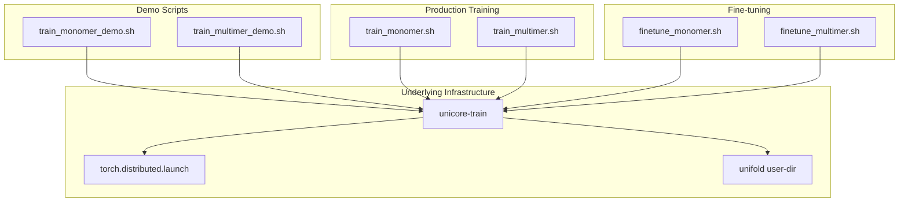
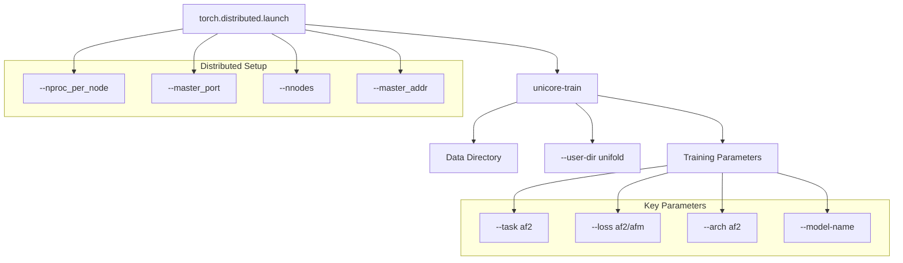
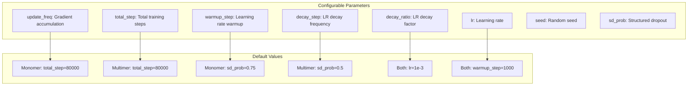
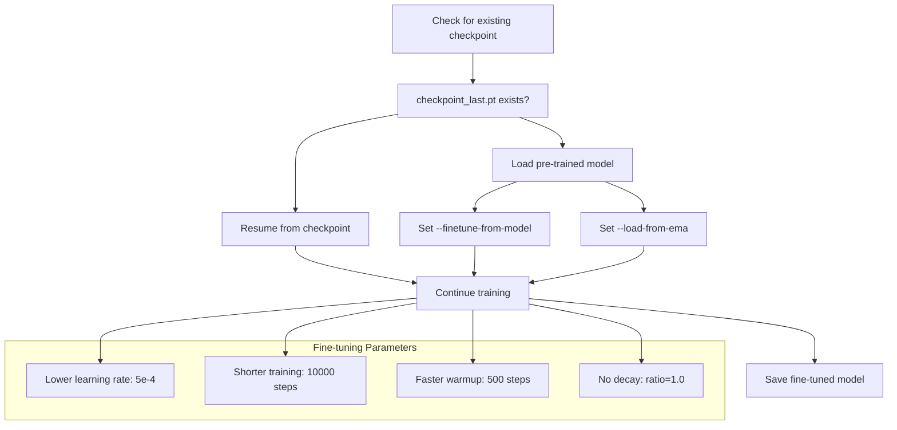
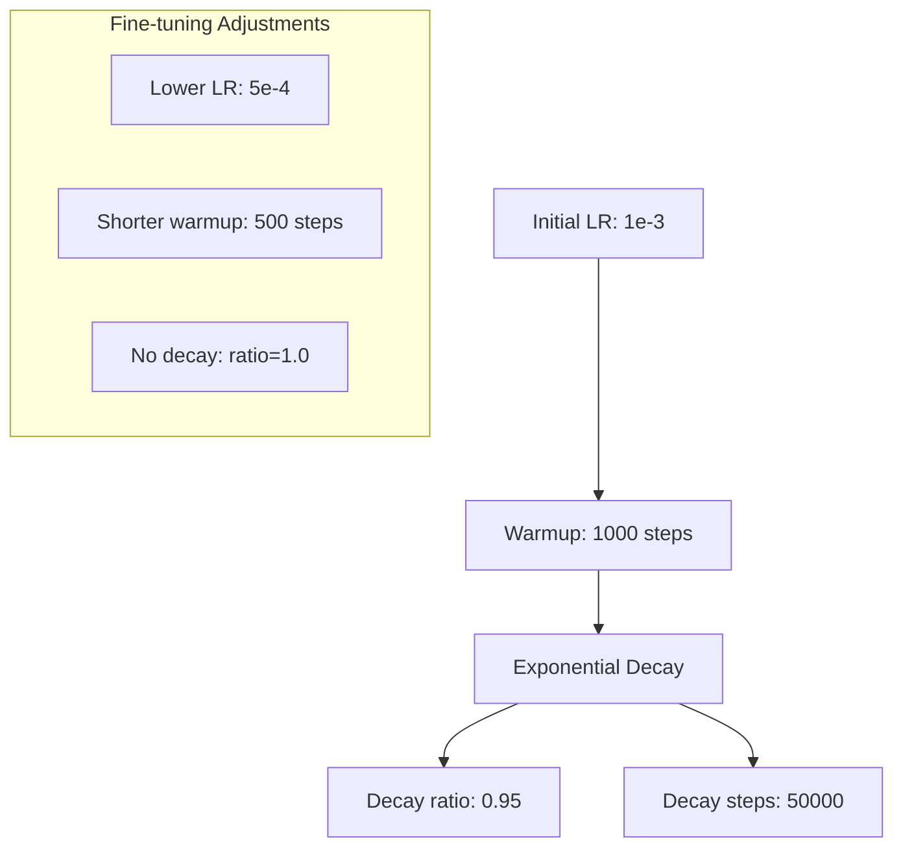
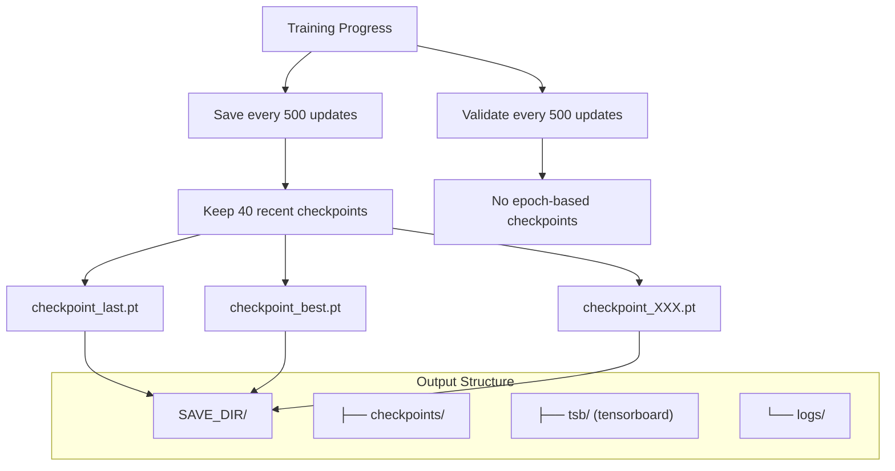

# Training Scripts

> **Relevant source files**
> * [finetune_monomer.sh](https://github.com/dptech-corp/Uni-Fold/blob/7b55789e/finetune_monomer.sh)
> * [finetune_multimer.sh](https://github.com/dptech-corp/Uni-Fold/blob/7b55789e/finetune_multimer.sh)
> * [train_monomer.sh](https://github.com/dptech-corp/Uni-Fold/blob/7b55789e/train_monomer.sh)
> * [train_monomer_demo.sh](https://github.com/dptech-corp/Uni-Fold/blob/7b55789e/train_monomer_demo.sh)
> * [train_multimer.sh](https://github.com/dptech-corp/Uni-Fold/blob/7b55789e/train_multimer.sh)
> * [train_multimer_demo.sh](https://github.com/dptech-corp/Uni-Fold/blob/7b55789e/train_multimer_demo.sh)

This page documents the training scripts provided with Uni-Fold for training and fine-tuning protein structure prediction models. These scripts handle both monomer (single-chain) and multimer (multi-chain complex) model training using distributed PyTorch training infrastructure.

For information about training configuration and hyperparameters, see [Training Configuration](/dptech-corp/Uni-Fold/6.1-training-configuration). For converting pre-trained parameters between different formats, see [Parameter Conversion](/dptech-corp/Uni-Fold/6.3-parameter-conversion).

## Overview of Training Scripts

Uni-Fold provides six main training scripts that cover different training scenarios:



**Sources:** [train_monomer_demo.sh L1-L16](https://github.com/dptech-corp/Uni-Fold/blob/7b55789e/train_monomer_demo.sh#L1-L16)

 [train_multimer_demo.sh L1-L16](https://github.com/dptech-corp/Uni-Fold/blob/7b55789e/train_multimer_demo.sh#L1-L16)

 [train_monomer.sh L1-L54](https://github.com/dptech-corp/Uni-Fold/blob/7b55789e/train_monomer.sh#L1-L54)

 [train_multimer.sh L1-L53](https://github.com/dptech-corp/Uni-Fold/blob/7b55789e/train_multimer.sh#L1-L53)

 [finetune_monomer.sh L1-L60](https://github.com/dptech-corp/Uni-Fold/blob/7b55789e/finetune_monomer.sh#L1-L60)

 [finetune_multimer.sh L1-L60](https://github.com/dptech-corp/Uni-Fold/blob/7b55789e/finetune_multimer.sh#L1-L60)

## Training Infrastructure

All training scripts use the `unicore-train` command with PyTorch's distributed training launcher. The training infrastructure automatically detects available GPUs and sets up distributed training accordingly.

### Core Training Command Structure



**Sources:** [train_monomer_demo.sh L7-L15](https://github.com/dptech-corp/Uni-Fold/blob/7b55789e/train_monomer_demo.sh#L7-L15)

 [train_multimer_demo.sh L7-L15](https://github.com/dptech-corp/Uni-Fold/blob/7b55789e/train_multimer_demo.sh#L7-L15)

### Environment Configuration

Each script sets up the training environment with these key configurations:

| Variable | Purpose | Default Value |
| --- | --- | --- |
| `MASTER_PORT` | Distributed training coordination port | 10086 (demo), 10087 (production) |
| `MASTER_IP` | Master node IP address | 127.0.0.1 |
| `n_gpu` | Number of GPUs per node | Auto-detected via `nvidia-smi` |
| `NCCL_ASYNC_ERROR_HANDLING` | NCCL error handling | 1 |
| `OMP_NUM_THREADS` | OpenMP thread count | 1 |

**Sources:** [train_monomer_demo.sh L1-L4](https://github.com/dptech-corp/Uni-Fold/blob/7b55789e/train_monomer_demo.sh#L1-L4)

 [train_monomer.sh L1-L16](https://github.com/dptech-corp/Uni-Fold/blob/7b55789e/train_monomer.sh#L1-L16)

 [finetune_monomer.sh L1-L16](https://github.com/dptech-corp/Uni-Fold/blob/7b55789e/finetune_monomer.sh#L1-L16)

## Demo Training Scripts

The demo scripts provide simplified training examples with minimal configuration, suitable for testing and learning purposes.

### Monomer Demo Training

The `train_monomer_demo.sh` script demonstrates basic monomer model training:

```
./train_monomer_demo.sh OUTPUT_DIR
```

Key characteristics:

* Uses `--loss af2` for monomer-specific loss function
* Runs for only 1000 updates (`--max-update 1000`)
* Uses example data from `./example_data/`
* Saves checkpoints every 100 updates
* Enables BF16 mixed precision training

**Sources:** [train_monomer_demo.sh L7-L15](https://github.com/dptech-corp/Uni-Fold/blob/7b55789e/train_monomer_demo.sh#L7-L15)

### Multimer Demo Training

The `train_multimer_demo.sh` script demonstrates multimer model training:

```
./train_multimer_demo.sh OUTPUT_DIR
```

Key differences from monomer:

* Uses `--loss afm` for multimer-specific loss function
* Includes `--model-name multimer` parameter
* More frequent logging (`--log-interval 1`)

**Sources:** [train_multimer_demo.sh L7-L15](https://github.com/dptech-corp/Uni-Fold/blob/7b55789e/train_multimer_demo.sh#L7-L15)

## Production Training Scripts

The production scripts provide full-scale training with configurable hyperparameters and multi-node support.

### Training Parameter Configuration



**Sources:** [train_monomer.sh L4-L11](https://github.com/dptech-corp/Uni-Fold/blob/7b55789e/train_monomer.sh#L4-L11)

 [train_multimer.sh L4-L11](https://github.com/dptech-corp/Uni-Fold/blob/7b55789e/train_multimer.sh#L4-L11)

### Monomer Training

```
./train_monomer.sh DATA_DIR SAVE_DIR MODEL_NAME
```

Arguments:

* `DATA_DIR`: Directory containing training data
* `SAVE_DIR`: Output directory for checkpoints and logs
* `MODEL_NAME`: Model variant (e.g., "model_1", "model_2")

**Sources:** [train_monomer.sh L37-L51](https://github.com/dptech-corp/Uni-Fold/blob/7b55789e/train_monomer.sh#L37-L51)

### Multimer Training

```
./train_multimer.sh DATA_DIR SAVE_DIR MODEL_NAME
```

Key differences from monomer training:

* Uses `--loss afm` (AlphaFold Multimer loss)
* Different structured dropout probability (0.5 vs 0.75)
* Includes multimer-specific data processing

**Sources:** [train_multimer.sh L37-L50](https://github.com/dptech-corp/Uni-Fold/blob/7b55789e/train_multimer.sh#L37-L50)

## Fine-tuning Scripts

The fine-tuning scripts enable transfer learning from pre-trained models, useful for domain adaptation or continued training.

### Fine-tuning Workflow



**Sources:** [finetune_monomer.sh L37-L43](https://github.com/dptech-corp/Uni-Fold/blob/7b55789e/finetune_monomer.sh#L37-L43)

 [finetune_multimer.sh L37-L43](https://github.com/dptech-corp/Uni-Fold/blob/7b55789e/finetune_multimer.sh#L37-L43)

### Monomer Fine-tuning

```
./finetune_monomer.sh DATA_DIR SAVE_DIR PRETRAINED_MODEL MODEL_NAME
```

Arguments:

* `PRETRAINED_MODEL`: Path to pre-trained checkpoint for initialization
* Other arguments same as production training

**Sources:** [finetune_monomer.sh L48-L57](https://github.com/dptech-corp/Uni-Fold/blob/7b55789e/finetune_monomer.sh#L48-L57)

### Multimer Fine-tuning

```
./finetune_multimer.sh DATA_DIR SAVE_DIR PRETRAINED_MODEL MODEL_NAME
```

Uses multimer-specific loss function (`--loss afm`) while maintaining fine-tuning hyperparameters.

**Sources:** [finetune_multimer.sh L48-L57](https://github.com/dptech-corp/Uni-Fold/blob/7b55789e/finetune_multimer.sh#L48-L57)

## Training Parameters and Optimization

### Core Training Configuration

| Parameter | Purpose | Monomer | Multimer |
| --- | --- | --- | --- |
| `--batch-size` | Batch size per GPU | 1 | 1 |
| `--update-freq` | Gradient accumulation steps | 1 | 1 |
| `--lr` | Learning rate | 1e-3 | 1e-3 |
| `--optimizer` | Optimization algorithm | adam | adam |
| `--clip-norm` | Global gradient clipping | 0.0 | 0.0 |
| `--per-sample-clip-norm` | Per-sample clipping | 0.1 | 0.1 |

**Sources:** [train_monomer.sh L46-L47](https://github.com/dptech-corp/Uni-Fold/blob/7b55789e/train_monomer.sh#L46-L47)

 [train_multimer.sh L45-L46](https://github.com/dptech-corp/Uni-Fold/blob/7b55789e/train_multimer.sh#L45-L46)

### Learning Rate Scheduling

All scripts use exponential decay learning rate scheduling:



**Sources:** [train_monomer.sh L47](https://github.com/dptech-corp/Uni-Fold/blob/7b55789e/train_monomer.sh#L47-L47)

 [finetune_monomer.sh L53](https://github.com/dptech-corp/Uni-Fold/blob/7b55789e/finetune_monomer.sh#L53-L53)

### Memory and Precision Optimizations

| Feature | Flag | Purpose |
| --- | --- | --- |
| Mixed Precision | `--bf16` | Reduces memory usage, faster training |
| Stochastic Rounding | `--bf16-sr` | Improves BF16 training stability |
| EMA | `--ema-decay 0.999` | Exponential moving average of parameters |
| Data Buffer | `--data-buffer-size 32` | Improves data loading efficiency |

**Sources:** [train_monomer.sh L51](https://github.com/dptech-corp/Uni-Fold/blob/7b55789e/train_monomer.sh#L51-L51)

 [train_multimer.sh L50](https://github.com/dptech-corp/Uni-Fold/blob/7b55789e/train_multimer.sh#L50-L50)

## Checkpoint Management

### Checkpoint Saving Strategy



**Sources:** [train_monomer.sh L56](https://github.com/dptech-corp/Uni-Fold/blob/7b55789e/train_monomer.sh#L56-L56)

 [train_multimer.sh L49](https://github.com/dptech-corp/Uni-Fold/blob/7b55789e/train_multimer.sh#L49-L49)

### Temporary Directory Management

All scripts create temporary directories for intermediate files and clean them up after training:

* Temporary directory created with `mktemp -d`
* Used for `--tmp-save-dir` parameter
* Automatically removed after training completion

**Sources:** [train_monomer.sh L39-L53](https://github.com/dptech-corp/Uni-Fold/blob/7b55789e/train_monomer.sh#L39-L53)

 [train_multimer.sh L39-L52](https://github.com/dptech-corp/Uni-Fold/blob/7b55789e/train_multimer.sh#L39-L52)