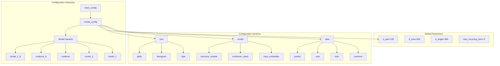
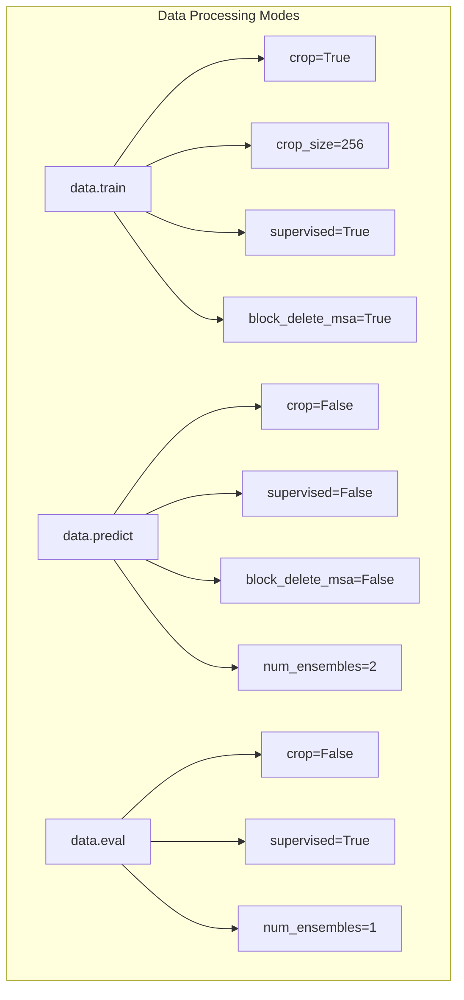
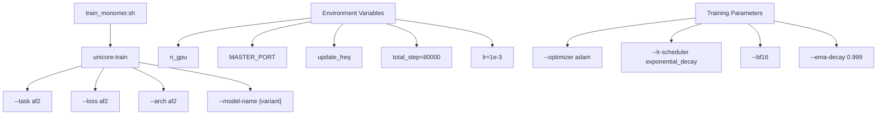
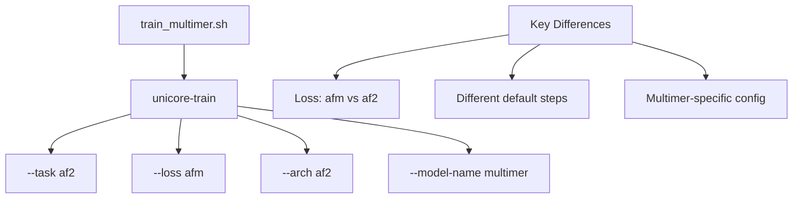
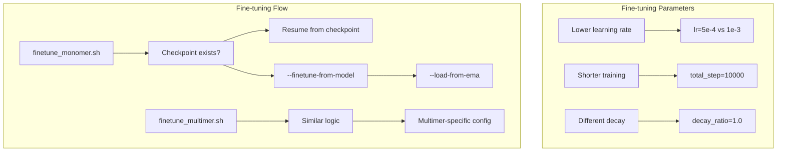
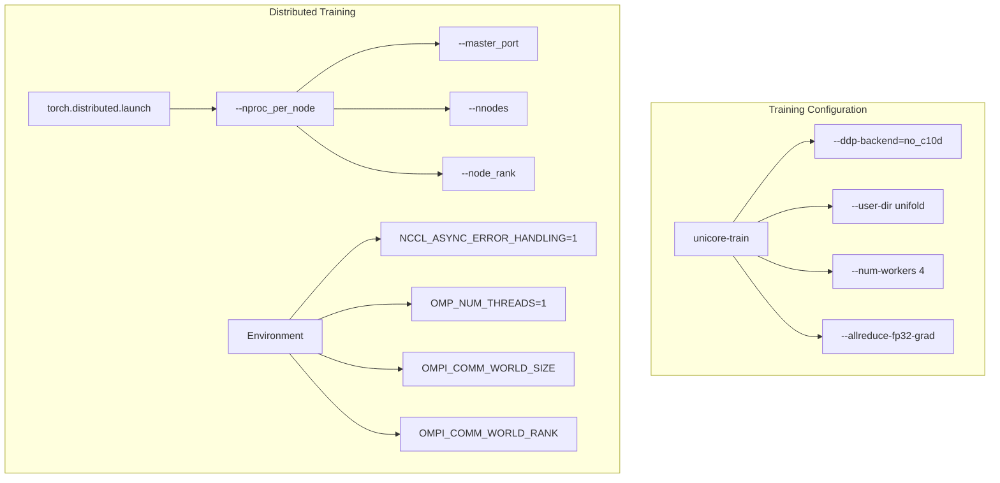
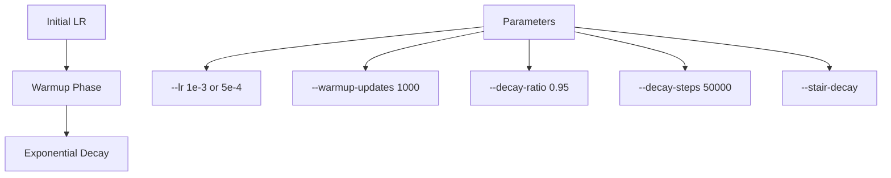
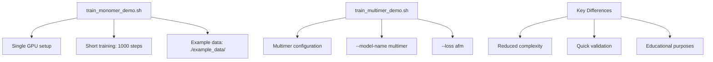

# Training and Fine-tuning

> **Relevant source files**
> * [finetune_monomer.sh](https://github.com/dptech-corp/Uni-Fold/blob/7b55789e/finetune_monomer.sh)
> * [finetune_multimer.sh](https://github.com/dptech-corp/Uni-Fold/blob/7b55789e/finetune_multimer.sh)
> * [train_monomer.sh](https://github.com/dptech-corp/Uni-Fold/blob/7b55789e/train_monomer.sh)
> * [train_monomer_demo.sh](https://github.com/dptech-corp/Uni-Fold/blob/7b55789e/train_monomer_demo.sh)
> * [train_multimer.sh](https://github.com/dptech-corp/Uni-Fold/blob/7b55789e/train_multimer.sh)
> * [train_multimer_demo.sh](https://github.com/dptech-corp/Uni-Fold/blob/7b55789e/train_multimer_demo.sh)
> * [unifold/config.py](https://github.com/dptech-corp/Uni-Fold/blob/7b55789e/unifold/config.py)

This document covers how to train Uni-Fold models from scratch and fine-tune existing models. It explains the configuration system, training scripts, model variants, and the underlying training infrastructure. For information about parameter conversion between different frameworks, see [Parameter Conversion](/dptech-corp/Uni-Fold/6.3-parameter-conversion). For details about the specific model architectures being trained, see [Model Architecture](/dptech-corp/Uni-Fold/5-model-architecture).

## Overview

Uni-Fold provides a comprehensive training system built on top of the `unicore-train` framework that supports both training from scratch and fine-tuning existing models. The system handles multiple model variants including monomer and multimer models, with configurable architectures and training parameters.

## Training Configuration System

The training system is controlled by a hierarchical configuration system defined in [unifold/config.py](https://github.com/dptech-corp/Uni-Fold/blob/7b55789e/unifold/config.py)

 The configuration separates concerns into data processing, model architecture, and loss function parameters.

### Configuration Architecture

Sources: [unifold/config.py L26-L466](https://github.com/dptech-corp/Uni-Fold/blob/7b55789e/unifold/config.py#L26-L466)

### Model Variants

The configuration system supports multiple model variants, each with specific parameter settings:

| Variant | Purpose | Key Differences |
| --- | --- | --- |
| `model_1` | Base monomer model | Standard AlphaFold architecture |
| `model_1_ft` | Fine-tuned monomer | Larger MSA (5120), larger crop (384) |
| `model_2` | Alternative monomer | Different feature processing |
| `multimer` | Protein complexes | Chain-aware processing, PAE head |
| `multimer_ft` | Fine-tuned multimer | Optimized for complex prediction |

Sources: [unifold/config.py L480-L672](https://github.com/dptech-corp/Uni-Fold/blob/7b55789e/unifold/config.py#L480-L672)

### Training vs Inference Configuration

The configuration system differentiates between training and inference modes:

Sources: [unifold/config.py L208-L226](https://github.com/dptech-corp/Uni-Fold/blob/7b55789e/unifold/config.py#L208-L226)

 [unifold/config.py L176-L189](https://github.com/dptech-corp/Uni-Fold/blob/7b55789e/unifold/config.py#L176-L189)

 [unifold/config.py L191-L207](https://github.com/dptech-corp/Uni-Fold/blob/7b55789e/unifold/config.py#L191-L207)

## Training Scripts

### Training from Scratch

Uni-Fold provides separate scripts for training monomer and multimer models:

#### Monomer Training

Sources: [train_monomer.sh L1-L54](https://github.com/dptech-corp/Uni-Fold/blob/7b55789e/train_monomer.sh#L1-L54)

#### Multimer Training

Sources: [train_multimer.sh L1-L53](https://github.com/dptech-corp/Uni-Fold/blob/7b55789e/train_multimer.sh#L1-L53)

### Fine-tuning Existing Models

Fine-tuning scripts support continuing training from pre-trained checkpoints:

Sources: [finetune_monomer.sh L37-L43](https://github.com/dptech-corp/Uni-Fold/blob/7b55789e/finetune_monomer.sh#L37-L43)

 [finetune_multimer.sh L37-L43](https://github.com/dptech-corp/Uni-Fold/blob/7b55789e/finetune_multimer.sh#L37-L43)

## Training Infrastructure

### Distributed Training Setup

The training system uses PyTorch distributed training with the following architecture:

Sources: [train_monomer.sh L15-L51](https://github.com/dptech-corp/Uni-Fold/blob/7b55789e/train_monomer.sh#L15-L51)

 [train_multimer.sh L15-L50](https://github.com/dptech-corp/Uni-Fold/blob/7b55789e/train_multimer.sh#L15-L50)

### Optimization and Performance

Key performance optimizations in the training setup:

| Parameter | Purpose | Value |
| --- | --- | --- |
| `--bf16` | Mixed precision training | Enabled |
| `--bf16-sr` | BF16 state reduction | Enabled |
| `--ema-decay` | Exponential moving average | 0.999 |
| `--per-sample-clip-norm` | Gradient clipping | 0.1 |
| `--data-buffer-size` | Data loading optimization | 32 |

Sources: [train_monomer.sh L51](https://github.com/dptech-corp/Uni-Fold/blob/7b55789e/train_monomer.sh#L51-L51)

 [finetune_monomer.sh L57](https://github.com/dptech-corp/Uni-Fold/blob/7b55789e/finetune_monomer.sh#L57-L57)

### Learning Rate Scheduling

All training scripts use exponential decay scheduling:

Sources: [train_monomer.sh L46-L47](https://github.com/dptech-corp/Uni-Fold/blob/7b55789e/train_monomer.sh#L46-L47)

 [finetune_monomer.sh L53](https://github.com/dptech-corp/Uni-Fold/blob/7b55789e/finetune_monomer.sh#L53-L53)

## Demo Training Scripts

For testing and experimentation, simplified demo scripts are provided:

### Demo Script Features

Sources: [train_monomer_demo.sh L7-L15](https://github.com/dptech-corp/Uni-Fold/blob/7b55789e/train_monomer_demo.sh#L7-L15)

 [train_multimer_demo.sh L7-L15](https://github.com/dptech-corp/Uni-Fold/blob/7b55789e/train_multimer_demo.sh#L7-L15)

The demo scripts use the same underlying infrastructure but with reduced training duration and simplified configurations, making them suitable for testing the training pipeline without requiring extensive computational resources.