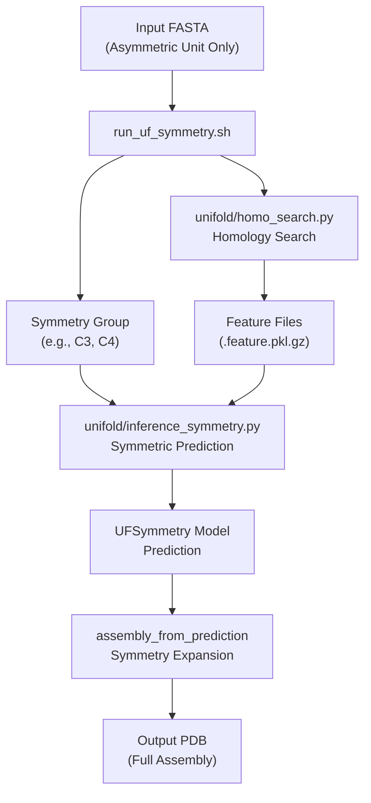
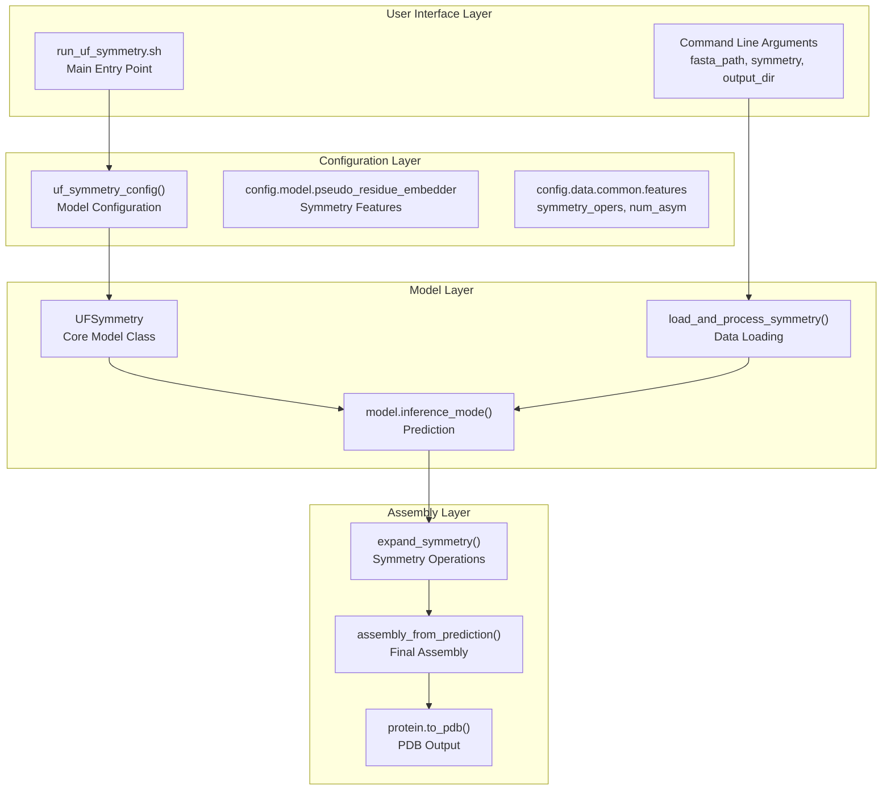
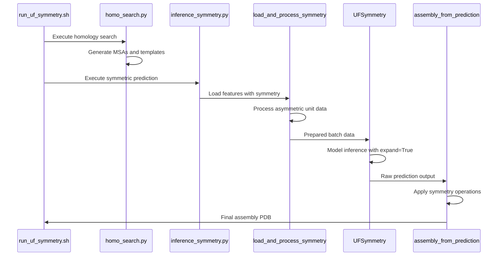
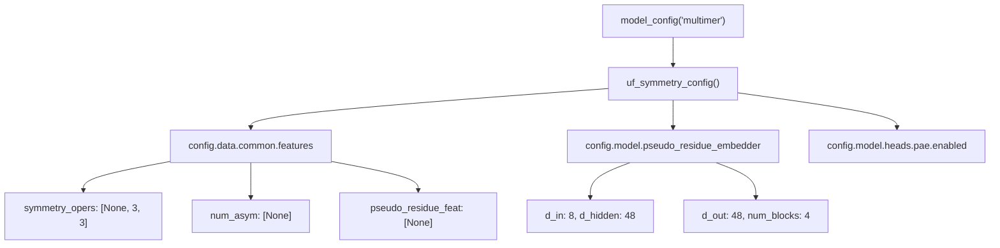
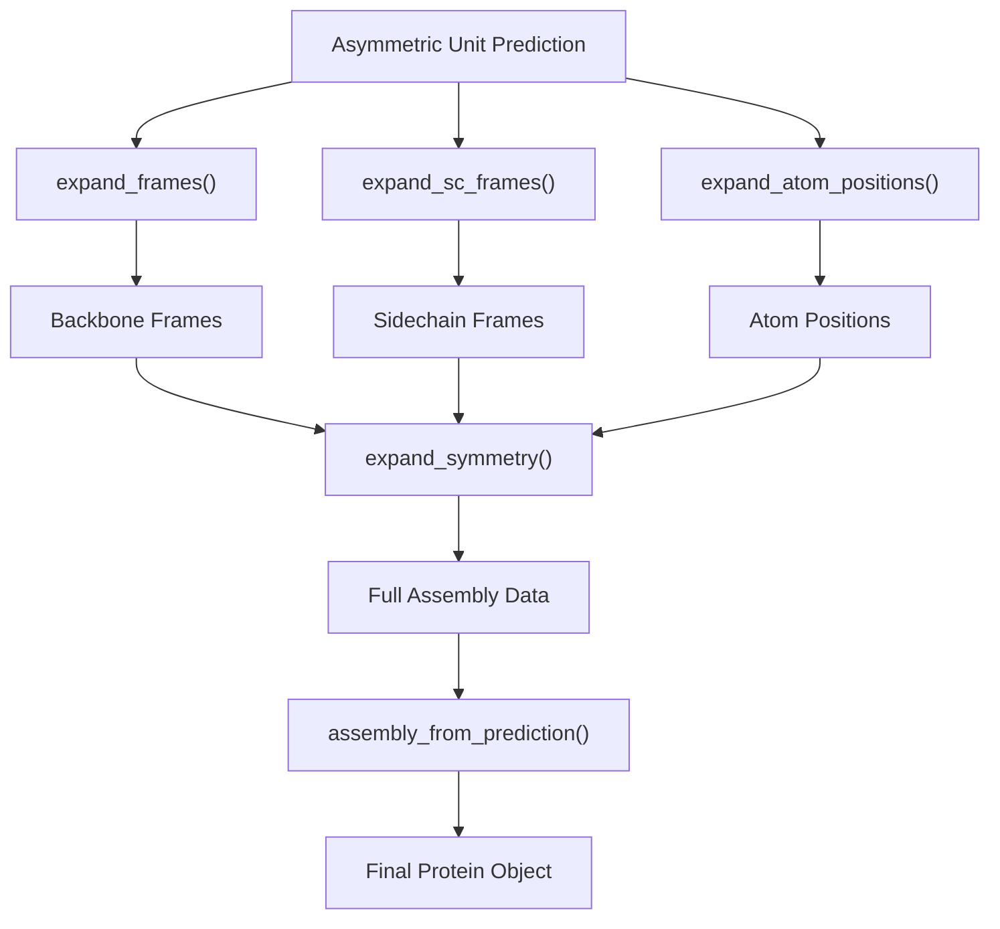

# UF-Symmetry Interface

> **Relevant source files**
> * [.gitignore](https://github.com/dptech-corp/Uni-Fold/blob/7b55789e/.gitignore)
> * [README.md](https://github.com/dptech-corp/Uni-Fold/blob/7b55789e/README.md?plain=1)
> * [img/uf-symmetry-effect.gif](https://github.com/dptech-corp/Uni-Fold/blob/7b55789e/img/uf-symmetry-effect.gif)
> * [run_uf_symmetry.sh](https://github.com/dptech-corp/Uni-Fold/blob/7b55789e/run_uf_symmetry.sh)
> * [unifold/inference_symmetry.py](https://github.com/dptech-corp/Uni-Fold/blob/7b55789e/unifold/inference_symmetry.py)
> * [unifold/symmetry/__init__.py](https://github.com/dptech-corp/Uni-Fold/blob/7b55789e/unifold/symmetry/__init__.py)
> * [unifold/symmetry/assemble.py](https://github.com/dptech-corp/Uni-Fold/blob/7b55789e/unifold/symmetry/assemble.py)
> * [unifold/symmetry/config.py](https://github.com/dptech-corp/Uni-Fold/blob/7b55789e/unifold/symmetry/config.py)

## Purpose and Scope

This document covers the UF-Symmetry interface, a specialized system within Uni-Fold for predicting large symmetric protein complexes efficiently. UF-Symmetry allows users to fold symmetric protein assemblies by predicting only the asymmetric unit and then applying symmetry operations to generate the full complex.

For general protein folding with the standard AlphaFold model, see [Command Line Interface](/dptech-corp/Uni-Fold/3.1-command-line-interface). For information about the core UF-Symmetry model architecture, see [UF-Symmetry System](/dptech-corp/Uni-Fold/7.1-uf-symmetry-system).

## System Overview

UF-Symmetry provides a streamlined interface for predicting symmetric protein complexes through a two-stage process: homology search and symmetric prediction. The system is designed to handle large protein assemblies that would be computationally prohibitive with standard approaches.

### UF-Symmetry Workflow



Sources: [README.md L260-L281](https://github.com/dptech-corp/Uni-Fold/blob/7b55789e/README.md?plain=1#L260-L281)

 [run_uf_symmetry.sh L1-L32](https://github.com/dptech-corp/Uni-Fold/blob/7b55789e/run_uf_symmetry.sh#L1-L32)

## Command Line Interface

The primary entry point for UF-Symmetry is the `run_uf_symmetry.sh` script, which orchestrates the complete prediction pipeline.

### Usage

```markdown
bash run_uf_symmetry.sh \    /path/to/input.fasta \        # Asymmetric unit sequences only    C3 \                          # Symmetry group (C, D, I, O, T)    /path/to/output/directory/ \  # Output directory    /path/to/database/directory/ \ # Database directory    2020-05-01 \                  # Template cutoff date    /path/to/model_parameters.pt  # UF-Symmetry parameters
```

### Script Components

| Component | Purpose | Implementation |
| --- | --- | --- |
| Homology Search | MSA and template generation | `unifold/homo_search.py` |
| Symmetric Prediction | Core folding with symmetry | `unifold/inference_symmetry.py` |

Sources: [run_uf_symmetry.sh L1-L32](https://github.com/dptech-corp/Uni-Fold/blob/7b55789e/run_uf_symmetry.sh#L1-L32)

 [README.md L272-L281](https://github.com/dptech-corp/Uni-Fold/blob/7b55789e/README.md?plain=1#L272-L281)

## Core Code Architecture

The UF-Symmetry system maps natural language concepts to specific code entities:

### Code Entity Mapping



Sources: [unifold/symmetry/__init__.py L14-L18](https://github.com/dptech-corp/Uni-Fold/blob/7b55789e/unifold/symmetry/__init__.py#L14-L18)

 [unifold/symmetry/config.py L4-L28](https://github.com/dptech-corp/Uni-Fold/blob/7b55789e/unifold/symmetry/config.py#L4-L28)

 [unifold/inference_symmetry.py L56-L76](https://github.com/dptech-corp/Uni-Fold/blob/7b55789e/unifold/inference_symmetry.py#L56-L76)

## Inference Process

The inference process involves several key stages, each handled by specific code components:

### Data Loading and Processing



### Key Functions and Their Roles

| Function | File | Purpose |
| --- | --- | --- |
| `load_feature_for_one_target()` | `inference_symmetry.py:28-53` | Feature loading with symmetry |
| `automatic_chunk_size()` | `inference.py` | Memory optimization |
| `expand_symmetry()` | `assemble.py:52-105` | Apply symmetry operations |
| `assembly_from_prediction()` | `assemble.py:108-126` | Create final Protein object |

Sources: [unifold/inference_symmetry.py L28-L53](https://github.com/dptech-corp/Uni-Fold/blob/7b55789e/unifold/inference_symmetry.py#L28-L53)

 [unifold/symmetry/assemble.py L52-L105](https://github.com/dptech-corp/Uni-Fold/blob/7b55789e/unifold/symmetry/assemble.py#L52-L105)

 [unifold/symmetry/assemble.py L108-L126](https://github.com/dptech-corp/Uni-Fold/blob/7b55789e/unifold/symmetry/assemble.py#L108-L126)

## Configuration and Model Setup

### Configuration Hierarchy

The UF-Symmetry configuration builds upon the standard multimer configuration with symmetry-specific modifications:



### Model Initialization

The `UFSymmetry` model is initialized with specific parameters for handling symmetric complexes:

```python
# Key configuration parameters from uf_symmetry_config()config.data.common.features.symmetry_opers = [None, 3, 3]config.model.pseudo_residue_embedder = {    "d_in": 8, "d_hidden": 48, "d_out": 48, "num_blocks": 4}config.model.input_embedder.pr_dim = 48
```

Sources: [unifold/symmetry/config.py L4-L28](https://github.com/dptech-corp/Uni-Fold/blob/7b55789e/unifold/symmetry/config.py#L4-L28)

## Input Requirements and Limitations

### Input Specifications

| Requirement | Description | Implementation |
| --- | --- | --- |
| **FASTA Format** | Asymmetric unit sequences only | Validated in `load_feature_for_one_target()` |
| **Symmetry Group** | Currently supports C-type symmetry | Checked in `inference_symmetry.py:96-97` |
| **Database Access** | Standard Uni-Fold databases required | Via `homo_search.py` |

### Current Limitations

The system currently has specific constraints:

```css
# From inference_symmetry.py lines 96-97if symmetry[0] != 'C':    raise NotImplementedError(f"symmetry {symmetry} is not supported currently.")
```

**Supported Symmetry Types:**

* C-type symmetries (C2, C3, C4, etc.)

**Not Yet Supported:**

* D-type symmetries (dihedral)
* I-type symmetries (icosahedral)
* O-type symmetries (octahedral)
* T-type symmetries (tetrahedral)

Sources: [unifold/inference_symmetry.py L96-L97](https://github.com/dptech-corp/Uni-Fold/blob/7b55789e/unifold/inference_symmetry.py#L96-L97)

 [README.md L281](https://github.com/dptech-corp/Uni-Fold/blob/7b55789e/README.md?plain=1#L281-L281)

## Symmetry Operations and Assembly

### Core Assembly Functions

The assembly process involves expanding the asymmetric unit prediction using symmetry operations:



### Assembly Data Structure

The `expand_symmetry()` function creates the following expanded data:

| Output Key | Source Function | Purpose |
| --- | --- | --- |
| `frames` | `expand_frames()` | Backbone rigid body transforms |
| `sidechain_frames` | `expand_sc_frames()` | Sidechain transforms |
| `positions` | `expand_atom_positions()` | Atomic coordinates |
| `expand_final_atom_positions` | `atom14_to_atom37()` | Final atom positions |
| `expand_final_atom_mask` | Feature expansion | Atom existence mask |

Sources: [unifold/symmetry/assemble.py L9-L50](https://github.com/dptech-corp/Uni-Fold/blob/7b55789e/unifold/symmetry/assemble.py#L9-L50)

 [unifold/symmetry/assemble.py L52-L105](https://github.com/dptech-corp/Uni-Fold/blob/7b55789e/unifold/symmetry/assemble.py#L52-L105)

## Output Format and Results

### Output Structure

UF-Symmetry generates several output files with specific naming conventions:

```markdown
output_directory/
└── target_name/
    ├── ufsymm_{param_name}_{seed}.pdb           # Assembly structure
    ├── ufsymm_{param_name}_{seed}_outputs.pkl.gz # Raw outputs (optional)
    └── ...
```

### File Naming Conventions

The output files use a systematic naming scheme based on prediction parameters:

| Component | Source | Example |
| --- | --- | --- |
| Base name | `ufsymm_` prefix | `ufsymm_` |
| Parameter name | `pathlib.Path(param_path).stem` | `uf_symmetry_2022` |
| Seed | `cur_seed` | `42` |
| Modifiers | Various flags | `_st_uni_r3_e2` |

### Confidence Metrics

The system outputs confidence scores using the same metrics as standard Uni-Fold:

* **pLDDT**: Per-residue confidence (0-100)
* **B-factors**: Assigned from pLDDT values, expanded to full assembly

Sources: [unifold/inference_symmetry.py L149-L170](https://github.com/dptech-corp/Uni-Fold/blob/7b55789e/unifold/inference_symmetry.py#L149-L170)

 [unifold/symmetry/assemble.py L108-L126](https://github.com/dptech-corp/Uni-Fold/blob/7b55789e/unifold/symmetry/assemble.py#L108-L126)