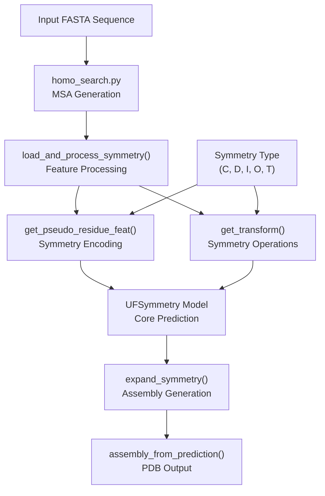
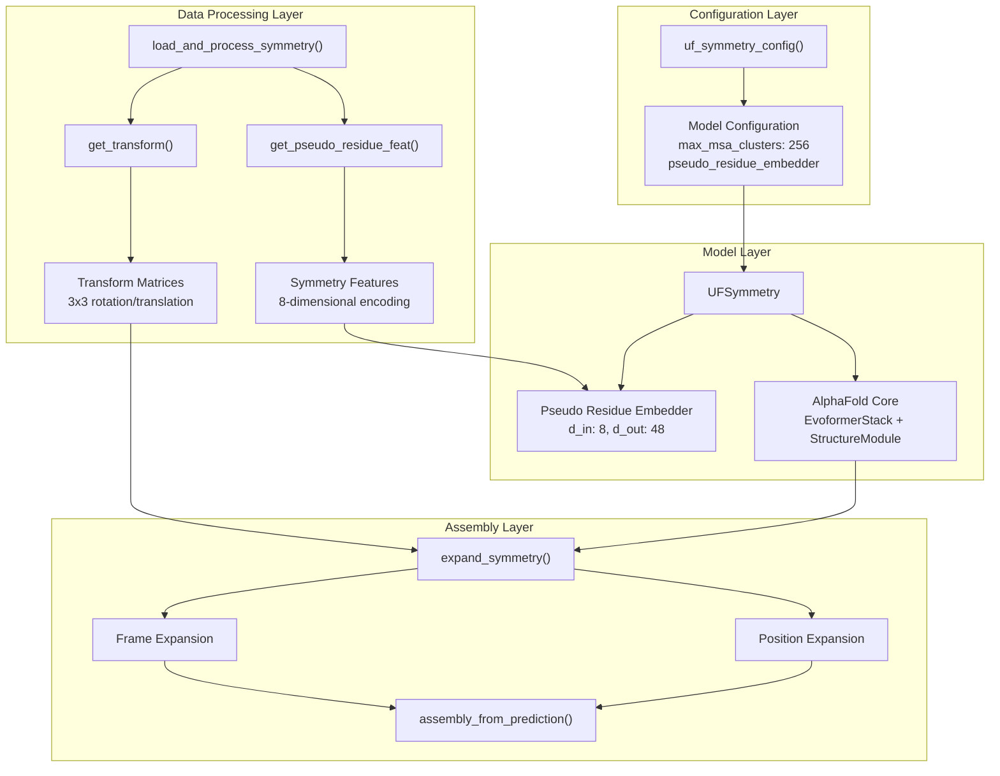
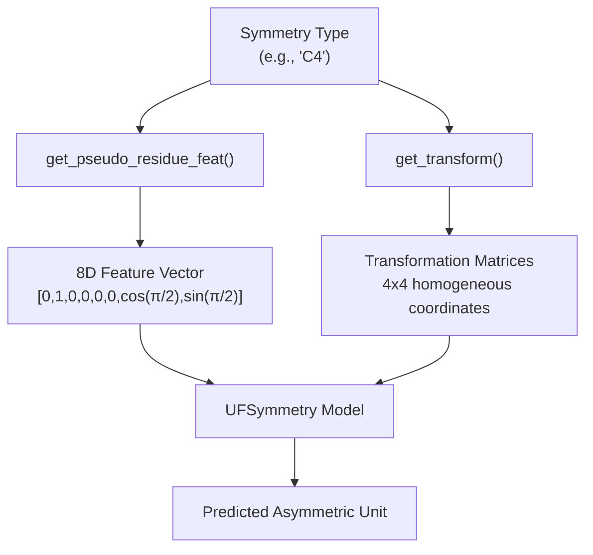
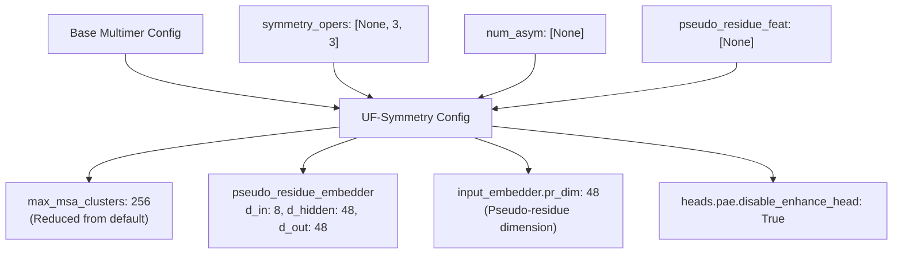
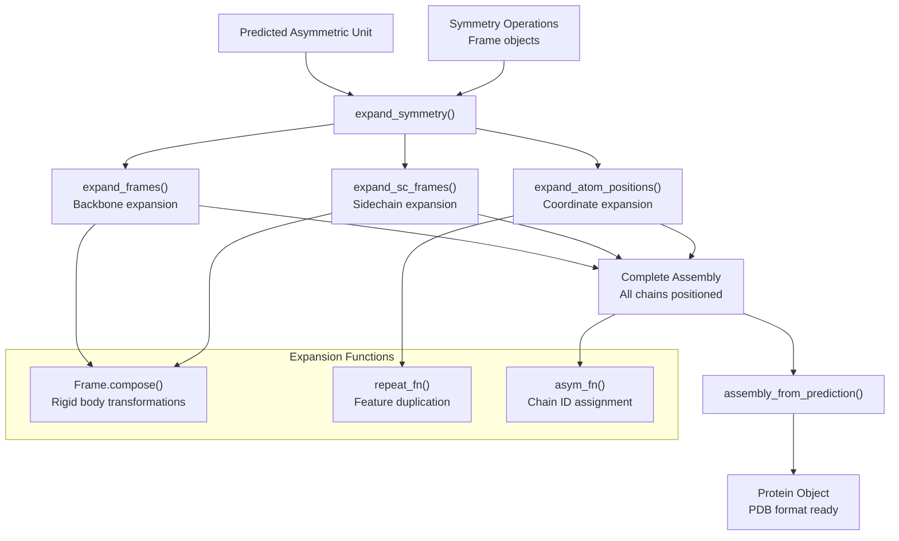
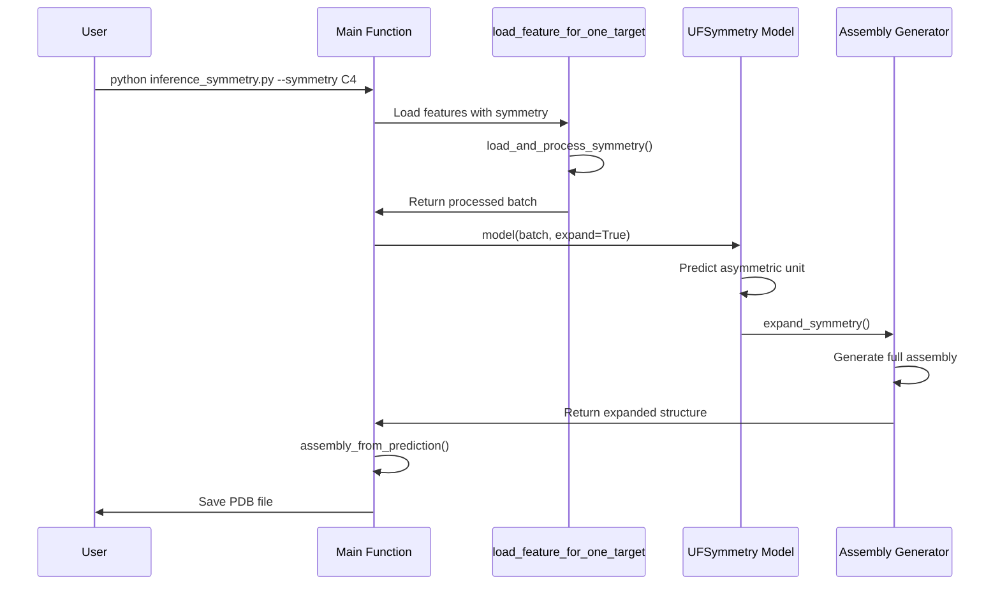

# UF-Symmetry System

> **Relevant source files**
> * [.gitignore](https://github.com/dptech-corp/Uni-Fold/blob/7b55789e/.gitignore)
> * [img/uf-symmetry-effect.gif](https://github.com/dptech-corp/Uni-Fold/blob/7b55789e/img/uf-symmetry-effect.gif)
> * [unifold/inference_symmetry.py](https://github.com/dptech-corp/Uni-Fold/blob/7b55789e/unifold/inference_symmetry.py)
> * [unifold/symmetry/__init__.py](https://github.com/dptech-corp/Uni-Fold/blob/7b55789e/unifold/symmetry/__init__.py)
> * [unifold/symmetry/assemble.py](https://github.com/dptech-corp/Uni-Fold/blob/7b55789e/unifold/symmetry/assemble.py)
> * [unifold/symmetry/config.py](https://github.com/dptech-corp/Uni-Fold/blob/7b55789e/unifold/symmetry/config.py)
> * [unifold/symmetry/dataset.py](https://github.com/dptech-corp/Uni-Fold/blob/7b55789e/unifold/symmetry/dataset.py)
> * [unifold/symmetry/utils/__init__.py](https://github.com/dptech-corp/Uni-Fold/blob/7b55789e/unifold/symmetry/utils/__init__.py)

The UF-Symmetry system is a specialized extension of Uni-Fold designed for predicting large symmetric protein complexes efficiently. Instead of predicting the entire complex directly, UF-Symmetry predicts only the asymmetric unit and then applies symmetry operations to generate the full assembly, significantly reducing computational requirements for symmetric structures.

For general protein folding capabilities, see [Core AlphaFold Model](/dptech-corp/Uni-Fold/5.1-core-alphafold-model). For multimer prediction without symmetry constraints, see [Multimer Prediction](/dptech-corp/Uni-Fold/7.2-multimer-prediction).

## System Overview

UF-Symmetry operates by identifying the minimal asymmetric unit of a symmetric protein complex, predicting its structure using a modified AlphaFold architecture, and then expanding this unit using crystallographic symmetry operations to generate the complete assembly.



**System Architecture Overview**
Sources: [unifold/symmetry/__init__.py L1-L19](https://github.com/dptech-corp/Uni-Fold/blob/7b55789e/unifold/symmetry/__init__.py#L1-L19)

 [unifold/inference_symmetry.py L16-L26](https://github.com/dptech-corp/Uni-Fold/blob/7b55789e/unifold/inference_symmetry.py#L16-L26)

## Core Components

The UF-Symmetry system consists of several key components that work together to enable symmetric complex prediction:

| Component | File Location | Purpose |
| --- | --- | --- |
| `UFSymmetry` | `unifold/symmetry/model.py` | Main model class extending AlphaFold |
| `load_and_process_symmetry` | `unifold/symmetry/dataset.py` | Data loading with symmetry features |
| `assembly_from_prediction` | `unifold/symmetry/assemble.py` | Assembly generation from predictions |
| `uf_symmetry_config` | `unifold/symmetry/config.py` | Model configuration |
| `inference_symmetry.py` | `unifold/inference_symmetry.py` | Inference interface |



**UF-Symmetry Component Architecture**
Sources: [unifold/symmetry/config.py L4-L28](https://github.com/dptech-corp/Uni-Fold/blob/7b55789e/unifold/symmetry/config.py#L4-L28)

 [unifold/symmetry/dataset.py L34-L53](https://github.com/dptech-corp/Uni-Fold/blob/7b55789e/unifold/symmetry/dataset.py#L34-L53)

## Data Processing Pipeline

The UF-Symmetry system processes input sequences through a specialized pipeline that incorporates symmetry information:

### Symmetry Feature Encoding

The system encodes different symmetry types using an 8-dimensional feature vector through the `get_pseudo_residue_feat()` function:

| Symmetry Type | Encoding Pattern | Description |
| --- | --- | --- |
| C1 (Asymmetric) | `[1,0,0,0,0,0,1,0]` | No symmetry |
| Cn (Cyclic) | `[0,1,0,0,0,0,cos(θ),sin(θ)]` | n-fold rotational symmetry |
| Dn (Dihedral) | `[0,0,1,0,0,0,cos(θ),sin(θ)]` | n-fold rotation + reflection |
| I (Icosahedral) | `[0,0,0,1,0,0,1,0]` | 60-fold symmetry |
| O (Octahedral) | `[0,0,0,0,1,0,1,0]` | 24-fold symmetry |
| T (Tetrahedral) | `[1,0,0,0,0,1,1,0]` | 12-fold symmetry |



**Symmetry Feature Processing Pipeline**
Sources: [unifold/symmetry/dataset.py L10-L31](https://github.com/dptech-corp/Uni-Fold/blob/7b55789e/unifold/symmetry/dataset.py#L10-L31)

 [unifold/symmetry/dataset.py L34-L53](https://github.com/dptech-corp/Uni-Fold/blob/7b55789e/unifold/symmetry/dataset.py#L34-L53)

### Data Loading Process

The `load_and_process_symmetry()` function extends the standard Uni-Fold data loading to include symmetry-specific features:

```markdown
# Key features added for symmetry:feats["symmetry_opers"] = torch.tensor(get_transform(symmetry), dtype=float)[None, :]feats["pseudo_residue_feat"] = torch.tensor(get_pseudo_residue_feat(symmetry), dtype=float)[None, :]feats["num_asym"] = torch.max(feats["asym_id"])[None]
```

Sources: [unifold/symmetry/dataset.py L44-L53](https://github.com/dptech-corp/Uni-Fold/blob/7b55789e/unifold/symmetry/dataset.py#L44-L53)

## Model Architecture

The `UFSymmetry` model extends the standard AlphaFold architecture with specialized components for handling symmetric structures:

### Configuration Modifications

The UF-Symmetry configuration makes several key changes to the base multimer model:



**UF-Symmetry Configuration Structure**
Sources: [unifold/symmetry/config.py L4-L28](https://github.com/dptech-corp/Uni-Fold/blob/7b55789e/unifold/symmetry/config.py#L4-L28)

### Pseudo-Residue Embedder

The system includes a specialized embedder for processing symmetry features:

| Parameter | Value | Purpose |
| --- | --- | --- |
| `d_in` | 8 | Input dimension for symmetry features |
| `d_hidden` | 48 | Hidden layer dimension |
| `d_out` | 48 | Output embedding dimension |
| `num_blocks` | 4 | Number of processing blocks |

Sources: [unifold/symmetry/config.py L18-L23](https://github.com/dptech-corp/Uni-Fold/blob/7b55789e/unifold/symmetry/config.py#L18-L23)

## Assembly Generation

The assembly generation process takes the predicted asymmetric unit and expands it using symmetry operations:



**Assembly Generation Pipeline**
Sources: [unifold/symmetry/assemble.py L52-L106](https://github.com/dptech-corp/Uni-Fold/blob/7b55789e/unifold/symmetry/assemble.py#L52-L106)

 [unifold/symmetry/assemble.py L108-L126](https://github.com/dptech-corp/Uni-Fold/blob/7b55789e/unifold/symmetry/assemble.py#L108-L126)

### Key Assembly Functions

The assembly process uses several specialized functions:

* **`expand_frames()`**: Applies symmetry operations to backbone frames
* **`expand_sc_frames()`**: Expands sidechain coordinate frames
* **`expand_atom_positions()`**: Transforms atomic coordinates
* **`assembly_from_prediction()`**: Creates final `Protein` object

Sources: [unifold/symmetry/assemble.py L9-L50](https://github.com/dptech-corp/Uni-Fold/blob/7b55789e/unifold/symmetry/assemble.py#L9-L50)

 [unifold/symmetry/assemble.py L108-L126](https://github.com/dptech-corp/Uni-Fold/blob/7b55789e/unifold/symmetry/assemble.py#L108-L126)

## Usage Interface

The UF-Symmetry system provides a command-line interface through `inference_symmetry.py`:

### Key Parameters

| Parameter | Type | Default | Description |
| --- | --- | --- | --- |
| `--symmetry` | str | "C1" | Symmetry type (C, D, I, O, T groups) |
| `--param_path` | str | None | Path to trained model parameters |
| `--target_name` | str | "" | Target protein identifier |
| `--times` | int | 3 | Number of prediction runs |
| `--max_recycling_iters` | int | 3 | Recycling iterations |
| `--bf16` | flag | False | Enable bfloat16 precision |

### Inference Workflow



**UF-Symmetry Inference Sequence**
Sources: [unifold/inference_symmetry.py L56-L172](https://github.com/dptech-corp/Uni-Fold/blob/7b55789e/unifold/inference_symmetry.py#L56-L172)

 [unifold/inference_symmetry.py L28-L53](https://github.com/dptech-corp/Uni-Fold/blob/7b55789e/unifold/inference_symmetry.py#L28-L53)

### Supported Symmetry Groups

Currently, UF-Symmetry supports cyclic symmetry groups (C groups). Other symmetry types are defined but not fully implemented:

```
if symmetry[0] != 'C':    raise NotImplementedError(f"symmetry {symmetry} is not supported currently.")
```

The system is designed to be extensible to other symmetry groups in the future.

Sources: [unifold/symmetry/dataset.py L46-L47](https://github.com/dptech-corp/Uni-Fold/blob/7b55789e/unifold/symmetry/dataset.py#L46-L47)

 [unifold/inference_symmetry.py L96-L97](https://github.com/dptech-corp/Uni-Fold/blob/7b55789e/unifold/inference_symmetry.py#L96-L97)