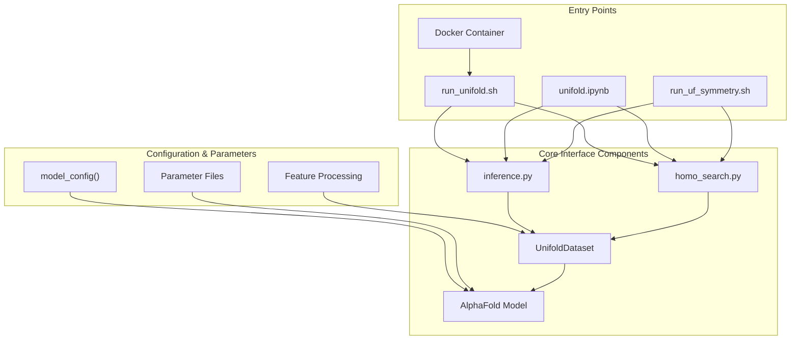
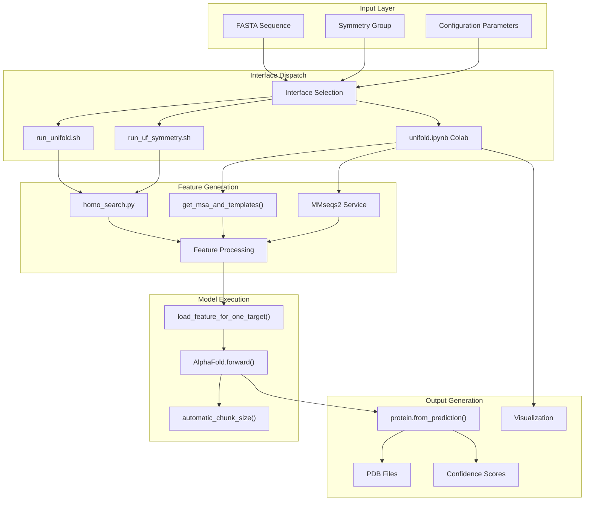
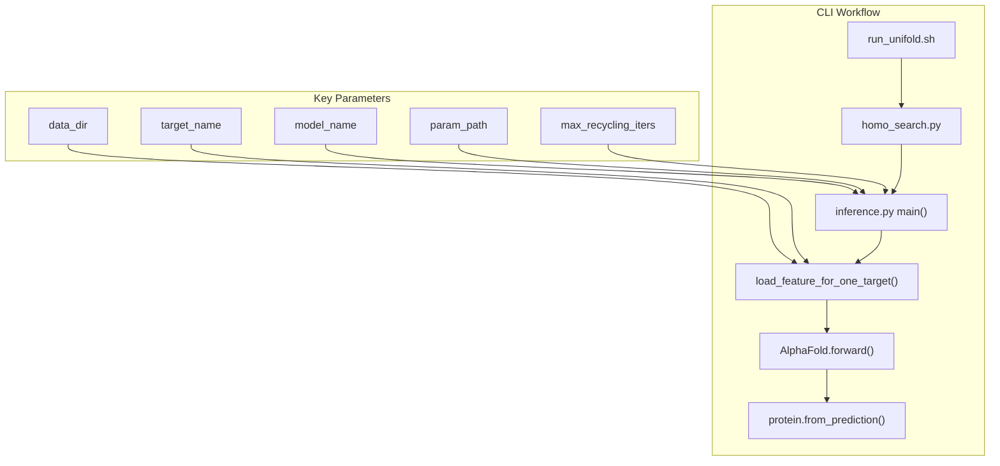
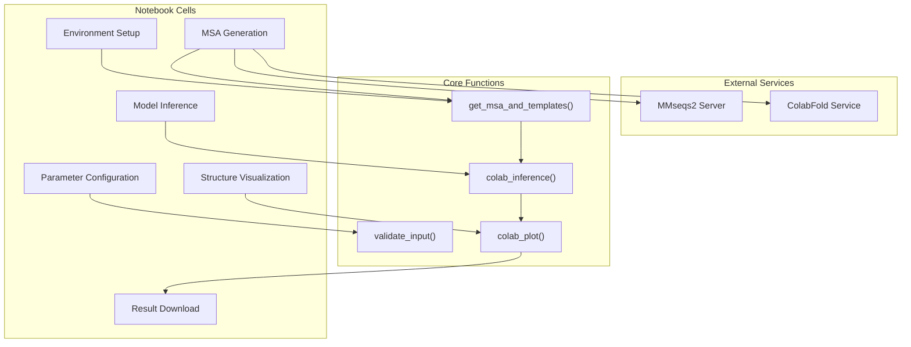
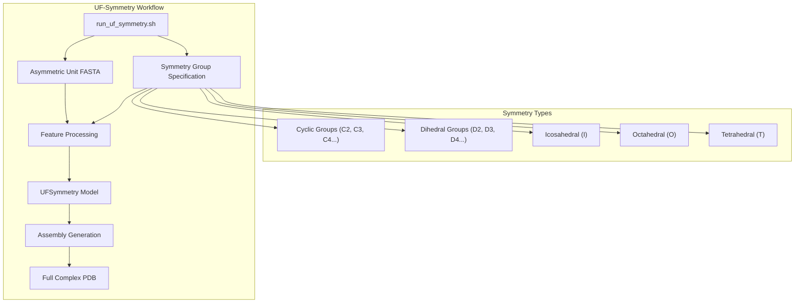
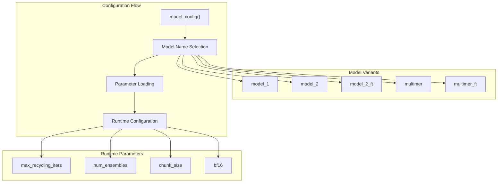

# User Interfaces

> **Relevant source files**
> * [README.md](https://github.com/dptech-corp/Uni-Fold/blob/7b55789e/README.md?plain=1)
> * [notebooks/unifold.ipynb](https://github.com/dptech-corp/Uni-Fold/blob/7b55789e/notebooks/unifold.ipynb)
> * [unifold/inference.py](https://github.com/dptech-corp/Uni-Fold/blob/7b55789e/unifold/inference.py)

This document covers the various user interfaces available for interacting with Uni-Fold, including command-line tools, interactive notebooks, and specialized interfaces for different prediction types. For information about the underlying model architecture, see [Model Architecture](/dptech-corp/Uni-Fold/5-model-architecture). For details on data processing pipelines, see [Data Pipeline](/dptech-corp/Uni-Fold/4-data-pipeline).

## Interface Overview

Uni-Fold provides multiple user interfaces to accommodate different use cases and user preferences:

* **Command Line Interface**: Primary interface for batch processing and production use
* **Colab Notebook Interface**: Interactive web-based interface for experimental use
* **UF-Symmetry Interface**: Specialized interface for symmetric protein complex prediction
* **Docker Container Interface**: Containerized deployment for reproducible environments

Sources: [README.md L1-L344](https://github.com/dptech-corp/Uni-Fold/blob/7b55789e/README.md?plain=1#L1-L344)

 [notebooks/unifold.ipynb L1-L350](https://github.com/dptech-corp/Uni-Fold/blob/7b55789e/notebooks/unifold.ipynb#L1-L350)

 [unifold/inference.py L1-L267](https://github.com/dptech-corp/Uni-Fold/blob/7b55789e/unifold/inference.py#L1-L267)

## Interface Entry Points and Data Flow

The following diagram shows how different interfaces process input sequences through to final structure predictions:

Sources: [README.md L125-L141](https://github.com/dptech-corp/Uni-Fold/blob/7b55789e/README.md?plain=1#L125-L141)

 [notebooks/unifold.ipynb L132-L240](https://github.com/dptech-corp/Uni-Fold/blob/7b55789e/notebooks/unifold.ipynb#L132-L240)

 [unifold/inference.py L49-L74](https://github.com/dptech-corp/Uni-Fold/blob/7b55789e/unifold/inference.py#L49-L74)

 [unifold/inference.py L76-L199](https://github.com/dptech-corp/Uni-Fold/blob/7b55789e/unifold/inference.py#L76-L199)

## Core Interface Components

### Command Line Interface Architecture

The primary CLI interface `run_unifold.sh` orchestrates the complete prediction pipeline:

| Component | File Path | Function | Purpose |
| --- | --- | --- | --- |
| Main Entry Point | `run_unifold.sh` | Shell script coordination | Orchestrates MSA search and inference |
| Homology Search | `homo_search.py` | Database searching | Generates MSAs and templates |
| Model Inference | `inference.py` | `main()` | Loads models and runs predictions |
| Feature Loading | `inference.py` | `load_feature_for_one_target()` | Processes features for model input |
| Memory Management | `inference.py` | `automatic_chunk_size()` | Optimizes memory usage based on sequence length |

Sources: [README.md L125-L141](https://github.com/dptech-corp/Uni-Fold/blob/7b55789e/README.md?plain=1#L125-L141)

 [unifold/inference.py L77-L199](https://github.com/dptech-corp/Uni-Fold/blob/7b55789e/unifold/inference.py#L77-L199)

 [unifold/inference.py L202-L266](https://github.com/dptech-corp/Uni-Fold/blob/7b55789e/unifold/inference.py#L202-L266)

### Colab Notebook Interface Components

The interactive notebook interface provides a streamlined web-based experience:

Sources: [notebooks/unifold.ipynb L36-L72](https://github.com/dptech-corp/Uni-Fold/blob/7b55789e/notebooks/unifold.ipynb#L36-L72)

 [notebooks/unifold.ipynb L132-L240](https://github.com/dptech-corp/Uni-Fold/blob/7b55789e/notebooks/unifold.ipynb#L132-L240)

 [notebooks/unifold.ipynb L251-L275](https://github.com/dptech-corp/Uni-Fold/blob/7b55789e/notebooks/unifold.ipynb#L251-L275)

 [notebooks/unifold.ipynb L286-L296](https://github.com/dptech-corp/Uni-Fold/blob/7b55789e/notebooks/unifold.ipynb#L286-L296)

### UF-Symmetry Interface Specialization

The UF-Symmetry interface extends the base CLI with symmetric complex prediction capabilities:

| Parameter | Description | Example Values |
| --- | --- | --- |
| `symmetry_group` | Symmetry type specification | `C3`, `C4`, `D2`, etc. |
| Input Requirements | Asymmetric unit only | Single chain representing unit |
| Model Selection | Specialized symmetry parameters | `uf_symmetry_params_2022-09-06.tar.gz` |
| Assembly Generation | Symmetry expansion | Automatic complex generation |

Sources: [README.md L260-L282](https://github.com/dptech-corp/Uni-Fold/blob/7b55789e/README.md?plain=1#L260-L282)

 [notebooks/unifold.ipynb L49-L54](https://github.com/dptech-corp/Uni-Fold/blob/7b55789e/notebooks/unifold.ipynb#L49-L54)

## Interface Configuration and Parameters

### Model Configuration System

All interfaces utilize the centralized configuration system defined in `unifold/config.py`:

Sources: [unifold/inference.py L78-L96](https://github.com/dptech-corp/Uni-Fold/blob/7b55789e/unifold/inference.py#L78-L96)

 [unifold/inference.py L127-L133](https://github.com/dptech-corp/Uni-Fold/blob/7b55789e/unifold/inference.py#L127-L133)

### Memory Management and Performance Optimization

The `automatic_chunk_size()` function optimizes memory usage based on hardware capabilities:

| Sequence Length Range | Chunk Size | Block Size | Memory Factor |
| --- | --- | --- | --- |
| < 1024 * factor | 256 | None | Based on GPU memory |
| < 2048 * factor | 128 | None | Adjusted for bf16 |
| < 3072 * factor | 64 | None | Dynamic scaling |
| < 4096 * factor | 32 | 512 | Conservative approach |
| ≥ 4096 * factor | 4 | 256 | Maximum memory efficiency |

Sources: [unifold/inference.py L20-L47](https://github.com/dptech-corp/Uni-Fold/blob/7b55789e/unifold/inference.py#L20-L47)

 [unifold/inference.py L125-L133](https://github.com/dptech-corp/Uni-Fold/blob/7b55789e/unifold/inference.py#L125-L133)