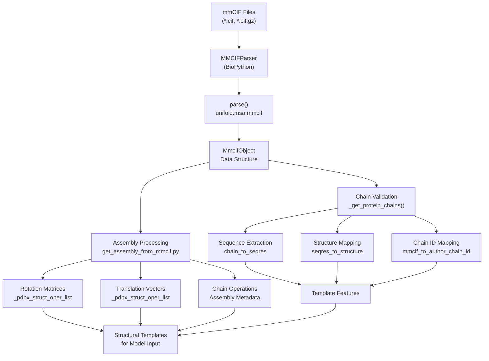
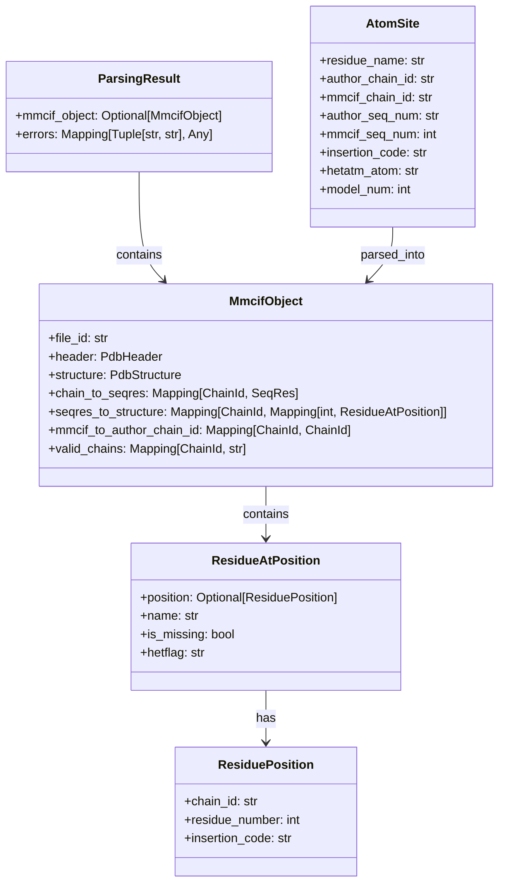
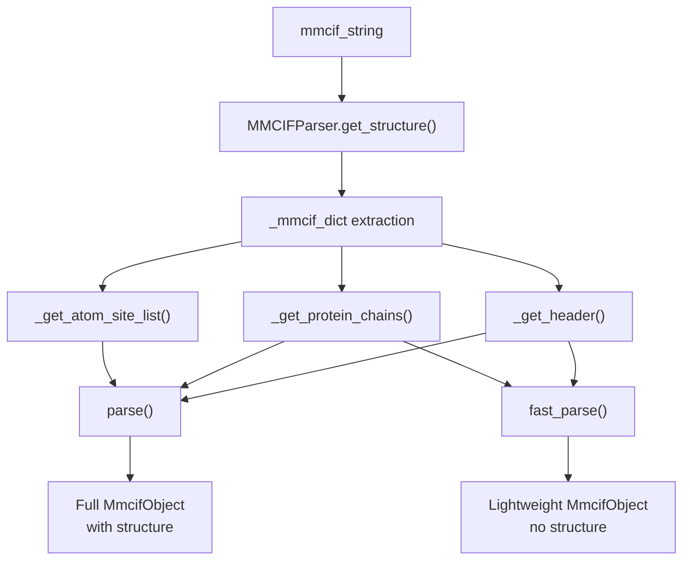
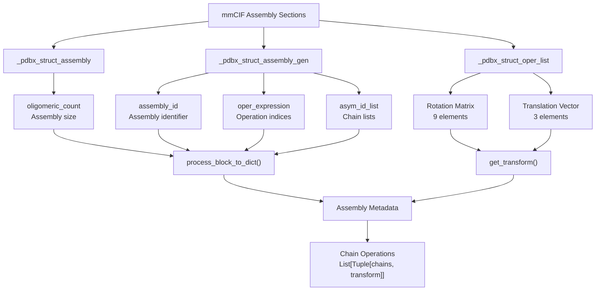
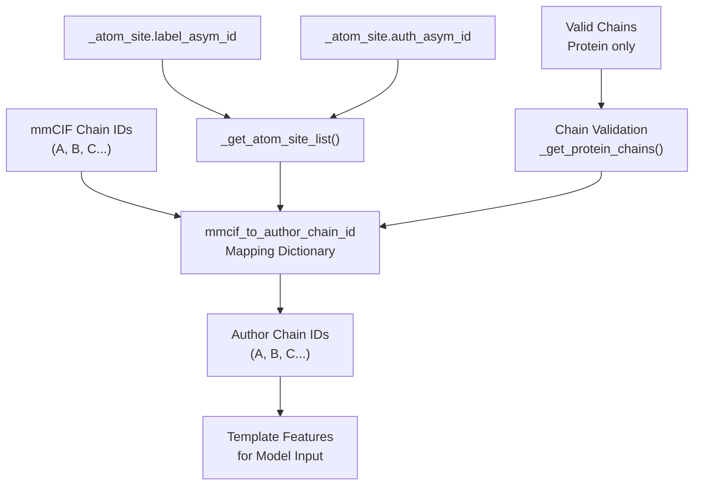
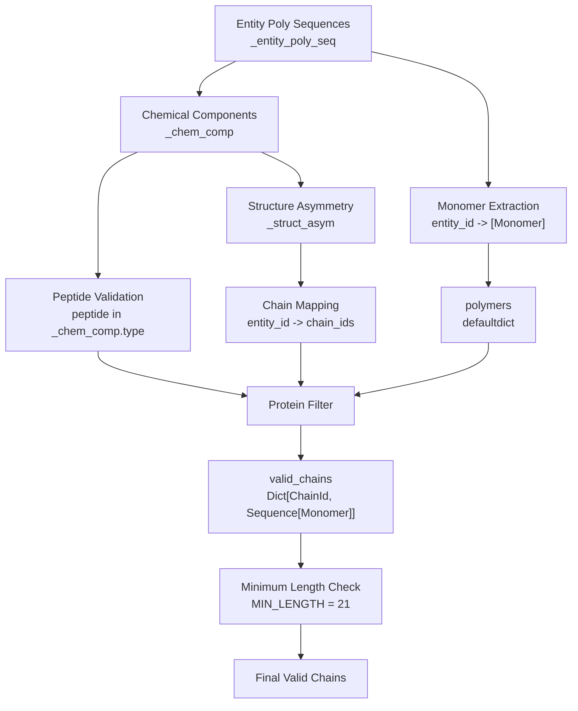
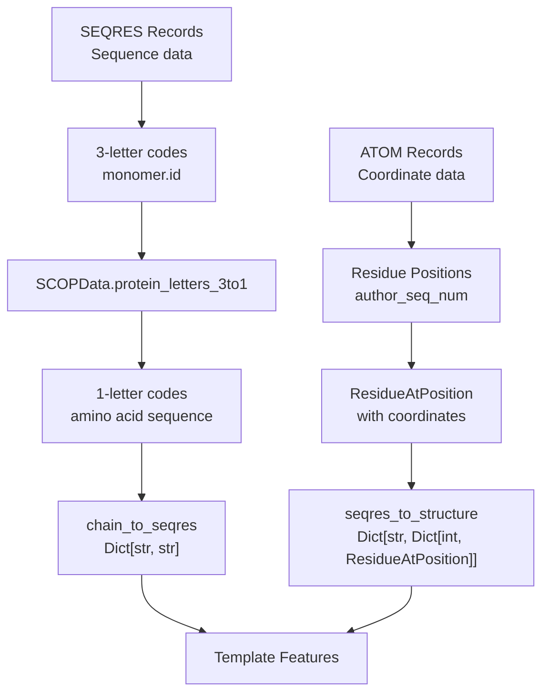
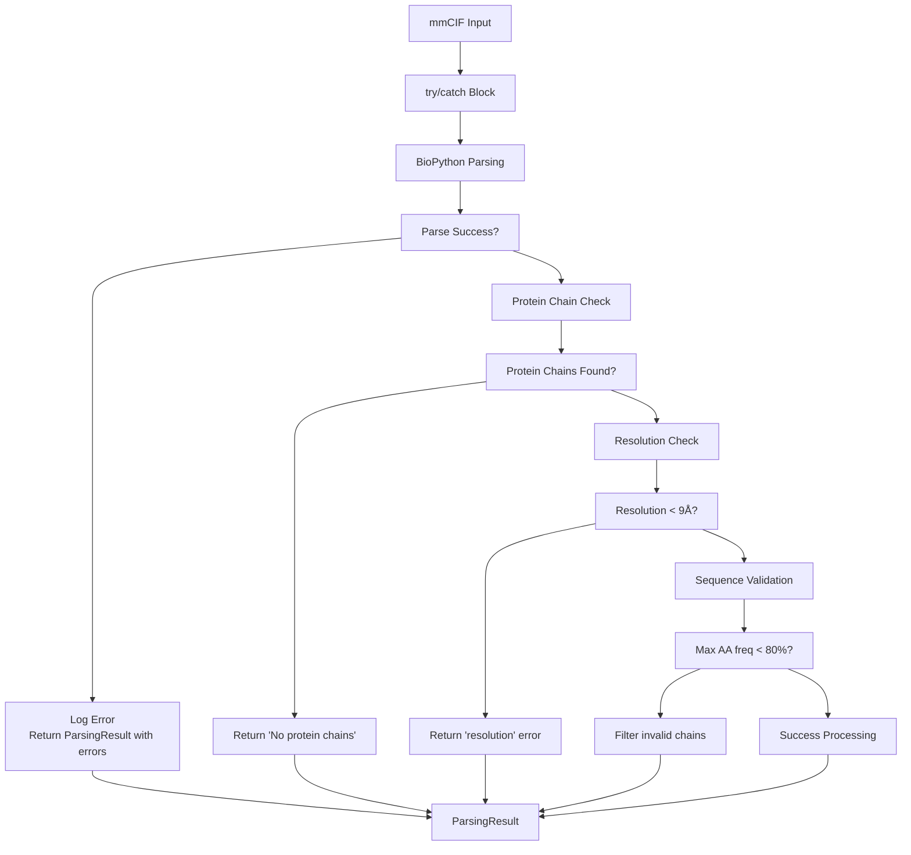
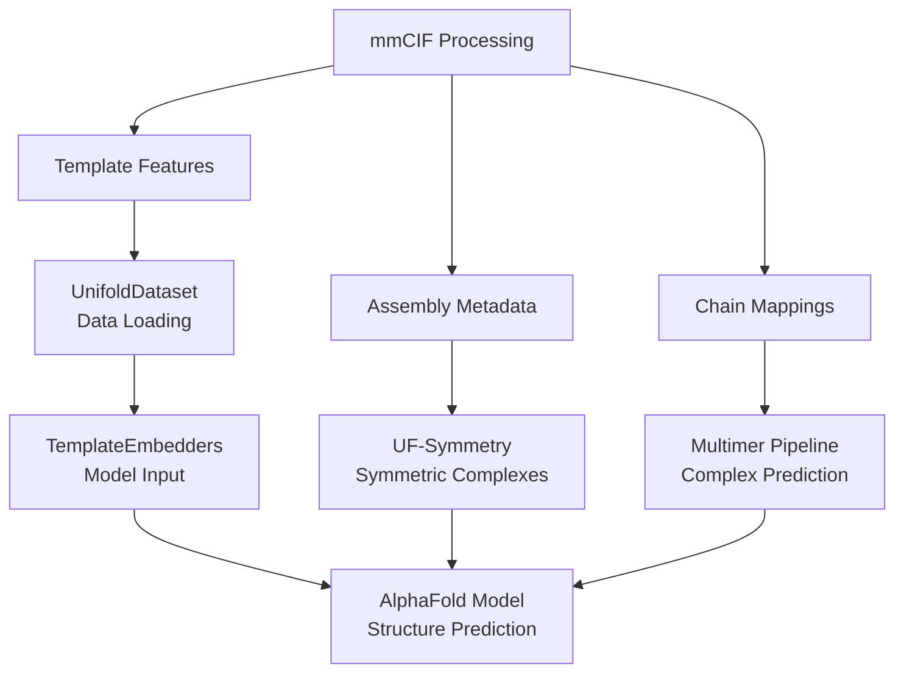

# mmCIF and Template Processing

> **Relevant source files**
> * [scripts/get_assembly_from_mmcif.py](https://github.com/dptech-corp/Uni-Fold/blob/7b55789e/scripts/get_assembly_from_mmcif.py)
> * [scripts/get_chain_mapper_from_mmcif.py](https://github.com/dptech-corp/Uni-Fold/blob/7b55789e/scripts/get_chain_mapper_from_mmcif.py)
> * [scripts/get_pdb_assembly.py](https://github.com/dptech-corp/Uni-Fold/blob/7b55789e/scripts/get_pdb_assembly.py)
> * [unifold/msa/SCOPData.py](https://github.com/dptech-corp/Uni-Fold/blob/7b55789e/unifold/msa/SCOPData.py)
> * [unifold/msa/mmcif.py](https://github.com/dptech-corp/Uni-Fold/blob/7b55789e/unifold/msa/mmcif.py)

This page covers the mmCIF (macromolecular Crystallographic Information File) processing system in Uni-Fold, which handles structural template data from the Protein Data Bank to enhance protein structure predictions. The system parses mmCIF files, extracts assembly information, and prepares structural templates for integration into the prediction pipeline.

For information about MSA generation and homology search, see [Homology Search and MSA Generation](/dptech-corp/Uni-Fold/4.1-homology-search-and-msa-generation). For details about how processed templates are used in the model architecture, see [Template Processing](/dptech-corp/Uni-Fold/5.4-template-processing).

## mmCIF Processing Pipeline

The mmCIF processing system follows a multi-stage pipeline that converts raw structural data into model-ready features:

**mmCIF Processing Pipeline**

Sources: [unifold/msa/mmcif.py L170-L359](https://github.com/dptech-corp/Uni-Fold/blob/7b55789e/unifold/msa/mmcif.py#L170-L359)

 [scripts/get_assembly_from_mmcif.py L112-L224](https://github.com/dptech-corp/Uni-Fold/blob/7b55789e/scripts/get_assembly_from_mmcif.py#L112-L224)

## Core Data Structures

The mmCIF processing system uses several key data structures to represent parsed structural information:

**mmCIF Data Structure Relationships**

Sources: [unifold/msa/mmcif.py L35-L109](https://github.com/dptech-corp/Uni-Fold/blob/7b55789e/unifold/msa/mmcif.py#L35-L109)

## mmCIF Parsing Functions

The system provides two main parsing entry points with different levels of detail:

| Function | Purpose | Structure Data | Performance |
| --- | --- | --- | --- |
| `parse()` | Full parsing with BioPython structure | Complete | Slower |
| `fast_parse()` | Lightweight parsing without structure | Limited | Faster |

Both functions use the same core parsing logic but differ in their output completeness:

**Parsing Function Workflow**

Sources: [unifold/msa/mmcif.py L170-L234](https://github.com/dptech-corp/Uni-Fold/blob/7b55789e/unifold/msa/mmcif.py#L170-L234)

 [unifold/msa/mmcif.py L236-L359](https://github.com/dptech-corp/Uni-Fold/blob/7b55789e/unifold/msa/mmcif.py#L236-L359)

## Assembly Information Extraction

The assembly processing system extracts biological assembly information from mmCIF files, including symmetry operations and chain transformations:

**Assembly Processing Workflow**

The system handles various assembly formats including ranges (`"1-4"`) and comma-separated lists (`"1,3,5"`):

Sources: [scripts/get_assembly_from_mmcif.py L80-L97](https://github.com/dptech-corp/Uni-Fold/blob/7b55789e/scripts/get_assembly_from_mmcif.py#L80-L97)

 [scripts/get_assembly_from_mmcif.py L185-L220](https://github.com/dptech-corp/Uni-Fold/blob/7b55789e/scripts/get_assembly_from_mmcif.py#L185-L220)

## Chain ID Mapping System

mmCIF files use different chain ID systems that must be mapped for consistency:

| ID Type | Description | Usage |
| --- | --- | --- |
| `mmcif_chain_id` | Internal mmCIF identifier | Parsing and validation |
| `author_chain_id` | Author-assigned identifier | Final output and PDB compatibility |

**Chain ID Mapping Process**

Sources: [unifold/msa/mmcif.py L209-L226](https://github.com/dptech-corp/Uni-Fold/blob/7b55789e/unifold/msa/mmcif.py#L209-L226)

 [unifold/msa/mmcif.py L286-L293](https://github.com/dptech-corp/Uni-Fold/blob/7b55789e/unifold/msa/mmcif.py#L286-L293)

## Protein Chain Validation

The system validates and filters chains to ensure only protein chains are processed:

**Protein Chain Validation Process**

Sources: [unifold/msa/mmcif.py L427-L478](https://github.com/dptech-corp/Uni-Fold/blob/7b55789e/unifold/msa/mmcif.py#L427-L478)

 [unifold/msa/mmcif.py L367](https://github.com/dptech-corp/Uni-Fold/blob/7b55789e/unifold/msa/mmcif.py#L367-L367)

## Sequence and Structure Mapping

The system creates bidirectional mappings between sequence positions and structural coordinates:

| Mapping Type | Source | Target | Purpose |
| --- | --- | --- | --- |
| `chain_to_seqres` | Chain ID | 1-letter sequence | Sequence alignment |
| `seqres_to_structure` | Sequence index | `ResidueAtPosition` | Structure lookup |

**Sequence-Structure Mapping**

Sources: [unifold/msa/mmcif.py L333-L341](https://github.com/dptech-corp/Uni-Fold/blob/7b55789e/unifold/msa/mmcif.py#L333-L341)

 [unifold/msa/mmcif.py L313-L321](https://github.com/dptech-corp/Uni-Fold/blob/7b55789e/unifold/msa/mmcif.py#L313-L321)

 [unifold/msa/SCOPData.py L22-L282](https://github.com/dptech-corp/Uni-Fold/blob/7b55789e/unifold/msa/SCOPData.py#L22-L282)

## Error Handling and Validation

The mmCIF processing system includes comprehensive error handling for common parsing issues:

| Error Type | Detection | Handling |
| --- | --- | --- |
| No protein chains | Chain validation | Return empty result |
| Parse errors | BioPython exceptions | Log and continue |
| Resolution filtering | Header analysis | Skip low-quality structures |
| Invalid sequences | Frequency analysis | Filter homopolymers |

**Error Handling Workflow**

Sources: [scripts/get_assembly_from_mmcif.py L117-L131](https://github.com/dptech-corp/Uni-Fold/blob/7b55789e/scripts/get_assembly_from_mmcif.py#L117-L131)

 [scripts/get_assembly_from_mmcif.py L144-L148](https://github.com/dptech-corp/Uni-Fold/blob/7b55789e/scripts/get_assembly_from_mmcif.py#L144-L148)

 [unifold/msa/mmcif.py L229-L233](https://github.com/dptech-corp/Uni-Fold/blob/7b55789e/unifold/msa/mmcif.py#L229-L233)

## Integration with Uni-Fold Pipeline

The processed mmCIF data integrates into the broader Uni-Fold system through several pathways:

**mmCIF Integration Points**

Sources: [scripts/get_assembly_from_mmcif.py L246-L260](https://github.com/dptech-corp/Uni-Fold/blob/7b55789e/scripts/get_assembly_from_mmcif.py#L246-L260)

 [unifold/msa/mmcif.py L343-L353](https://github.com/dptech-corp/Uni-Fold/blob/7b55789e/unifold/msa/mmcif.py#L343-L353)