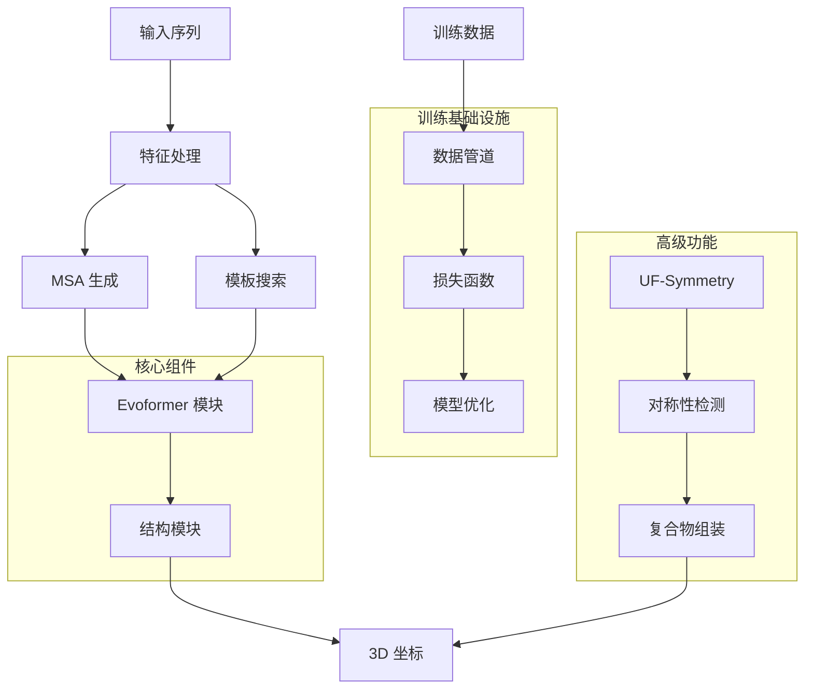

---
slug:1-overview
blog_type:normal
---


Uni-Fold 是一个全面的开源平台，它重新构想了超越 AlphaFold 原始实现的蛋白质结构预测。完全基于 PyTorch 构建，Uni-Fold 是首个支持 AlphaFold-Multimer 模型完整训练的开源仓库，同时提供卓越的性能和效率。

## Uni-Fold 的革命性突破

Uni-Fold 引入了多项突破性功能，使其区别于其他实现：

**完整的 PyTorch 实现**：与原始基于 JAX 的 AlphaFold 不同，Uni-Fold 提供了 AlphaFold 和 AlphaFold-Multimer 架构的完整 PyTorch 重新实现，实现了与更广泛的 PyTorch 生态系统的无缝集成 [setup.py](setup.py#L20-L22)。

**训练卓越性**：Uni-Fold 通过成功的从头训练证明了模型的正确性，其达到的准确度与原始 AlphaFold 相当或更高，使其成为首个支持 AlphaFold-Multimer 训练的开源平台 [README.md](README.md#L15-L17)。

**性能领先**：基准测试显示 Uni-Fold 是目前最快的 AlphaFold 实现，在单体和多聚体预测准确度上均有显著提升  。

**UF-Symmetry 创新**：该平台引入了 UF-Symmetry，这是一个专门用于高效预测大型对称蛋白质复合物的解决方案，这些复合物在标准实现中会导致内存溢出错误 。

## 架构概览

Uni-Fold 采用模块化架构，在保持集成的同时分离关注点：



该架构利用 [Uni-Core](https://github.com/dptech-corp/Uni-Core) 实现分布式训练能力，支持跨多个 GPU 和节点的高效扩展，同时支持混合精度训练和融合 CUDA 内核等高级功能。

## 关键组件和能力

### 模型架构

Uni-Fold 实现了完整的 AlphaFold 架构，并进行了多项增强：

**Evoformer 模块**：核心注意力机制处理多序列比对 (MSAs) 和成对表示，捕获进化信息和结构关系 [unifold/modules/evoformer.py](unifold/modules/evoformer.py)。

**结构模块**：使用不变点注意力和几何约束将学习到的表示转换为 3D 原子坐标 [unifold/modules/structure_module.py](unifold/modules/structure_module.py)。

**模板集成**：整合同源蛋白质的结构模板，以提高具有已知结构亲属关系目标的预测准确性 [unifold/modules/template.py](unifold/modules/template.py)。

### 训练基础设施

该平台提供全面的训练能力：

**分布式训练**：基于 Uni-Core 框架构建，支持高效的多 GPU 和多节点训练，具有自动梯度同步功能 [unifold/model.py](unifold/model.py#L12-L31)。

**混合精度支持**：支持 float16 和 bfloat16 训练，以减少内存使用并加速计算，同时保持数值稳定性 [unifold/model.py](unifold/model.py#L33-L43)。

**高级优化**：包括每个样本的梯度裁剪、融合 CUDA 内核和大规模训练的内存高效实现 [README.md](README.md#L17-L18)。

### 数据处理管道

Uni-Fold 具有复杂的数据处理管道：

**特征提取**：对蛋白质序列、MSA 和结构特征进行全面处理，生成模型就绪的表示 [unifold/data/process.py](unifold/data/process.py)。

**模板处理**：高级模板搜索和处理，支持可配置的模板数据库和过滤标准 [unifold/msa/templates.py](unifold/msa/templates.py)。

**数据增强**：多种增强策略，用于提高模型鲁棒性和泛化能力 [unifold/data/data_ops.py](unifold/data/data_ops.py)。

## 项目结构

该仓库被组织成逻辑组件，以确保清晰性和可维护性：

```
unifold/
├── modules/           # 核心神经网络模块
├── data/             # 数据处理和特征提取
├── msa/              # 多序列比对处理
├── losses/           # 损失函数实现
├── symmetry/         # UF-Symmetry 实现
└── colab/           # Google Colab 集成
```

这种模块化设计便于扩展和自定义，同时保持关注点的清晰分离。[modules](unifold/modules/) 目录包含核心神经网络组件，而 [data](unifold/data/) 处理所有预处理和特征工程任务。

## 性能和准确性

Uni-Fold 在多个维度上实现了卓越性能：

**预测准确性**：对训练后发布的 PDB 结构进行综合评估，显示与 AlphaFold-Multimer 相当的单体预测准确度和更优越的多聚体性能 。

**计算效率**：基准测试显示 Uni-Fold 是最快的 AlphaFold 实现，在训练和推理速度上有显著提升，同时保持内存效率。

**可扩展性**：该平台高效处理不同大小的蛋白质，从小肽到大复合物，UF-Symmetry 将能力扩展到使用标准方法难以处理的对称组装体。

## 快速入门

Uni-Fold 为用户提供了多种参与平台的途径：

**快速开始**：从 [快速开始](2-quick-start) 指南开始，使用预训练模型立即获得动手体验。

**安装**：遵循 [安装和环境设置](3-installation-and-environment-setup) 获取详细的环境配置说明。

**数据库准备**：访问 [数据库准备和下载](4-database-preparation-and-downloads) 指南以设置所需的生物数据库。

**基本使用**：参考 [运行基本蛋白质结构预测](5-running-basic-protein-structure-prediction) 获取分步推理说明。

该平台还通过全面的训练脚本、微调能力和广泛的定制选项支持高级用户。无论你是探索蛋白质折叠的研究人员、在平台上构建的开发人员，还是将结构预测应用于生物问题的科学家，Uni-Fold 都为成功提供了所需的工具和灵活性。

Uni-Fold 不仅仅是一个重新实现——它是下一代蛋白质结构预测模型的基础，将 AlphaFold 的成功与 PyTorch 生态系统的灵活性和强大功能相结合。