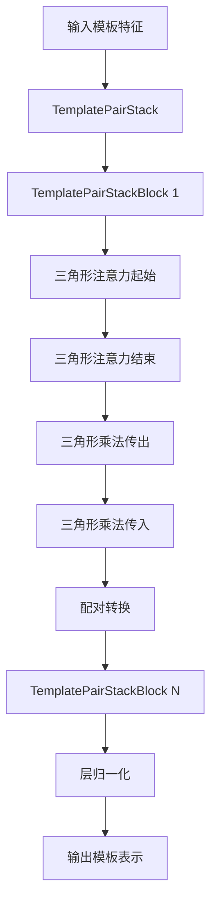

---
slug:10-template-integration-and-pair-representation
blog_type:normal
---


模板集成和配对表示构成了 Uni-Fold 架构的关键组成部分，使模型能够利用同源蛋白质的结构信息来提高预测准确性。该系统通过复杂的注意力机制处理模板特征，并将其转换为配对表示，从而指导结构预测过程。

## 模板特征架构

模板处理流水线由多个关键模块组成，它们协同工作以提取和集成模板信息：

### 核心模板模块

模板系统围绕 [`unifold/modules/template.py`](unifold/modules/template.py) 中的四个主要类构建：

1. **TemplatePointwiseAttention**（第 34-93 行）：实现模板特征与配对表示之间的注意力机制
2. **TemplateProjection**（第 94-112 行）：将模板特征投影到配对表示维度
3. **TemplatePairStackBlock**（第 113-255 行）：具有三角形注意力和乘法运算的独立处理块
4. **TemplatePairStack**（第 256-341 行）：协调多个模板处理块

### 模块逐点注意力

`TemplatePointwiseAttention` 模块作为模板特征与演化中的配对表示之间的接口：

```python
class TemplatePointwiseAttention(nn.Module):
    def __init__(self, d_template, d_pair, d_hid, num_heads, inf, **kwargs):
        super(TemplatePointwiseAttention, self).__init__()
        self.inf = inf
        self.mha = Attention(
            d_pair, d_template, d_template, d_hid, num_heads, gating=False
        )
```

该模块应用多头注意力，其中配对表示作为查询，模板特征作为键和值，使模型能够根据与当前预测状态的相关性有选择地整合模板信息 [来源](unifold/modules/template.py#L34-L76)。

## 模板特征处理流水线

### 特征提取与转换

模板特征在集成前会经历多个转换步骤：

1. **配对特征构建**：[`unifold/modules/featurization.py`](unifold/modules/featurization.py) 中的 `build_template_pair_feat` 函数从模板伪 beta 坐标创建基于距离的表示：

```python
def build_template_pair_feat(batch, min_bin, max_bin, num_bins, eps=1e-20, inf=1e8):
    template_mask = batch["template_pseudo_beta_mask"]
    template_mask_2d = template_mask[..., None] * template_mask[..., None, :]
    
    tpb = batch["template_pseudo_beta"]
    dgram = torch.sum(
        (tpb[..., None, :] - tpb[..., None, :, :]) ** 2, dim=-1, keepdim=True
    )
```

此函数在模板残基之间创建距离直方图，将空间关系编码为分箱距离特征 [来源](unifold/modules/featurization.py#L84-L108)。

2. **多链支持**：v2 特征实现（`build_template_pair_feat_v2`）通过非对称掩码添加对多链蛋白质复合物的支持：

```python
def build_template_pair_feat_v2(batch, min_bin, max_bin, num_bins, multichain_mask_2d=None, eps=1e-20, inf=1e8):
    template_mask = batch["template_pseudo_beta_mask"]
    template_mask_2d = template_mask[..., None] * template_mask[..., None, :]
    if multichain_mask_2d is not None:
        template_mask_2d *= multichain_mask_2d
```

这能够正确处理具有多条链的蛋白质复合物 [来源](unifold/modules/featurization.py#L129-L150)。

### 模板堆栈处理

`TemplatePairStack` 通过一系列注意力和转换块处理单个模板：



每个 `TemplatePairStackBlock` 应用三角形注意力机制来捕获模板表示中的行和列依赖关系 [来源](unifold/modules/template.py#L113-L200)。

## 与 AlphaFold 模型的集成

### 模板嵌入流水线

模板系统通过 [`unifold/modules/alphafold.py`](unifold/modules/alphafold.py) 中的 `embed_templates_pair` 方法与主 AlphaFold 模型集成：

```python
def embed_templates_pair_core(self, batch, z, pair_mask, tri_start_attn_mask, tri_end_attn_mask, templ_dim, multichain_mask_2d):
    if self.config.template.template_pair_embedder.v2_feature:
        t = build_template_pair_feat_v2(
            batch, inf=self.config.template.inf, eps=self.config.template.eps,
            multichain_mask_2d=multichain_mask_2d, **self.config.template.distogram,
        )
        num_template = t[0].shape[-4]
        single_templates = [
            self.template_pair_embedder([x[..., ti, :, :, :] for x in t], z)
            for ti in range(num_template)
        ]
```

此方法处理 v1 和 v2 特征格式，处理单个模板，并应用模板堆栈进行特征优化 [来源](unifold/modules/alphafold.py#L147-L170)。

### 条件模板处理

系统支持基于训练模式和配置的条件模板激活：

```python
def embed_templates_pair(self, batch, z, pair_mask, tri_start_attn_mask, tri_end_attn_mask, templ_dim):
    if self.config.template.template_pair_embedder.v2_feature and "asym_id" in batch:
        multichain_mask_2d = (
            batch["asym_id"][..., :, None] == batch["asym_id"][..., None, :]
        )
        multichain_mask_2d = multichain_mask_2d.unsqueeze(0)
    else:
        multichain_mask_2d = None

    if self.training or self.enable_template_pointwise_attention:
        t = self.embed_templates_pair_core(...)
```

这使训练和推理期间能够灵活使用模板 [来源](unifold/modules/alphafold.py#L185-L200)。

## 数据处理与特征准备

### 模板特征生成

模板特征通过 [`unifold/data/process.py`](unifold/data/process.py) 中的数据处理流水线准备：

```python
def nonensembled_fns(common_cfg, mode_cfg):
    operators = []
    # ... 其他处理步骤
    if common_cfg.use_templates:
        operators.extend([
            data_ops.make_template_mask,
            data_ops.make_pseudo_beta("template_"),
        ])
        operators.append(
            data_ops.crop_templates(
                max_templates=mode_cfg.max_templates,
                subsample_templates=mode_cfg.subsample_templates,
            )
        )
```

这确保了正确的模板掩码、伪 beta 坐标生成和为内存效率进行的模板裁剪 [来源](unifold/data/process.py#L30-L45)。

<CgxTip>
模板裁剪对于内存管理至关重要，尤其是在处理多个模板时。系统支持随机子采样和固定大小裁剪策略，以平衡信息内容与计算约束。
</CgxTip>

## 技术实现细节

### 内存优化

模板系统实现了多种内存优化策略：

1. **分块处理**：`TemplatePointwiseAttention` 中的 `_chunk` 方法支持以内存高效的方式分块处理大型模板：

```python
def _chunk(self, z: torch.Tensor, t: torch.Tensor, mask: torch.Tensor, chunk_size: int) -> torch.Tensor:
    mha_inputs = {"q": z, "k": t, "v": t, "mask": mask}
    return chunk_layer(
        self.mha, mha_inputs, chunk_size=chunk_size,
        num_batch_dims=len(z.shape[:-2]),
    )
```

2. **检查点**：`TemplatePairStack` 使用梯度检查点来减少反向传播期间的内存使用 [来源](unifold/modules/template.py#L289-L300)。

### 维度管理

`TemplateProjection` 模块处理模板特征与配对表示之间的维度对齐：

```python
class TemplateProjection(nn.Module):
    def __init__(self, d_template, d_pair, **kwargs):
        super(TemplateProjection, self).__init__()
        self.d_pair = d_pair
        self.act = nn.ReLU()
        self.output_linear = Linear(d_template, d_pair, init="relu")

    def forward(self, t, z) -> torch.Tensor:
        if t is None:
            # 处理无模板情况
            shape = z.shape
            shape[-1] = self.d_pair
            t = torch.zeros(shape, dtype=z.dtype, device=z.device)
        t = self.act(t)
        z_t = self.output_linear(t)
        return z_t
```

这确保了不同特征维度之间的兼容性，并为缺失的模板数据提供了优雅的处理 [来源](unifold/modules/template.py#L94-L112)。

<CgxTip>
模板系统包括对无模板可用情况的鲁棒处理，自动生成具有适当维度的零填充张量，以保持一致的模型行为。
</CgxTip>

## 配置与使用

模板集成通过配置参数控制，这些参数指定：

- **模板使用**：是否启用模板处理（`use_templates`）
- **特征版本**：在 v1 和 v2 特征格式之间选择（`v2_feature`）
- **模板限制**：最大模板数量（`max_templates`）
- **子采样策略**：随机模板选择（`subsample_templates`）
- **注意力配置**：逐点注意力启用（`enable_template_pointwise_attention`）

这些参数允许针对不同用例（从单体预测到多聚体复合物建模）微调模板系统。

模板集成系统代表了利用同源蛋白质进化和结构信息的复杂方法，提供了显著改善 Uni-Fold 中蛋白质结构预测准确性的关键空间约束。

有关整体模型架构的更多信息，请参阅 [PyTorch 中的 AlphaFold 模型实现](6-alphafold-model-implementation-in-pytorch)。要了解模板特征如何补充其他输入特征，请参考 [特征提取与 MSA 处理](9-feature-extraction-and-msa-processing)。