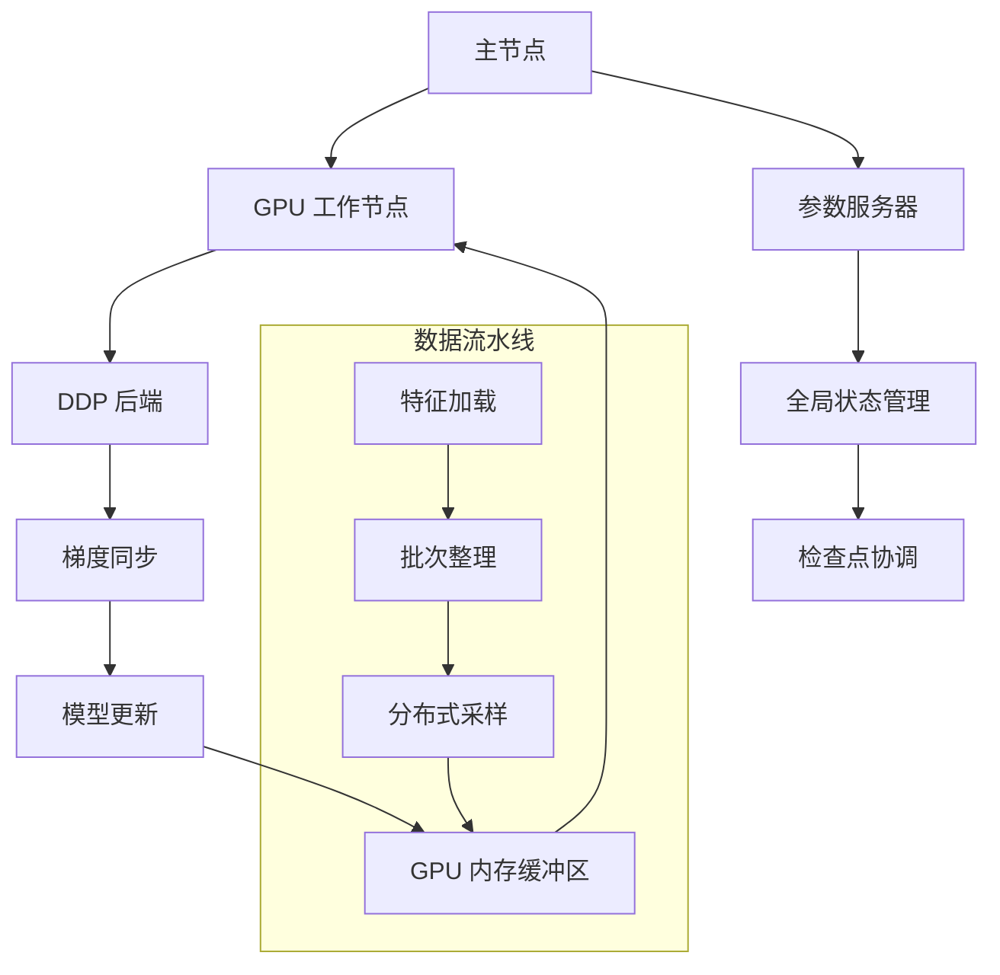

---
slug:12-distributed-training-with-uni-core
blog_type:normal
---


Uni-Fold 利用 Uni-Core 框架在多个 GPU 和节点间高效地分布式训练蛋白质结构预测模型。本综合指南涵盖了从单 GPU 到多节点部署扩展训练的架构、配置和优化策略。

## 分布式训练架构

Uni-Fold 的分布式训练基于 PyTorch 的分布式数据并行（DDP）框架构建，并与 Uni-Core 的训练基础设施集成。该架构支持跨多个 GPU 的数据并行和大规模蛋白质复合物的模型并行。



训练过程使用 `no_c10d` DDP 后端进行优化通信，并支持使用 bfloat16 的混合精度训练以提高内存效率 [train_monomer.sh#L27](train_monomer.sh#L27)。

## 训练配置

### 环境设置

分布式训练需要正确配置几个关键环境变量：

- **MASTER_IP**: 主节点的 IP 地址（默认：127.0.0.1）
- **MASTER_PORT**: 通信端口（默认：10087）
- **OMPI_COMM_WORLD_SIZE**: 集群中的节点数
- **OMPI_COMM_WORLD_RANK**: 当前节点的秩

```bash
export NCCL_ASYNC_ERROR_HANDLING=1
export OMP_NUM_THREADS=1
```

### 训练参数

训练脚本提供了全面的配置选项用于优化：

| 参数 | 默认值 | 描述 |
|-----------|---------|-------------|
| `n_gpu` | 自动检测 | 每节点 GPU 数 |
| `total_step` | 80000 | 最大训练步数 |
| `warmup_step` | 1000 | 学习率预热步数 |
| `decay_step` | 50000 | 学习率衰减步数 |
| `lr` | 1e-3 | 初始学习率 |
| `update_freq` | 1 | 梯度累积频率 |
| `sd_prob` | 0.75 (单体) / 0.5 (多聚体) | 自蒸馏概率 |

## 任务和数据集管理

### AlphafoldTask 集成

[unifold/task.py](unifold/task.py#L16-L92) 中的 `AlphafoldTask` 类管理分布式训练工作流：

- **数据集选择**：根据 `is_multimer` 配置自动选择单体训练的 `UnifoldDataset` 或复合物训练的 `UnifoldMultimerDataset`
- **数据加载**：实现带缓存和内存优化的高效特征加载
- **批次处理**：处理带回收维度的动态批次整理

### 数据集架构

数据集类支持分布式采样和高效数据加载：

- **UnifoldDataset**：单体训练的基类，支持自蒸馏 ([unifold/dataset.py#L240-L399](unifold/dataset.py#L240-L399))
- **UnifoldMultimerDataset**：多聚体复合物的扩展类，具有链组装逻辑 ([unifold/dataset.py#L399-L535](unifold/dataset.py#L399-L535))

两个数据集都实现了 `collater` 方法，用于高效创建批次，以回收维度为第一轴，批次大小为第二轴 [unifold/dataset.py#L381](unifold/dataset.py#L381)。

## 训练执行

### 单体训练

启动支持分布式的单体训练：

```bash
python -m torch.distributed.launch \
    --nproc_per_node=$n_gpu \
    --master_port $MASTER_PORT \
    --nnodes=$OMPI_COMM_WORLD_SIZE \
    --node_rank=$OMPI_COMM_WORLD_RANK \
    --master_addr=$MASTER_IP \
    $(which unicore-train) $data_path \
    --user-dir unifold \
    --task af2 --loss af2 --arch af2 \
    --ddp-backend=no_c10d \
    --bf16 --ema-decay 0.999
```

### 多聚体训练

多聚体训练遵循类似模式，但使用修改的损失函数：

```bash
python -m torch.distributed.launch \
    --nproc_per_node=$n_gpu \
    --master_port $MASTER_PORT \
    --nnodes=$OMPI_COMM_WORLD_SIZE \
    --node_rank=$OMPI_COMM_WORLD_RANK \
    --master_addr=$MASTER_IP \
    $(which unicore-train) $data_path \
    --user-dir unifold \
    --task af2 --loss afm --arch af2 \
    --ddp-backend=no_c10d \
    --bf16 --ema-decay 0.999
```

## 优化策略

### 内存优化

Uni-Fold 为分布式训练实现了多种内存优化技术：

- **混合精度**：bfloat16 训练减少内存使用同时保持数值稳定性
- **梯度累积**：可配置的 `update_freq` 允许有效的更大批次大小
- **数据缓冲**：32 样本缓冲区大小优化 I/O 操作 [train_monomer.sh#L41](train_monomer.sh#L41)

### 通信优化

- **No C10D 后端**：优化的 DDP 后端减少通信开销
- **FP32 梯度 All-Reduce**：在梯度同步中保持精度 [train_monomer.sh#L27](train_monomer.sh#L27)
- **异步错误处理**：NCCL 异步错误处理提高鲁棒性

### 检查点管理

训练系统包含复杂的检查点管理：

- **间隔保存**：每 500 次更新保存模型并进行验证
- **临时存储**：使用临时目录进行原子检查点操作
- **历史管理**：保留 40 个最近的检查点用于恢复

## 性能监控

训练进度通过以下方式监控：

- **TensorBoard 集成**：将指标记录到 `$save_dir/tsb/` 用于可视化
- **日志间隔**：可配置的日志频率（默认：每 10 步）
- **验证周期**：每 500 次更新进行定期验证

<CgxTip>
为获得最佳多节点性能，请确保节点间的正确网络配置，并考虑使用 InfiniBand 以降低梯度同步的延迟。
</CgxTip>

## 扩展考虑

扩展到多个节点时，需考虑：

1. **网络带宽**：梯度同步在大规模扩展时成为瓶颈
2. **批次大小扩展**：增加 `update_freq` 以保持有效批次大小
3. **内存分配**：监控跨节点的 GPU 内存使用以实现负载均衡
4. **容错性**：为长时间运行的训练作业实现适当的检查点恢复

<CgxTip>
自蒸馏概率（`sd_prob`）应根据数据集大小和训练阶段进行调整——较小数据集适合使用较高值。
</CgxTip>

## 后续步骤

要全面了解训练流水线，请探索：
- [损失函数和训练目标](13-loss-functions-and-training-objectives) 了解详细优化策略
- [内存优化和混合精度训练](17-memory-optimization-and-mixed-precision-training) 了解高级内存管理技术
- [微调预训练模型](14-fine-tuning-pretrained-models) 了解适配策略