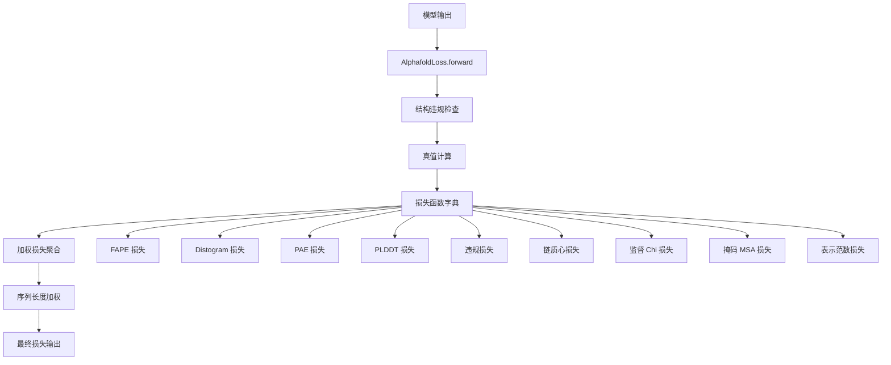

---
slug:13-loss-functions-and-training-objectives
blog_type:normal
---


Uni-Fold 实现了一个综合的多目标损失函数，结合了几何、结构和辅助损失，以实现高精度的蛋白质结构预测。损失架构旨在通过精心平衡的目标，同时优化局部原子排列和全局蛋白质折叠模式。

## 核心损失架构

主要损失函数在 `AlphafoldLoss` 类中实现，该类将九个不同的损失组件协调成一个统一的训练目标 [unifold/loss.py#L26-L199]。损失计算遵循系统性模式，每个组件根据其重要性加权，并贡献于最终累积损失。



## 结构损失组件

### 帧对齐点误差 (FAPE)

**FAPE 损失**作为主要的几何目标，测量预测坐标帧与真实坐标帧之间的对齐程度。它通过主干和侧链组件分别实现：

- **主干 FAPE**：使用链内和链间掩码计算主干原子的帧对齐误差 [unifold/losses/fape.py#L9-L70]
- **侧链 FAPE**：使用刚性组变换评估侧链定位精度 [unifold/losses/fape.py#L70-L115]
- **限位机制**：使用可配置的限位距离（链内 10.0Å，链间 30.0Å）防止梯度爆炸 [unifold/losses/fape.py#L14-L17]

<CgxTip>
FAPE 损失使用序列长度加权 (seq_len^0.5) 来平衡不同长度蛋白质的贡献，确保在多样化数据集规模上的稳定训练。
</CgxTip>

### 结构违规损失

违规损失通过多个子组件强制执行化学和几何约束：

- **键长约束**：惩罚残基间理想 C-N 键长的偏差 [unifold/losses/violation.py#L9-L126]
- **键角约束**：使用可配置权重保持适当的 CA-C-N 和 C-N-CA 角度 [unifold/losses/violation.py#L457-L485]
- **冲突检测**：识别并惩罚残基内部和残基之间的原子重叠 [unifold/losses/violation.py#L127-L236]
- **极长距离违规**：防止超过生物学约束的不现实 CA-CA 距离 [unifold/losses/violation.py#L390-L414]

## 辅助损失函数

### 基于距离的损失

**Distogram 损失**：使用 64-bin 直方图方法预测成对 Cβ-Cβ 距离，范围从 2.3125Å 到 21.6875Å [unifold/losses/auxillary.py#L170-L192]。该损失使用预测距离分布与真实距离分布之间的交叉熵。

**预测对齐误差 (PAE) 损失**：估计预测位置相对于真实坐标的期望误差，提供置信度校准 [unifold/losses/auxillary.py#L193-L226]。

### 置信度和分辨率损失

**PLDDT 损失**：训练模型基于结构准确度预测每个残基的置信度分数 (LDDT)，采用分辨率相关加权 [unifold/losses/auxillary.py#L42-L83]。

**实验解析损失**：预测在 X 射线结构中哪些原子被实验解析，整合 0.1Å 到 3.0Å 之间的分辨率信息 [unifold/losses/auxillary.py#L16-L41]。

### 序列和表示损失

**掩码 MSA 损失**：在多序列比对上实现 BERT 风格的掩码语言建模， enabling 进化信息学习 [unifold/losses/auxillary.py#L227-L237]。

**监督 Chi 损失**：使用 sin/cos 表示直接监督侧链二面角预测，确保适当的旋转异构体几何 [unifold/losses/auxillary.py#L84-L138]。

**表示范数损失**：正则化内部表示（MSA 和配对特征），防止训练期间特征漂移 [unifold/losses/auxillary.py#L139-L169]。

## 损失聚合和加权

最终损失通过复杂的聚合方案计算：

1. **单独损失计算**：每个损失函数返回形状为 [batch_size] 的每批次张量 [unifold/loss.py#L151-L157]
2. **NaN/Inf 处理**：自动跳过损坏的损失组件以保持训练稳定性 [unifold/loss.py#L159-L162]
3. **加权求和**：根据训练目标对每个组件应用可配置权重 [unifold/loss.py#L152-L163]
4. **序列长度归一化**：乘以 seq_len^0.5 以考虑蛋白质长度变化 [unifold/loss.py#L168]

```python
# 损失聚合模式来自 unifold/loss.py#L151-L168
for loss_name, loss_fn in loss_fns.items():
    weight = config[loss_name].weight
    if weight > 0.:
        loss = loss_fn()
        if any(torch.isnan(loss)) or any(torch.isinf(loss)):
            loss = loss.new_tensor(0.0, requires_grad=True)
        cum_loss = cum_loss + weight * loss

loss = (cum_loss * seq_length_weight).mean()
```

## 多聚体特定损失

对于蛋白质复合物预测，Uni-Fold 使用多聚体特定组件扩展损失架构：

**链质心损失**：对齐每条链的质心，确保适当的四级结构排列 [unifold/losses/auxillary.py#L245-L287]。

**多链排列对齐**：在损失计算前通过贪心对齐算法处理链顺序模糊性 [unifold/losses/chain_align.py#L123-L176]。

<CgxTip>
多聚体损失包括自动链排列对齐，解决相同链在预测与真实值中可能以不同顺序排列的对称性问题。
</CgxTip>

## 训练优化功能

损失实现包含几个用于稳健训练的优化功能：

- **梯度稳定性**：自动 NaN/inf 检测并用零梯度替换 [unifold/loss.py#L159-L162]
- **分布式训练**：跨多个工作进程的高效指标归约，具有可求和的日志输出 [unifold/loss.py#L193-L199]
- **可配置权重**：所有损失组件支持通过配置文件动态加权
- **内存效率**：使用就地操作和最小张量复制进行大规模训练

这种全面的损失架构使 Uni-Fold 能够通过几何准确性、化学有效性和进化信息整合的仔细平衡，在单体和多聚体蛋白质结构预测任务上实现最先进的性能。

有关实际实现细节和配置示例，请参阅 [微调预训练模型](14-fine-tuning-pretrained-models) 和 [使用 Uni-Core 的分布式训练](12-distributed-training-with-uni-core)。