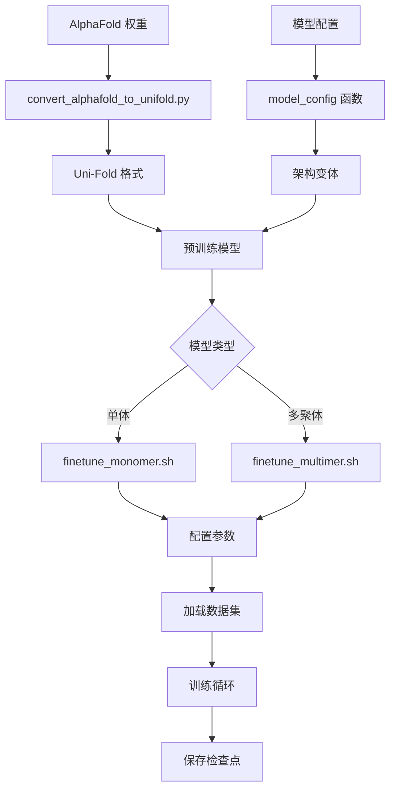

---
slug:14-fine-tuning-pretrained-models
blog_type:normal
---


在 Uni-Fold 中微调预训练模型，使你能够强大的 AlphaFold 架构适配到特定的蛋白质数据集或专门任务。本指南涵盖了单体和多聚体模型的完整微调工作流程，包含实用示例和配置细节。

## 微调架构概述

Uni-Fold 通过专用 shell 脚本和可配置模型架构，提供了系统化的微调方法。该框架支持从 Uni-Fold 预训练检查点和原始 AlphaFold 权重进行微调，为不同用例提供灵活的配置选项。



## 可用的模型配置

Uni-Fold 提供多种针对不同场景优化的预训练模型配置。每个配置在 `model_config` 函数中定义，包含特定的超参数和架构设置。

### 单体模型变体

| 模型名称 | 用例 | 关键特性 | MSA 聚类 | 额外 MSA |
|------------|----------|--------------|--------------|-----------|
| `model_1_ft` | 从模型 1 微调 | 增强 MSA 容量 | 512 | 5120 |
| `model_2_ft` | 从模型 2 微调 | 平衡性能 | 512 | 1024 |
| `model_2_v2_ft` | V2 架构微调 | Gumbel 采样、V2 特性 | 512 | 1024 |

### 多聚体模型变体

| 模型名称 | 用例 | 关键特性 | MSA 聚类 | 额外 MSA |
|------------|----------|--------------|--------------|-----------|
| `multimer_ft` | 多聚体微调 | 链质心损失 | 256 | 1152 |
| `multimer_af2` | AlphaFold 多聚体 | PAE 头部、实验分辨率 | 256 | 1152 |
| `multimer_af2_v3` | 增强多聚体 | 更大 MSA 容量 | 512 | 2048 |

配置系统根据选定的模型变体自动调整损失权重、模型架构和数据处理参数 [unifold/config.py#L480-L673](unifold/config.py#L480-L673)。

## 微调脚本

### 单体微调

`finetune_monomer.sh` 脚本为单体蛋白质提供完整的训练流水线：

```bash
./finetune_monomer.sh <data_path> <save_dir> <pretrained_model> <model_name>
```

关键参数包括：
- **学习率**：`lr=5e-4`（默认）
- **训练步数**：`total_step=10000`（默认）
- **预热步数**：`warmup_step=500`（默认）
- **批次大小**：1，带梯度累积
- **精度**：BF16，EMA 衰减率为 0.999

脚本自动检测现有检查点，并使用 `--finetune-from-model` 和 `--load-from-ema` 标志恢复训练或开始新的微调 [finetune_monomer.sh#L35-L40](finetune_monomer.sh#L35-L40)。

### 多聚体微调

对于蛋白质复合物，使用 `finetune_multimer.sh` 配合类似参数，但采用多聚体特定的损失函数：

```bash
./finetune_multimer.sh <data_path> <save_dir> <pretrained_model> <model_name>
```

关键区别在于损失规范（`--loss afm`），该规范激活多聚体特定的损失组件，包括预测对齐误差（PAE）和链质心正则化 [finetune_multimer.sh#L35](finetune_multimer.sh#L35)。

## 微调数据准备

### 数据集结构

微调需要格式正确的数据，包含特征、标签和样本权重：

```
data_directory/
├── pdb_features/          # 处理后的蛋白质特征
├── pdb_labels/           # 真实结构
├── train_sample_weight.json  # 样本权重
└── train_multi_label.json    # 多链映射（多聚体）
```

### 样本权重配置

通过样本权重控制训练重点：

```json
{
    "8d27_A": 1.0,
    "protein_B": 2.0
}
```

较高权重会增加训练期间的采样频率 [example_data/train_sample_weight.json](example_data/train_sample_weight.json)。

### 多链标签映射

对于多聚体训练，指定链关系：

```json
{
    "8d27_A": ["8d27_A", "8d27_B"]
}
```

这将训练复合物映射到其组成链 [example_data/train_multi_label.json](example_data/train_multi_label.json)。

## 模型加载和初始化

### 从 Uni-Fold 检查点加载

直接从 Uni-Fold 检查点微调使用标准加载机制：

```python
# 自动检查点检测
if [ -f "$2/checkpoint_last.pt" ]; then
    echo "ckp exists."
else
    echo "finetuning from initial training..."
    OPTION=" --finetune-from-model $3 --load-from-ema "
fi
```

### 从 AlphaFold 权重加载

将原始 AlphaFold 权重转换为 Uni-Fold 格式：

```bash
python scripts/convert_alphafold_to_unifold.py \
    <alphafold_weights> <output_checkpoint> <model_name>
```

转换脚本处理参数映射并创建带有 EMA 参数的适当检查点结构 [scripts/convert_alphafold_to_unifold.py](scripts/convert_alphafold_to_unifold.py)。

## 训练配置细节

### 优化器设置

微调使用带有特定参数的 Adam 优化器：
- **Beta 值**：(0.9, 0.999)
- **Epsilon**：1e-6
- **梯度裁剪**：每样本范数为 0.1
- **All-reduce 精度**：FP32 以确保稳定性

### 学习率调度

指数衰减调度器提供可控的学习率进展：
- **初始学习率**：可配置（默认 5e-4）
- **预热**：在指定步数内线性预热
- **衰减**：带可配置比率的指数衰减
- **阶梯衰减**：在定义间隔处逐步减少

### 数据增强

微调包含随机丢弃（SD）用于数据增强：
- **SD 概率**：默认 0.5，可通过 `--sd-prob` 配置
- **目的**：通过随机掩蔽特征提高泛化能力
- **实现**：集成到数据流水线中 [unifold/task.py#L32-L38](unifold/task.py#L32-L38)

## 高级微调特性

### 内存优化

微调脚本包含多种内存优化技术：
- **BF16 训练**：减少内存占用
- **梯度累积**：实现更大有效批次大小
- **数据缓冲**：大小为 32 以提高 I/O 效率
- **TensorBoard 日志记录**：实时训练监控

### 检查点管理

自动检查点保存和管理：
- **保存间隔**：每 500 次更新
- **验证间隔**：每 500 次更新
- **保留**：保留最近 40 个检查点
- **EMA 存储**：单独的指数移动平均权重

<CgxTip>
微调多聚体模型时，确保训练数据包含正确的链注释和组装信息。任务配置中的 `max_chains` 参数限制了每个复合物的最大链数 [unifold/task.py#L32](unifold/task.py#L32)。
</CgxTip>

<CgxTip>
为获得最佳微调结果，建议从较低的学习率（1e-4 到 5e-4）开始，并使用预训练的 EMA 权重作为初始化。`--load-from-ema` 标志确保你从最稳定的权重开始。
</CgxTip>

## 后续步骤

掌握微调后，探索这些相关主题：

- **[用于大型复合物预测的 UF-Symmetry](15-uf-symmetry-for-large-complex-prediction)** - 高级对称感知建模
- **[多聚体蛋白质复合物建模](16-multimer-protein-complex-modeling)** - 深入探索复合物预测
- **[内存优化和混合精度训练](17-memory-optimization-and-mixed-precision-training)** - 性能优化技术

Uni-Fold 中的微调框架为将蛋白质结构预测模型适配到专门领域和数据集提供了灵活基础，赋能计算生物学领域的研究和应用。