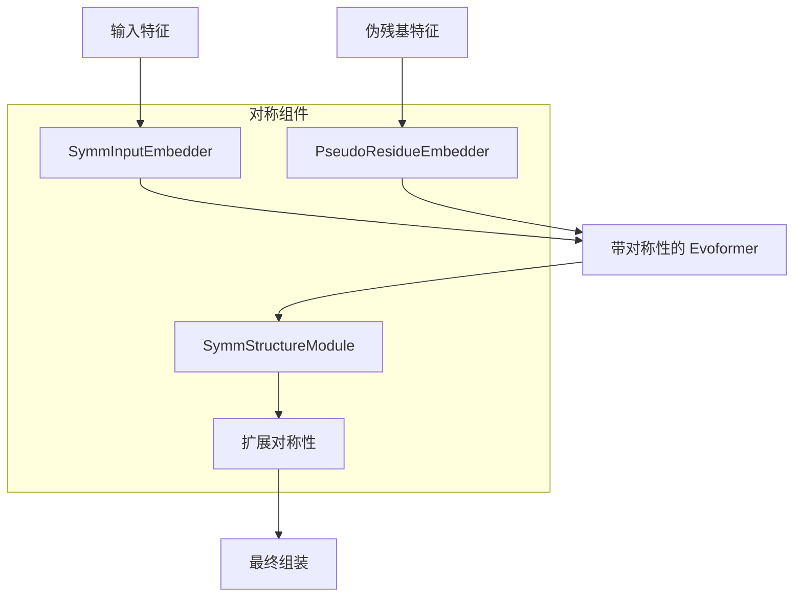
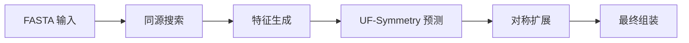

---
slug:15-uf-symmetry-for-large-complex-prediction
blog_type:normal
---


UF-Symmetry 是 Uni-Fold 框架的高级扩展，专为预测具有对称排列的大型蛋白质复合物而设计。该模块利用对称约束显著提高了同寡聚组装和对称蛋白质复合物的预测准确性和计算效率。

## 架构概述

UF-Symmetry 基于核心 AlphaFold 架构构建，同时引入了专门用于对称感知建模的组件：



UF-Symmetry 模型（[`UFSymmetry`](unifold/symmetry/model.py#L7)）继承自基础 AlphaFold 模型，但用对称感知替代方案替换了关键组件：

- **SymmInputEmbedder**：增强的输入嵌入，融合了伪残基特征
- **PseudoResidueEmbedder**：专门用于处理对称信息的神经网络
- **SymmStructureModule**：修改后的结构模块，遵循对称约束
- **Expand Symmetry**：生成完整非对称单元的后处理步骤

## 核心组件

### 伪残基系统

UF-Symmetry 引入了新颖的伪残基概念，将对称信息直接编码到模型中。伪残基特征（[`get_pseudo_residue_feat()`](unifold/symmetry/dataset.py#L10)）编码了不同的对称群：

| 对称类型 | 特征向量 | 描述 |
|---------------|----------------|-------------|
| C1 | `[1., 0., 0., 0., 0., 0., 1., 0.]` | 无对称（非对称） |
| Cn | `[0., 1., 0., 0., 0., 0., cos(θ), sin(θ)]` | 循环对称 |
| Dn | `[0., 0., 1., 0., 0., 0., cos(θ), sin(θ)]` | 二面体对称 |
| T | `[1., 0., 0., 0., 0., 1., 1., 0.]` | 四面体 |
| O | `[0., 0., 0., 0., 1., 0., 1., 0.]` | 八面体 |
| I | `[0., 0., 0., 1., 0., 0., 1., 0.]` | 二十面体 |

这些特征通过具有 48 个隐藏维度的 4 块 ResNet 架构（[`PseudoResidueEmbedder`](unifold/symmetry/modules.py#L43)）进行处理，生成引导对称感知预测过程的嵌入。

### 对称感知模型架构

UF-Symmetry 模型修改了几个关键组件：

1. **增强的输入嵌入**：[`SymmInputEmbedder`](unifold/symmetry/modules.py#L95) 扩展了基础输入嵌入器，可接受伪残基特征以及标准序列和 MSA 特征。

2. **修改的 Evoformer 处理**：Evoformer 迭代（[`iteration_evoformer()`](unifold/symmetry/model.py#L22)）将伪残基信息融入注意力机制，使模型能够在特征处理期间学习对称约束。

3. **对称结构模块**：[`SymmStructureModule`](unifold/symmetry/modules.py#L149) 确保 3D 坐标生成遵循指定的对称操作。

### 对称扩展

生成非对称单元后，UF-Symmetry 应用对称操作生成完整的复合物。[`expand_symmetry()`](unifold/symmetry/assemble.py#L52) 函数处理此转换：

- **坐标系扩展**：对刚体坐标系应用对称操作
- **侧链坐标系扩展**：转换侧链坐标系
- **原子位置扩展**：通过对称操作生成所有原子位置

## 配置与使用

### 模型配置

UF-Symmetry 使用专门的配置（[`uf_symmetry_config()`](unifold/symmetry/config.py#L4)），扩展了多聚体配置：

```python
config.data.common.features.symmetry_opers = [None, 3, 3]
config.data.common.features.num_asym = [None]
config.data.common.features.pseudo_residue_feat = [None]

config.model.pseudo_residue_embedder = {
    "d_in": 8,
    "d_hidden": 48,
    "d_out": 48,
    "num_blocks": 4,
}
```

<CgxTip>伪残基嵌入器维度（48）经过精心调整，以平衡大型复合物的表征能力和计算效率。</CgxTip>

### 运行 UF-Symmetry 预测

UF-Symmetry 预测的工作流程遵循两步流程：



提供的脚本 [`run_uf_symmetry.sh`](run_uf_symmetry.sh#L1) 自动执行此过程：

```bash
# 步骤 1：同源搜索
python unifold/homo_search.py --fasta_path=$fasta_path ...

# 步骤 2：对称性预测
python unifold/inference_symmetry.py \
    --symmetry=$symmetry \
    --param_path=$param_path \
    --data_dir=$output_dir_base \
    --target_name=$target_name
```

### 支持的对称群

UF-Symmetry 目前支持：
- **循环对称 (Cn)**：围绕单一轴的旋转对称
- **二面体对称 (Dn)**：具有额外垂直 C2 轴的循环对称
- **柏拉图立体**：四面体 (T)、八面体 (O)、二十面体 (I)
- **非对称 (C1)**：标准单体预测

<CgxTip>螺旋对称性已计划但尚未实现，需要特殊处理无限对称操作。</CgxTip>

## 性能优势

UF-Symmetry 为大型复合物预测提供了显著优势：

1. **降低计算成本**：通过仅预测非对称单元并通过对称操作扩展，内存和计算需求随非对称单元大小而非完整复合物规模扩展。

2. **提高准确性**：对称约束作为强先验，减少了构象搜索空间，从而为对称组装提供更准确的预测。

3. **更好的物理真实性**：强制对称确保了符合基本生化约束的物理合理排列。

## 与 Uni-Fold 生态系统的集成

UF-Symmetry 与现有 Uni-Fold 流水线无缝集成：

- **数据处理**：扩展标准数据流水线（[`load_and_process_symmetry()`](unifold/symmetry/dataset.py#L34)）以处理对称特定特征
- **模型训练**：目前专注于推理，训练基础设施正在开发中
- **评估**：与现有评估指标和可视化工具兼容

## 未来发展

UF-Symmetry 模块正在积极演进，计划增强功能：
- 对称感知模型的训练支持
- 扩展对称群支持（螺旋、非晶体学）
- 改进异寡聚对称性处理
- 与 cryo-EM 密度拟合工作流集成

UF-Symmetry 代表了蛋白质复合物预测的重大进步，特别是对于传统方法具有挑战性的大型对称组装。通过利用对称约束，它能够准确高效地预测否则在计算上不可行的复合物。

对于处理对称蛋白质复合物的用户，UF-Symmetry 提供了一个专门的工具，它在 Uni-Fold 的坚实基础之上构建，同时解决了对称组装预测的独特挑战。要开始使用，请参考[安装和环境设置](3-installation-and-environment-setup)和[运行基本蛋白质结构预测](5-running-basic-protein-structure-prediction)指南，然后按照上述对称特定工作流程进行。