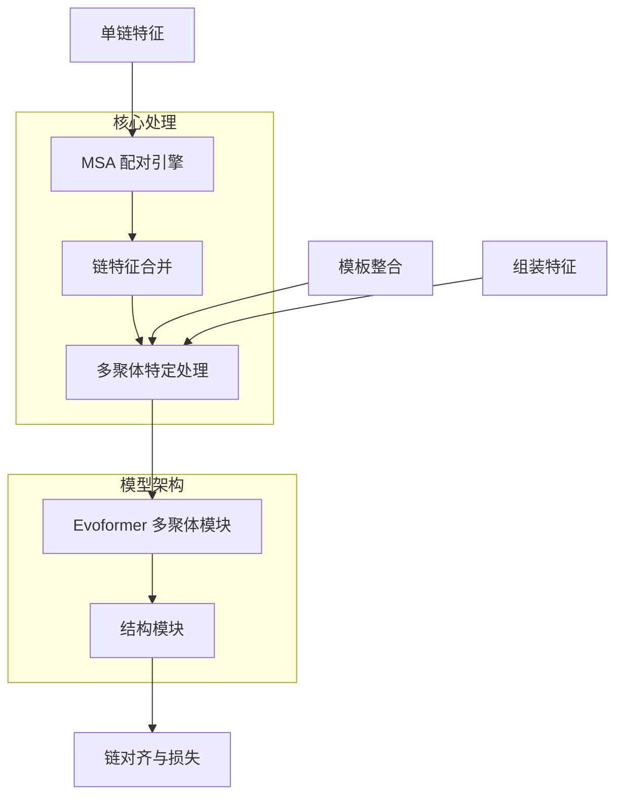

---
slug:16-multimer-protein-complex-modeling
blog_type:normal
---


Uni-Fold 扩展了 AlphaFold 架构，通过复杂的多聚体建模能力来处理蛋白质复合物。该实现能够准确预测蛋白质-蛋白质相互作用和复合物结构，支持异源多聚体和同源多聚体组合。

## 架构概览

多聚体建模系统在单体基础上构建，配备用于处理多条蛋白质链的专用组件：



## 数据处理流水线

### 链特征处理

多聚体流水线通过 `process_multimer.py` 模块从单链处理开始。每条链在多聚体特定操作之前先进行单体式特征提取：

- **特征转换**：通过 `convert_monomer_features()` 将单体特征重塑和修改以适应多聚体兼容性 [unifold/data/process_multimer.py#L278-L320]
- **模板处理**：当模板不可用时生成空模板特征 [unifold/data/process_multimer.py#L269-L277]
- **组装整合**：添加组装特征以捕获四级结构信息 [unifold/data/process_multimer.py#L344-L384]

### MSA 配对系统

核心创新在于 `msa_pairing.py` 中实现的 MSA 配对机制：

- **同源多聚体检测**：系统首先通过 `_is_homomer_or_monomer()` 确定链是否形成同源或异源多聚体 [unifold/data/process_multimer.py#L69-L84]
- **序列配对**：对于异源多聚体，`create_paired_features()` 基于物种和序列相似性对齐跨链 MSA 序列 [unifold/data/msa_pairing.py#L72-L110]
- **特征合并**：`merge_chain_features()` 使用块对角操作合并配对和未配对特征 [unifold/data/msa_pairing.py#L466-L496]

<CgxTip>
配对算法使用基于物种的匹配和序列相似性阈值（SEQUENCE_SIMILARITY_CUTOFF = 0.9）来识别不同链中对应的 MSA 行，实现相互作用蛋白质间的进化耦合信息传递。
</CgxTip>

## 模型配置

### 多聚体特定参数

多聚体模型通过 `config.py` 中的 `multimer()` 函数激活专用配置：

```python
def multimer(c):
    recursive_set(c, "is_multimer", True)
    recursive_set(c, "max_extra_msa", 1152)
    recursive_set(c, "max_msa_clusters", 128)
    c.model.heads.pae.enabled = True
    c.model.heads.pae.disable_enhance_head = True
    c.loss.chain_centre_mass.weight = 1.0
    c.model.structure_module.trans_scale_factor = 20
```

关键的多聚体特定功能包括：

- **预测对齐误差（PAE）**：启用用于链间距离预测 [unifold/config.py#L507-L508]
- **链质心损失**：优化链的相对定位 [unifold/config.py#L513]
- **增强的 MSA 处理**：增加 MSA 簇限制以处理复杂的进化信息

### 训练配置

多聚体训练脚本（`train_multimer.sh`、`finetune_multimer.sh`）实现了专用超参数：

| 参数 | 训练 | 微调 | 用途 |
|-----------|----------|-------------|---------|
| 学习率 | 1e-3 | 5e-4 | 为复合物收敛优化 |
| 总步数 | 80,000 | 10,000 | 针对多聚体复杂性的扩展训练 |
| 随机深度概率 | 0.5 | 0.5 | 随机深度正则化 |

## 链对齐和损失函数

### 多链排列对齐

`chain_align.py` 模块实现了复杂的链对齐机制，以处理训练期间的链排列模糊性：

- **锚点选择**：`get_anchor_candidates()` 识别用于对齐的最优锚点链 [unifold/losses/chain_align.py#L90-L122]
- **贪婪对齐**：`greedy_align()` 基于结构相似性执行最优链到标签匹配 [unifold/losses/chain_align.py#L123-L175]
- **标签合并**：`merge_labels()` 根据对齐结果合并多个标签字典 [unifold/losses/chain_align.py#L176-L207]

<CgxTip>
对齐系统使用 Kabsch 算法进行最优叠加，并执行多次洗牌迭代以找到全局最优链排序，解决多聚体预测中的排列对称性问题。
</CgxTip>

## 评估和基准测试

### 测试集配置

多聚体评估使用了来自 PDB 的 164 个蛋白质复合物的精选集合，列在 `evaluation/multimer_list.json` 中。这些复合物代表了多样化的相互作用类型和拓扑结构，用于全面的基准测试。

### 性能指标

多聚体性能使用专用指标进行评估：

- **界面 RMSD（iRMSD）**：测量蛋白质-蛋白质界面的准确性
- **DockQ 分数**：结合多个界面质量度量
- **预测对齐误差（PAE）**：评估链间距离预测准确性

## 用法和集成

### 训练流水线

多聚体训练遵循以下工作流程：

1. **数据准备**：通过单体流水线处理单个链
2. **MSA 配对**：应用配对算法以获得进化耦合
3. **特征合并**：将链特征与组装信息结合
4. **模型训练**：使用多聚体特定配置和损失函数

### 推理支持

对于推理，多聚体系统支持：

- **模板整合**：单体和复合物模板
- **组装信息**：来自 PDB 的生物组装定义
- **对称性处理**：与 UF-Symmetry 集成以处理对称复合物

## 高级功能

### 模板整合

多聚体系统通过模板模块中的专用处理支持复杂模板整合，实现从已知复合物的结构信息传递。

### 内存优化

实现包括通过以下方式对大型复合物进行内存高效处理：

- **MSA 裁剪**：限制 MSA 大小以防止内存溢出 [unifold/data/process_multimer.py#L119-L150]
- **特征过滤**：移除不必要的特征以减少内存占用 [unifold/data/process_multimer.py#L226-L230]

Uni-Fold 中的多聚体蛋白质复合物建模代表了 AlphaFold-Multimer 概念在 PyTorch 中的全面实现，为研究人员提供了理解蛋白质相互作用和复合物形成的强大工具。

有关相关主题的更多信息，请参阅 [UF-Symmetry for Large Complex Prediction](15-uf-symmetry-for-large-complex-prediction) 和 [Feature Extraction and MSA Processing](9-feature-extraction-and-msa-processing)。