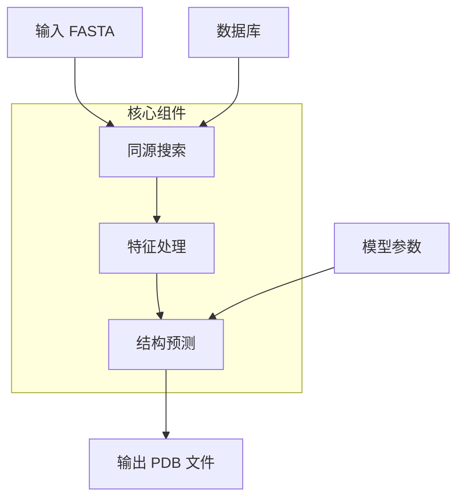

---
slug:2-quick-start
blog_type:normal
---


Uni-Fold 提供了一个开源的蛋白质结构预测平台，在 PyTorch 中重新实现了 AlphaFold 和 AlphaFold-Multimer。本快速入门指南将帮助你在几分钟内运行蛋白质结构预测。

## 系统架构概览

Uni-Fold 采用模块化架构，将同源搜索、特征处理和结构预测分离：



## 前置条件

开始之前，请确保你具备：
- 已安装 Docker 和 nvidia-docker-2
- 至少 3TB 的数据库存储空间
- 兼容 CUDA 的 GPU（推荐）

## 安装步骤

### 1. 拉取 Docker 镜像

```bash
docker pull dptechnology/unifold:latest-pytorch1.11.0-cuda11.3
```

### 2. 克隆并安装 Uni-Fold

```bash
git clone https://github.com/dptech-corp/Uni-Fold
cd Uni-Fold
pip install -e .
```

### 3. 下载所需数据库

```bash
bash scripts/download/download_all_data.sh /path/to/database/directory
```

### 4. 下载预训练模型

```bash
wget https://github.com/dptech-corp/Uni-Fold/releases/download/v2.0.0/unifold_params_2022-08-01.tar.gz
tar -zxf unifold_params_2022-08-01.tar.gz
```

## 运行你的首次预测

### 基本命令结构

主要的预测工作流由 `run_unifold.sh` 脚本处理，该脚本执行两个主要步骤：同源搜索和结构预测 [run_unifold.sh](run_unifold.sh#L1-L32)。

```bash
bash run_unifold.sh \
    /path/to/input.fasta \
    /path/to/output/directory/ \
    /path/to/database/directory/ \
    2020-05-01 \
    model_2_ft \
    /path/to/model_parameters.pt
```

### 参数说明

| 参数 | 说明 | 示例 |
|-----------|-------------|---------|
| `fasta_path` | 输入蛋白质序列文件 | `protein.fa` |
| `output_dir` | 结果输出目录 | `./results/` |
| `database_dir` | 下载的数据库路径 | `./databases/` |
| `max_template_date` | 模板截止日期 | `2020-05-01` |
| `model_name` | 使用的模型（单体用 `model_2_ft`，多聚体用 `multimer_ft`） | `model_2_ft` |
| `param_path` | 模型参数路径 | `./unifold_params_2022-08-01/model_2_ft.pt` |

### 输入格式要求

- **单体预测**：FASTA 文件应包含一个序列
- **多聚体预测**：FASTA 文件应包含目标复合物的所有序列，相同的序列根据其拷贝数重复出现

## 理解输出

运行预测后，你的输出目录将包含：

```
output_directory/
├── best.pdb              # 置信度最高的预测结果
├── result_model_1.pkl.gz # 原始模型输出
├── result_model_2.pkl.gz # 附加模型输出
└── ranking_debug.json    # 置信度指标（plddt、iptm+ptm）
```

`best.pdb` 文件包含最终预测的结构，而置信度指标以 JSON 格式存储，便于分析。

## 快速演示训练

要测试你的安装，运行演示训练脚本：

```bash
bash train_monomer_demo.sh .
```

这将使用包含的[示例数据](example_data/)来验证包安装是否正确。该演示在最小数据上运行，不能反映实际性能 [train_monomer_demo.sh](train_monomer_demo.sh#L1-L16)。

## 替代方案：Colab Notebook

对于无需本地设置的快速实验，可以使用 [Uni-Fold Colab notebook](notebooks/unifold.ipynb#L1-L50)，它提供了基于 Web 的界面，支持单体和多聚体预测，包括 UF-Symmetry 支持。

## 后续步骤

成功运行首次预测后，你可能想要：

- [安装和环境设置](3-installation-and-environment-setup) 了解详细配置
- [数据库准备和下载](4-database-preparation-and-downloads) 进行数据库管理
- [运行基本蛋白质结构预测](5-running-basic-protein-structure-prediction) 了解高级用法

<CgxTip>
对于多聚体预测，请确保你的 FASTA 文件包含所有链，并正确复制序列。Uni-Fold 需要明确复制相同的序列，以匹配蛋白质复合物的化学计量比。
</CgxTip>

<CgxTip>
`model_2_ft` 和 `multimer_ft` 模型是微调版本，通常比从 AlphaFold 参数转换的基础 `model_2_af2` 和 `multimer_af2` 提供更好的性能。
</CgxTip>