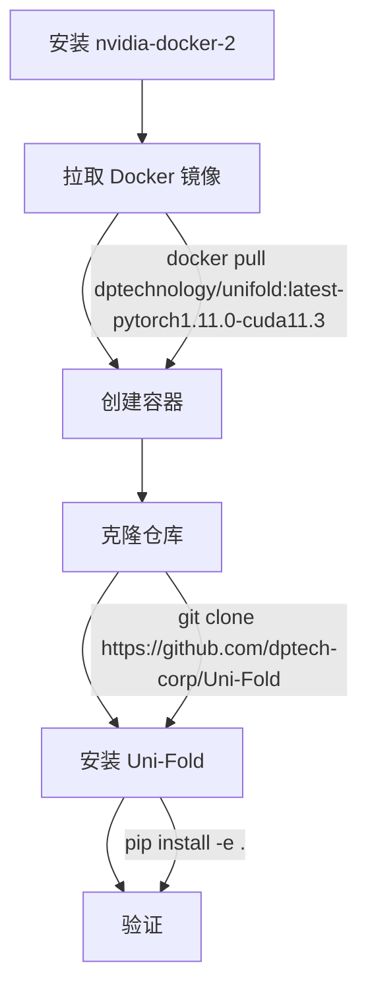

---
slug:3-installation-and-environment-setup
blog_type:normal
---


Uni-Fold 因其对 CUDA 内核、PyTorch 和生物信息学工具的依赖，需要仔细的环境配置。本指南涵盖从系统要求到验证的完整安装过程。

## 系统要求

Uni-Fold 支持带有启用 CUDA 的 GPU 的 Linux 操作系统。该平台需要 Python 3.6-3.10，并依赖于分布式训练框架 Uni-Core [setup.py](setup.py#L1-L51)。为获得最佳性能，请确保你的系统满足以下规格：

| 要求 | 最低版本 | 推荐版本 |
|-------------|----------------|-------------------|
| 操作系统 | Linux (POSIX) | Ubuntu 18.04+ |
| CUDA | 11.3 | 11.3+ |
| Python | 3.6 | 3.8-3.10 |
| GPU 内存 | 8GB | 16GB+ |
| 存储 | 500GB (数据库) | 3TB (完整安装) |
| RAM | 16GB | 32GB+ |

## 安装方法

### 方法 1：Docker 安装（推荐）

Docker 方法可消除依赖冲突并确保环境可重现。Uni-Fold 提供了一个基于 Uni-Core 的预配置 Docker 镜像，包含 PyTorch 1.11.0 和 CUDA 11.3 [docker/Dockerfile](docker/Dockerfile#L1-L31)。



<CgxTip>
Docker 镜像包含预编译的生物信息学工具（HHsuite、HMMER、Kalign），这些工具是 MSA 处理所必需的，可节省大量设置时间。
</CgxTip>

**Docker 安装分步说明：**

1. **安装 nvidia-docker-2**（容器中访问 GPU 所需）：
   ```bash
   # 遵循 NVIDIA 官方文档
   curl https://get.docker.com | sh
   distribution=$(. /etc/os-release;echo $ID$VERSION_ID)
   curl -s -L https://nvidia.github.io/nvidia-docker/gpgkey | sudo apt-key add -
   curl -s -L https://nvidia.github.io/nvidia-docker/$distribution/nvidia-docker.list | sudo tee /etc/apt/sources.list.d/nvidia-docker.list
   sudo apt-get update && sudo apt-get install -y nvidia-docker2
   sudo systemctl restart docker
   ```

2. **拉取 Uni-Fold Docker 镜像**：
   ```bash
   docker pull dptechnology/unifold:latest-pytorch1.11.0-cuda11.3
   ```

3. **创建并进入容器**：
   ```bash
   docker run --gpus all -it --name unifold-container dptechnology/unifold:latest-pytorch1.11.0-cuda11.3 bash
   ```

4. **克隆并安装 Uni-Fold**：
   ```bash
   git clone https://github.com/dptech-corp/Uni-Fold
   cd Uni-Fold
   pip install -e .
   ```

### 方法 2：手动安装

对于喜欢本地安装的高级用户，请按此顺序操作以避免依赖冲突：


**手动安装分步说明：**

1. **安装 Uni-Core 框架**（先决条件）：
   ```bash
   # 遵循 Uni-Core 安装指南
   # 需要特定的 CUDA 和 PyTorch 版本
   pip install unicore
   ```

2. **安装系统依赖**：
   ```bash
   sudo apt-get update
   sudo apt-get install -y hmmer kalign aria2c git cmake build-essential
   ```

3. **安装 Python 依赖**：
   ```bash
   pip install absl-py biopython ml-collections numpy pandas scipy
   ```

4. **克隆并安装 Uni-Fold**：
   ```bash
   git clone https://github.com/dptech-corp/Uni-Fold
   cd Uni-Fold
   pip install -e .
   ```

5. **从源代码编译 HHsuite**（MSA 处理所需）：
   ```bash
   git clone --branch v3.3.0 https://github.com/soedinglab/hh-suite.git /tmp/hh-suite
   mkdir /tmp/hh-suite/build
   cd /tmp/hh-suite/build
   cmake -DCMAKE_INSTALL_PREFIX=/opt/hhsuite ..
   make -j 4 && make install
   ln -s /opt/hhsuite/bin/* /usr/bin
   ```

## 环境配置

### CUDA 和 GPU 设置

Uni-Fold 需要 CUDA 11.3 以使用提供的 Docker 镜像获得最佳性能。验证你的 CUDA 安装：

```bash
nvidia-smi  # 检查 GPU 可用性
nvcc --version  # 检查 CUDA 版本
```

### Python 环境

该包支持 Python 3.6-3.10，具有以下核心依赖 [setup.py](setup.py#L25-L30)：

- **absl-py**: Google 的 Python 通用库
- **biopython**: 计算生物学工具
- **ml-collections**: 配置管理
- **numpy**: 数值计算
- **pandas**: 数据处理
- **scipy**: 科学计算

### 环境变量

设置这些环境变量以获得最佳性能：

```bash
export NCCL_ASYNC_ERROR_HANDLING=1  # 更好的错误处理
export OMP_NUM_THREADS=1  # 防止线程冲突
```

## 数据库设置

Uni-Fold 需要多个生物数据库用于 MSA 生成和模板搜索。完整数据库集的总存储需求约为 3TB [scripts/download/download_all_data.sh](scripts/download/download_all_data.sh#L1-L79)。

### 数据库下载选项

| 模式 | 所需存储 | 描述 |
|------|------------------|-------------|
| 完整数据库 | ~2.5TB | 完整的 BFD 数据库 |
| 精简数据库 | ~500GB | 小型 BFD 子集 |

**下载所有数据库：**
```bash
bash scripts/download/download_all_data.sh /path/to/database/directory
```

**下载精简数据库：**
```bash
bash scripts/download/download_all_data.sh /path/to/database/directory reduced_dbs
```

<CgxTip>
使用 aria2c 进行并行下载。脚本会自动检查 aria2c 的可用性，如果缺少则提供安装说明。
</CgxTip>

### 单独数据库组件

数据库下载包含以下基本组件：

- **BFD/Small BFD**: 序列同源数据库
- **MGnify**: 宏基因组蛋白质序列  
- **PDB70**: PDB 结构的序列聚类
- **PDB mmCIF**: 结构模板
- **Uniclust30**: 聚类蛋白质序列
- **Uniref90**: 非冗余蛋白质序列
- **UniProt**: 综合蛋白质数据库
- **PDB SeqRes**: PDB 序列数据库

## 验证和测试

### 演示训练测试

使用提供的演示训练脚本验证你的安装 [train_monomer_demo.sh](train_monomer_demo.sh#L1-L16)：

```bash
# 测试单体训练
bash train_monomer_demo.sh ./demo_output

# 测试多聚体训练  
bash train_multimer_demo.sh ./demo_output
```

这些脚本在示例数据上运行最小训练周期以确认：
- 软件包安装正确性
- GPU 可访问性
- 分布式训练功能
- 数据管道完整性

### 推理测试

下载预训练模型后，测试推理管道：

```bash
# 下载预训练模型
wget https://github.com/dptech-corp/Uni-Fold/releases/download/v2.0.0/unifold_params_2022-08-01.tar.gz
tar -zxf unifold_params_2022-08-01.tar.gz

# 测试推理（需要数据库）
bash run_unifold.sh \
    example_data/test.fasta \
    ./output/ \
    /path/to/database/directory/ \
    2020-05-01 \
    model_2_ft \
    ./unifold_params_2022-08-01/model_2_ft.pt
```

## 常见问题和故障排除

### CUDA 版本冲突

**问题**：Uni-Core 需要特定的 CUDA 版本
**解决方案**：使用提供的 Docker 镜像或手动安装匹配的 CUDA/PyTorch 版本

### 内存错误

**问题**：训练或推理期间内存不足
**解决方案**： 
- 减少训练脚本中的批量大小
- 使用 `--bf16` 或混合精度训练
- 增加 GPU 内存或使用梯度检查点

### 数据库下载失败

**问题**：未找到 aria2c 或下载中断
**解决方案**：
```bash
sudo apt install aria2c  # 安装 aria2c
# 恢复中断的下载
bash scripts/download/download_all_data.sh /path/to/directory
```

### 权限问题

**问题**：安装期间权限被拒绝
**解决方案**：使用虚拟环境或适当的权限：
```bash
python -m venv unifold_env
source unifold_env/bin/activate
pip install -e .
```

## 后续步骤

成功安装和环境设置后，请继续：

1. **[数据库准备和下载](4-database-preparation-and-downloads)** - 详细的数据库配置
2. **[运行基本蛋白质结构预测](5-running-basic-protein-structure-prediction)** - 你的第一次蛋白质结构预测
3. **[快速开始](2-quick-start)** - 立即使用的快速指南

对于对模型架构感兴趣的高级用户，请探索 **[PyTorch 中的 AlphaFold 模型实现](6-alphafold-model-implementation-in-pytorch)** 以了解技术实现细节。