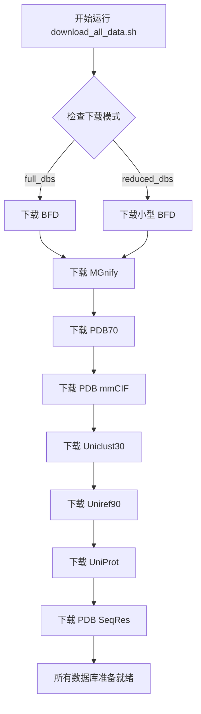

---
slug:4-database-preparation-and-downloads
blog_type:normal
---


Uni-Fold 需要多个大型生物数据库来执行准确的蛋白质结构预测。本指南涵盖了完整的数据库设置流程，从自动下载到单个数据库管理。

## 先决条件和系统要求

在下载数据库之前，请确保你的系统满足以下要求：

- **aria2c**：多线程下载所需（`sudo apt install aria2`）
- **rsync**：PDB mmCIF 同步所需（`sudo apt install rsync`）
- **存储空间**：完整数据库最少需要 2.5 TB 可用空间，精简数据库约需 400 GB
- **网络**：下载大文件需要稳定的网络连接

<CgxTip>
下载脚本包含内置依赖检查，如果缺少必需工具，将显示明确的错误消息并失败。请先安装 aria2c 和 rsync 再继续操作。
</CgxTip>

## 数据库下载模式

Uni-Fold 提供两种数据库配置，以满足不同的存储和计算需求：

| 模式 | 所需存储空间 | 使用场景 | 包含的数据库 |
|------|------------------|----------|-------------------|
| **full_dbs** | ~2.5 TB | 生产环境训练，最高精度 | 包含完整 BFD 的所有数据库 |
| **reduced_dbs** | ~400 GB | 开发、测试、资源有限环境 | 使用小型 BFD 替代完整 BFD |

## 自动化数据库设置

数据库准备的主要方法是使用综合下载脚本：

```bash
# 完整数据库设置
bash scripts/download/download_all_data.sh /path/to/download/directory

# 精简数据库设置（更快，占用空间更少）
bash scripts/download/download_all_data.sh /path/to/download/directory reduced_dbs
```

下载流程如下：



## 单个数据库下载

对于选择性数据库管理或故障排除，每个数据库都可以单独下载：

### 序列数据库

**BFD (Big Fantastic Database)**
- 完整版本：压缩后约 1.7 TB
- 小型版本：压缩后约 50 GB
- 来源：90% 一致性的 BFD metaclust 聚类
- 用途：主要序列同源性搜索数据库

```bash
# 完整 BFD
bash scripts/download/download_bfd.sh /path/to/download/directory

# 小型 BFD（用于 reduced_dbs 模式）
bash scripts/download/download_small_bfd.sh /path/to/download/directory
```

**UniRef90**
- 大小：压缩后约 50 GB
- 来源：90% 一致性的 UniProt 参考聚类
- 用途：用于 MSA 生成的高质量序列数据库

```bash
bash scripts/download/download_uniref90.sh /path/to/download/directory
```

**UniProt**
- 大小：压缩后约 200 GB（SwissProt + TrEMBL）
- 来源：完整的 UniProt 知识库
- 用途：用于多聚体预测的综合蛋白质序列数据库

```bash
bash scripts/download/download_uniprot.sh /path/to/download/directory
```

**MGnify**
- 大小：压缩后约 40 GB
- 来源：宏基因组蛋白质聚类
- 用途：用于远源同源性检测的环境序列多样性

```bash
bash scripts/download/download_mgnify.sh /path/to/download/directory
```

**Uniclust30**
- 大小：压缩后约 25 GB
- 来源：UniClust30 聚类
- 用途：用于 MSA 多样性的替代序列数据库

```bash
bash scripts/download/download_uniclust30.sh /path/to/download/directory
```

### 结构数据库

**PDB70**
- 大小：压缩后约 20 GB
- 来源：来自 mmCIF 的 HHsuite PDB70 数据库
- 用途：模板结构搜索数据库

```bash
bash scripts/download/download_pdb70.sh /path/to/download/directory
```

**PDB mmCIF 文件**
- 大小：解压后约 200 GB
- 来源：RCSB PDB mmCIF 格式结构
- 用途：模板结构和训练数据
- 处理：通过 rsync 下载，解压并展平目录结构

```bash
bash scripts/download/download_pdb_mmcif.sh /path/to/download/directory
```

**PDB SeqRes**
- 大小：约 1 GB
- 来源：PDB 序列残基
- 用途：模板匹配的参考序列

```bash
bash scripts/download/download_pdb_seqres.sh /path/to/download/directory
```

### 模型参数

Uni-Fold 包含自己的预训练参数，但可以下载 AlphaFold 参数用于基准测试：

```bash
bash scripts/download/download_alphafold_params.sh /path/to/download/directory
```

<CgxTip>
PDB mmCIF 下载过程使用 rsync 进行增量更新，这对于维护最新结构数据库非常高效。脚本会自动处理解压和目录展平操作。
</CgxTip>

## 下载后的目录结构

运行下载脚本后，你的数据库目录将具有以下结构：

```
/path/to/download/directory/
├── bfd/                    # BFD 数据库文件
├── small_bfd/             # 小型 BFD（reduced_dbs 模式）
├── mgnify/                # MGnify 宏基因组数据
├── pdb70/                 # PDB70 模板数据库
├── pdb_mmcif/             # PDB mmCIF 结构文件
│   ├── mmcif_files/       # 展平的 .cif 文件
│   └── obsolete.dat       # 过时的 PDB 条目
├── uniclust30/            # Uniclust30 数据库
├── uniref90/              # UniRef90 数据库
├── uniprot/               # UniProt 数据库
├── pdb_seqres/            # PDB 序列残基
└── params/                # AlphaFold 参数（可选）
```

## 配置集成

下载完数据库后，请更新你的 Uni-Fold 配置以指向正确的路径。数据库路径通常在模型配置文件中配置，或者在运行推理或训练时通过命令行参数指定。

## 常见问题排查

**下载失败**
- 检查网络连接和存储空间
- 验证 aria2c 安装：`aria2c --version`
- 某些下载可能因服务器负载需要重试

**权限错误**
- 确保对下载目录有写入权限
- 使用绝对路径以避免歧义

**存储空间**
- 在下载过程中监控磁盘使用情况
- 考虑在开发环境中使用 reduced_dbs 模式
- 单个数据库脚本允许选择性下载

## 后续步骤

完成数据库准备后，请继续阅读[运行基础蛋白质结构预测](5-running-basic-protein-structure-prediction)，使用配置好的数据库与 Uni-Fold。要详细了解这些数据库在预测流程中的使用方式，请参阅[特征提取和 MSA 处理](9-feature-extraction-and-msa-processing)。

全面的数据库设置确保 Uni-Fold 能够访问准确蛋白质结构预测所需的完整序列和结构信息范围，从同源序列到模板结构再到进化保守模式。