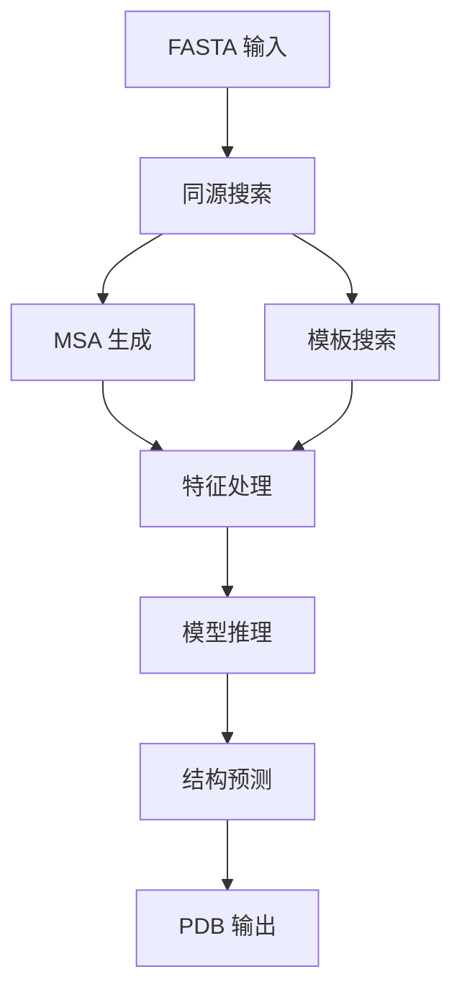

---
slug:5-running-basic-protein-structure-prediction
blog_type:normal
---


Uni-Fold 提供了一个遵循 AlphaFold 方法的蛋白质结构预测综合流水线。本指南将引导你完成基本的蛋白质结构预测流程，从数据准备到最终模型推理。

## 预测流水线概述

Uni-Fold 中的蛋白质结构预测过程采用系统化的两阶段方法：首先进行**同源搜索**生成 MSA 和模板，随后通过**模型推理**进行结构预测。



## 使用 run_unifold.sh 快速开始

运行蛋白质结构预测最直接的方式是使用提供的 shell 脚本。该脚本协调整个流水线，从 MSA 搜索到最终预测。

### 基本用法

```bash
bash run_unifold.sh <fasta_path> <output_dir> <database_dir> <max_template_date> <model_name> <param_path>
```

### 必需参数

| 参数 | 描述 | 示例 |
|-----------|-------------|---------|
| `fasta_path` | 包含蛋白质序列的输入 FASTA 文件路径 | `protein.fa` |
| `output_dir` | 存储结果的目录 | `./results/` |
| `database_dir` | 包含所有数据库的根目录 | `./databases/` |
| `max_template_date` | 模板最大发布日期 | `2020-05-14` |
| `model_name` | 模型配置名称 | `model_2` |
| `param_path` | 训练好的模型参数路径 | `./params/monomer.unifold.pt` |

该脚本执行两个主要操作：

1. **同源搜索**：使用 `unifold/homo_search.py` 生成 MSA 并查找模板 [run_unifold.sh#L8-L25](run_unifold.sh#L8-L25)
2. **预测**：运行 `unifold/inference.py` 进行结构预测 [run_unifold.sh#L27-L32](run_unifold.sh#L27-L32)

## 数据库要求

Uni-Fold 需要多个序列数据库来生成全面的 MSA。同源搜索模块期望以下数据库结构：

```
database_dir/
├── uniref90/uniref90.fasta
├── mgnify/mgy_clusters_2018_12.fa
├── bfd/bfd_metaclust_clu_complete_id30_c90_final_seq.sorted_opt
├── uniclust30/uniclust30_2018_08/uniclust30_2018_08
├── uniprot/uniprot.fasta
├── pdb_seqres/pdb_seqres.txt
└── pdb_mmcif/mmcif_files/
```

<CgxTip>确保所有数据库路径正确指定。缺失或错误的数据库路径是流水线失败的最常见原因。</CgxTip>

## 高级推理选项

要更好地控制预测过程，你可以直接运行推理模块并使用额外参数：

### 关键推理参数

| 参数 | 默认值 | 描述 |
|-----------|---------|-------------|
| `--model_device` | `cuda:0` | 模型执行设备 |
| `--times` | `3` | 使用不同种子的预测次数 |
| `--max_recycling_iters` | `3` | 最大回收迭代次数 |
| `--num_ensembles` | `2` | 集成预测数量 |
| `--bf16` | `False` | 使用 bfloat16 精度以提高内存效率 |
| `--sample_templates` | `False` | 启用模板采样 |

### 内存优化

Uni-Fold 会根据序列长度和可用内存自动调整分块大小 [unifold/inference.py#L30-L48](unifold/inference.py#L30-L48)：

```python
def automatic_chunk_size(seq_len, device, is_bf16):
    total_mem_in_GB = get_device_mem(device)
    factor = math.sqrt(total_mem_in_GB/40.0*(0.55 * is_bf16 + 0.45))*0.95
    if seq_len < int(1024*factor):
        chunk_size = 256
        block_size = None
    elif seq_len < int(2048*factor):
        chunk_size = 128
        block_size = None
    # ... 针对更长序列的更多配置
```

## 输出文件

预测会在指定目录中生成多个输出文件：

- **PDB 文件**：包含置信度分数的 3D 结构坐标
- **结果 Pickles**：包含中间数据的完整预测结果
- **置信度指标**：pLDDT 分数和其他质量评估

### 理解 pLDDT 分数

pLDDT（预测 LDDT）分数表示预测置信度：
- **90-100**：非常高的置信度
- **70-90**：良好的置信度  
- **50-70**：低置信度
- **<50**：非常低的置信度

## 常见问题故障排除

### 内存问题

对于大型蛋白质或 GPU 内存有限的情况：
1. 使用 `--bf16` 标志降低精度
2. 将 `--num_ensembles` 从 2 减少到 1
3. 使用 `--model_device cpu` 进行 CPU 推理

### 数据库问题

确保所有数据库文件可访问且格式正确。同源搜索模块在处理前会验证数据库路径 [unifold/homo_search.py#L50-L150](unifold/homo_search.py#L50-L150)。

### 性能优化

<CgxTip>对于较短蛋白质（<256 个残基）的更快预测，考虑使用 `--db_preset reduced_dbs` 减少数据库以缩短 MSA 搜索时间。</CgxTip>

## 后续步骤

掌握基本蛋白质结构预测后，你可能想要探索：

- [PyTorch 中的 AlphaFold 模型实现](6-alphafold-model-implementation-in-pytorch) 以了解模型架构
- [特征提取和 MSA 处理](9-feature-extraction-and-msa-processing) 以深入了解数据准备
- [用于大型复合物预测的 UF-Symmetry](15-uf-symmetry-for-large-complex-prediction) 以实现高级对称性感知预测

Uni-Fold 框架为蛋白质结构预测提供了坚实的基础，结合了最先进的模型架构和高效的推理流水线，适用于研究和生产环境。