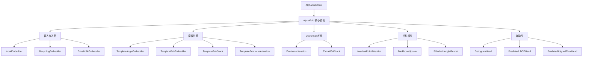

---
slug:6-alphafold-model-implementation-in-pytorch
blog_type:normal
---


本页面全面概述了在 Uni-Fold 中使用 PyTorch 实现的 AlphaFold 模型架构。该实现忠实复现了原始的 AlphaFold2 架构，同时利用 PyTorch 生态系统来提升训练和推理效率。

## 核心架构概述

Uni-Fold 中的 AlphaFold 模型采用分层模块结构组织，与原始的 JAX 实现保持一致。主入口点是 `AlphafoldModel` 类，它封装了核心的 `AlphaFold` 神经网络模块 [unifold/model.py](unifold/model.py#L12-L54)。



## 模型初始化与配置

核心 `AlphaFold` 模块通过一个全面的配置进行初始化，该配置定义了所有架构参数 [unifold/modules/alphafold.py](unifold/modules/alphafold.py#L42-L102)：

```python
def __init__(self, config):
    super(AlphaFold, self).__init__()
    
    # 不同输入模式的关键嵌入器
    self.input_embedder = InputEmbedder(...)
    self.recycling_embedder = RecyclingEmbedder(...)
    self.extra_msa_embedder = ExtraMSAEmbedder(...)
    
    # 模板处理组件（条件性）
    if config.template.enabled:
        self.template_angle_embedder = TemplateAngleEmbedder(...)
        self.template_pair_embedder = TemplatePairEmbedder(...)
        self.template_pair_stack = TemplatePairStack(...)
    
    # 核心处理模块
    self.evoformer = EvoformerStack(...)
    self.structure_module = StructureModule(...)
    self.aux_heads = AuxiliaryHeads(...)
```

<CgxTip>
模型通过 `is_multimer` 标志支持单体和多聚体配置，该标志启用链相对位置编码和多聚体特定特征。
</CgxTip>

## 前向传播与循环机制

前向传播实现了 AlphaFold 的标志性循环机制，模型通过该机制迭代优化其预测 [unifold/modules/alphafold.py](unifold/modules/alphafold.py#L418-L458)：

```python
def forward(self, batch):
    num_iters = int(batch["num_recycling_iters"]) + 1
    num_ensembles = int(batch["msa_mask"].shape[0]) // num_iters
    
    for cycle_no in range(num_iters):
        is_final_iter = cycle_no == (num_iters - 1)
        with torch.set_grad_enabled(is_grad_enabled and is_final_iter):
            outputs, m_1_prev, z_prev, x_prev = self.iteration_evoformer_structure_module(
                batch, m_1_prev, z_prev, x_prev, cycle_no, num_iters, num_ensembles
            )
    
    outputs.update(self.aux_heads(outputs))
    return outputs
```

循环机制允许模型在多次迭代中优化其表示，仅在最终迭代中计算梯度以提高内存效率。

## 输入嵌入层

### 输入嵌入器
`InputEmbedder` 将原始序列特征和 MSA 数据处理为初始表示 [unifold/modules/embedders.py](unifold/modules/embedders.py#L12-L137)：

- **目标特征**：转换为成对表示（`d_pair = 128`）
- **MSA 特征**：嵌入为 MSA 表示（`d_msa = 256`）
- **相对位置**：使用学习到的嵌入编码空间关系
- **链相对编码**：为多聚体预测启用

### 循环嵌入器
整合来自先前循环迭代的预测以提供迭代优化 [unifold/modules/embedders.py](unifold/modules/embedders.py#L138-L201)：

```python
def forward(self, m: torch.Tensor, z: torch.Tensor) -> Tuple[torch.Tensor, torch.Tensor]:
    # 将先前迭代的 MSA 和成对表示嵌入
    # 到当前迭代的输入嵌入中
```

## 模板集成

当模板信息可用时，模型通过多个专用模块处理它：

### 模板处理流程
1. **TemplateAngleEmbedder**：处理来自模板结构的主链角度 [unifold/modules/embedders.py](unifold/modules/embedders.py#L203-L225)
2. **TemplatePairEmbedder**：创建成对模板表示 [unifold/modules/embedders.py](unifold/modules/embedders.py#L226-L267)
3. **TemplatePairStack**：对模板特征应用三角形注意力 [unifold/modules/template.py](unifold/modules/template.py#L256-L341)
4. **TemplatePointwiseAttention**：将模板信息与当前成对表示集成 [unifold/modules/template.py](unifold/modules/template.py#L34-L93)

<CgxTip>
模板处理是可选的，由 `template.enabled` 配置标志控制。禁用时，跳过这些模块以减少计算开销。
</CgxTip>

## Evoformer 架构

Evoformer 是核心处理模块，通过注意力机制迭代优化 MSA 和成对表示。

### Evoformer 堆栈
由多个 `EvoformerIteration` 块组成，每个块包含：
- **MSA-to-MSA 注意力**：处理 MSA 内的序列信息
- **MSA-to-pair 通信**：使用 MSA 信息更新成对表示
- **三角形注意力**：处理成对表示中的空间关系
- **外积均值**：从 MSA 特征更新成对表示 [unifold/modules/evoformer.py](unifold/modules/evoformer.py#L29-L213)

### 额外 MSA 堆栈
处理额外的 MSA 序列以提供进化信息 [unifold/modules/evoformer.py](unifold/modules/evoformer.py#L310-L376)：

```python
class ExtraMSAStack(EvoformerStack):
    def forward(self, m, z, ...):
        # 处理额外 MSA 序列以丰富成对表示
        # 仅返回更新的成对表示
```

## 结构模块

结构模块使用几何深度学习将优化的成对表示转换为 3D 坐标。

### 关键组件
1. **InvariantPointAttention**：在 3D 空间中运行的注意力机制 [unifold/modules/structure_module.py](unifold/modules/structure_module.py#L165-L340)
2. **BackboneUpdate**：从注意力输出更新主链坐标 [unifold/modules/structure_module.py](unifold/modules/structure_module.py#L341-L349)
3. **SidechainAngleResnet**：预测侧链构象 [unifold/modules/structure_module.py](unifold/modules/structure_module.py#L123-L164)

### 3D 坐标生成
模块使用一系列几何变换将抽象表示转换为原子坐标：

```python
def forward(self, s, z, aatype, mask=None):
    # 通过注意力迭代优化 3D 结构
    # 返回最终坐标和置信度指标
```

## 辅助预测头

模型包含多个辅助头用于置信度估计和中间预测 [unifold/modules/auxillary_heads.py](unifold/modules/auxillary_heads.py#L8-L81)：

| 头 | 用途 | 输出维度 |
|------|---------|-------------------|
| DistogramHead | 预测残基间距离 | `num_bins = 64` |
| PredictedLDDTHead | 估计每残基置信度 | `num_bins = 50` |
| PredictedAlignedErrorHead | 预测对齐误差指标 | `num_bins = 64` |
| MaskedMSAHead | 预测掩码 MSA 标记 | 20 个氨基酸类别 |
| ExperimentallyResolvedHead | 预测实验分辨率 | 二元分类 |

## 配置系统

模型使用在 `unifold/config.py` 中定义的分层配置系统，关键参数包括：

- **表示维度**：`d_pair=128`、`d_msa=256`、`d_single=384`
- **循环迭代次数**：`max_recycling_iters=3`
- **模板维度**：`d_template=64`
- **内存效率的分块大小**：`chunk_size=4`

## 精度与内存管理

实现支持多种精度模式以适应不同用例：

```python
def half(self): self.model = self.model.half()
def bfloat16(self): self.model = self.model.bfloat16()  
def float(self): self.model = self.model.float()
```

这种灵活性允许针对不同硬件配置和内存约束进行优化。

## 与训练流水线的集成

模型通过 `AlphafoldModel` 包装器类与 Uni-Core 的分布式训练框架集成 [unifold/model.py](unifold/model.py#L12-L54)，该类处理：
- 参数解析和配置
- 分布式训练设置
- 损失计算协调
- 混合精度训练支持

该实现在保持与原始 AlphaFold2 架构一致性的同时，提供了针对训练效率和部署灵活性的 PyTorch 特定优化。

要更深入地了解注意力机制和几何处理，请继续阅读 [Evoformer 模块与注意力机制](7-evoformer-module-and-attention-mechanisms)。有关 3D 坐标生成的详细信息，请参阅 [结构模块与 3D 坐标预测](8-structure-module-and-3d-coordinate-prediction)。